# Animation Node (Animation)

## 1. Introduction to the Animation Node

The **Animation** node is used to create node-based animations, making it easy to generate sprite sheet or frame-by-frame animations. As shown in Animation 1-1, this effect is achieved using an Animation node. For the full API reference, see [Animation API](https://layaair.com/3.x/api/Chinese/index.html?version=3.0.0&type=Core&category=display&class=laya.display.Animation).

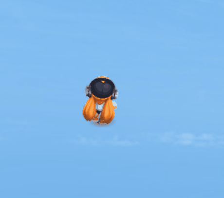

(Animation 1-1)

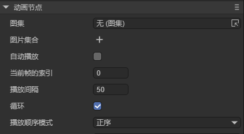

(Figure 1-1)

**Common Properties of the Animation Node**

| Property     | Description                                                                                      |
| ------------ | ------------------------------------------------------------------------------------------------ |
| **source**   | Add an animation atlas.                                                                          |
| **images**   | A collection of individual image files.                                                          |
| **autoplay** | Whether to automatically play the animation when added to the stage. Default is `false`.         |
| **index**    | The current frame index.                                                                         |
| **interval** | The interval time between frames, in milliseconds. Default is 50ms.                              |
| **loop**     | Whether the animation loops. Default is `true`.                                                  |
| **wrapmode** | The playback mode: `0` = forward (POSITIVE), `1` = reverse (REVERSE), `2` = pingpong (PINGPONG). |

## 2. Creating an Animation Node in LayaAir IDE

### 2.1 Creating an Animation

As shown in Animation 2-1, an Animation node can be created in the **Hierarchy** panel by clicking the **+** button or right-clicking to add it.

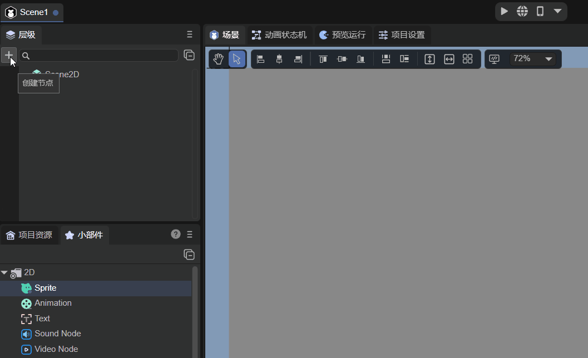

(Animation 2-1)

You can also drag an Animation node directly from the **Widget** panel into the **Scene Editor** or **Hierarchy** panel, as shown in Animation 2-2.

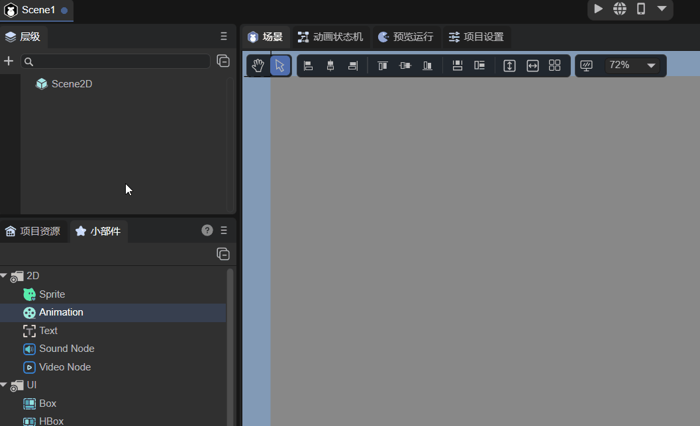

(Animation 2-2)

### 2.2 Loading Animation Data Sources

There are two ways to assign data sources to an Animation: using **Images** or **Source**.

#### 2.2.1 Using Images

The first method is through the **Images** property. You can quickly select multiple images using the **↓** key, or add them manually by clicking, as shown in Animation 2-3.

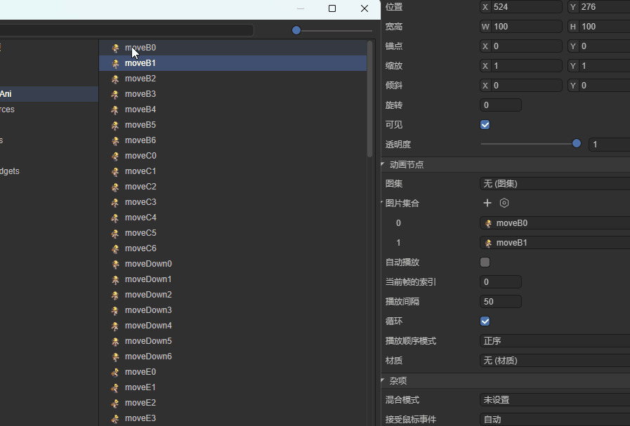

(Animation 2-3)

#### 2.2.2 Using Source

The second and simpler method is to assign a packed atlas directly to the **Source** property, as shown in Figure 2-4.

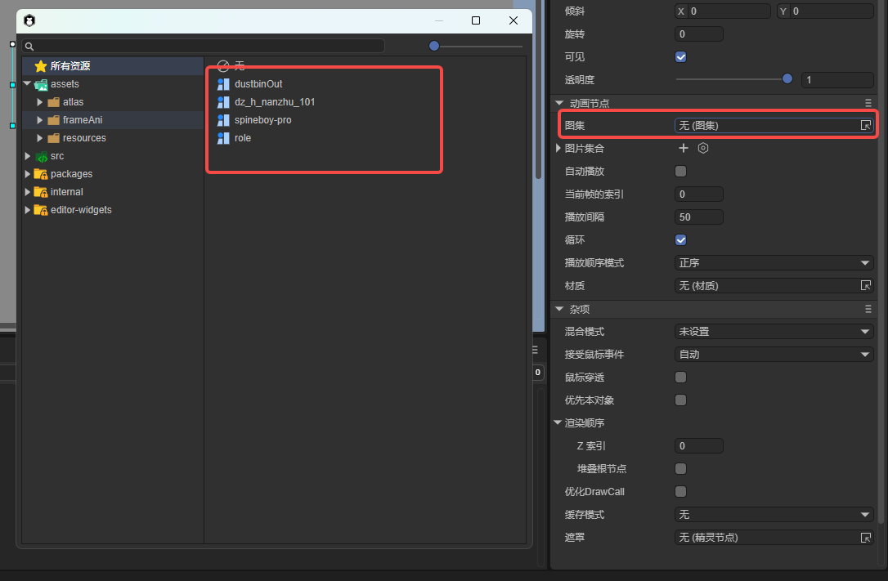

(Figure 2-4)

#### 2.2.3 Creating a Sprite Atlas

Although using an atlas is convenient, developers must first create the atlas themselves. LayaAir IDE provides a built-in **Atlas Maker** tool. As shown in Figure 2-5, open it from the top menu under **Tools → Create Atlas**.

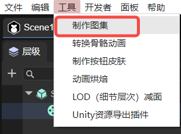

(Figure 2-5)

After launching, the Atlas Maker window appears as shown in Figure 2-6.

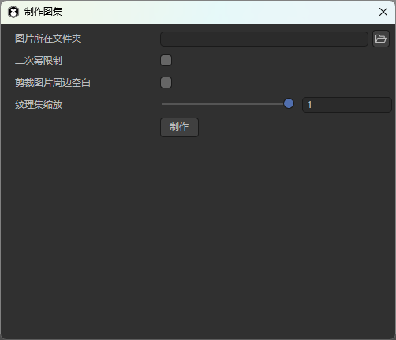

(Figure 2-6)

To create an atlas, place all the images you wish to pack into a single folder (for example, “role”). Then set the **Image Folder** path to that folder, as shown in Figure 2-7.

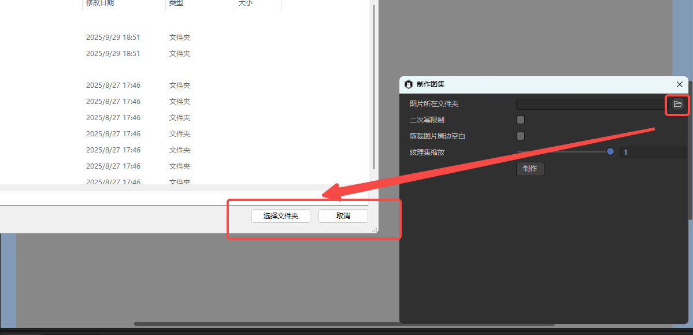

(Figure 2-7)

* Enabling **Power of Two Restriction** ensures the generated atlas dimensions are powers of two.
* Enabling **Trim Transparent Edges** makes the atlas image more compact.

Click **Create**, select an output path, and name your atlas file, as shown in Figure 2-8.

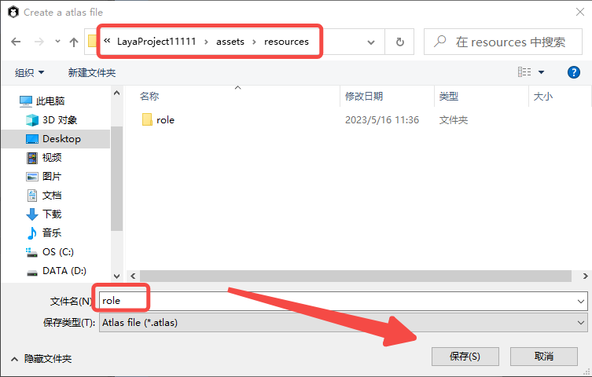

(Figure 2-8)

When the process completes successfully, a “**Success!**” message appears (Figure 2-9).

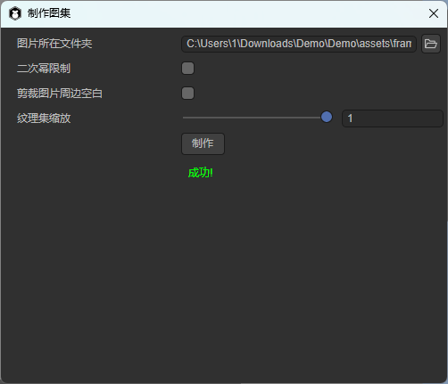

(Figure 2-9)

The output includes a `.atlas` file and a `.png` file (for example, `role.atlas` and `role.png`). The `.atlas` file is a LayaAir-specific format used to define atlas metadata.

### 2.3 Enabling Auto Play (autoPlay)

The **autoPlay** property determines whether the animation automatically starts playing when added to the stage. The default value is `false`. When set to `true`, playback begins automatically upon creation.

### 2.4 Controlling the Playback Mode (wrapMode)

The **wrapMode** property defines how the animation plays:

* `0`: Forward (POSITIVE) — default
* `1`: Reverse (REVERSE)
* `2`: Pingpong (PINGPONG)

> **Note:** To preview playback in the IDE, ensure **AutoPlay** is enabled.

#### 2.4.1 Forward Playback

When **wrapMode = 0**, the animation plays in normal order, as shown in Animation 2-10.

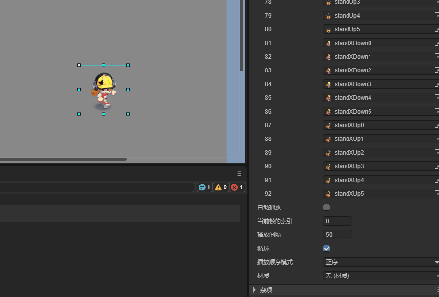

(Animation 2-10)

#### 2.4.2 Reverse Playback

When **wrapMode = 1**, frames play in reverse order, as shown in Animation 2-11.

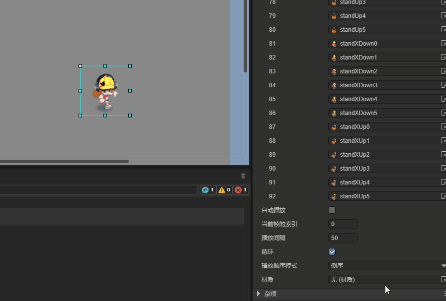

(Animation 2-11)

#### 2.4.3 Pingpong Playback

When **wrapMode = 2**, the animation plays forward and then backward (like a ping-pong motion), producing a smoother and more continuous effect. This mode is widely used in games as it provides natural looping with fewer assets. See Animation 2-12.

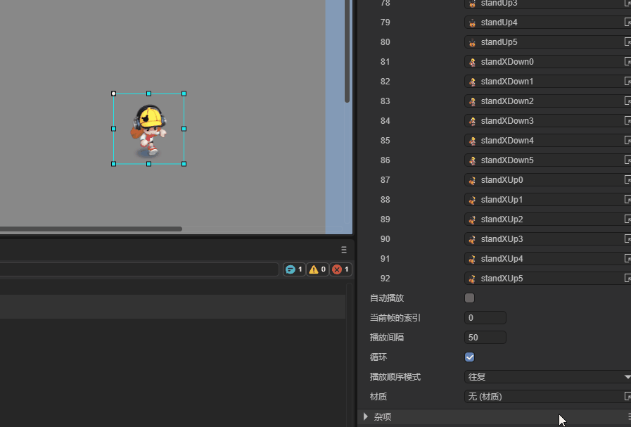

(Animation 2-12)

### 2.5 Frame Interval (interval)

The **interval** property controls the time between frames, in milliseconds. The default value is 50ms. For example, doubling it to 100ms slows playback by half, as shown in Animation 2-13.

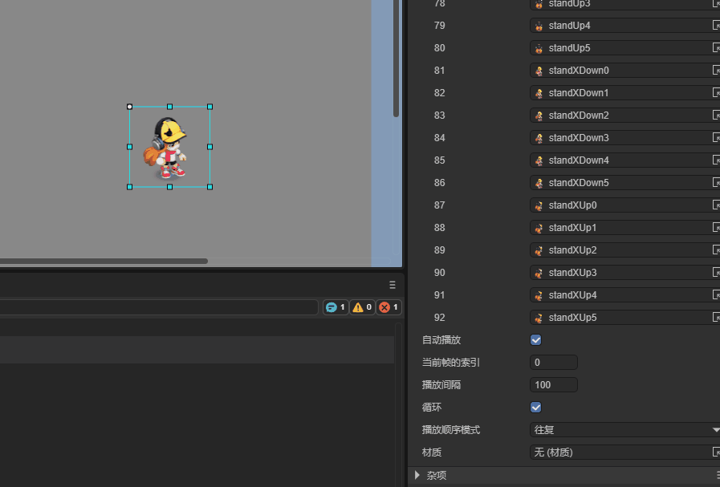

(Animation 2-13)

> **Tips:** Changing the interval frequently during playback can cause timing issues or slow frame updates.

### 2.6 Setting the Starting Frame (index)

The **index** property specifies the current frame index (default: 0). Setting it jumps to a specific frame, as shown in Animation 2-14.

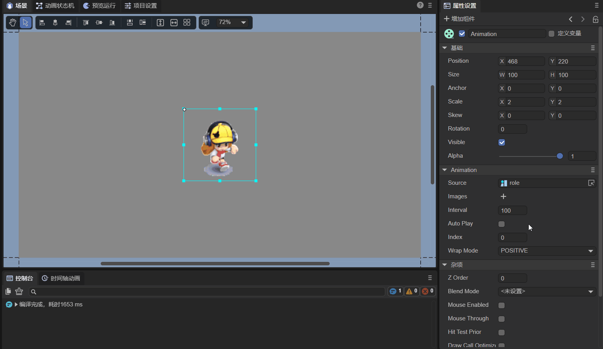

(Animation 2-14)

> **Tips:** This property is typically used for manual frame control (e.g., via code or user input). It does not affect the starting frame of auto-play animations.

### 2.7 Controlling Animation via Script

In the Scene2D property panel, attach a custom script named `Animation.ts` and drag the Animation node into its exposed property field, as shown in Animation 2-15.


(Animation 2-15)

Example code for controlling the animation:

```typescript
const { regClass, property } = Laya;

@regClass()
export class Animation extends Laya.Script {
    @property({ type: Laya.Animation })
    ani: Laya.Animation;

    onAwake(): void {
        this.ani.source = "resources/role.atlas"; // Load atlas as source
        this.ani.autoPlay = true; // Enable autoplay
        this.ani.wrapMode = 0; // Forward playback
        this.ani.interval = 50; // 50ms frame interval
    }
}
```

Result shown in Animation 2-16:

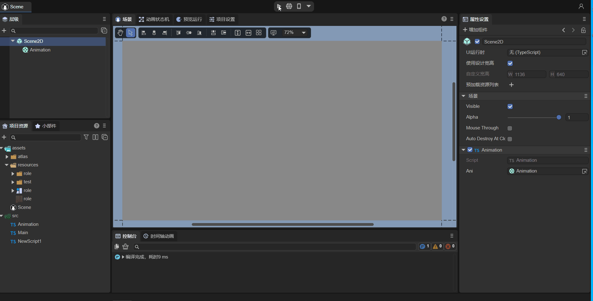

(Animation 2-16)

## 3. Creating an Animation via Code

If you want to create an animation dynamically instead of pre-placing it in the scene, you can create it in code. Add a custom script in Scene2D and write the following:

```typescript
const { regClass, property } = Laya;

@regClass()
export class UI_Animation extends Laya.Script {
    onAwake(): void {
        this.setup();
    }

    private setup(): void {
        const animation = new Laya.Animation();
        animation.pos(200, 200);
        animation.source = "resources/role.atlas";
        animation.size(600, 275);
        animation.interval = 100;
        animation.autoPlay = true;
        animation.wrapMode = 2; // Pingpong mode
        this.owner.addChild(animation);
    }
}
```

The resulting effect is shown in Animation 3-1:

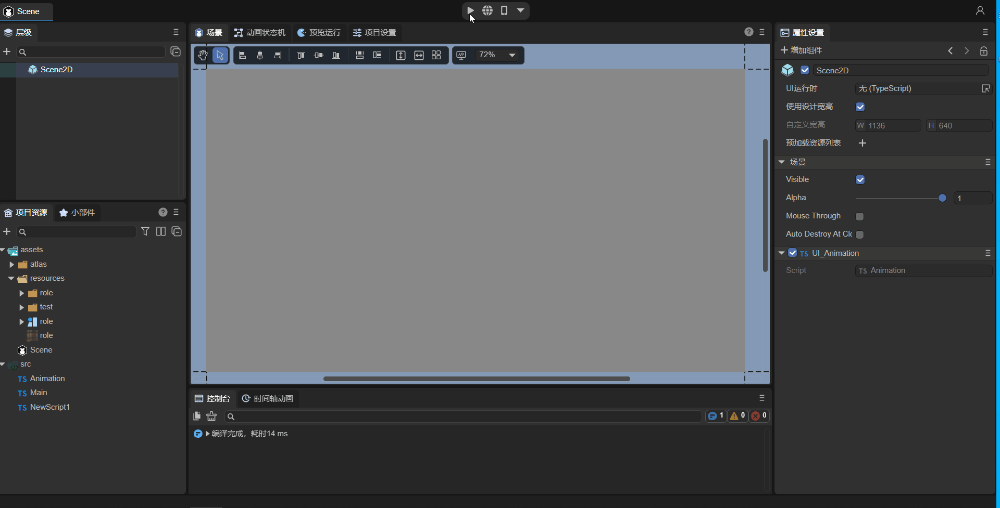

(Animation 3-1)
