# Sprite

## 1. Overview

In a game, a `Sprite` is a display object that can be controlled on the screen. If a display object cannot be controlled, it is simply a node. More precisely, a `Sprite` is a 2D image that can be animated and controlled by modifying its properties, such as rotation, position, scale, and color.

`Sprite` is the basic display node for graphics. Through the `graphics` property, you can draw images or vector graphics. It supports rotation, scaling, translation, and other operations. `Sprite` is also a container class, allowing multiple child nodes to be added. LayaAir optimizes rendering for different scenarios, so that a single class can provide rich functionality while maintaining high performance.

In LayaAir 2D UI, `Sprite` is the base class for all node objects. As shown in Figure 1-1, the basic functions of the `Sprite` class are inherited by all its subclasses (only a partial inheritance hierarchy is shown in the figure; see the [API documentation](https://layaair.com/3.x/api/English/index.html?version=3.0.0&type=Core&category=display&class=laya.display.Sprite) for full details). This article focuses on the fundamental features of `Sprite`, which will not be repeated for other node objects later.

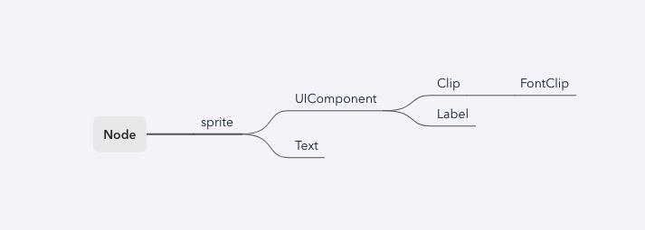

(Figure 1-1)

---

## 2. Using Sprite in the IDE

### 2.1 Creating Sprites

#### 2.1.1 Creating in Scene2D

In the `Hierarchy` panel of a Scene2D, you can right-click on any node or empty space to create a sprite, as shown in Animation 2-1:

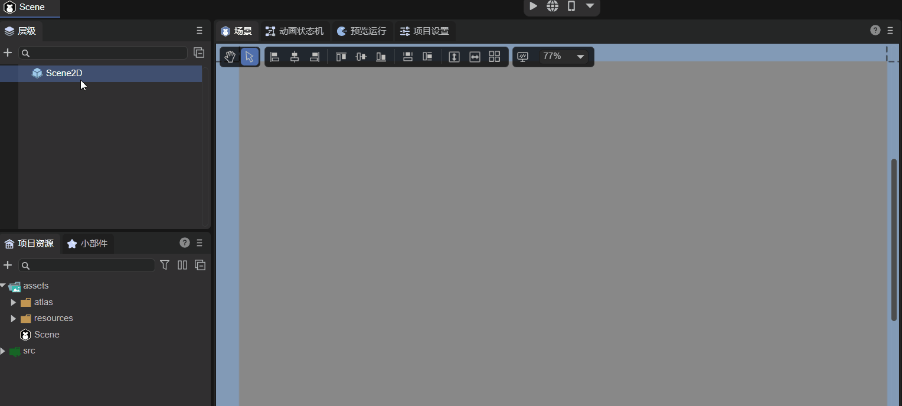

(Animation 2-1)

A newly created sprite is invisible initially—it is just an empty 2D node.

#### 2.1.2 Creating from the Widget Panel

In the 2D tab of the `Widget` panel, you can also create a sprite under any node, as shown in Animation 2-2:

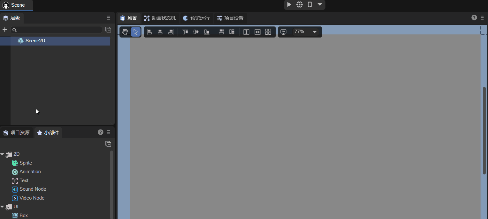

(Animation 2-2)

---

### 2.2 Basic Properties

As shown in Figure 2-3, a sprite has the following basic properties:

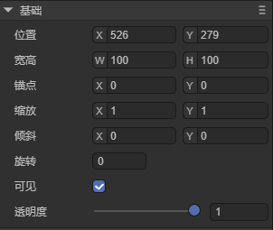

| Property | Description                    |
| -------- | ------------------------------ |
| Position | The position of the sprite     |
| Size     | Width and height of the sprite |
| Anchor   | The anchor point of the sprite |
| Scale    | Scaling factor                 |
| Skew     | Skew angle                     |
| Rotation | Rotation angle                 |
| Visible  | Visibility of the sprite       |
| Alpha    | Transparency                   |

Animation 2-4 demonstrates some basic operations on these properties:

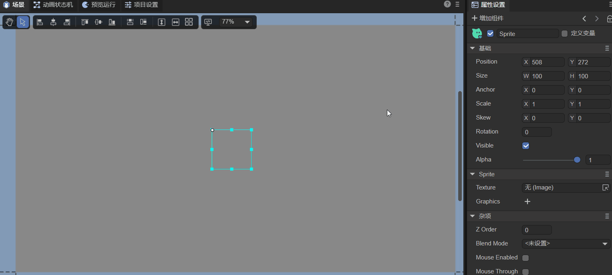

(Animation 2-4)

Since the sprite is empty, adjusting `Visible` or `Alpha` has no visual effect. Let’s look at some commonly used properties:

#### 2.2.1 Position

The position refers to the location of the sprite’s pivot point on the canvas. It has `x` and `y` coordinates. The top-left corner of the canvas is the origin. Positive x goes right; positive y goes down.

#### 2.2.2 Size

The size is the width (W) and height (H) of the sprite in pixels.

#### 2.2.3 Anchor

Before understanding anchors, it’s important to know about the **pivot**. A sprite’s default pivot point is its top-left corner. Position, scale, and rotation are applied relative to this pivot. Changing the pivot controls the center of rotation and scaling.

Anchor is another way to set a pivot. Its values range from 0 to 1, representing a proportion of the sprite’s width and height. Changing the anchor also updates the pivot.

#### 2.2.4 Scale

ScaleX and ScaleY scale the sprite horizontally and vertically around its pivot/anchor.

* Default is 1 (no scaling).
* 0 makes the sprite invisible.
* -1 mirrors the sprite. Negative values scale while mirroring.

#### 2.2.5 Skew

SkewX and SkewY skew the sprite around its pivot/anchor.

#### 2.2.6 Rotation

Rotation is applied around the pivot/anchor. Positive values rotate clockwise; negative values rotate counterclockwise.

#### 2.2.7 Visibility

`Visible` is a boolean. Checked (true) = visible, unchecked (false) = invisible.

#### 2.2.8 Alpha

Transparency ranges from 0 to 1.

---

### 2.3 Sprite-specific Properties

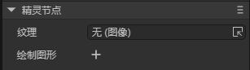

(Figure 2-5)

Specific properties include:

* **Texture**: Set an image or render texture.
* **Graphics**: Draw shapes like rectangles, circles, polygons, etc.

#### 2.3.1 Image Texture

You can assign a texture by dragging an image into the Texture property, as shown in Animation 2-6:

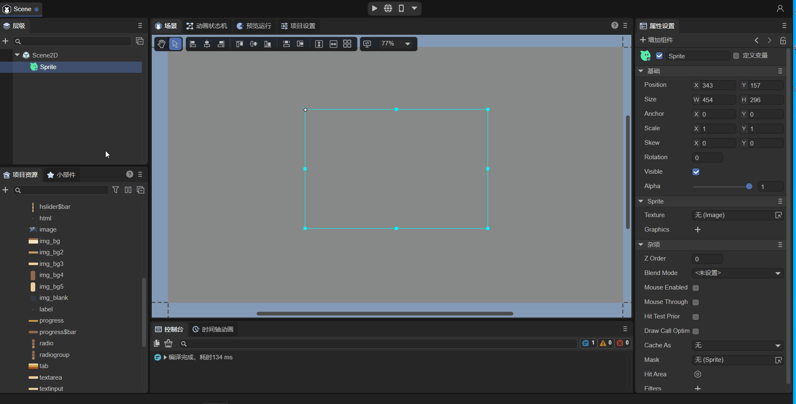

> **Tip:** For rendering a single image, using `Texture` on a Sprite is the most efficient approach.

#### 2.3.2 RenderTexture

A **RenderTexture** is a special texture updated at runtime. A common use is setting it as a camera’s target texture. It can then be used like any regular texture in a Sprite.

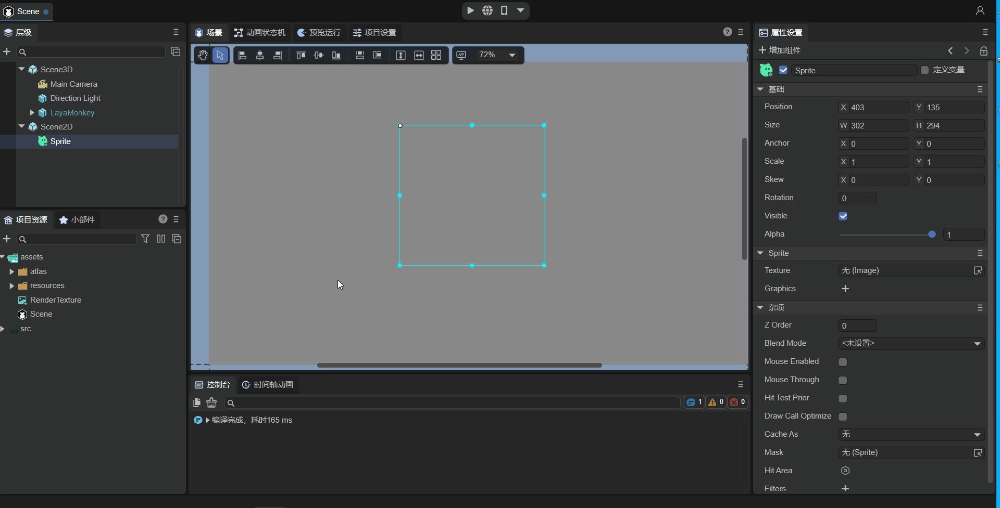

> **Note:** Only Sprites support RenderTexture via the Texture property.

#### 2.3.3 Graphics

Graphics allows you to draw shapes such as rectangles, circles, or polygons.

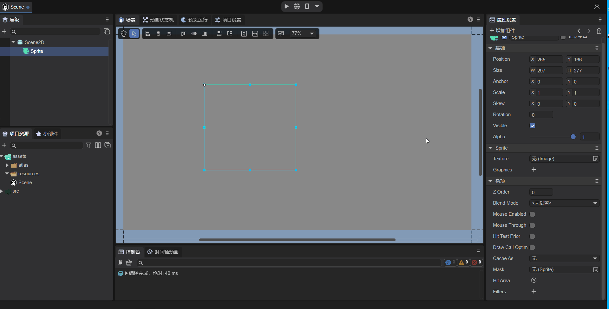

For details, see [Drawing Graphics](../../../IDE/uiEditor/graphics/readme.md).

---

### 2.4 Other Properties

Other properties include:

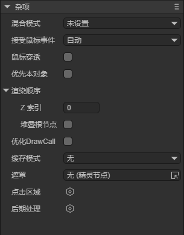

| Property          | Description                                            |
| ----------------- | ------------------------------------------------------ |
| Blend Mode        | Set the blend mode (currently only "lighter")          |
| Mouse Enabled     | Whether the sprite receives mouse events               |
| Mouse Through     | Whether mouse events pass through the sprite           |
| Hit Test Prior    | Detect the sprite first or its children first          |
| ZIndex            | Render order in 2D space                               |
| Stacking Root     | Whether child nodes’ zOrder is relative to this sprite |
| DrawCall Optimize | Enable draw call optimization                          |
| Cache As          | Enable static cache                                    |
| Mask              | Set a mask node                                        |
| Hit Area          | Custom click area                                      |
| Filters           | Post-processing effects                                |

Mouse-related properties will be covered in detail in section 2.4.6.

#### 2.4.1 Node Hierarchy

In the Hierarchy panel, nodes added later render above earlier nodes. At runtime, `ZIndex` can adjust global render order.

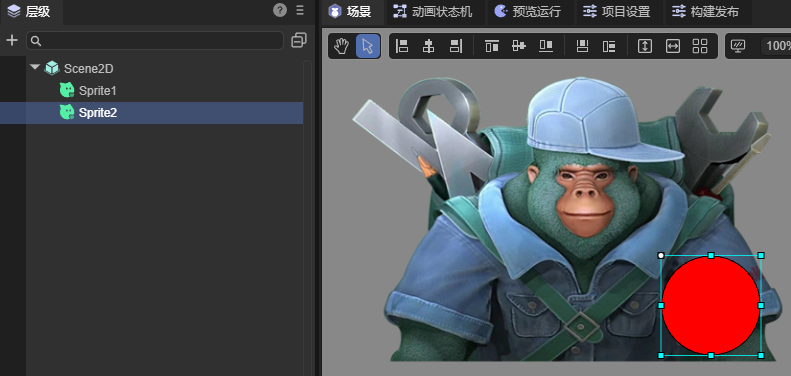

#### 2.4.2 BlendMode

Using “lighter” blend mode will combine colors of overlapping sprites:

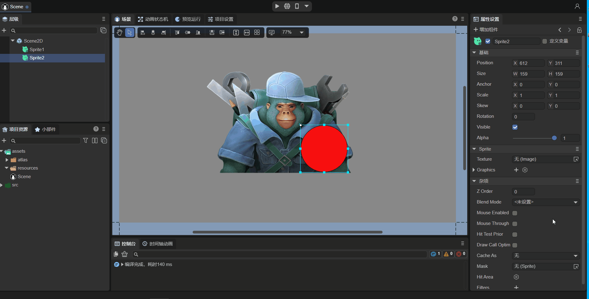

#### 2.4.3 Draw Call Optimization

Enabling `drawCallOptimize` can reduce draw calls without changing visual hierarchy. Example:

* `drawCallOptimize = false`, DC = 65
* `drawCallOptimize = true`, DC = 5

#### 2.4.4 Cache As

`cacheAs` can improve rendering efficiency for mostly static UI. Options: None, Normal, Bitmap.

#### 2.4.5 Mask

Masks are applied based on another node’s shape.

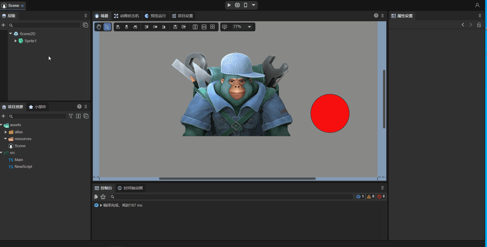

#### 2.4.6 Mouse-related Properties

| Property       | Description                                 |
| -------------- | ------------------------------------------- |
| MouseEnabled   | Whether the sprite accepts mouse events     |
| HitArea        | Custom clickable area                       |
| MouseThrough   | Allow clicks to pass through empty regions  |
| Hit Test Prior | Priority for detecting self vs. child nodes |

Examples and behavior for these properties are shown in Animations 2-14 to 2-22.

#### 2.4.7 PostProcess

Post-processing effects can be applied for artistic visuals.

---

### 2.5 Controlling Sprite via Script

Example code controlling properties programmatically:

```typescript
const { regClass, property } = Laya;

@regClass()
export class NewScript extends Laya.Script {
    @property({ type: Laya.Sprite })
    public sprite: Laya.Sprite;

    onAwake(): void {
        this.sprite.loadImage("atlas/comp/image.png"); 
        this.sprite.pos(Laya.stage.width / 2, Laya.stage.height / 2);
        this.sprite.size(512, 313);
        this.sprite.pivot(this.sprite.width / 2, this.sprite.height / 2);
        this.sprite.anchorX = 0.5;
        this.sprite.anchorY = 0.5;
        this.sprite.scale(2, 2);
        this.sprite.skew(5, 5);
        this.sprite.rotation = 45;
        this.sprite.visible = true;
        this.sprite.alpha = 0.5;
    }
}
```

---

## 3. Using Sprite in Code

The `Laya.Sprite` class is in the core library (`laya.display.Sprite`).

### 3.1 Creating a Sprite

```typescript
let sprite = new Laya.Sprite();
Laya.stage.addChild(sprite);
```

### 3.2 Displaying Images

#### 3.2.1 `loadImage`

```typescript
let sprite = new Laya.Sprite();
sprite.loadImage("atlas/comp/image.png");
sprite.pos(Laya.stage.width >> 1, Laya.stage.height >> 1);
Laya.stage.addChild(sprite);
```

#### 3.2.2 Setting `texture`

```typescript
Laya.loader.load("atlas/comp/image.png").then(() => {
    let sprite = new Laya.Sprite();
    let res = Laya.loader.getRes("atlas/comp/image.png");
    sprite.pos(Laya.stage.width / 2, Laya.stage.height / 2);
    sprite.texture = res;
    Laya.stage.addChild(sprite);
});
```

### 3.3 Basic Properties

```typescript
let sprite = new Laya.Sprite();
sprite.loadImage("atlas/comp/image.png");
sprite.pos(20, 20);
sprite.anchorX = 0.5;
sprite.anchorY = 0.5;
sprite.scale(2, 2);
sprite.rotation = 30;
Laya.stage.addChild(sprite);
```

### 3.4 Other Properties

#### 3.4.1 Setting zIndex

The `zIndex` property is used to adjust the rendering order of a `Sprite`. You can directly set this value in the IDE:

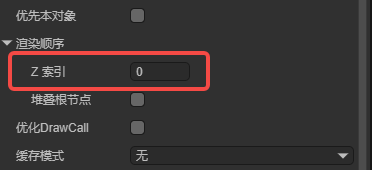

You can also set it through code:

```typescript
onAwake(): void {
    let sp = new Laya.Sprite;
    sp.zIndex = 1;
}
```

Adjusting the rendering order through this property takes effect globally. It is not limited by the node hierarchy and does not affect the logical order of nodes in the tree.

Suppose we have the following node tree:

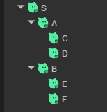

By default, the rendering order follows the depth-first traversal of the node tree:

S -> A -> C -> D -> B -> E -> F

If we set `C`’s `zIndex` to 1, the rendering order becomes:

S -> A -> D -> B -> E -> F -> C

If we then set `D`’s `zIndex` to -1, the rendering order becomes:

D -> S -> A -> B -> E -> F -> C

The larger the `zIndex` value, the later the node is rendered and the higher its display layer.

Note that `zIndex` is relative to its parent node. For example, if a parent node has a `zIndex` of 1 and a child node has a `zIndex` of 2, the child node’s effective `zIndex` value is 3. For instance, if you set `A`’s `zIndex` to 1, `C`’s to 1, and `B`’s to 1, the rendering order becomes:

S -> D -> E -> F -> A -> B -> C

`C` is rendered last because its effective `zIndex` value is 2.

In practical applications, you often want to adjust rendering order **locally** rather than globally. For example, if within a prefab you want a certain node to be rendered on top, you might set its `zIndex` to a positive number. However, after adding this prefab to the scene, if other nodes do not have a `zIndex` set, that node will appear above all other nodes in the scene, which is usually not the intended behavior.

To solve this, `Sprite` introduces another property — `stackingRoot`:

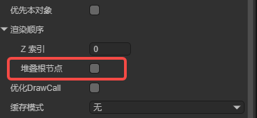

When this property is checked, all child and descendant nodes’ `zIndex` values only affect the rendering order **within this node**.

Using the same example, if we set `A`’s `stackingRoot` to `true`, set `C`’s `zIndex` to 2, and `D`’s `zIndex` to 1, the rendering order becomes:

S -> A -> D -> C -> B -> E -> F

As you can see, even though `C` and `D` have larger `zIndex` values than `B`, `E`, and `F`, they do not appear above them.

If we now set `A`’s `zIndex` to 3, the rendering order becomes:

S -> B -> E -> F -> A -> D -> C

Note that the order inside `A` is `D` then `C`, not `C` then `D`. In other words, a node marked as `stackingRoot` still uses its own `zIndex` to determine its **global** rendering order.

`Sprite` also has another property called `zOrder`. This changes the **logical order** of child nodes under the same parent, but does **not** affect rendering order.

This property is not exposed in the IDE and can only be set through code:

```typescript
onAwake(): void {
    // Create two nodes and add them to the scene
    let sp1 = new Laya.Sprite();
    sp1.name = "sp1";
    this.owner.addChild(sp1);

    let sp2 = new Laya.Sprite();
    sp2.name = "sp2";
    this.owner.addChild(sp2);

    sp1.zOrder = 1;
    sp2.zOrder = 0;
}
```

Runtime result:

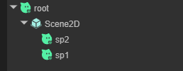

Although `sp1` was added first in the code, its `zOrder` value is higher, so it appears above `sp2` in hierarchy.

#### 3.4.2 Setting BlendMode

Example code for setting `blendMode`:

```typescript
let sp1 = new Laya.Sprite();
Laya.stage.addChild(sp1);
// Load and display image 1
sp1.loadImage("atlas/comp/image.png", null);
let sp2 = new Laya.Sprite();
Laya.stage.addChild(sp2);
// Load and display image 2
sp2.loadImage("resources/layabox.png", null);
sp2.pos(200, 190);
// Set blendMode
sp2.blendMode = "lighter";
```

Runtime result:

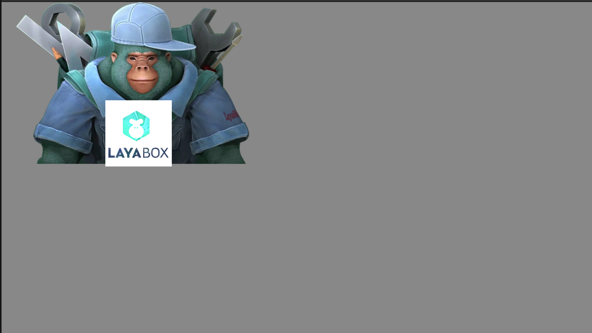

(Figure 3-4)

Compared with Figure 3-3, when using the `"lighter"` `blendMode`, the colors of `sp2` and `sp1` are blended together.

#### 3.4.3 Setting autoSize

Specifies whether to automatically calculate width and height. The default is `false`.
 By default, a `Sprite`’s width and height are 0 and do not change with its drawn content.
 If you want to automatically determine the width and height based on the drawn content, set this property to `true`. Example:

```typescript
let sprite = new Laya.Sprite();
// Add to stage
Laya.stage.addChild(sprite);
sprite.autoSize = true;
```

#### 3.4.4 Caching as a Static Image

Example:

```typescript
let sprite = new Laya.Sprite();
Laya.stage.addChild(sprite);
// Cache as a static image
sprite.cacheAs = "bitmap";
```

#### 3.4.5 Setting a Mask

Example:

```typescript
let sprite = new Laya.Sprite();
Laya.stage.addChild(sprite);
sprite.loadImage("atlas/comp/image.png", null);

// Create a mask
let mask = new Laya.Sprite();
sprite.addChild(mask);
mask.graphics.drawCircle(200, 200, 100, "#FFFFFF");

// Apply the mask after 1 second
setTimeout(() => { 
	sprite.mask = mask;
}, 1000);
```

Runtime result:

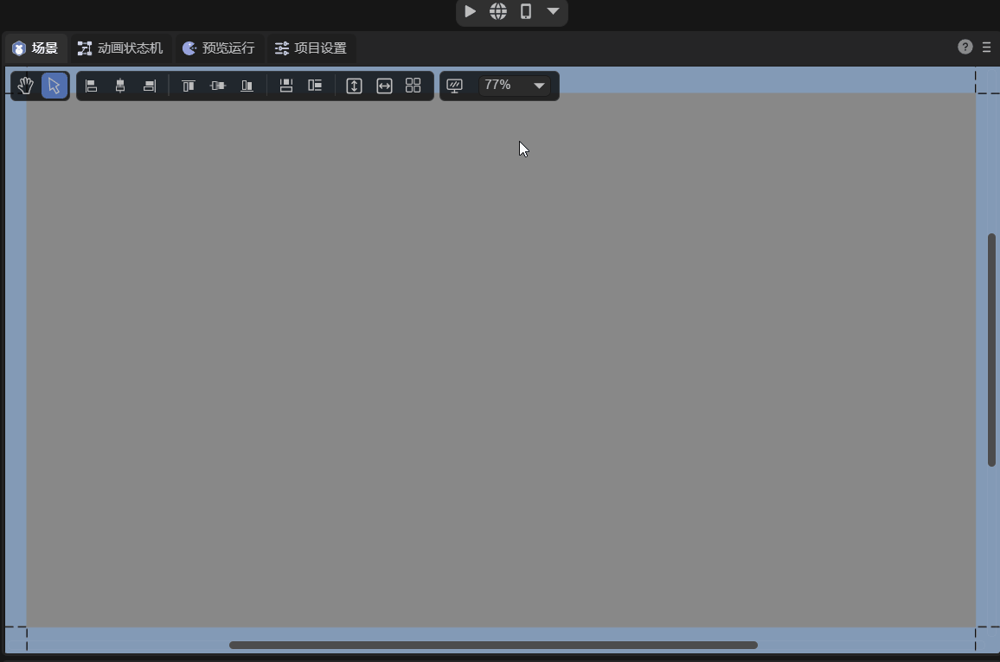

(Animated Figure 3-5)

#### 3.4.6 Setting the Click Area (hitArea)

Mouse-related properties share similar code patterns.
 Here’s an example using `hitArea`:

```typescript
let sp = new Laya.Sprite();
Laya.stage.addChild(sp);
// Load and display an image
sp.loadImage("atlas/comp/image.png", null);
// Set click event
sp.on("click", this, () => {
	Laya.Tween.to(sp, { scaleX: 0.5, scaleY: 0.5 }, 100);
});
// Define click area
let hitArea: Laya.HitArea = new Laya.HitArea();
hitArea.hit.drawRect(0, 0, 100, 100, "#00ff00");
sp.hitArea = hitArea;
```

Runtime result:

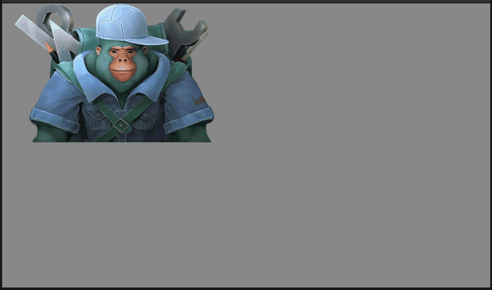

(Animated Figure 3-6)

You can see that clicks within the defined area trigger the event, while clicks outside do not.
 If you don’t define a `hitArea`, any click within the image bounds will trigger the event.

