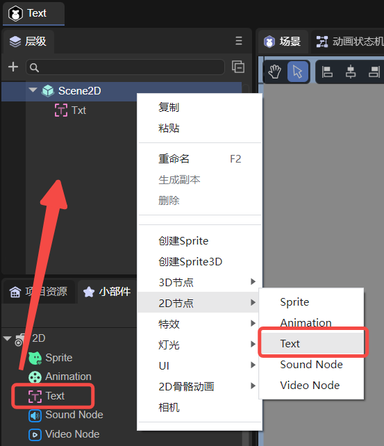
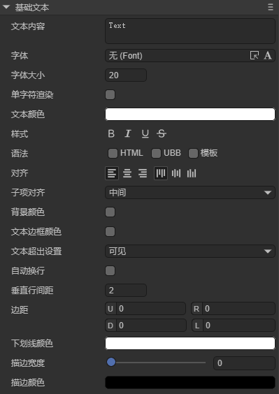
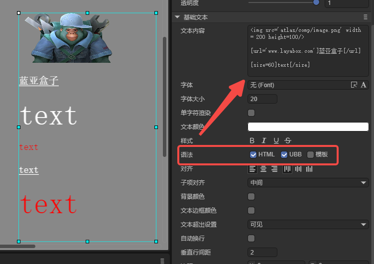
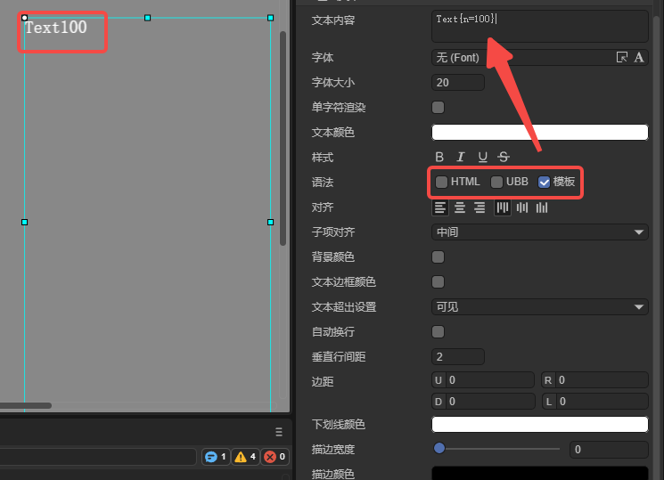
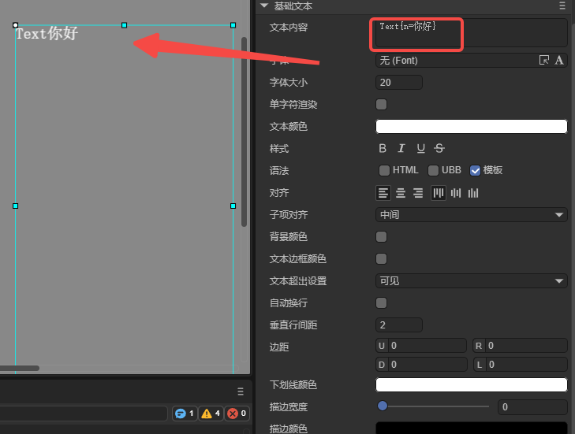
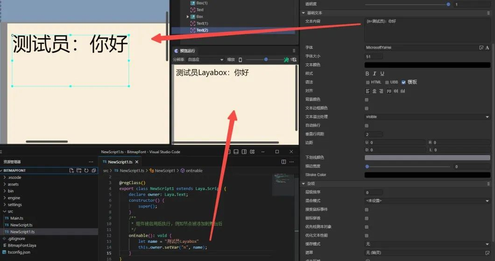
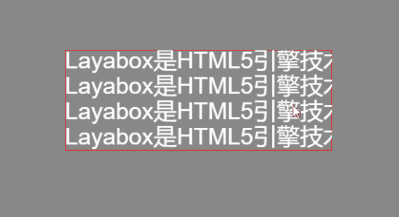

# Basic Text (Text)

Text inherits from Sprite and is the fundamental component for displaying static text. Here we introduce the properties specific to the Text component.

## 1. Using Text in LayaAir IDE

### 1.1 Creating Text

As shown in Figure 1-1, you can right-click in the `Hierarchy` window to create it, or drag and drop it from the `Widgets` window.



(Figure 1-1)

### 1.2 Property Introduction

After adding a Text component to the scene editing view, its exclusive properties appear in the property panel, as shown in Figure 1-2:



(Figure 1-2)

Below is a description of each property:

| Property Name                                | Description                                                                                                                                                                                    |
| -------------------------------------------- | ---------------------------------------------------------------------------------------------------------------------------------------------------------------------------------------------- |
| Text Content **text**                        | The actual content of the text                                                                                                                                                                 |
| Font **font**                                | The text font, e.g., `Microsoft YaHei`. You can manually input common fonts or use [bitmap fonts](../../advanced/useText/readme.md)                                                            |
| Font Size **fontSize**                       | The size of the text font, e.g., `50`, entered as a positive integer                                                                                                                           |
| Single Character Render **singleCharRender** | Caches each character to a shared texture. Characters with the same font and size share one cache globally. Defaults to false. Enable this to improve performance when fonts change frequently |
| Text Color **color**                         | The color of the text, can input a color value like `#ffffff`, or select one from the color picker                                                                                             |
| Style **style**                              | “**B**” (bold), “***I***” (italic), and “<u>**U**</u>” (underline)                                                                                                                             |
| Syntax **syntax**                            | Enables mixed styles supporting partial HTML and UBB syntax. You can also enable templates to use variables in strings                                                                         |
| Alignment **align**                          | Alignment type. Horizontal: left, center, right; Vertical: top, middle, bottom                                                                                                                 |
| Background Color **bgColor**                 | Background color. Can enter a color value like `#ffffff`, or pick from the color picker                                                                                                        |
| Border Color **borderColor**                 | Border color. Same color input method as background color                                                                                                                                      |
| Text Overflow **overflow**                   | Text overflow handling. Modes: visible (default), hidden, scroll, shrink, ellipsis.                                                                                                            |
| Word Wrap **wordWrap**                       | Whether to enable automatic line wrapping. Boolean value, default `false`.                                                                                                                     |
| Line Spacing **leading**                     | Vertical line spacing in pixels, effective when auto line wrap is enabled.                                                                                                                     |
| Padding **padding**                          | Text padding in pixels, defined as four integers: U (top), R (right), D (bottom), L (left).                                                                                                    |
| Underline Color **underlineColor**           | Underline color, same color input method as above.                                                                                                                                             |
| Stroke Width **stroke**                      | Stroke width, range 0–100                                                                                                                                                                      |
| Stroke Color **strokecolor**                 | Stroke color, same color input method as above.                                                                                                                                                |

Most of these properties are straightforward; developers can adjust the parameters and observe the results in the IDE. The following section details the **“Syntax”** property.

### 1.3 Syntax Property

#### 1.3.1 HTML and UBB

When the HTML checkbox is selected, partial HTML syntax is supported. When UBB is selected, UBB syntax is supported. If both are checked, both syntaxes are available.

Supported UBB syntax:

| Syntax Structure            | Example Code                                                                 | Description          |
| --------------------------- | ---------------------------------------------------------------------------- | -------------------- |
| [img]image_url[/img]        | [img]atlas/comp/image.png[/img]                                              | Displays an image    |
| [url=link_href]text[/url]   | [url='[www.layabox.com']Layabox[/url](http://www.layabox.com']Layabox[/url)] | Displays a hyperlink |
| [b]text[/b]                 | [b]This text is bold[/b]                                                     | Bold text            |
| [i]text[/i]                 | [i]This text is italic[/i]                                                   | Italic text          |
| [u]text[/u]                 | [u]This text is underlined[/u]                                               | Underlined text      |
| [color=#FFFFFF]text[/color] | [color=#FF0000]Red text[/color]                                              | Text color           |
| [size=10]text[/size]        | [size=60]Text with font size 60[/size]                                       | Text font size       |

> UBB supports nested tags, such as `[color=#FF0000][size=60]Red text size 60[/size][/color]`.

Supported HTML syntax:

| Syntax Structure                               | Example Code                                             | Description                    |
| ---------------------------------------------- | -------------------------------------------------------- | ------------------------------ |
| `<b>Text</b>`                                  | `<b>This is bold</b>`                                    | Bold text                      |
| `<i>Text</i>`                                  | `<i>This is italic</i>`                                  | Italic text                    |
| `<u>Text</u>`                                  | `<u>This is underlined</u>`                              | Underlined text                |
| `<li>Text1</li> <li>Text2</li> <li>Text3</li>` | `<li>Apple</li><li>Banana</li><li>Orange</li>`           | List                           |
| ``  | `` | Displays an image (supports %) |
| `<a href='xxx'>link text</a>`                  | `<a href='www.layabox.com'>Layabox</a>`                  | Hyperlink                      |
| `<div>Text</div>`                              | `<div>Outer container text</div>`                        | Div container                  |
| `<span>Text</span>`                            | `<span>Inline element</span>`                            | Inline element                 |
| `<p>Text</p>`                                  | `<p>Paragraph text</p>`                                  | Paragraph                      |
| `Text1<br />Text2`                             | `Line1<br />Line2`                                       | Line break                     |
| `&nbsp;`                                       | `Here&nbsp;space`                                        | Space                          |

As shown in Figure 1-3, when both HTML and UBB are checked, you can input syntax expressions in the Text field:



(Figure 1-3)

Example Text content:

```html

[url='www.layabox.com']Layabox[/url]
[size=60]text[/size]
[color=#FF0000]text[/color]
[u]text[/u]
[color=#FF0000][size=60]text[/size][/color]
```

These six lines correspond to the six effects in Figure 1-3: image, link, font size 60, red text, underline, and nested styles. Line breaks are added only for readability.

#### 1.3.2 Template

You can also enable the `Template` option in the “syntax” property to use variables in strings. For example, input `Text{n=100}`, as shown in Figure 1-4:



(Figure 1-4)

The variable `n` can also be a string, e.g., `Text{n=Hello}` results in Figure 1-5. The variable name can be customized.



(Figure 1-5)

You can dynamically change variable `n` using the `setVar` method in code:

```typescript
const { regClass, property } = Laya;

@regClass()
export class NewScript extends Laya.Script {
    @property({ type: Laya.Text })
    txt: Laya.Text;

    onAwake(): void {
        this.txt.text = "Page {n=1}";
    }

    onStart(): void {
        let page: number = 1;
        Laya.timer.frameLoop(10, this, () => {
            page += 1;
            this.txt.setVar("n", page);
        });
    }
}
```

Animated result as shown in Figure 1-6:


(Figure 1-6)

> Note: The variable `n` can also be loaded from a `.json` file and assigned using `setVar`.

A common game use case is dynamic dialogue, where only the player’s name changes, as shown in Figure 1-7. With templates, only the variable needs updating instead of the entire text.



(Figure 1-7)

### 1.4 Script Control of Text

Add a custom script component in the Scene2D property panel and assign a Text node to it. Example code:

```typescript
const { regClass, property } = Laya;

@regClass()
export class TextControl extends Laya.Script {
    @property({ type: Laya.Text })
    public txt: Laya.Text;

    onAwake(): void {
        this.txt.pos(Laya.stage.width >> 1, Laya.stage.height >> 1);
        this.txt.size(500, 30);
        this.txt.pivot(this.txt.width/2, this.txt.height/2);
        this.txt.text = "Hello everyone, welcome to LayaAir IDE. This is the Text content for testing.";
        this.txt.font = "SimSun";
        this.txt.fontSize = 50;
        this.txt.color = "#ff0000";
        this.txt.bold = true;
        this.txt.italic = true;
        this.txt.underline = true;
        this.txt.underlineColor = "#ff0000";
        this.txt.stroke = 5;
        this.txt.strokeColor = "#000000";
        this.txt.wordWrap = true;
        this.txt.leading = 20;
        this.txt.align = "center";
        this.txt.valign = "top";
        this.txt.overflow = "visible";
    }
}
```

Below is another example using the `scroll` overflow mode, allowing text to be scrolled via mouse drag:

```typescript
const { regClass, property } = Laya;

let prevX = 0;
let prevY = 0;

@regClass()
export class UI_Text extends Laya.Script {

	@property({ type: Laya.Text })
	txt: Laya.Text;

	onAwake(): void {
		this.txt.text = 
			"Layabox is an HTML5 engine provider and game publisher, offering HTML5 solutions for AS/JS/TS developers!\n".repeat(6);
		this.txt.fontSize = 35;
		this.txt.size(400,150);
		this.txt.borderColor = "#fa1515";
		this.txt.overflow = "scroll";
		this.txt.on(Laya.Event.MOUSE_DOWN, this, this.startScrollText);
	}

	startScrollText() {
		prevX = this.txt.mouseX;
		prevY = this.txt.mouseY;
		Laya.stage.on(Laya.Event.MOUSE_MOVE, this, this.scrollText);
		Laya.stage.on(Laya.Event.MOUSE_UP, this, this.finishScrollText);
	}

	finishScrollText() {
		Laya.stage.off(Laya.Event.MOUSE_MOVE, this, this.scrollText);
		Laya.stage.off(Laya.Event.MOUSE_UP, this, this.finishScrollText);
	}

	scrollText() {
		let nowX = this.txt.mouseX;
		let nowY = this.txt.mouseY;
		this.txt.scrollX += prevX - nowX;
		this.txt.scrollY += prevY - nowY;
		prevX = nowX;
		prevY = nowY;
	}
}
```

Effect shown below:



(Figure 1-8)

This demonstrates that scroll mode differs from hidden mode — the text beyond the box isn’t clipped.

## 2. Creating Text via Code

Sometimes, you may want to create a Text node dynamically rather than at scene load. Example:

```typescript
const { regClass } = Laya;

@regClass()
export class NewScript extends Laya.Script {

    onAwake(): void {
        let txt = new Laya.Text();
        Laya.stage.addChild(txt);
        txt.pos(Laya.stage.width >> 1, Laya.stage.height >> 1);
        txt.size(500, 30);
        txt.pivot(txt.width/2, txt.height/2);
        txt.text = "Hello, welcome to LayaAir IDE. This Text was created via code.";
        txt.wordWrap = true;
    }
}
```
