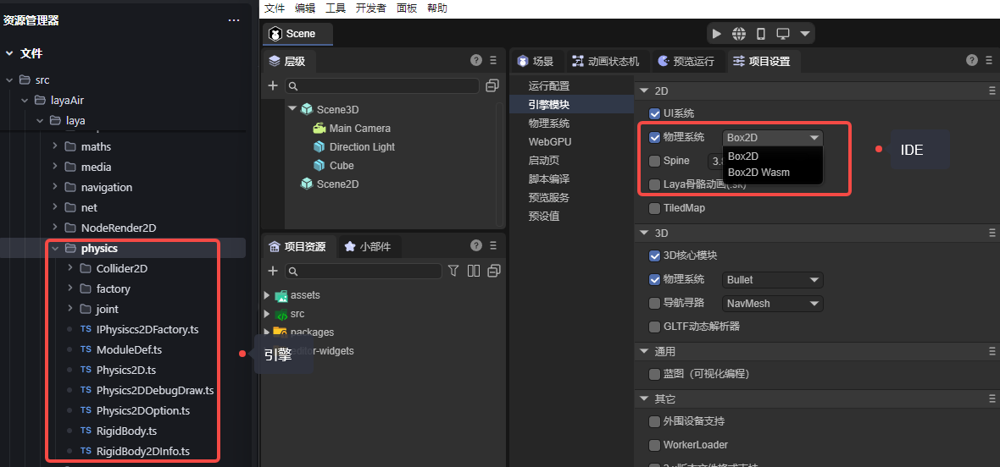
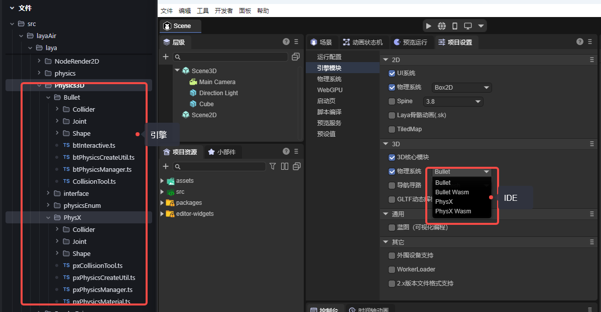
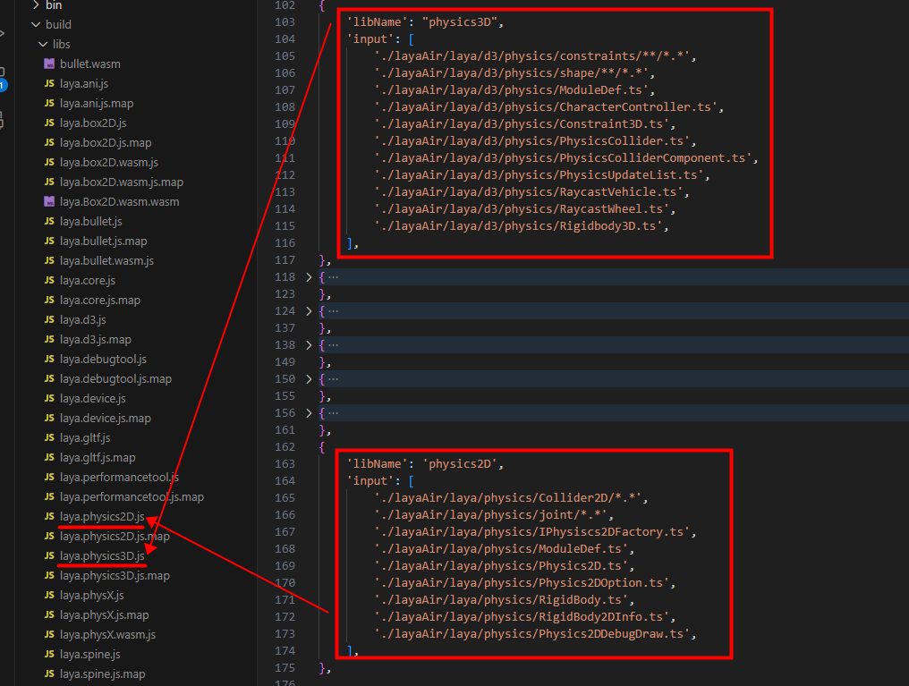
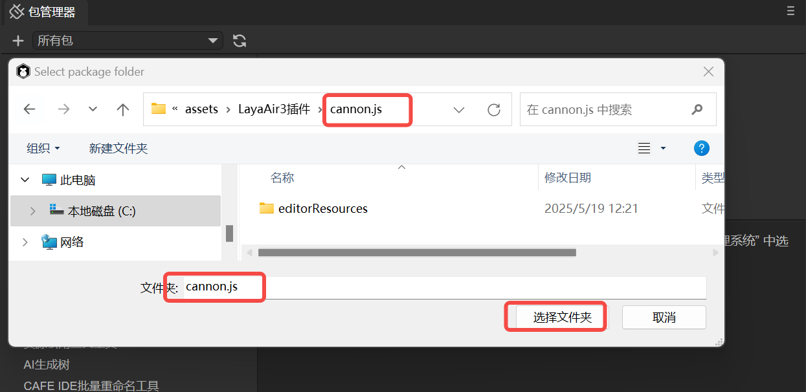
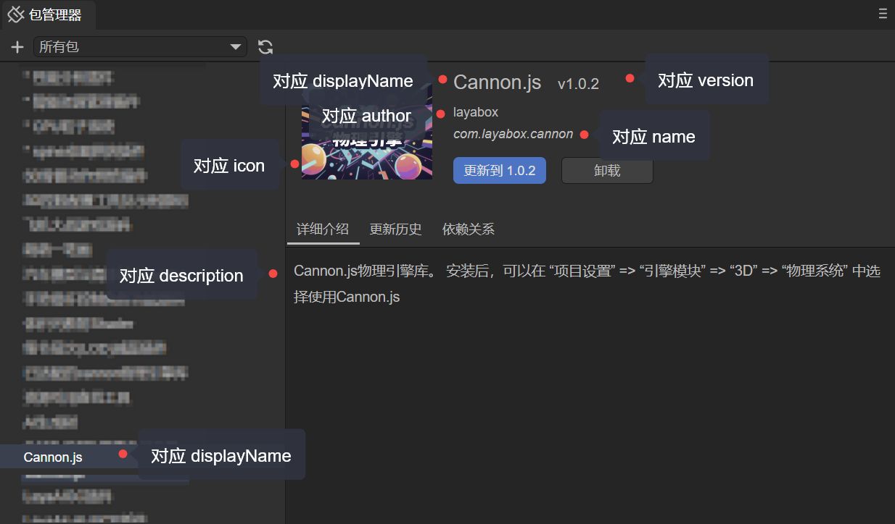
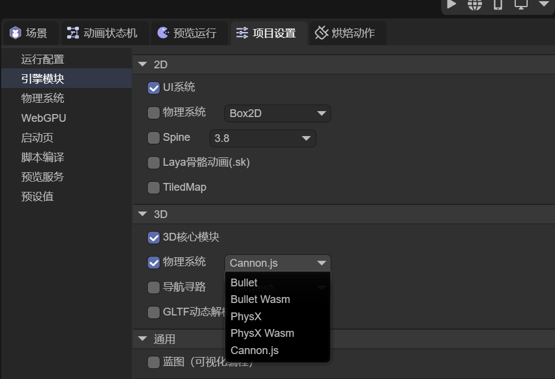
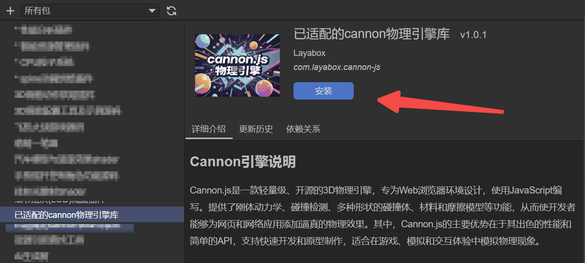

# Custom Physics Engine Libraries

> Author: Charley

The LayaAir engine has built-in third-party physics engines; for example, Box2D is built-in for 2D, and Bullet and PhysX are built-in for 3D.

At the same time, we also provide a solution for **custom physics engine libraries**. If developers need to integrate other physics engines into the LayaAir engine, this document will guide you through the process of integrating a physics engine, making it easier for you to connect and use.


## 1\. Understanding Built-in Physics Engines

### 1.1 Which Classes Do Built-in Physics Engines Correspond To?

The LayaAir3 engine has the **Box2D** physics engine built in for 2D, supporting both JS engine libraries and Wasm libraries. This corresponds to the classes under the `Physics` directory in the engine source code, as shown in Figure 1-1:

 

(Figure 1-1)

For 3D, we have **Bullet** and **PhysX** physics engines built in, corresponding to the classes under the `Physics3D` directory in the engine source code, as shown in Figure 1-2.

 

(Figure 1-2)

### 1.2 Compiling the Engine into a Physics Library

Built-in physics engines are not simply third-party physics engines used directly.

Instead, the interfaces of the third-party physics engine are **individually integrated with the interfaces of the LayaAir engine**, meaning the third-party physics engine is built into the LayaAir engine. This way, developers can ultimately switch and use various physics engines directly through the LayaAir engine's physics interfaces. Furthermore, within the IDE, visual editing is possible through physics components.

The physics engine ultimately used by the developer is a complete physics library formed by the integration of the third-party physics engine and the LayaAir engine's physics integration classes.

The process of integrating a custom physics engine library with a built-in engine library follows the same steps. The only difference is that built-in engines are integrated by the official engine developers and included in the open-source engine, while custom engines are integrated by project developers who understand and refer to the engine's integration process and interfaces to connect with third-party physics engines and form their own physics engine libraries.

Next, we will analyze the compilation scripts in the engine source code to understand which class files need to be compiled and integrated into an independent physics engine library.

First, let's open the `build` task in the gulp script. From the subtask names alone, you can clearly see the `copyJsLibs` task for copying third-party engine libraries and subtasks for processing various physics engine libraries, as shown in Figure 1-3.

 

(Figure 1-3)

If you examine the task code, it becomes even clearer that the `copyJsLibs` task specifies the file rules to be processed using `gulp.src()`, and then copies the matching files to the specified directory using `gulp.dest()`. In the physics engine library task code, it can also be intuitively seen that each LayaAir physics engine library is a new library formed by merging the LayaAir engine's physics integration code with the third-party physics engine JS library.

 

(Figure 1-4)

Of course, a complete physics engine implementation, in addition to the corresponding third-party physics engine library, also includes basic physics functionalities such as physics components. These are used as the basic physics library. Both 2D and 3D have basic physics engine libraries, namely `laya.physics2D.js` and `laya.physics3D.js`, as shown in Figure 1-5.

 

(Figure 1-5)

By analyzing the engine library's compilation process, we can understand that the built-in physics engine is divided into three parts: the implementation of LayaAir engine's physics foundation and physics components, the adaptation library (integration code) between the LayaAir engine and the physics engine, and the third-party physics engine library.

Ultimately, the LayaAir engine's physics basic library and the implementation of physics components form the LayaAir engine physics basic library. The LayaAir engine physics adaptation library and the third-party physics library are merged to form a complete physics engine library.


## 3\. Custom Physics Engine Library Workflow

Having understood the structure of LayaAir's built-in physics engine, this section will cover the tasks developers need to perform when creating a custom physics engine library.

> Customizing a physics engine requires the ability to read and write engine code. If you cannot complete the custom integration, you can contact LayaAir\_Engine on WeChat for commercial customization.

### 2.1 Selecting and Obtaining a Third-Party Physics Engine Library

Although Box2D, Bullet, and PhysX, these built-in physics engines, are top-tier internationally renowned engines, some developers have specific needs. For example, some projects may not require a very high-precision physics engine, only basic physics features, but demand a very lightweight engine library. By customizing the engine library, these developers can choose the engine most suitable for their project.

For example, 2D physics lightweight engines like **matter.js** and 3D physics lightweight engines like **cannon.js**.

Developers can obtain the source code or pre-compiled engine libraries for these physics engines from open-source websites.

Whether compiling from source code into an engine library or obtaining ready-made JS engine libraries, the preparation for "third-party physics engine library," one of the three parts introduced in the previous subsection, is complete.

### 2.2 Adapting to Third-Party Physics Engines

The other two parts, the LayaAir engine physics basic library, do not need to be rewritten by developers; they can directly use the pre-compiled library from the engine.

Developers only need to integrate the physics engine's **adaptation library**. To help you better understand how to integrate third-party physics engines, we have independently open-sourced a physics engine adaptation library called **LayaAir3Physics-Cannon** outside the LayaAir engine library, using the Cannon physics library as an example for adaptation. This will allow developers to understand the entire adaptation process more simply.

The specific operations are as follows:

First, we clone the source code of our adapted Cannon.js library project via Git from: https://github.com/layabox/LayaAir3Physics-Cannon.git

After cloning the source code project to your local machine, configure the project's compilation environment according to the [Open Source Usage Document (README.zh-CN.md)](https://github.com/layabox/LayaAir3Physics-Cannon/blob/master/README.zh-CN.md).

In this project's source code, the `src` directory is less complex; it only contains the physics engine adaptation code, as shown in Figure 2-1:

 

(Figure 2-1)

Once we have read and understood the adaptation source code under `src`, we can use this source code as a reference to adapt other physics engine libraries.

During the adaptation process, one point needs special emphasis. If developers need to insert their own initialization process into the scene initialization flow (for example, some physics engines use WebAssembly, which requires downloading resources during the initialization phase), then they need to use `Laya.addBeforeInitCallback()` to register a method. An example of code usage is shown in Figure 2-2.

   

(Figure 2-2)

### 2.3 Merging into a Complete Physics Engine Library

After completing the adaptation work, developers can refer to the gulp script in the Cannon adaptation source code to compile the physics engine adaptation source code and then merge it with the third-party physics engine library into a single, independent physics engine library.

In the Cannon adaptation source code, we can analyze what work needs to be done by referring to the build process in the gulp script.

Here, we will still use the Cannon source project as an example, focusing on which parts need to be done.

First, the developer places the obtained third-party physics engine library into the `libs` directory.

In this example, `cannon.js` is the original library file of the third-party physics engine, as shown in Figure 2-3. Developers can modify gulp to replace it with their own third-party physics engine library.

 

(Figure 2-3)

Second, after the adaptation is complete, modify the generated adaptation library filename in the gulp script, replacing `laya.cannon` with your own physics engine library name, then execute the script. The script will automatically complete the compilation, as well as the merging and output of the engine library.


## 3\. Using a Custom Physics Engine Library

### 3.1 Local Import of Physics Engine Library Installation Package

#### 3.1.1 Configuring the Installation Package

The directory structure of the installation package is as follows:

```
.
├── package.json
├── laya.cannon.js
└── editorResources
    └── cannon.png
```

  - `laya.cannon.js` is the example engine library filename; developers can name it as needed.
  - `cannon.png` is the icon for the installation package. It's important to note that this package icon must be placed under `editorResources` for the installation package to find it. This is similar to the role of the `resources` directory under the `assets` directory.
  - `package.json` is the crucial configuration file for the installation package; its contents determine whether it can be recognized as an installation package.

An example of the installation package's configuration file code is as follows:

```json
{
  "name": "com.layabox.cannon",
  "displayName": "Cannon.js",
  "version": "1.0.2",
  "description": "Cannon.js physics engine library.\n\nAfter installation, you can select Cannon.js for use in \"Project Settings\" => \"Engine Modules\" => \"3D\" => \"Physics System\".",
  "icon": "editorResources/cannon.png",
  "author": "layabox",
  "contributes": {
    "engine": [
      {
        "name": "laya.physics3D",
        "addons": [
          {
            "name": "Cannon.js",
            "files": [
              "laya.cannon.js"
            ]
          }
        ]
      }
    ]
  }
}
```

#### 3.1.2 Importing a Local Installation Package

Click the `Package Manager` option under the IDE's `Developer` menu. In the pop-up panel, click the `+` sign in the upper left corner and select the installation package directory, as shown in Figure 3-1.

 

(Figure 3-1)

> Note: Here, `cannon.js` refers to the directory name, not the file name.

After the installation package is successfully imported, the installation package information corresponding to `package.json` will appear in the installation package list, as shown in Figure 3-2, indicating successful installation.

 

(Figure 3-2)

#### 3.1.3 Using a Custom Physics Engine

After successful installation, go back to `Project Settings` -\> `Engine Modules`. You will see that a new Cannon.js configuration has been added under `3D` -\> `Physics System`, as shown in Figure 3-3.

    
  
(Figure 3-3)

Seeing the settings in the figure indicates that the `contributes` configuration in `package.json` has taken effect. At this point, switch to Cannon.js and refresh the IDE for it to take effect.

```json
  "contributes": {
    "engine": [
      {
        "name": "laya.physics3D",
        "addons": [
          {
            "name": "Cannon.js",
            "files": [
              "laya.cannon.js"
            ]
          }
        ]
      }
    ]
  }
```

Finally, let's explain the main parameters of `contributes`.

  - `engine` indicates that this is an engine module configuration.
  - `engine.name` specifies which configuration under the engine module; the value `laya.physics3D` indicates the 3D physics engine configuration.
  - `engine.addons` indicates adding new options under the built-in `laya.physics3D` engine configuration.
  - `engine.addons.name` specifies the display name of the option.
  - `engine.addons.files` specifies which engine library corresponds to this new option (if not in the root directory of the installation package, the path needs to be included, e.g., `libs/laya.cannon.js`).

### 3.2 Using Engine Library Installation Packages from the Resource Store

If a third-party physics engine library is available in the resource store, such as Cannon.js, you can directly go to the resource store, log in, and add it to your "My Resources."

Cannon.js plugin address: [https://store.layaair.com/info.php?id=10180](https://store.layaair.com/info.php?id=10180)

After adding it, you can find it directly in the IDE's package manager list and click "Install," as shown in Figure 3-4.

 

(Figure 3-4)

This concludes the introduction to the basic workflow for custom engines.