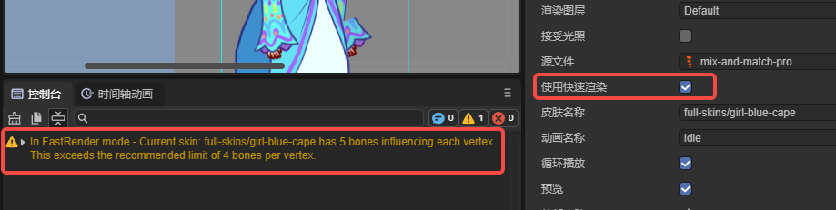
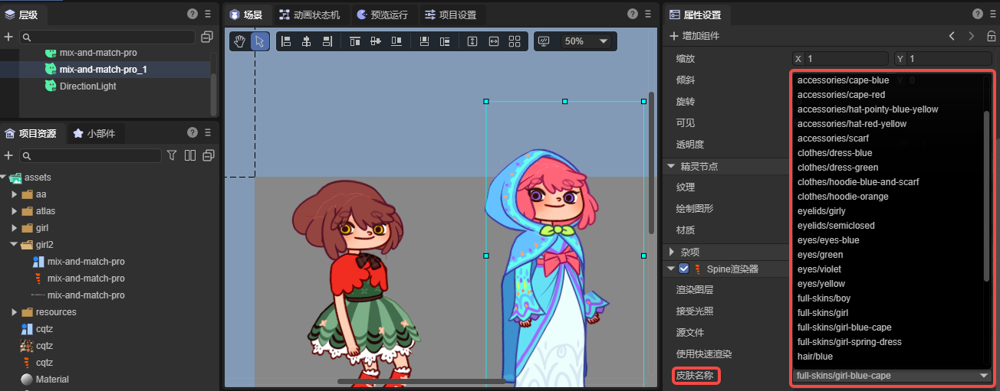
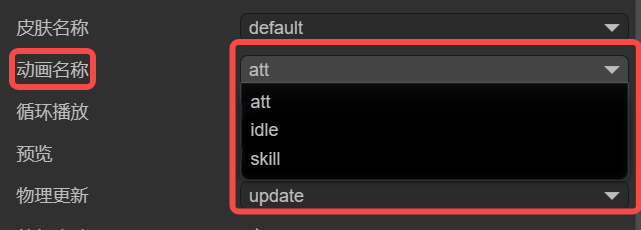
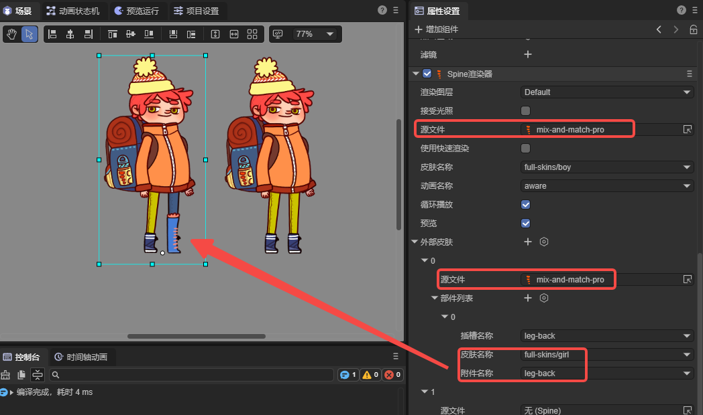
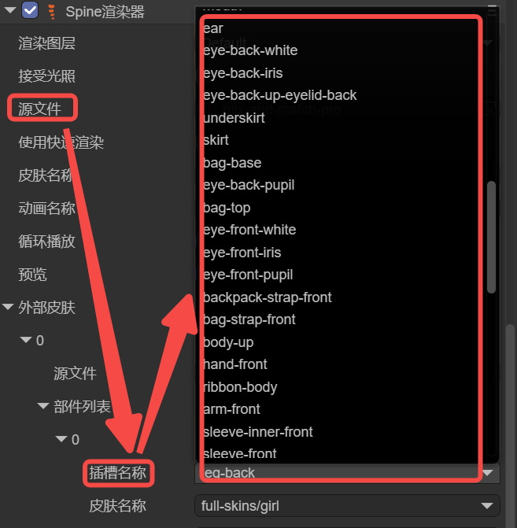
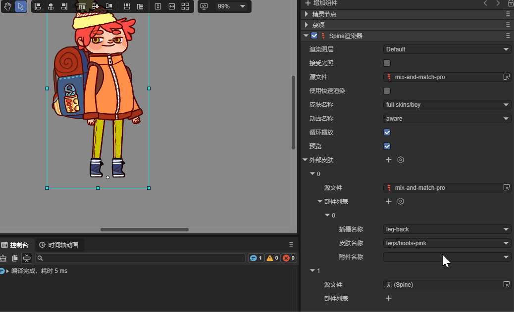
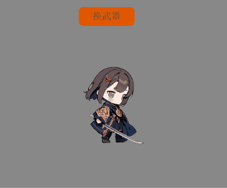

# Spine Renderer (`Spine2DRenderNode`)

> Author: Charley

## 1\. Getting Started with Spine

Spine is a professional 2D skeletal animation tool widely used in game development. It uses a bone-driven animation approach, with keyframe interpolation and mesh deformation to make character or object animations more fluid and more resource-efficient than frame-by-frame animation.

> This article does not cover how to create Spine skeletal animations. Interested developers can visit the [Spine website](https://zh.esotericsoftware.com/spine-academy) for more information.

### 1.1 Supported Spine Runtimes

Spine consists of two main parts: the Spine Editor and the Spine Runtime. The Spine Editor is used to create and adjust animations, supporting the import of bitmap resources, bone binding, keyframe adjustment, and animation parameter settings.

The Spine Runtime is a series of open-source libraries provided by Spine's official team. The LayaAir engine integrates Spine animation rendering by introducing the Spine Runtime libraries.

Currently, LayaAir supports Spine 3.7, 3.8, 4.0, 4.1, and 4.2 runtime versions. Developers can select the corresponding Spine runtime version in the IDE under `Project Settings` -\> `Engine Modules` -\> `2D` -\> `Spine Animation`. The interface is shown in Figure 1-1.

  

(Figure 1-1)

**Note**: The IDE cannot automatically identify the Spine version. Therefore, developers need to manually select the correct runtime library version based on their Spine resource to ensure correct operation.

### 1.2 Basic Spine Usage Flow

Once the Spine resources are placed in the resource directory (`assets`), you can directly drag and drop the Spine file (`.skel` or `.json`) into the hierarchy panel. This automatically creates a 2D sprite node and adds a `Spine Renderer` component to it, with the Spine source file path automatically set to the dragged resource, as shown in Figure 1-2.

 

(Figure 1-2)

Alternatively, developers can add the `Spine Renderer` component to an existing node by using the "Add Component" function, as shown in animated Figure 1-3.

 

(Animated Figure 1-3)

If you have added the Spine component and specified the Spine resource but **it does not display correctly in the IDE, it is usually because of an incorrect runtime library version**. You need to first confirm the Spine resource version and then select the correct Spine runtime library as shown in Figure 1-1.

When dynamically loading the Spine in code, you also need to be mindful of the Spine resource's runtime library version.

Here is an example of dynamic code addition:

```typescript
const { regClass, property } = Laya;
@regClass()
export class Demo extends Laya.Script {
     spine: Laya.Spine2DRenderNode;
     // Executed after the component is activated, once all nodes and components have been created. This method is only run once.
     onAwake(): void {
         // Load the Spine animation data resource (json file), making sure to set the type to Laya.Loader.SPINE, otherwise the json will not be recognized as a Spine resource.
         Laya.loader.load("girl2/mix-and-match-pro.json", Laya.Loader.SPINE).then(() => {
             // Add the Spine Renderer component to the sprite node.
             this.spine = this.owner.addComponent(Laya.Spine2DRenderNode);
             this.spine.source = "girl2/mix-and-match-pro.json"; // Set the Spine animation data source.
             this.spine.skinName = "full-skins/girl"; // Set the skin name.
             this.spine.play("idle", false); // Play the animation named "idle", with false indicating it does not loop.
         });
     }
}
```

## 2\. Spine Panel Properties Explained

### 2.1 Render Layer `layer`

The render layer determines whether the node is affected by the 2D lighting system and other render-layer-related logic.

For example, after setting the render layer to `abc` as shown in Figure 2-1, the Spine animation on the current node can be affected by 2D lights whose `Layer Mask` is also set to `abc`.

 

(Figure 2-1)

> For more information on how lights affect render layers, refer to the [《BaseLight2D》](../../BaseLight2D/readme.md)documentation.

### 2.2 Receive Light 

By default, Spine does not receive light. It will only be affected by light if `lightReceive` is checked.

As shown in Figure 2-2, the Spine animation on the right is affected by a blue 2D directional light, while the one on the left is not.

 

(Figure 2-2)

### 2.3 Source File 

The path to the Spine animation resource file, with the format `.skel` or `.json`.

### 2.4 Use Fast Render 

The Spine component enables Fast Render by default. In this mode, a series of optimization strategies, such as GPU computation, are used to significantly improve Spine animation performance.

However, this optimization strategy balances performance and memory by limiting the number of bones per vertex. The number of bones controlling a single vertex cannot be greater than 4.

If the number of bones controlling a vertex exceeds 4, it may cause rendering abnormalities. The engine will also issue a warning, as shown in Figure 2-3.

 

(Figure 2-3)

If rendering is abnormal, you can uncheck `Use Fast Render` to revert to the standard rendering process. However, we recommend adjusting the Spine art resource for optimal animation performance.

### 2.5 Skin Name 

If your Spine asset has multiple skins, you can switch between different skin names in the IDE to preview the effects, as shown in Figure 2-4.



(Figure 2-4)

Developers can also switch between different skins dynamically through code based on game logic.

Here is a code example:

```typescript
const { regClass, property } = Laya;

@regClass()
export class NewScript extends Laya.Script {
     spine: Laya.Spine2DRenderNode;
     onEnable(): void {
         // Get the spine component attached to the IDE node.
         this.spine = this.owner.getComponent(Laya.Spine2DRenderNode);
         let currentSkin: string = this.spine.skinName; // Record the current skin state.
         // Execute logic after playback stops.
         this.owner.on(Laya.Event.STOPPED, this, () => {
             // Use a ternary operator to switch skin names.
             currentSkin = currentSkin === "full-skins/girl" ? "full-skins/girl-blue-cape" : "full-skins/girl";
             this.spine.skinName = currentSkin;
             this.spine.play("idle", false); // Play the animation again after switching.
             console.log(`Current skin switched to: ${currentSkin}`);
         });
     }
}
```

### 2.6 Animation Name 

In the example code above, we used the `play` method to play an animation directly. For easier use in the IDE panel, we have encapsulated the `play` method with the `animationName` accessor.

This allows developers to directly see all the animation names in the Spine asset within the IDE panel, making it easy to switch and preview different animations, as shown in Figure 2-5.

 

(Figure 2-5)

### 2.7 Loop Playback 

Similar to `animationName`, `loop` is an encapsulated property for the `play` method, providing a visual control in the IDE to enable or disable looping.

Check the box to loop the animation; uncheck it to play only once.

### 2.8 Preview 

Preview is not an engine feature but an IDE-specific function to control whether the animation plays in the scene editor.

Check the box to play the Spine animation; uncheck it to display only a static frame.

### 2.9 Physics Update `physicsUpdate`

> The physics simulation feature is only available for Spine versions 4.2 and above. We currently only support `none` and `update` parameter settings.

  - `none`: No physics simulation is used.

  - `update`: Enables physics updates. When enabled, the final animation pose is no longer determined solely by the timeline but is influenced by physical effects.

As shown in animated Figure 2-6, after enabling `Physics Update` for the girl on the right, her hair and skirt sway naturally under the influence of physical forces.

 

(Animated Figure 2-6)

The specific physics parameters need to be set in the Spine editor; LayaAir only determines whether to enable them.

## 3\. External Skins `externalSkins` (Part Swapping)

The main function of `externalSkins` is to import other Spine resources to replace attachments on the current Spine's slots under different skins.

> The external skins feature does not support Fast Render mode (`useFastRender`).

### 3.1 Importing External Skin Resources

Clicking the `+` icon on the right side of `External Skins` creates a sub-object property with `Source File` and `Part List` fields, as shown in Figure 3-1.

 

(Figure 3-1)

The `Source File` in the sub-object list is the Spine resource file, and the skin and attachments in the `Part List` are obtained from that source file.

In principle, each sub-object's `Source File` should correspond to a different Spine resource file; do not use duplicates. This is because the engine will apply each setting in the list, and duplicate resource settings will overwrite the previous identical setting.

It is important to note that external skins are used to replace attachments from another set of skins that are outside the current Spine component's skin set.

If the Spine resource for the current component has multiple skins, you can still reference them in the sub-object list of external skins, as shown in Figure 3-2. Just be careful not to reuse the same resource within the sub-objects.

 

(Figure 3-2)

### 3.2 Replacing Different Parts

The `Part List` in the `External Skins` sub-object is used to specify which attachment from a skin in the corresponding source file should be used for which slot.

#### 3.2.1 Slot Name `slot`

The `Slot Name` is a list of all slots in the current component's Spine resource file. Developers can select the slot they want to replace from the list, as shown in Figure 3-3.

 

(Figure 3-3)

#### 3.2.2 Skin Name `skin`

The `Skin Name` is a list of all skins from the `Source File` corresponding to the `External Skins` sub-object.

In Spine, a single skin can correspond to different attachments, as shown in animated Figure 3-4.

 

(Animated Figure 3-4)

Similarly, the same attachment name can have a different appearance under different skins. As shown in animated Figure 3-5, switching the skin name changes the appearance of the right leg.

 

(Animated Figure 3-5)

#### 3.2.3 Attachment Name `attachment`

To facilitate needs like changing outfits or weapons, a Spine character is usually broken down into individual parts. In Spine, these parts are professionally called `attachments`, which need to be connected through slots. The effect is shown in animated Figure 3-6.

 

(Animated Figure 3-6)

### 3.3 Code Example for Replacing Parts

Visual operations are usually used for previewing effects or changing default settings. Replacing attachments is more commonly controlled through code, for example, to change a weapon.

Here is a code example:

```typescript
const { regClass, property } = Laya;

@regClass()
export class NewScript extends Laya.Script {

     @property({ type: Laya.Button, caption: "Switch Button" })
     public btn: Laya.Button;

     spine: Laya.Spine2DRenderNode;

     // External skin object.
     weaponSkin: Laya.ExternalSkin = new Laya.ExternalSkin();
     // External skin list item.
     weaponSkinItem: Laya.ExternalSkinItem = new Laya.ExternalSkinItem();

     // Executed after the component is activated. All nodes and components have been created at this point. This method is executed only once.
     onAwake(): void {
         // Load Spine animation resources.
         Laya.loader.load(["spine4.1/boss.json", "spine4.1/role.json"], Laya.Loader.SPINE).then(() => {
             // Add the Spine Renderer component to the sprite node and return the component.
             this.spine = this.owner.addComponent(Laya.Spine2DRenderNode);
             this.spine.source = "spine4.1/role.json"; // Set the Spine animation data source.
             this.spine.skinName = "default"; // Set the skin name.
             this.spine.play("att", true); // Play the "att" attack animation, true indicates looping.

             this.btn.on(Laya.Event.CLICK, this, this.changeAttachment); // Listen for click events to trigger the method for changing the weapon.

             // The following basic settings can be set in the IDE, so you don't have to add them in code. This is just for demonstration.
             // Set the external skin object.
             this.spine.externalSkins = [this.weaponSkin];
             // Set data for the external skin object.
             this.weaponSkin.source = "spine4.1/boss.json"; // Set the external skin data source.
             this.weaponSkin.items = [this.weaponSkinItem]; // Set the external skin list items.
             // Set data for the external skin list item.
             this.weaponSkinItem.slot = "taidao"; // Set the slot name.
             this.weaponSkinItem.skin = "default"; // Set the skin name.
         });
     }

     // Change the weapon.
     changeAttachment(): void {
         // Switch the weapon based on the current attachment state.
         const newAttachment = this.weaponSkinItem.attachment === "weapon_1" ? "weapon_3" : "weapon_1";
         this.setAttachment("taidao", "default", newAttachment);
         console.log(`Switched to ${newAttachment}`);
     }

     // Set the weapon attachment.
     setAttachment(slot: string, skinName: string, attachmentName: string): void {
         this.weaponSkinItem.slot = slot; // Set the slot name.
         this.weaponSkinItem.skin = skinName; // Set the skin name.
         this.weaponSkinItem.attachment = attachmentName; // Set the attachment name.
         this.spine.resetExternalSkin(); // Reset the loaded external skin to apply the settings.
     }
}
```

The code in action is shown in animated Figure 3-7.

 

(Animated Figure 3-7)

## 4\. Common Considerations (Must Read)

### 4.1 Playback Issues due to Asynchronous Loading

Sometimes, due to the large size of Spine resources and slow user network speeds, the code controlling the Spine component may fail or report errors. This happens because the resources are still in the process of asynchronous loading when lifecycle methods like `onAwake` and `onEnable` are executed, and are not yet fully loaded. This can cause issues with usage.

The solution is to put larger Spine resources into the preloading queue to load them in advance.

Alternatively, listen for the `Laya.Event.READY` event before processing your logic.

### 4.2 You Must Specify the Type When Loading a Spine JSON

If developers load a binary Spine resource, they can omit the type because the binary suffix is special and can be specified internally by the engine. However, JSON is a general resource type, so the engine cannot specify the type internally. Therefore, developers must specify the Spine type as `Laya.Loader.SPINE` during loading, as shown in the example below:

```typescript
// Load the Spine animation data resource (json file), making sure to set the type to Laya.Loader.SPINE, otherwise the json will not be recognized as a Spine resource.
Laya.loader.load(["aa.json", "bb.json"], Laya.Loader.SPINE);
```

### 4.3 Display Differences with Alpha Blending

Some developers have reported that the effect seen in Spine is different from the engine's effect, typically appearing less bright or with less obvious semi-transparent areas.

In fact, these issues are almost always caused by texture configurations for alpha blending. This is especially common for projects that worked fine in version 3.1 but show discrepancies in 3.2 and later.

Starting from LayaAir 3.2, a distinction is made between premultiplied and non-premultiplied blending for Spine.

If your Spine requires alpha blending, you cannot use the default sprite texture type. You need to make the following changes to the Spine texture resources in the IDE project:

  - In the Project Resources panel, select the texture from your Spine resource.
  - In the Spine texture's property panel, change the `Texture Type` to `Default`.
  - Check the `sRGB Color Space` box.
  - Make sure **not** to check `Premultiply Alpha` (do not check this when exporting from Spine either).
  - Click `Apply`.

These steps are shown in Figure 4-1:

 

(Figure 4-1)

Note: If the effect is still incorrect after applying, refresh the IDE.
Additionally, if you have multiple Spine textures, you can select them all at once to set them. Or, developers can write an IDE plugin to automate this process.

### 4.4 Do Not Manually Load Spine's .atlas and .png Files

When developers manually load Spine's `.atlas` files in code or preload them in the IDE's Scene2D, they may see a warning similar to the following during runtime:

```sh
Failed to load 'http://localhost:18094/resources/ddlx_02/ddlx_02.atlas' Unexpected token 'd', "ddlx_02.pn"... is not valid JSON
```

This occurs because although a Spine `.atlas` file has the same name as our engine's atlas files, they are not the same thing. Our atlas information is in JSON format, while Spine's is not. So, when loading, the engine finds that the `.atlas` file is not a valid JSON and reports the warning `"... load 'xxx.atlas'....is not valid JSON"`.

When loading a Spine asset, developers only need to load the main Spine file (`.skel` or `.json`). You do not need to manually load the `.atlas` and `.png` files, as the engine will automatically load the associated resources based on the main Spine file.