# 3D RigidBody

> Author: Charley        Version \>= LayaAir 3.2

We know that all tangible matter in nature can be called an object.

**rigid body** is an abstract concept in mechanics used to describe the properties of an object. It is an idealized mechanical model that **refers to a body whose shape and size remain unchanged during force application or motion, and the relative positions between all internal points of the body do not change.**

However, a perfectly rigid body model cannot exist in the real world. When an object is subjected to force, factors like the magnitude of the force, the material's elasticity, and plasticity cause the object to deform. Nevertheless, in many physical simulations, if the object's deformation has a negligible effect on its overall motion, or to simplify the problem, we still treat the object as a rigid body and ignore changes in its shape and volume. This approximation usually yields results that are consistent with real-world scenarios.

In the LayaAir3 engine, the class for a **3D rigid body** is **Rigidbody3D**. This is a physics component class that inherits from the PhysicsColliderComponent class and **provides all the core functionalities required for physical simulation**, including force application, velocity control, gravity influence, collision response, and more.


## 1\. Collider Base Class Properties

### 1.1 Collision Shape 

A **collision shape** is a geometry used to describe how an object detects and responds to collisions with other objects. It defines the object's physical boundary, or its external shape, so that the physics engine can accurately determine if objects are in contact and calculate the post-collision reaction.

The LayaAir engine supports several collision shapes, including Box, Sphere, Capsule, Cylinder, Cone, and Mesh, each suitable for different types of objects, as shown in Figure 1-1:

 

(Figure 1-1)

The choice of collision shape not only affects the accuracy of physical collision calculations but also directly impacts the performance of the game or physical simulation.

For dynamic objects, simpler collision shapes are usually chosen to improve efficiency, while for static objects, more complex collision shapes can be used to ensure higher accuracy. Choosing the right collision shape is a crucial step in 3D physical simulation, as it allows you to optimize system performance while ensuring the realism of physical effects.

#### 1.1.1 Box Collision Shape

A box collision shape is a rectangular prism or cube, as shown in Figure 1-2. It is suitable for simple, box-shaped objects like crates, building walls, and can be used for most regular-shaped objects.

 

(Figure 1-2)

You can set the position and size of the box collision shape using the `localOffset` and `size` properties, as shown in Figure 1-3.

 

(Figure 1-3)

#### 1.1.2 Sphere Collision Shape

The sphere collision shape is the simplest collision shape, using a sphere to represent the object's collision boundary, as shown in Figure 1-4. The physics engine checks the distance between spheres to determine if a collision has occurred.

Because its calculations are simple, it is more performant. The sphere collision shape is suitable for objects that are small and have a spherical shape, such as bullets, balls, and other simple objects.

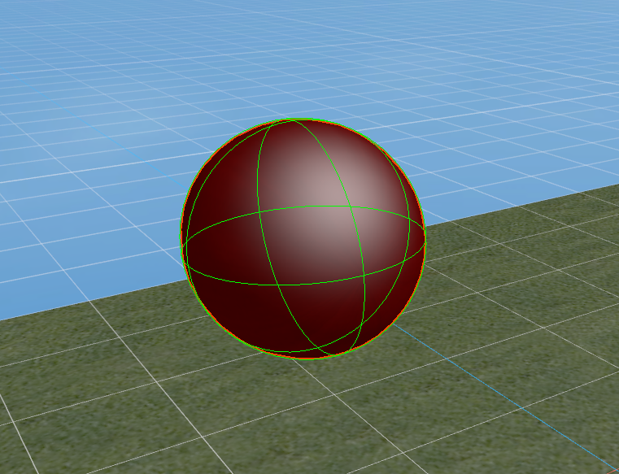 

(Figure 1-4)

You can set the position and size of the sphere collision shape using the `localOffset` and `radius` properties, as shown in Figure 1-5.

 

(Figure 1-5)
#### 1.1.3 Capsule Collision Shape

A capsule collision shape is composed of a cylinder and two hemispherical end caps, resembling the shape of a capsule, as shown in Figure 1-6. It is commonly used to simulate objects that are taller in the vertical direction but narrow, with a common application being for character controllers. In addition, the capsule shape is also suitable for other columnar objects, such as pillars or similar mechanical parts.

 

(Figure 1-6)

You can set the position, thickness, length, and orientation of the capsule collision shape using the `localOffset`, `radius`, `length`, and `orientation` properties, as shown in Figure 1-7.

 

(Figure 1-7)

#### 1.1.4 Cylinder Collision Shape

A cylinder collision shape is used to represent the collision boundary of a cylindrical object, typically for objects with a symmetrical shape. It is suitable for simulating tall, regular-shaped objects like pipes or columns, as shown in Figure 1-8. The cylinder shape is also often used for rotating objects, such as gears or rollers. Due to its simple geometric structure, calculations are relatively efficient.

 

(Figure 1-8)

You can set the position, thickness, height, and orientation of the cylinder collision shape using the `localOffset`, `radius`, `height`, and `orientation` properties, as shown in Figure 1-9.

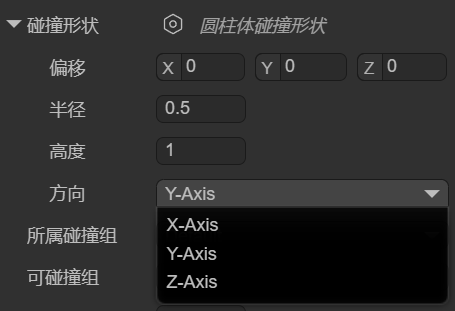 

(Figure 1-9)

#### 1.1.5 Cone Collision Shape

The cone collision shape is used to represent the collision boundary of a cone-shaped object. It has a circular base and a vertex, making it suitable for objects shaped like cones, as shown in Figure 1-10. The cone shape is often used to simulate objects with a conical structure, such as cone-shaped rocks, conical mechanical parts, spikes, and missiles, ensuring a natural physical reaction during collisions.

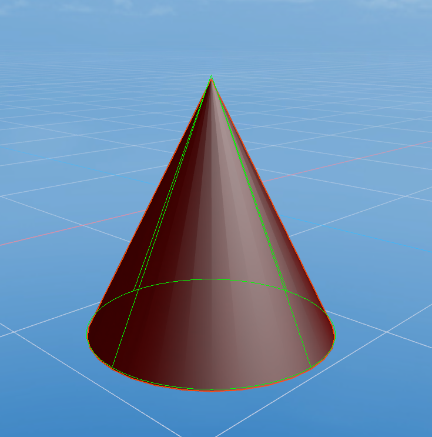 

(Figure 1-10)

You can set the position, base size, height, and orientation of the cone collision shape using the `localOffset`, `radius`, `height`, and `orientation` properties, as shown in Figure 1-11.

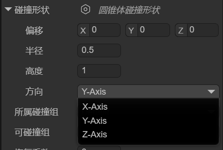 

(Figure 1-11)

#### 1.1.6 Mesh Collision Shape

The mesh collision shape uses the object's 3D model (mesh) as its collision boundary, as shown in Figure 1-12, allowing it to precisely match the object's shape. It is suitable for complex or irregular-shaped objects and provides very high collision accuracy. Due to the high computational cost of mesh colliders, they are typically only used for static objects (static colliders) and are not suitable for dynamic objects (3D rigid bodies). If you must use one on a dynamic object, the LayaAir engine will force it to use a convex hull for performance optimization.

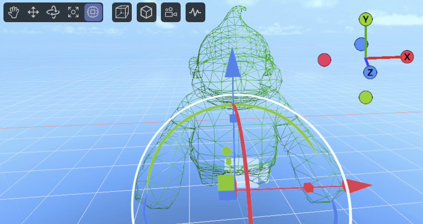 

(Figure 1-12)

You can set the position, mesh resource, and whether the engine should automatically process it as a convex hull (for performance optimization) using the `localOffset`, `mesh`, and `convex` properties, as shown in Figure 1-13.

 

(Figure 1-13)

#### 1.1.7 Compound Collision Shape

A compound collision shape combines multiple sub-collision shapes into a single collider using local offsets relative to the parent node. Its essence is to create a "compound body" made up of multiple shapes at the physics engine's core, which is then treated as one rigid body.

In the IDE, after adding a compound collision shape, there is only one setting: `shapes`. You can add sub-shapes by clicking the `+` button, as shown in Figure 1-14.

 

(Figure 1-14)

> Note: When adding sub-shapes, you cannot use another compound collision shape.

#### 1.1.8 Collision Shape Editing Tool

Starting with LayaAir 3.2.4, in addition to property adjustments, a visual editing tool for collision shapes is provided, making it more intuitive for developers to edit collision shapes (except for mesh collision shapes).

The operation is simple: just click "Show Collision Shape Editing Tool" at the top of the collision shape. Once in editing mode, you will see several white cubes, which are the editing points, as shown in Figure 1-15.

 

(Figure 1-15)

By dragging these editing points, you can easily change the shape's appearance.

### 1.2 Collision Group 

When you have complex collision requirements, for example, wanting to collide with some objects but not others, you need to use grouping and specify which collision groups can collide with each other.

The `collisionGroup` property is used to specify which collision group the current collider belongs to. In the IDE, you can click on `Edit Group` to go to the `Physics System` section of `Project Settings` to add collision groups and their names. As shown in Figure 1-15.


(Figure 1-15)

It's important to note that the name of the collision group is for easy identification in the IDE, but the engine's API uses values that are powers of 2.

For example, `Default` in Figure 2-1 is $2^0$, which is 1, while the custom `npc` group is $2^2$, with an actual value of 4. Following this pattern, the collision group with group ID 3 has a value of 8.

Therefore, if you set collision groups in the code instead of the IDE, the value for the engine's API must be a power of 2.

Here is a code example:

```typescript
// Use code to specify which collision group a collider belongs to
xxx.collisionGroup = 1 << 3; // The value is 2 to the power of 3 (8), which can be simply understood as group ID 3, making it easier to align with the IDE concept.
```

### 1.3 Can Collide With 

In the IDE, you can set the value for **Can Collide With** by selecting multiple group names, as shown in Figure 1-16. This is used to specify which groups of colliders the current object can collide with.

 

(Figure 1-16)

In addition to specifying custom collision groups, `Nothing` at the top means it won't collide with any group, while `Everything` means it can collide with any group.

If developers need to pass values through code, they can also use bitwise operations, as shown in the following example:

```typescript
// Specify that collider xxx can collide with a specific collision group
xxx.canCollideWith = 1 << 2; // Only collides with the group with ID 2 (value is 4).

// Specify that collider xxx can collide with multiple collision groups
xxx.canCollideWith = (1 << 1) | (1 << 2) | (1 << 5); // Only collides with groups 1, 2, and 5.

// Specify that collider xxx cannot collide with certain groups, but can with all others
xxx.canCollideWith = -1 ^ (1 << 3) ^ (1 << 6); // Does not collide with groups 3 and 6, but can collide with any other group.
```

### 1.4 Restitution 

Restitution describes the elasticity of an object during a collision. A higher restitution value means a stronger bounce and less energy loss after a collision. A lower value means less bounce and more energy loss. In animated Figure 1-17, the restitution values for the falling boxes (3D rigid bodies) from left to right are 0, 0.5, and 1, respectively. The floor (static collider) has a restitution of 0.5.

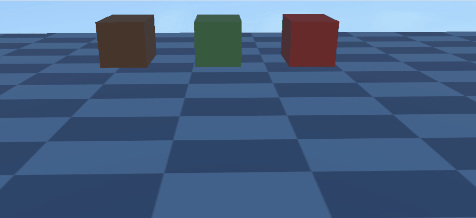 

(Animated Figure 1-17)

> Note that the effect of restitution depends on both colliding objects. For example, if one object has a restitution of 0, the overall restitution will be 0 regardless of the other object's value, meaning there will be no bounce.

### 1.5 Friction 

Friction is a force that resists relative motion or the tendency of relative motion between two objects in contact.

Friction is an important parameter used to simulate the resistance between objects in contact, affecting how easily an object slides on a surface. A higher value means greater friction, making it harder for the object to slide.

We set the friction of the boxes (3D rigid bodies) from left to right to 0.1, 0.3, 0.5, and 1. The friction of the ramp (static collider) is set to 0, and the floor (static collider) is set to 0.5. The effect is shown in animated Figure 1-18.

 

(Animated Figure 1-18)

When we set the ramp's (static collider) friction to 0.8 and keep other friction values the same, the effect is shown in animated Figure 1-19.

(Animated Figure 1-19)

### 1.6 Rolling Friction 

Rolling friction is the force that resists the rolling motion of one object on the surface of another. When friction is too high, it can even affect rolling.

We set the rolling friction of the spheres (3D rigid bodies) from left to right to 0, 0.2, and 0.3. The rolling friction of the ramp (static collider) is set to 0. The effect is shown in animated Figure 1-20.

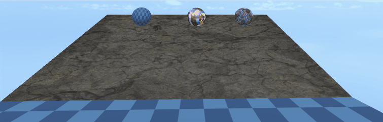 

(Animated Figure 1-20)

We keep the rolling friction of the spheres the same but set the ramp's (static collider) rolling friction to 0.1. The effect is shown in animated Figure 1-21. Only the leftmost sphere continues to roll, while the rightmost one slides slowly and is almost stationary.

 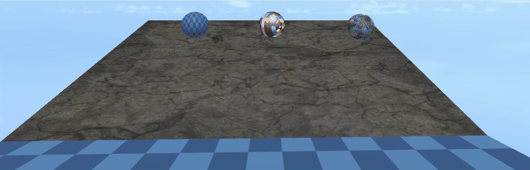

(Animated Figure 1-21)

-----

## 2\. 3D RigidBody Properties

### 2.1 Trigger 

In a 3D rigid body, when the `isTrigger` property is checked, it will not participate in collision interactions during physical simulation. This means it won't produce collision forces or affect the rigid body's trajectory. As shown on the right side of animated Figure 2-1, the falling box ignores the ground (static collider) and passes straight through it, as the ground is set to a trigger.

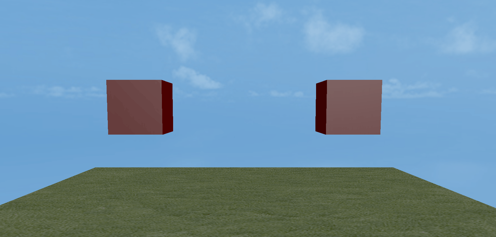  

(Animated Figure 2-1)

The main purpose of a trigger is to detect if another rigid body enters, stays in, or leaves its defined area. When these conditions are met, it triggers a pre-defined event or logic, enabling a wide range of game or simulation effects.

### 2.2 Kinematic RigidBody 

A kinematic rigid body is a type of rigid body that is not affected by physical forces. Its motion is controlled by the program, for example, by modifying its 3D transform properties rather than being driven by the physics engine's force calculations.

Unlike a normal rigid body, a kinematic rigid body is not affected by physical factors like gravity or friction, allowing for precise control over its position and rotation.

Furthermore, kinematic rigid bodies can significantly improve performance because the physics engine does not need to calculate every movement for them. This is especially important for scenes with many objects, as it can reduce the burden on the physics engine.

Kinematic rigid bodies are often used in conjunction with triggers, as they only detect collision events but are not affected by forces. This makes them suitable for scenarios that require interaction with other objects but do not need physical collision feedback.

Due to the characteristics of a kinematic rigid body, force-related properties are automatically hidden when `isKinematic` is checked, as shown in Figure 2-2.

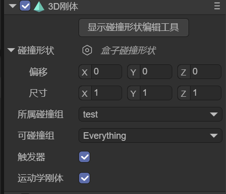 

(Figure 2-2)

### 2.3 Gravity 

Gravity refers to a constant acceleration applied by the physics engine to a rigid body, typically simulating real-world gravitational pull.

Gravity affects a rigid body's motion, causing it to continuously accelerate in a certain direction (usually downwards, i.e., in the negative Y-axis direction), thereby simulating a realistic free-fall effect.

The default gravity value is **(0, -9.8, 0)**, meaning the object will fall downwards with an acceleration of 9.8 m/s².

For dynamic rigid bodies with the same mass, a greater gravity value results in a greater acceleration of fall. The comparison is shown in animated Figure 2-3.

  

(Animated Figure 2-3)

### 2.4 Mass 

Mass is a physical quantity that measures the amount of matter in an object. In a 3D rigid body's digital simulation environment, mass can be understood as a quantitative description of the rigid body's "inertia."

It is a scalar value, has no direction, and represents a physical characteristic of the rigid body. Different rigid bodies can have different mass values to simulate the weight differences of real-world objects.

In a physics engine, mass is typically used to calculate an object's **equation of motion**, in accordance with Newton's second law: $F=m \\cdot a$.

Here, **F** is the net force acting on the rigid body, **m** is the mass of the rigid body, and **a** is the acceleration produced by the rigid body. Therefore, if a rigid body has a larger mass, it will have a smaller acceleration when subjected to the same force; conversely, a rigid body with a smaller mass will be easier to push.

As shown in animated Figure 2-4, the box on the left has a significantly greater mass than the box on the right.

 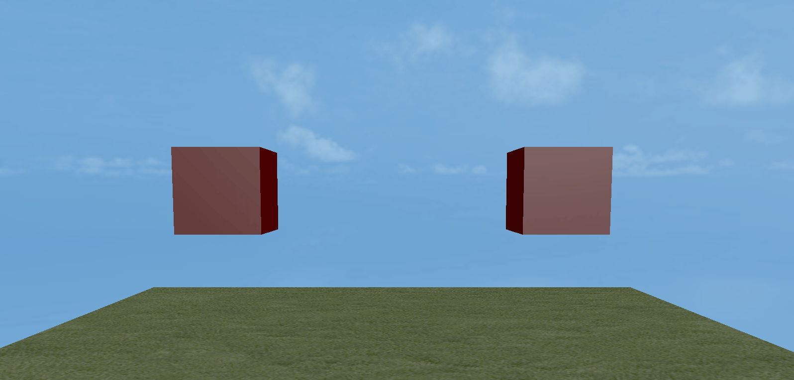  

(Animated Figure 2-4)

### 2.5 Linear Velocity 

Linear velocity is a physical property that describes a rigid body's straight-line motion in a certain direction. It is represented by a three-dimensional vector (x, y, z), with each component corresponding to the rigid body's velocity along the X, Y, and Z axes. This value has both magnitude and direction.

Animated Figure 2-5 shows the comparison when the gravity is 0, between not setting a linear velocity and setting a linear velocity value on the y-axis.

  

(Animated Figure 2-5)

### 2.6 Linear Damping 

If no external force is applied, linear velocity would remain constant, causing the rigid body to move indefinitely.

Linear damping is used to simulate effects like **air resistance** or **viscous drag**, causing the rigid body's linear velocity to gradually decrease over time so that it doesn't move forever in the absence of external forces.

Animated Figure 2-6 shows the comparison between the left box with a linear damping of 0.9 and the right box with a linear damping of 1, both under the same conditions of `gravity = 0` and `y-axis linear velocity = -1`.

  

(Animated Figure 2-6)

### 2.7 Angular Velocity 

Angular velocity is a physical property that describes a rigid body's rotational speed around an axis. It is represented by a three-dimensional vector (Vector3), with each component corresponding to the rotational rate around the X, Y, and Z axes. This value has both magnitude and direction. The unit is **radians per second**.

Simply put, angular velocity measures how fast and in what direction a 3D rigid body rotates around a specific axis. It reflects the change in the angle of rotation per unit of time.

Imagine a spinning top: the higher the angular velocity, the greater the angle it rotates in the same amount of time, meaning it spins faster. Conversely, a smaller angular velocity means it spins slower.

Animated Figure 2-7 shows the comparison when the x-axis angular velocity is set to 3.14 and 31.4, respectively.

  

(Animated Figure 2-7)

### 2.8 Angular Damping 

Angular damping is a physical property used to simulate the factors that resist a rigid body's rotation. Just as objects in the real world are affected by air resistance and friction, which prevent them from rotating forever, angular damping is the parameter used to quantify this resistance in 3D physics simulations.

Animated Figure 2-8 shows the comparison between the left side with an angular damping of 1 and the right side with an angular damping of 0.9, both under the same angular velocity of 31.4.

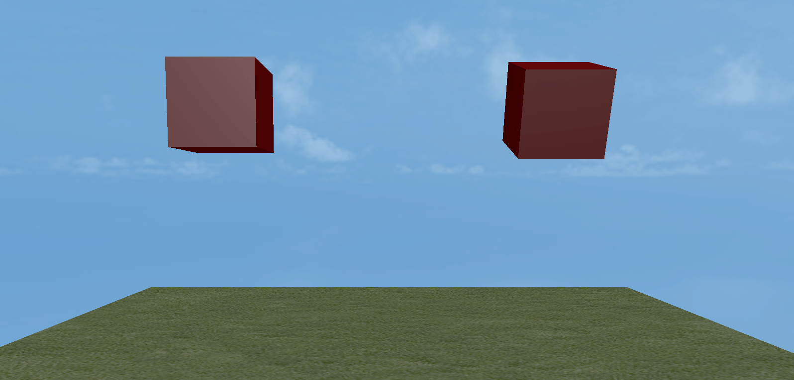  

(Animated Figure 2-8)

### 2.9 Linear Factor 

**Linear factor** refers to a **rigid body's ability to translate along the X, Y, and Z axes**, i.e., whether it can move freely in a certain direction. For example, when pushing a box on a plane, it can be pushed in the X and Z directions, but the Y direction (vertical) is locked.

**Control method, using 0 or 1 for a specific axis to determine if it is locked:**

  - **Free (1)**: Allows the rigid body to move in that direction.
  - **Locked (0)**: The rigid body's displacement in that direction is locked and cannot move.

The setting in Figure 2-9 indicates that the rigid body can move freely in the X and Z directions, while the Y-axis direction is locked and it cannot move.

 

(Figure 2-9)

> Note that the restriction of degrees of freedom is based on the axis motion of physical forces. For example, setting linear velocity will not be limited by the linear factor setting.

### 2.10 Angular Factor 

**Angular factor** refers to a **rigid body's ability to rotate around the X, Y, and Z axes**, i.e., whether it can rotate in a certain direction. For example, a hinged door is only allowed to rotate around the Y-axis, while rotation around the X and Z axes is locked.

**Control method:**

  - **Free (1)**: Allows the rigid body to rotate around that axis.
  - **Locked (0)**: The rotation around that axis is locked, and the rigid body cannot rotate around it.

The setting in Figure 2-10 indicates that rotation is free around the Y-axis, while rotation around the X and Z axes is locked.

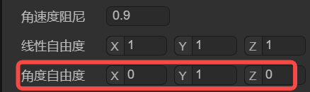 

(Figure 2-10)

> Note that the restriction of degrees of freedom is based on the axis motion of physical forces. For example, setting angular velocity will not be limited by the angular factor setting.

-----

## 3\. Related Documentation

### [《physics3D》](../../../physicsEditor/physics3D/readme.md)