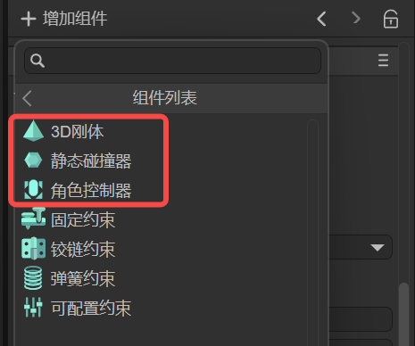
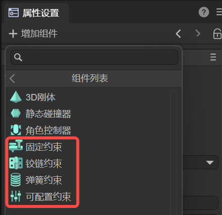

# 3D Physics Components

> Author : Charley           Version \>= LayaAir 3.2

3D physics components mainly consist of two parts: physics colliders and physics constraints.

## 1\. Physics Colliders

LayaAir3 has three types of physics collider components: 3D RigidBody, Static Collider, and Character Controller. As shown in Figure 1:

 

(Figure 1)

### 1.1 3D Rigid Body

Whether in a 2D or 3D physics engine, a **Rigid Body** is one of the fundamental concepts for understanding physical simulation.

We know that all physical objects in nature can be called bodies.

**A rigid body** is an abstract concept in mechanics used to describe the properties of an object. It is an idealized mechanical model that **refers to a body whose shape and size remain unchanged during force application or motion, and the relative positions between all internal points of the body do not change.**

However, a perfectly rigid body model cannot exist in the real world. When an object is subjected to force, factors like the magnitude of the force, the material's elasticity, and plasticity cause the object to deform. Nevertheless, in many physical simulations, if the object's deformation has a negligible effect on its overall motion, or to simplify the problem, we still treat the object as a rigid body and ignore changes in its shape and volume. This approximation usually yields results that are consistent with real-world scenarios.

In the LayaAir3 engine, the class for a **3D rigid body** is **Rigidbody3D**. This is a physics component class that inherits from the PhysicsColliderComponent class and **provides all the core functionalities required for physical simulation**, including force application, velocity control, gravity influence, collision response, and more.

#### Click on [《3D Rigid Body》](https://www.google.com/search?q=./Rigidbody3D/readme.md) to see the usage guide.

### 1.2 Static Collider

In the design of physics engines, static colliders have several key characteristics.

First, they remain absolutely static in position unless a developer directly modifies their transform properties through a script.

Unlike dynamic objects (such as rigid bodies represented by Rigidbody3D), static colliders are not affected by gravity, impulses, or other external forces. This means that no matter how other objects collide with them, the static collider will remain in its original position, without displacement or rotation.

The primary purpose of static colliders is to provide physical boundaries and obstacles for a scene, such as terrain, buildings, walls, platforms, and other fixed environmental elements. When a dynamic object (such as a character or item controlled by the physics engine) comes into contact with a static collider, the dynamic object can react according to physical rules, such as bouncing, sliding, or stopping. This allows objects in the game to interact with the environment in a realistic way without causing the environment itself to move.

From a performance perspective, static colliders are more efficient than dynamic rigid bodies. Since they do not need to calculate dynamic properties like position, velocity, or acceleration, they help improve performance and reduce unnecessary physics calculations.

In the LayaAir3 engine, the class for a **static collider** is **PhysicsCollider**. This is a physics component class that inherits from the PhysicsColliderComponent class and is used to simulate collision bodies for objects that **do not move** or are **not affected by physical forces**.

#### Click on [《Static Collider》](https://www.google.com/search?q=./PhysicsCollider/readme.md) to see the usage guide.

### 1.3 Character Controller

The **Character Controller** is a component in a game engine used to control the movement of players or NPCs (Non-Player Characters). It is typically used to simplify and optimize character movement and collision handling in 3D space, providing a dedicated interface to implement functions like character movement, jumping, and collision detection.

In essence, a character controller represents a type of constrained physical entity. Unlike a rigid body that completely follows Newton's laws of physics, a character controller uses a hybrid approach, combining deterministic character movement with interactions in the physical environment. It is neither a completely static collider nor a completely dynamic rigid body, but a special entity somewhere in between.

Unlike static physics colliders (PhysicsCollider), a character controller can move actively in the scene.

Unlike dynamic rigid bodies (Rigidbody3D), the character controller's movement is not entirely controlled by the physics engine's force system but is achieved through explicit movement commands. This ensures that the game character's movement is more precise and controllable.

In terms of physical representation, the character controller defaults to using a CapsuleColliderShape as its collision shape. This is because the capsule shape is best suited for simulating humanoid characters, as it can effectively handle collisions with the environment while maintaining stability. Developers can adjust the size of this capsule using the `radius` and `height` properties, and adjust its position offset in the character's local coordinate system with the `centerOffset` property.

The character controller has several built-in practical functions to handle common character movement scenarios. For example, the `stepHeight` property defines the maximum stair height the character can automatically climb, allowing them to smoothly walk up small steps without jumping. The `maxSlope` property sets the maximum angle of a slope the character can climb; any slope steeper than this angle will be considered un-climbable. The `move` and `jump` methods control the character's movement and jumping functions, respectively.

In game development, the character controller is particularly suitable for controlling the main character in first-person or third-person games. It solves problems that can arise from using a traditional 3D rigid body to control a character, such as sliding, tipping, or unstable collisions. With the character controller, developers can achieve precise character control, including movement, jumping, climbing, and interacting with the environment, while maintaining an appropriate sense of physical realism.

In the LayaAir3 engine, the class for the **character controller** is **CharacterController**. This is a physics component class that inherits from the PhysicsColliderComponent class, and it is an ideal choice for implementing high-quality character control systems.

#### Click on [《Character Controller》](https://www.google.com/search?q=./CharacterController/readme.md) to see the usage guide.

-----

## 2\. Physics Constraints

LayaAir3 has four types of physics constraint components: Fixed Constraint, Hinge Constraint, Spring Constraint, and Configurable Constraint, as shown in Figure 2:

 

(Figure 2)

### 1.4 Fixed Constraint

A fixed constraint is used to completely lock two objects together, restricting all relative movement and rotation between them, making them act as a single unit, as if they were welded together.

Fixed constraints are typically used to represent connections that do not allow relative motion, such as attaching a weapon to a character's hand at a specific position. A fixed constraint can be used between the weapon and the character's hand, so that no matter how the character moves or animates, the weapon will maintain its fixed relative position and orientation.

#### Click on [《Fixed Constraint》](https://www.google.com/search?q=./FixedConstraint/readme.md) to see the usage guide.

### 1.5 Hinge Constraint

A hinge constraint allows two objects to rotate around a specific axis while restricting movement in other directions. Similar to a door hinge or other rotational connections, a hinge constraint restricts linear displacement between two objects, allowing only rotation around a designated axis.

This is very useful for simulating various objects with rotational joints, such as simulating the opening and closing of doors and windows, or components in mechanical devices like cranks and rockers that rotate around an axis. Hinge constraints can accurately achieve their rotational motion around a specific axis, making the simulation more realistic.

#### Click on [《Hinge Constraint》](https://www.google.com/search?q=./HingeConstraint/readme.md) to see the usage guide.

### 1.6 Spring Constraint

A spring constraint allows two objects to maintain an elastic connection. When the distance between them exceeds a certain range, the spring generates a restorative force, attempting to maintain a specific distance or relative positional relationship between the two objects. When the distance between the objects deviates from the set equilibrium position, the spring constraint generates a force that tries to pull the objects back to the equilibrium position.

It can be used to simulate various objects or systems with elastic connections, such as simulating a vehicle's suspension system, where the wheels and body are connected by a spring constraint, allowing the wheels to move up and down based on the road surface while maintaining their connection to the body. It can also be used to simulate elastic ropes, chains, and other objects; when the distance between objects changes, the spring constraint will behave like a real spring, generating a corresponding elastic force to influence the objects' motion.

#### Click on [《Spring Constraint》](https://www.google.com/search?q=./SpringConstraint/readme.md) to see the usage guide.

### 1.7 Configurable Constraint

A configurable constraint is a highly flexible type of constraint that allows users to precisely define the relationship between two objects through various parameter configurations based on specific needs and scenarios. It allows for detailed constraint settings on translation, rotation, position, angle, and other aspects of the objects, and its behavior and properties can be dynamically changed based on different conditions and logic.

This is suitable for various complex physical simulation scenarios where other standard constraint types cannot meet specific requirements. For example, in simulating complex mechanical devices or the joint movements of a robot, a configurable constraint can be used to precisely define the range of motion and limitations for each joint. In games or simulation applications that need to dynamically change constraint relationships based on different situations, such as adjusting the connection and constraint conditions between objects based on character skills or environmental changes, configurable constraints can also be a good solution.

#### Click on [《Configurable Constraint》](https://www.google.com/search?q=./ConfigurableConstraint/readme.md) to see the usage guide.