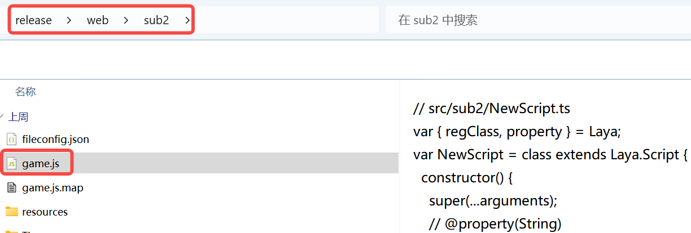
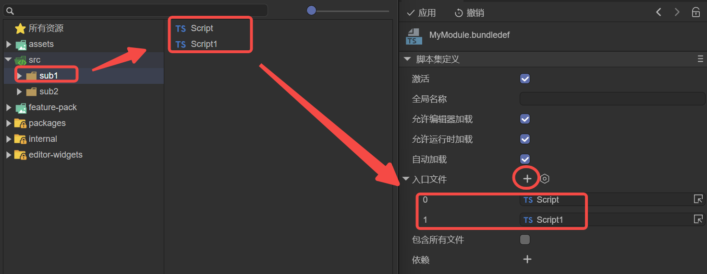

# Script Bundle Definition

> Author: Charley

---

## 1. Basic Usage Workflow

### 1.1 What is a Script Bundle Definition

Before understanding **Script Bundle Definition**, let's first clarify what a **script bundle** is.

As the name implies, a **script bundle** is a collection of script files.

In the default build and publish process of **LayaAir 3 IDE**, all `TypeScript` scripts under the project’s `src` directory are compiled and bundled into a single file named `bundle.js`. This is called the **main script bundle**.

A **Script Bundle Definition** is used to **customize and manage how these script bundles are built**, allowing a project to have multiple independent script bundles in addition to the main bundle.

By creating and configuring a `.bundledef` file, developers can specify which `TypeScript` files should be compiled and bundled into a separate modular `.js` file, enabling **modular usage of scripts**.

---

### 1.2 Creating a Script Bundle Definition

The script bundle definition file (`.bundledef`) is usually placed in an independent module folder, such as a subpackage directory.

In the project resources panel, right-click a folder → **Create → Script Bundle Definition** to generate a new script bundle definition file, as shown in Figure 1-1.

(Figure 1-1)

---

### 1.3 Using a Script Bundle Definition

Script bundle definitions can be applied in two scenarios: **main package** or **subpackage**.

#### 1.3.1 Using in the Main Package

Select the `.bundledef` file, configure its properties in the properties panel, and click **Apply** to save.

After building and publishing, a **script bundle** file with the same name as the bundle definition file will be generated under the main package directory (`js` folder), as shown in Figure 1-2.

(Figure 1-2)

> Detailed property explanations for the script bundle definition file are provided in Section 2.

#### 1.3.2 Using in a Subpackage

In **Build & Publish → General → Subpackage → Subpackage Settings**, you can set a script bundle definition file as the **entry script** for that subpackage, as shown in Figure 1-3.

(Figure 1-3)

When a script bundle definition is set as a subpackage **entry script**, the output script bundle file name will no longer match the definition file name. Instead, it will be uniformly named `game.js` under the subpackage folder, as shown in Figure 1-4.

(Figure 1-4)

---

## 2. File Configuration Properties

> This section introduces each property of a script bundle definition file.

### 2.1 Enabled (`enabled`)

Enabled by default. The configuration only takes effect if this option is checked.

### 2.2 Global Name (`globalName`)

Usually does not need to be set. Used for module naming. For example, if set to `module1`, other modules can access exported classes or functions via `module1.xxx`.

### 2.3 Allow Load in Editor (`allowLoadInEditor`)

Checked by default. Controls whether the script bundle is loaded in the editor environment.

### 2.4 Allow Load in Runtime (`allowLoadInRuntime`)

Checked by default. Only script bundles with this option checked will be included during the build and publish process.

### 2.5 Auto Load (`autoLoad`)

Checked by default. Determines whether the script bundle is automatically loaded and executed on startup.

### 2.6 Entry Files (`entries`)

The `entries` property specifies which `TypeScript` files should be compiled and included in this script bundle.

During the build process, the system first includes the TypeScript files listed in `entries`, then includes any files referenced by these entries and any files referenced by scene or prefab resources.

> Note: External TS files outside the same directory as the script bundle definition will be filtered out even if listed in `entries`. This ensures precise file selection while maintaining modular encapsulation.

In the IDE, you can add entries by dragging TS files to the `+` icon on the right side of the entries list, or by clicking the `+` and selecting files, as shown in Figure 2-1.

(Figure 2-1)

### 2.7 Include All Files (`includeAllFiles`)

Unchecked by default.

If checked, all TS files in the folder containing the script bundle definition will be compiled into the corresponding script bundle (`js` file).

If unchecked, only the TS files specified in the `entries` list will be processed.

### 2.8 References (`references`)

The `references` property specifies dependencies between script bundles to ensure correct load order and prevent runtime errors caused by incorrect loading sequences.

For example, if script bundle A depends on bundle B, add B in A's `references`. The system will ensure B is compiled and loaded before A.

Click the `+` icon to add references, as shown in Figure 2-2.

(Figure 2-2)

> A script bundle cannot reference itself.

### 2.9 Load Before Main (`loadBeforeMain`)

The main script bundle refers to `bundle.js`.

`loadBeforeMain` determines whether this script bundle should be loaded **before** or **after** the main bundle.

* Checked → load before `bundle.js`
* Unchecked → load after `bundle.js`

### 2.10 Bundle Externals (`bundleExternals`)

`bundleExternals` controls how external script references are handled during packaging.

* **Unchecked (default)**: References to files outside the bundle are not included; instead, a reference to the external bundle is created. This keeps bundles independent and avoids code duplication.
* **Checked**: All referenced files, including those belonging to other bundles, are directly compiled and included in this script bundle. The output is a complete script bundle with all referenced content included.

This option is useful when external dependencies need to be aggregated into a single script bundle to ensure proper execution.
