# Model Import Settings

> Author: Charley & 孟星煜

## I. Model Import and Setup

### 1.1 Supported Model Formats for Import

LayaAir3-IDE supports model formats with the following extensions for import: **obj, fbx, gltf, glb**.

> LayaAirIDE also supports importing models and meshes exported by the `"LayaAir-Unity Resource Export Plugin"` (with .lh and .lm extensions). This document primarily refers to external model files, but if there's a need for .lm mesh configuration, this document is also applicable.

### 1.2 Basic Use of Imported Models

Models with these extensions can be dragged and dropped into the `assets` directory within your project resources. They will automatically be converted and imported, and then you can add them to your scene.

The operation is shown in animated GIF 1-1:

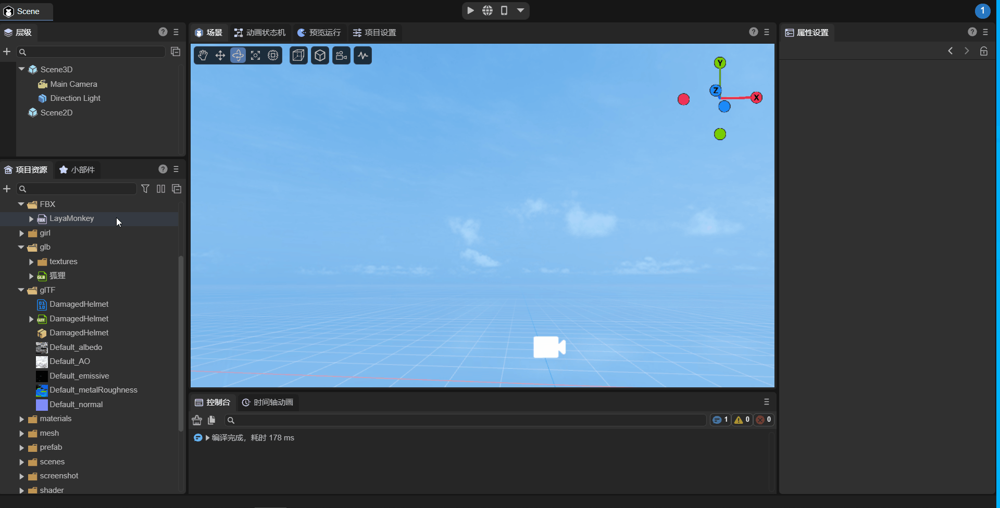

(Animated GIF 1-1)

### 1.3 Modifying Properties of Imported Models

When a model is selected, you can modify its import settings in the **Property Settings panel**. **After each modification**, click `Apply` to **re-import the model based on the updated properties**.

The operation is shown in Figure 1-2:

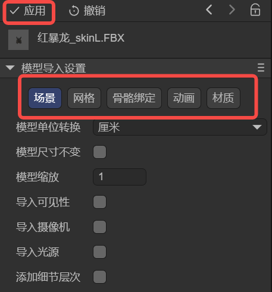  

(Figure 1-2)

### 1.4 Extracting Internal Model Resources

As mentioned earlier, every modification to model settings leads to a re-import. If developers frequently modify models via custom IDE plugins, it might continuously trigger the model import processing tool, affecting the IDE experience.

Furthermore, beyond the basic settings on the properties panel, it's impossible to modify internal model data like animations or materials directly.

Therefore, we recommend using the `Extract Internal Model Resources` function from the right-click menu to extract the model, as shown in Figure 1-3.

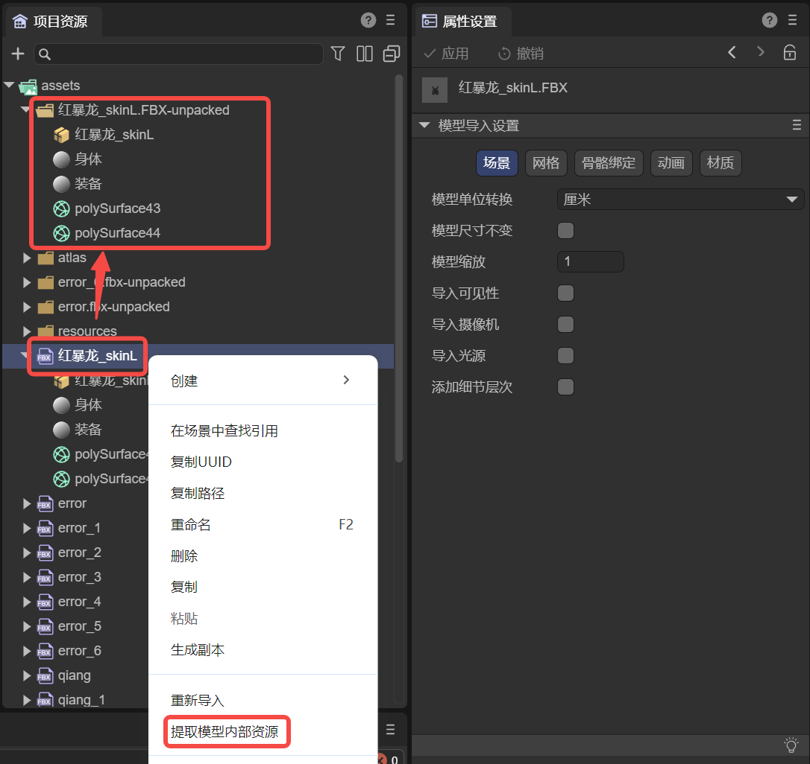 

(Figure 1-3)

Extracting a model's internal resources allows developers to freely modify the model's internal data without re-importing every time they save. Also, during the extraction process, some format errors in animation files will be automatically corrected.

## II. Model Scene Import Settings Description

A model may contain a lot of information, such as scene-related data like cameras and lights, as well as meshes, animations, materials, and bones. We categorize this information and start by introducing scene-related settings.

### 2.1 Model Unit Conversion

The default unit for imported models is **meters**. You can change it to **centimeters** or revert it back to **meters** here.

During unit conversion, to avoid sudden scaling up or down of the model, the default process is to maintain the visual size but perform a scaling adjustment.

For example, when **changing the unit to centimeters**, there will be a **checked** associated option by default: `Normalize Mesh`, as shown in Figure 2-1. Checking this option keeps the current model's visual size while only changing the model's unit.

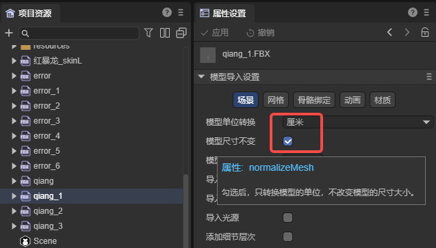 

(Figure 2-1)

**If unchecked**, the model will be scaled up by 100 times (e.g., 100 centimeters becomes 100 meters). A comparison of effects is shown in Figure 2-2:

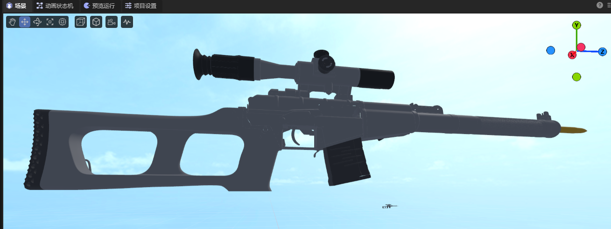

(Figure 2-2)

If converting from centimeters to meters, this option is not available, and the conversion process is handled automatically. Scaled-up sizes will be restored, and unscaled sizes will remain unchanged.

### 2.2 Model Scale Factor

Model scaling is primarily used to pre-process model size according to the target scene scale. It adjusts the overall scale of different models to meet design requirements.

For example, the `Normalize Mesh` function mentioned in the previous section is essentially implemented based on model scaling.

### 2.3 Import Model Built-in Data (Visibility, Camera, Light)

If the artist has set visibility, camera, or light properties during model creation, LayaAir3-IDE does not import them by default. It is recommended to add and set these in the LayaAir-IDE scene.

However, if developers need to use these built-in model data, they can enable them by checking the respective options, as shown in Figure 2-3. Click **Apply** to re-import.

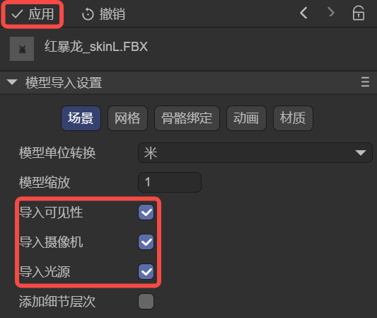 

(Figure 2-3)

### 2.4 Add LOD Group

When a model contains LOD data, checking this option will export the LOD data and automatically create an LOD Group component to set the LOD data when using the model. The effect after adding is shown in animated GIF 2-4.

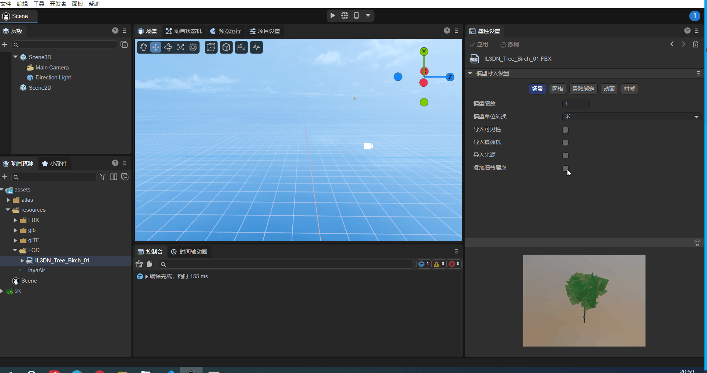

(Animated GIF 2-4)

## III. Model Mesh Import Settings Description

### 3.1 Easily Understood Property Descriptions

Some property settings are straightforward to understand, as shown in Figure 3-1:

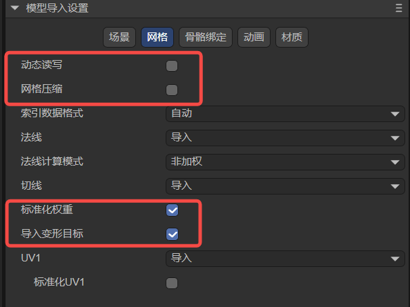 

(Figure 3-1)

We provide a summary in the table below.

| Chinese Property Name | English Property Name | Property Description |
|---|---|---|
| 动态读写 | read Write | When checked, allows developers to dynamically access or modify model data at runtime (e.g., modifying mesh vertex information for facial manipulation).\ Note that enabling `read Write` increases memory usage.\ Therefore, if your model does not need to be modified at runtime, please do not enable this option to save memory. |
| 网格压缩 | mesh Compress | When checked, mesh data can be compressed to reduce the mesh file size.\ Note that compressed meshes will reside in the IDE's temporary directory; the original model remains unchanged.\ The volume reduction will only be visible after publishing. |
| 标准化权重 | standardized weights | Adjusts total weights to 1 through weight correction,\ used to solve issues like distortion that might occur if the model exceeds a certain range. It's recommended to keep this checked.\ If you can ensure the model will not have issues when applied, you can uncheck it; this will preserve the original model data for its original effect. |
| 导入变形目标 | import Morph Target | Imports morph target (also called Blend Shape) data from the model. |

### 3.2 Index Data Format

Index data is used to determine the position of vertices in the vertex buffer, thereby constructing the shape of the geometry. This property controls the precision and range of this index data, affecting rendering performance and quality.

As shown in Figure 3-2, this property has three options: **Auto, UInt16, and UInt32**.

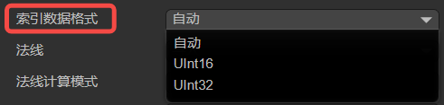 

(Figure 3-2)

**Auto**: This is the default option. In this mode, LayaAir will automatically decide which data format to use based on the number of vertices. It will prioritize UInt16 by default, and automatically switch to UInt32 data format when the number of vertices exceeds 65535.

**UInt16**: This means that index data is represented using 16-bit unsigned integers (0\~65535). Using 16-bit indices can save memory and is sufficient for vertex indexing in most cases. However, when the number of vertices in a model exceeds 65535, it needs to be split into multiple sub-meshes for rendering, which may increase the number of draw calls.

**UInt32**: This means that index data is represented using 32-bit unsigned integers (0\~4294967295). Using 32-bit indices can support larger models, avoiding the need to split them into multiple sub-meshes, but it will consume more memory.

### 3.3 Handling Normals and Tangents

In terms of handling normal effects, there are three main related properties: **Normals**, **Normal Calculate Mode**, and **Tangents**, as shown in Figure 3-3:

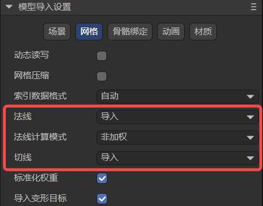 

(Figure 3-3)

#### 3.3.1 Normals `normal`

The **Normals** property has three options: **Import**`import`, **Calculate**`calculate`, and **None**`none`. As shown in Figure 3-4.

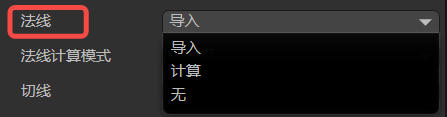 

(Figure 3-4)

**Import** means using the normal data predefined in the model file. This implies that if the model file contains normal information, LayaAir will directly use this data for rendering. If the model lacks normal data or has incorrect normal data, it might result in incorrect lighting effects.

**Calculate** means that the model's normal data will be recomputed during model import. This can be useful in certain situations, for example, when the model's normal data is incomplete or inaccurate. Recalculating normals may consume some computational resources but ensures correct lighting effects for the model.

Whether importing or calculating, the associated property **Normal Calculate Mode** needs to be set. Choosing **None** will completely ignore the model's normal data, and vertices will not be passed. The `Normal Calculate Mode` property will also not be displayed in the IDE. The **None** option might be used for specific rendering requirements, or when manually editing normals or calculating them with scripts in LayaAir. Otherwise, it means no normal data will be available during rendering, which could lead to incorrect lighting visual effects.

#### 3.3.2 Normal Calculate Mode `normal Calculate Mode`

The **Normal Calculate Mode** has two options: **Unweighted** and **Area Weighted**`areaWeight`. As shown in Figure 3-5.

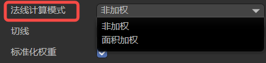 

(Figure 3-5)

**Unweighted** means normals are calculated as a simple average of adjacent vertices. This implies that each vertex's normal is only influenced by its neighboring vertices, without considering the size or angle of the faces. This method is suitable for smooth surfaces, but may result in normal discontinuities at sharp corners or separate edges.

**Area Weighted** calculates the weighted average of adjacent vertex normals based on face area. This can produce smoother normal transitions on sharp surfaces, reducing normal discontinuities.

#### 3.3.3 Tangents `tangents`

Tangent data is a crucial part of advanced effects like normal maps and normal mapping. Normal maps simulate height detail by storing normal information on the model surface. Tangent data helps calculate pixel normals, making objects visually appear to have bump details. Therefore, like **Normal Calculate Mode**, **Tangents** will only be displayed in the properties panel when normals exist (i.e., not set to **None**).

Tangents are used to define the tangent vector for each vertex on the model surface. The options are **None**`none`, **Calculate**`calculate`, and **Import**`import`. As shown in Figure 3-6.

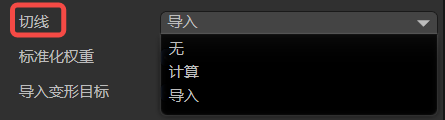 

(Figure 3-6)

**None** means that tangent data will not be calculated or imported. This implies that no tangent data will be available during rendering, which may affect the correctness of normal maps and similar effects. If this doesn't pose a problem, selecting this option can save memory used by vertices.

**Calculate** means that tangent vectors are recomputed when the model is imported. This can be useful when using effects like normal maps and normal mapping, as tangent vectors need to be used in conjunction with normals and texture coordinates. Recalculating tangents may consume some computational resources but ensures the correctness of rendering effects.

**Import** will use the tangent data predefined in the model file. This means that if the model file contains tangent information, LayaAir will directly use this data for rendering. If the model lacks tangent data or has incorrect tangent data, you might get incorrect normal mapping effects.

### 3.4 UV1

During model import, the UV1 channel included in the model can be imported by default, as shown in Figure 3-7.

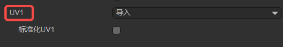 

(Figure 3-7)

You can check `Normalize UV1`. When checked, the model's built-in UV1 will meet the standard for lightmap baking upon import; otherwise, the default imported UV1 will not initiate the lightmap baking process. If UV1 is not used for lightmap baking, you don't need to check this option.

Sometimes, a model only has a default UV. If you want to generate an additional UV1 to support lightmaps, as shown in Figure 3-8, you can select the `Generate` option.

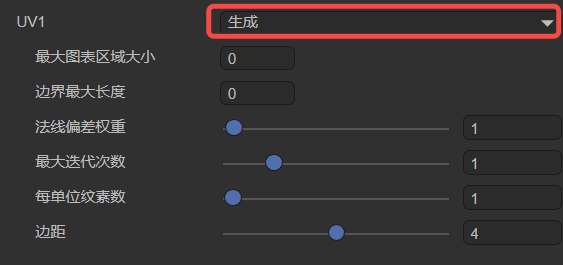 

(Figure 3-8)

Here are the configurations for its sub-items:

#### 3.4.1 Maximum Chart Area `max Chart Area`

Maximum Chart Area is a parameter in the lightmap generation process used to control the maximum area of a chart. Charts are fundamental units used to organize faces in the algorithm. This parameter limits the total area of faces contained within a single chart to control chart size.

This parameter plays a role in the chart generation process, controlling the generation and merging of charts. The algorithm checks whether the area of each chart exceeds the `maxChartArea` value. If it does, chart generation or merging will be limited. If the maximum chart area size is set to 0 (default), it means there is no area limit, and charts can be of any size.

Smaller values lead to more charts being generated, with fewer faces per chart. Larger values may generate a small number of large charts.

#### 3.4.2 Maximum Boundary Length `max Boundary Length`

In the lightmap generation process, `max Boundary Length` is used to constrain the merging and generation of charts.

In the algorithm, it checks whether the boundary length after generating or merging two charts exceeds the preset maximum boundary length limit. If it does, it will be limited, and the merge or generation will be aborted, thereby controlling the compactness of the generated charts in terms of boundaries.

By default, the maximum boundary length is 0, meaning there is no limit on the maximum boundary length of charts.

#### 3.4.3 Normal Deviation Weight `normal Deviation Weight`

Normal Deviation Weight is an important parameter used to control the cost calculation during the face charting process within lightmap generation.

In the face charting process, the algorithm iterates through each face in the current chart area and determines which faces can be candidates for inclusion in the chart generation. The basis for calculation is what we call "cost."

The angular deviation between a face normal and the chart's best-fit normal (the average normal vector of the entire chart) is one of the factors influencing this cost. If it exceeds a certain angular range (approximately 45 degrees), it's considered a high cost and directly excluded from the generation queue. For angles within the range, the cost is calculated by multiplying it by the normal deviation weight, which is then used for further calculations. Therefore, the normal deviation weight is one of the important parameters affecting the cost of normal angular deviation and chart generation.

A larger normal deviation weight means that normal deviation has a greater impact on chart generation. A larger value makes the chart generation algorithm more inclined to select faces with consistent normals to be assigned to the same chart, resulting in smoother charts in the normal direction. However, excessively high values might lead to overly conservative chart generation, failing to fully utilize favorable face structures.

Conversely, a smaller normal deviation weight value means the chart generation algorithm will tolerate a certain degree of normal deviation during the face charting process. This implies that the algorithm might assign faces with larger normal differences to the same chart, even if their normal directions are not perfectly aligned. This might be suitable for scenes that require more variation.

#### 3.4.4 Maximum Iterations `max Iteration`

Maximum Iteration is a parameter used to control the number of iterations during the chart generation and optimization process. Iteration is an important step in the chart generation algorithm, as it continuously optimizes the generated charts through multiple iterations to achieve better results.

More iterations mean the algorithm will have more opportunities to adjust and optimize the charts, potentially leading to better chart layouts. However, too many iterations can increase the computational cost and time overhead of the algorithm.

Fewer iterations might be more time-efficient, but the generated charts might not be as well optimized as with more iterations.

Developers can use this setting to control the number of iterations for chart generation and optimization, balancing computational efficiency and the quality of the generated results.

#### 3.4.5 Texels Per Unit

The `Texels Per Unit` parameter defines the number of texture pixels contained within each unit space (e.g., a 1x1 unit square). This parameter is used during lightmap generation to control the texture density of charts.

Specifically, it affects the size allocation of charts within the texture atlas. In the lightmap generation algorithm, when determining the position and size of charts in the texture atlas, the value of "Texels Per Unit" is considered. **If the value is greater than 0**, the algorithm will allocate the chart's texture area based on the given value to achieve a higher resolution on the texture. **If the value is 0**, the algorithm will estimate an appropriate value based on the chart's surface area and a given resolution to ensure the chart is properly represented on the texture.

From a visual perspective, this parameter affects the mapping quality of charts in the final texture atlas. Higher values result in higher resolution for charts on the texture, making details clearer, but also increase the size of the final texture atlas. Lower values reduce the resolution of charts on the texture but can decrease the texture atlas size. Therefore, adjusting the `Texels Per Unit` parameter allows for a trade-off between chart quality and texture atlas size.

#### 3.4.6 Padding

Padding refers to the extra pixel spacing added around charts. These extra pixels are used to extend the chart boundaries to ensure there's enough space between them and prevent overlapping.

Increasing padding can provide better texture sampling boundaries, reduce color blending between charts, and improve edge rendering effects.

When using it, you can adjust the padding value as needed to balance rendering quality and atlas size. A reasonable value usually provides better rendering results, but excessively increasing padding can make the atlas too large, consuming more memory.

## IV. Model Rig Import Settings Description

For model import, the Rig options allow you to set **skin weights**, with the default being Standard mode, as shown in Figure 4-1.

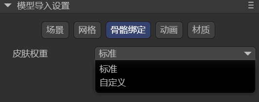  

(Figure 4-1)

When we select Custom mode, there are two sub-options: `Max Bones / Vertex` and `Min Bone Weight`, as shown in Figure 4-2.

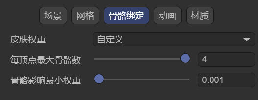 

(Figure 4-2)

### 4.1 Max Bones / Vertex

As the name suggests, this sets the maximum number of bones that can be bound to each vertex, meaning how many bones can influence each vertex at most. Bones exceeding this limit will be culled.

This parameter is directly related to the complexity and expressiveness of character model animations. If the **Max Bones / Vertex** value is set very high, it means each vertex can be influenced by more bones, allowing for more complex and refined animation effects. However, it also increases the computational load on the game, potentially leading to performance degradation. We need to weigh this based on actual circumstances and requirements.

### 4.2 Min Bone Weight

Minimum Bone Weight is used to set a minimum weight value. When importing a model with skeletal animation, if the influence weight of a bone on a certain vertex is less than this threshold, that influence will be ignored. This parameter is typically used to discard bone influences that have almost no deformation effect, optimizing performance and cleaning data.

## V. Model Animation (Animator) Import Settings Description

After checking `Animation Data Compression`, as shown in Figure 5-1, the animation data size can be compressed according to the configuration.

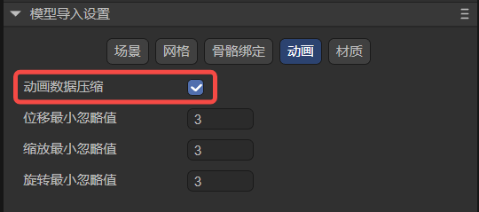 

(Figure 5-1)

`Minimum Ignore Value` indicates that keyframes exceeding the set value will be ignored by the algorithm, thereby achieving the purpose of reducing animation data.

There are three dimensions for ignoring: position, scale, and rotation.

The input values for ignoring are all in degrees.

## VI. Model Material (Materials) Import Settings Description

### 6.1 Extract Materials

As mentioned earlier, materials inside a model cannot be modified directly. We advised extracting the model's internal resources. If you don't frequently change model data, you can choose not to extract the model itself, but only extract its materials, and then link the materials you want to modify using the material remapping table.

After clicking the `Extract All Materials` button, the **Material Output Target Folder Selection** window will pop up, as shown in Figure 6-1.

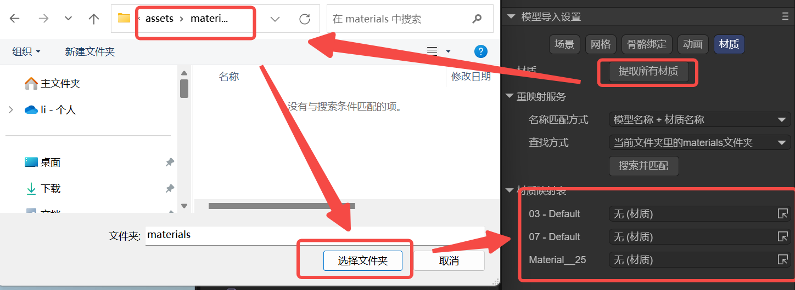 

(Figure 6-1)

### 6.2 Remapped Materials

After extraction, the extracted materials will automatically be linked to the material remapping table, as shown in Figure 6-2. Of course, developers can also manually change the material mapping relationships.

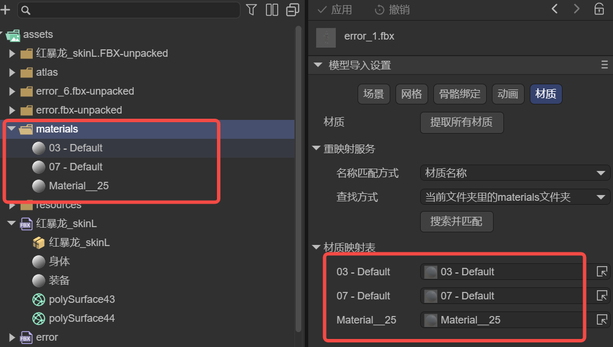  

(Figure 6-2)

### 6.3 On Demand Remap

For material mapping, you can also map by searching and matching. This method has two condition parameters: **Naming Match Mode** and **Search Method**.

#### 6.3.1 Naming Match Mode `naming`

There are two naming match rules: match by **Material Name only**, or match by **Model Name + Material Name**, as shown in Figure 6-3.

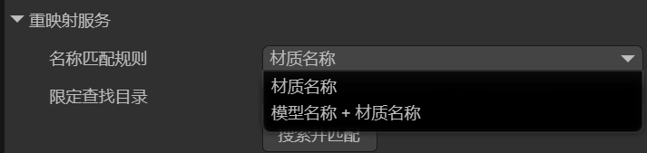 

(Figure 6-3)

| Matching Rule | Function |
|---|---|
| Material Name | The material name consists only of the **material's file name**, e.g.: body.lmat |
| Model Name + Material Name | The material name's composition rule is: model file name - material file name,\ e.g., "character" + "-" + "body.lmat" → "character-body.lmat" |

#### 6.3.2 Constrain Search Directory `search`

Once the Naming Match Mode is set, the IDE will use the naming result as the search key for materials and look in the specified directory.

**Constrain Search Directory** specifies which directory to search, and there are two ways, as shown in Figure 6-4:

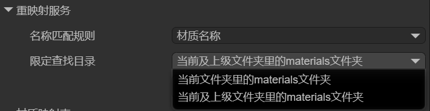 

(Figure 6-4)

The two options in the figure are relatively easy to understand: search in the current `materials` directory, or search in the current and parent `materials` directories.

If a material matching the naming rule is found, the material mapping will be performed automatically.