# Resource Package Export and Submission to the Resource Store

> Author: Charley

Another document, "[Package Manager and Resource Package Import](https://www.google.com/search?q=../pluginImport/readme.md)," is intended for users of resource packages.

This document is for developers of LayaAir engine resource packages.


## 1\. LayaAir Resource Package Categories and Differences

### 1.1 Resource Store Categories

In the LayaAir resource store, our categories include: Project Source Code, Art Assets, Music & Sound Effects, IDE Plugins, Tools, and Other. As shown in Figure 1-1.

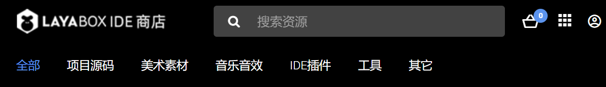 

> When uploading resources, please try to upload them according to their functional classification, otherwise, they may be rejected during review.

| Category          | Description                                                                                                                                                                                                                                                                                                                                                                                                                                                                       |
| :---------------- | :------------------------------------------------------------------------------------------------------------------------------------------------------------------------------------------------------------------------------------------------------------------------------------------------------------------------------------------------------------------------------------------------------------------------------------------------------------------------------------ |
| **Project Source Code** | Refers to projects intended as templates for creating new IDE projects, serving as source code packages for secondary development or learning. The package should include scene files, art assets, project logic code, etc.                                                                                                                                                                                                                                                        |
| **Art Assets** | Refers to visual resources that can be edited and used in a scene, such as images, compressed textures, models, animations (timeline animations, rigid body animations, skeletal animations, etc.), materials, fonts, atlases, prefabs (particles, UI interfaces, etc.), and blueprints.                                                                                                                                                                                             |
| **Music & Sound Effects** | Refers to streaming media files such as background music, sound effects, and videos. Supports mp3, wav, ogg, mp4, and webm file formats.                                                                                                                                                                                                                                                                                                                                                        |
| **IDE Plugins** | Refers to IDE functional plugins extended based on the IDE plugin system. Examples: 3D skeletal animation baking plugin, Level of Detail (LOD) decimation plugin. Plugins are typically installed via the `package manager`.                                                                                                                                                                                                                                                        |
| **Tools** | Refers to third-party tools that can run independently, or independently runnable third-party executables, which are called and executed only through the plugin system.                                                                                                                                                                                                                                                                                                         |
| **Other** | Refers to other resources not covered by the above categories, for example, 2.x source code or tools.\<br\>Since 2.x does not have a plugin system or resource store, source code or tools can be packaged into a compressed file, placed in the LayaAir3-IDE's resource directory, and exported as a regular resource package with the `.layapkg` extension.\<br\>Purchasers would need to first import the resource using LayaAir3-IDE, then copy and decompress the resource to another directory outside the current project. |

### 1.2 Technical Classification and Differences

The categorization in the resource store is designed to make it easier for users to find resources.

From a technical perspective, LayaAir engine resources fall into three categories: **Project Template Packages (Source Code)**, **Plugin Installation Packages**, and **Project Resource Packages**.

| Type                      | Description                                                                                                                                                                 | Configured `package.json` | Package Suffix |
| :------------------------ | :-------------------------------------------------------------------------------------------------------------------------------------------------------------------------- | :----------------------- | :------------- |
| **Project Template Package** | A template for creating an IDE project, usually a project framework or source code, including scenes, resources, and code, with a complete project structure.                         | No                       | **.zip** |
| **Plugin Installation Package** | A plugin for extending IDE functionality, installed in the `packages` directory.                                                                                             | **Yes** | .layapkg       |
| **Project Resource Package** | Resources used for project development, imported into the `assets` directory (excluding IDE plugin code).                                                                  | No                       | .layapkg       |


## 2\. Exporting Project Resource Packages

Project resource packages include various non-code resources (excluding IDE plugin code) used for project development. This not only covers art assets like images, models, animations, materials, prefabs, and blueprints, but also resources such as scenes, music, sound effects, and videos.

### 2.1 Export Process

To export, click on the IDE menu: **"Tools"** -\> **"Export Resource Package"**. In the pop-up resource export panel, check the corresponding resources to export, then choose to export locally or upload to the store. The operation process is shown in Figure 2-1:

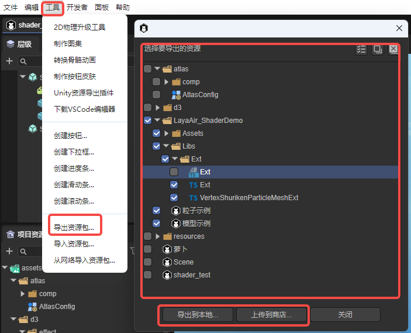 

(Figure 2-1)

### 2.2 Export Rules

#### 2.2.1 How to Avoid Resource Conflicts and Overwrites

We recommend that resources intended for export **be uniformly placed in a sub-directory under `assets`.**

**Furthermore, this directory should use a unique naming convention.** Otherwise, when another project imports this resource package, **any identical files in identically named directories will be directly overwritten and cannot be restored.**

Therefore, it's essential to use unique directory names, for example, using your brand name or resource store shop name as a prefix, combined with the resource's functional name (and optionally a version number) for differentiation.

#### 2.2.2 Notes on Direct Upload to the Store

If a developer wants to directly upload a resource package to the resource store, they must have obtained **shop qualification** (real-name verification) for the resource store and have created an unsubmitted resource package in the store's backend.

The specific process will be detailed in the section on listing resources in the store later.


## 3\. Exporting IDE Plugin Installation Packages

The process for uploading plugin installation packages to the resource store from the IDE client is the same as for ordinary resource packages; the only difference lies in the backend configuration of the store.

Therefore, this section will only cover the export method and rules for local installation packages.

### 3.1 How to Export a Local Installation Package

Importing a local plugin installation package doesn't involve importing a `.layapkg` file. Instead, it points to the plugin's root directory. So, simply **copy your developed plugin directory and all its resources** to a specific location on your local disk (you can put it in the project, but it's recommended to place it in different directories based on versions, or in a GIT environment).

### 3.2 Local Installation Package Export Rules

There's a crucial difference between exporting a plugin's local installation package and a regular resource package: the installation package's recognition relies on the **`package.json` configuration information**. If `package.json` is missing or its data is incorrect, it might lead to non-recognition, installation failures, or errors.

Therefore, this section will explain the role of core configuration information within `package.json`.

First, simply create an empty `package.json` file, or create one via the command line using `npm init`.

Here's an example of the core content of `package.json`:

```json
{
  "name": "com.layabox.package-name",
  "displayName": "Plugin Name",
  "version": "1.0.0",
  "description": "A descriptive text explaining the purpose and usage of this plugin",
  "icon": "editorResources/icon.png",
  "author": "layabox"
}
```

The installed effect is shown in Figure 3-1.

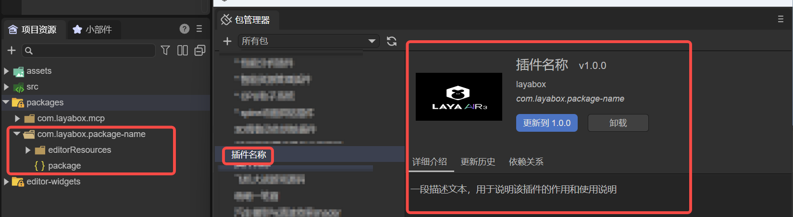 

(Figure 3-1)

[\!Tip]

It's important to note that **all images in the plugin (including the icon)** must be placed in the `editorResources` directory, otherwise they cannot be found.


## 4\. Exporting Project Source Code (Templates)

### 4.1 Source Code Export Rules

Project source code cannot be directly exported via built-in IDE functions. Developers must manually package it into a **`.zip`** compressed file according to the rules in this section.

The simplest export method is: Open the project's top-level directory (e.g., `LayaAirProject`), and **package the entire directory** as `LayaAirProject.zip`.

An example of a complete directory structure:

```json
LayaAirProject/
├── .vscode/
│   └── settings.json
│   └── launch.json
├── assets/
│   └── (Project assets)
├── bin/
│   ├── index.html
│   └── (PC web debug run directory)
├── engine/
│   └── (Engine declaration files and custom engine directory)
├── library/
│   └── (IDE's temporary project storage directory)
├── local/
│   └── (IDE's local configuration directory, e.g., IDE panel layout settings)
├── settings/
│   └── (Project's local configuration directory, e.g., build/publish configuration parameters, layer settings, runtime library references)
├── src/
│   └── (Project source code)
├── tsconfig.json
└── LayaAirProject.laya
```

This "whole package" approach is simple to operate, but it might include some unnecessary redundant files, or even local personalized configurations and other superfluous information.

Therefore, the recommended practice is to **package only the `assets` and `src` directories**. Other directories can be automatically generated by the IDE using built-in empty templates.

**The recommended core template structure is as follows:**

```
LayaAirProject/
├── assets/
└── src/
```

If you need to retain some project build and run configurations (such as engine library references, build parameters, etc.), you can additionally include the `settings` directory.

**Example template structure with configurations:**

```
LayaAirProject/
├── assets/
├── settings/
└── src/
```

If your project uses a custom engine, or if you want the new project's interface layout to remain consistent with the original project, you can also include the `engine/` and `local/` directories. However, it's recommended to add these only when necessary, to leave more customization space for developers using this template. Non-essential files and directories should ideally not be packaged into the template.

### 4.2 Source Code Import Testing

To avoid omitting core resources or configurations from your template, it's recommended that developers perform a **full template import test after packaging** to ensure that the created project can run normally.

**The operation process is as follows:**

1.  Open the IDE's "Create Project" interface.
2.  Go to the "Local Template" tab.
3.  Click the "Import Local Template" button in the upper right corner.
4.  Select the packaged `.zip` template file and click "Confirm," as shown in Figure 4-1.

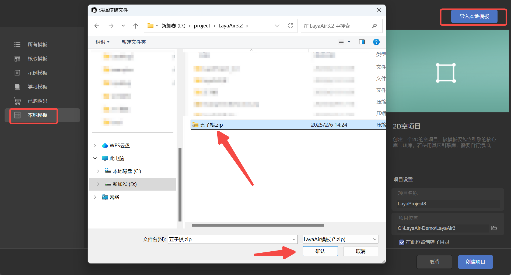 

(Figure 4-1)

Once the template is successfully imported, it will appear in the local template list, as shown in Figure 4-2. At this point, you can create a new project using the template and test it like a regular project.

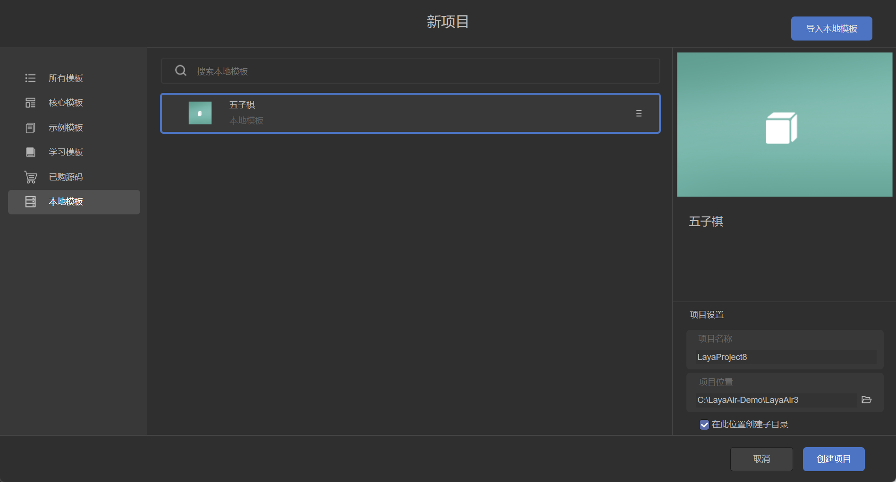

(Figure 4-2)

If the project is created successfully and runs normally, it means the template export was correct, and it can be directly uploaded to the resource store or shared with other developers. If issues arise, check the error messages, add any missing resources or configurations, and then repackage.


## 5\. How to Submit and List Resources in the Resource Store

### 5.1 Source Code (Template) Submission

The source code submission process is relatively simple. Please first prepare your `.zip` formatted source code resource package following the guidelines in the previous section.

Next, open the resource store backend: https://store.layaair.com/center/

It's important to note that **real-name verification must be completed** before uploading resources. You can only access the backend and create resource packages after your verification is approved.

> For a video explaining account opening and verification: https://www.bilibili.com/video/BV1oQ4y1E7j3/?p=3

After logging into the backend, click **"Create Resource Package"**. In the pop-up page, fill in the following information sequentially:

  - Resource Package Name
  - Resource Package Identifier (Package Name, only required for plugin type resources)
  - Resource Category, Theme
  - Engine Version (the minimum engine version supported at the time of initial submission; if higher versions are supported later, they should be noted in the update log)
  - Resource Applicability, Network Requirement (Yes/No)

After filling in, click **"Create My Resource"**, as shown in Figure 5-1.

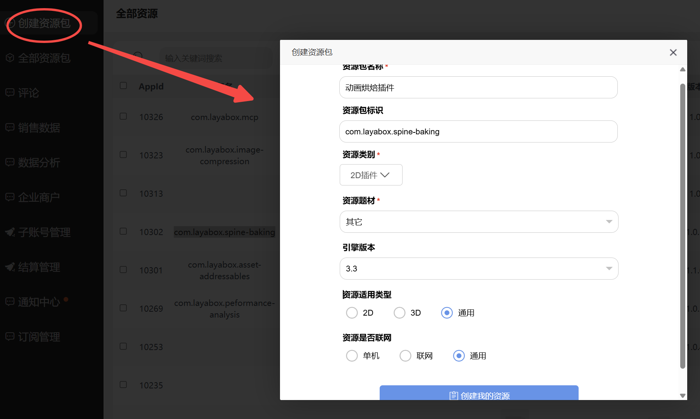

(Figure 5-1)

On the resource upload interface, use the "Upload File" button on the page to upload the `.zip` file you prepared earlier. After the upload is complete, click the "Save" button in the upper right corner to complete the submission of the resource file.

Next, you need to continue to complete various information about the resource, including version description, resource description, basic resource information, and images and videos for display. All fields marked "Required" on the page must be filled in completely. During the filling process, the system will validate the input. Once all information is correctly filled, a green checkmark will appear on the page, as shown in Figure 5-2. At this point, you can click the "Submit" button to submit the resource to the official team for review.

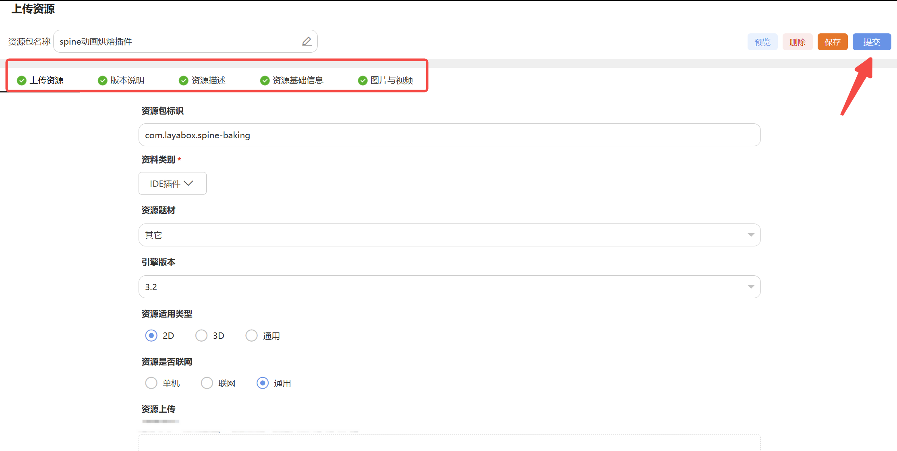 

(Figure 5-2)

Additionally, the official team also provides detailed video tutorials for each step of the operation. If this is your first upload, it's recommended to watch the relevant videos for more intuitive guidance: https://www.bilibili.com/video/BV1oQ4y1E7j3/?p=4

### 5.2 Resource and Plugin Submission

The overall process for uploading resources or plugins via the web is essentially the same as uploading source code resource packages. However, there are two key differences. First, the file format for source code resource packages is `.zip`, while the file format for regular resources and plugins must be `.layapkg`. Second, if you are uploading a plugin installation package, in addition to the regular information, you must also fill in the plugin's exclusive package name.

> For methods on exporting resource packages, please refer to the instructions in section 2.1 above.

#### 5.2.1 Plugin Package Naming Rules

When the uploaded resource is a plugin installation package, the **Resource Package Identifier (i.e., package name)** must be filled in according to specifications. The package name format is uniformly `com.ShopName.PackageName`, for example, `com.layabox.spine-baking`. The package name part is typically an English word; if multiple words are needed, they can be connected with hyphens. All letters should be in lowercase to ensure standardization and consistency.

#### 5.2.2 Directly Uploading Resources in the IDE

In addition to uploading `.layapkg` files via the web, LayaAir also supports developers directly uploading resources to the resource store from within the IDE.

Regardless of the upload method used, developers must first follow the process described in section 5.1 to **create a resource package draft in the resource store backend** and fill in all basic information except for the resource files. After filling it in, click save. You will then see this unsubmitted resource draft in the resource list, as shown in Figure 5-3.

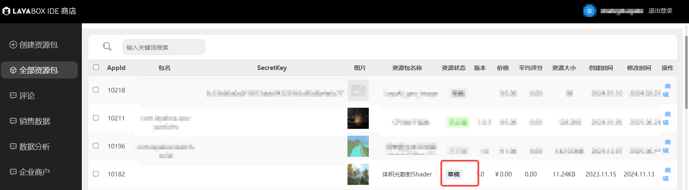 

(Figure 5-3)

After completing the information on the web page, you can switch back to `LayaAir3-IDE`. In the Tools menu bar, select "Export Resource Package". In the pop-up panel, specify the resource package directory and resource content. Then click the "Upload to Store" button in the panel. In the pop-up interface, select the resource package draft you just saved on the web page, and click "OK" to complete the upload operation, as shown in Figure 5-4.

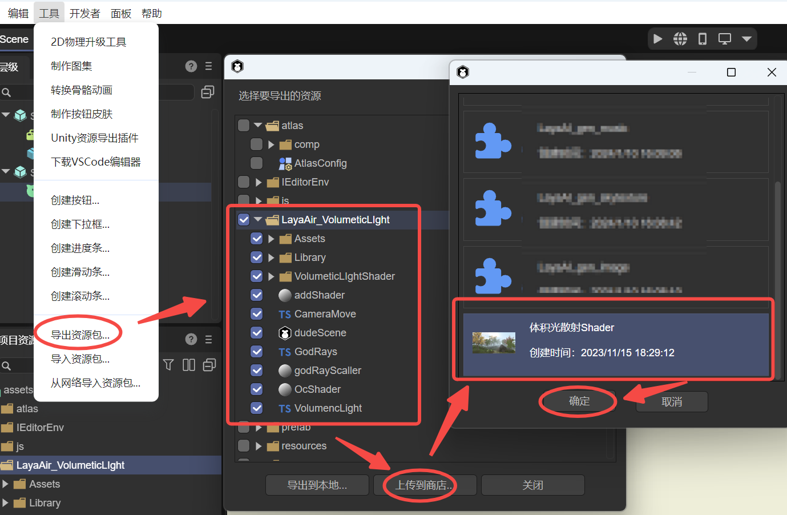 

(Figure 5-4)

After clicking "OK," the IDE will display a window showing the upload progress. When the progress bar finishes, it will prompt "Upload successful," indicating that the resource has been successfully submitted to the store, as shown in Figure 5-5.

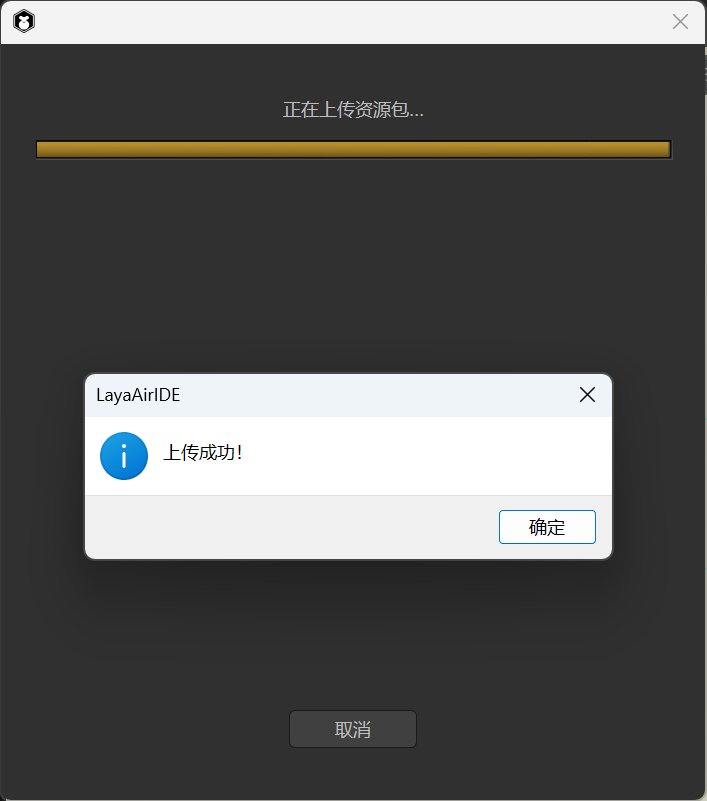 

(Figure 5-5)

After the upload is complete, you can return to the resource store's web backend. Find the previously saved draft in the resource package list and click the "Edit" button to enter the resource details page.

On the resource upload page, you will see that the resource's update time has been updated to the time of the recent upload, and the resource file size is also synchronously displayed as the actual uploaded value, as shown in Figure 5-6.

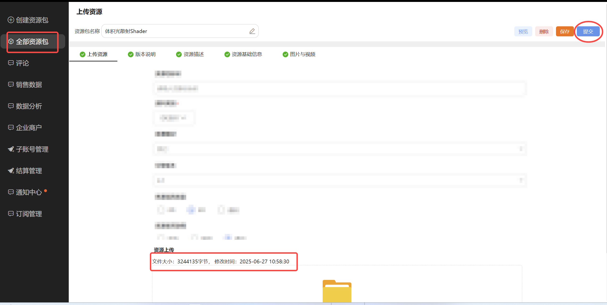 

(Figure 5-6)

After confirming everything is correct, you can click the "Submit" button in the upper right corner to submit the resource to the LayaAir official review team.


## 6\. Resource Store Revenue Sharing and Withdrawal

Currently, the resource store is still in the early stages of ecosystem development. During this phase, **all revenue from resource products uploaded by developers belongs entirely to the developers.**

In the future, when the store enters a period of prosperous development, the revenue sharing model will be **70% for developers and 30% for the platform.**

If you have any further questions, you can contact the `LayaAir` customer service WeChat account (`LayaAir_Engine`) to communicate.