# Package Manager and Resource Package Import Guide

> Author: Charley

Since LayaAir 3.1, a new plugin system and import/export functionalities for resource packages have been added. Version 3.2 further introduced the package manager. Developers can encapsulate external tools, IDE plugins, project assets, or source code into complete **resource packages**, facilitating import and sharing, and contributing to the continuous prosperity and expansion of the engine's ecosystem.

> To fully utilize the resource package features, we recommend updating your IDE version to 3.1 or higher.

There are two formats for resource packages: `.zip` and `.layapkg`.

A `.zip` package represents **project source code** resources, while other resource packages are in the **`.layapkg` format**. These two resource package import forms have very distinct differences: a `.zip` formatted project source code can only be imported **before creating a project**, whereas a `.layapkg` resource package must be imported **after opening a project**.

Once a project is opened, there are also two different ways to import resource packages: via the **package manager** or by **direct import**. This document will explain these in detail.

## 1\. Project Source Code Import

### 1.1 Import from Resource Store

The resource store offers free and paid source code resources. The link is: [https://store.layaair.com/?cid=7\&cname=%E9%A1%B9%E7%9B%AE%E6%BA%90%E7%A0%81](https://www.google.com/search?q=https://store.layaair.com/%3Fcid%3D7%26cname%3D%25E9%25A1%25B9%25E7%259B%25BEM%25E6%25BA%2590%25E7%25A0%2581)

After opening the link and logging in, **free source code** can be directly added by clicking `Add to My Resources`. **Paid resources** require you to first `Add to Cart`, as shown in Figure 1-1, and then proceed with payment.

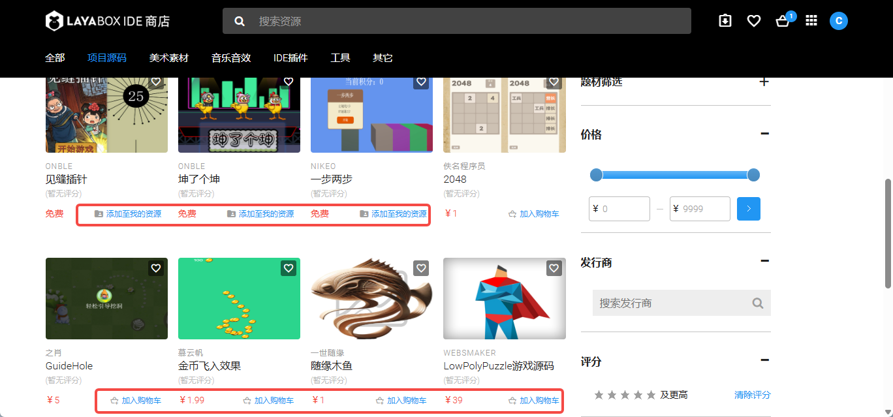 

(Figure 1-1)

Whether added for free or purchased, once successfully added to "My Resources," open LayaAir3-IDE and log in (using the same account as the resource store). In the **Create Project** panel, select **Purchased Source Code** and then choose the target source code resource to create a new project using that source code as a template, as shown in Figure 1-2.

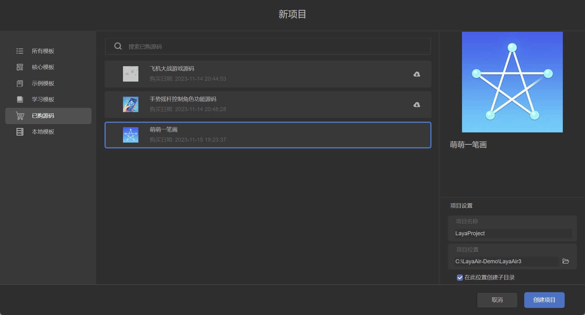 

(Figure 1-2)

If a download icon appears in the upper right corner of a source code item in the list, it indicates that the source code has been updated in the resource store. You can click the download icon to update the source code version.

### 1.2 Local Template Import

Sometimes, you might want to use your company's internal project framework as an initial source code template without going through the resource store. LayaAir3-IDE supports this as well.

When creating a project, select the "**Local Template**" tab, then click the "**Import Local Template**" button in the upper right corner, as shown in Figure 1-3. Select the corresponding source code `.zip` package to complete the import.

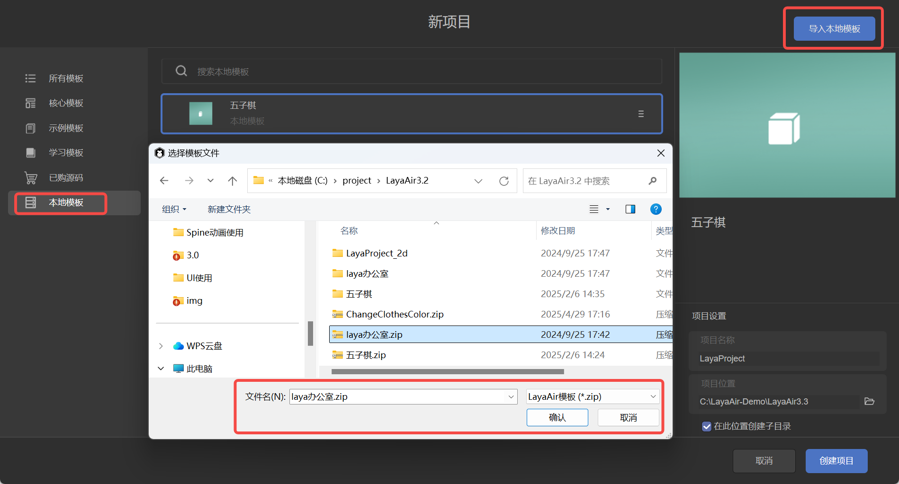

(Figure 1-3)

After importing the template, it can be used just like other templates.

## 2\. Regular Resource Package Import

### 2.1 Importing via the Resource Store

After adding resources to **My Resources** in the resource store, you can find them in the [`Purchased Assets`](https://www.google.com/search?q=%5Bhttps://store.layaair.com/assets.php%5D\(https://store.layaair.com/assets.php\)) list and click "**Open in LayaAirIDE**," as shown in Figure 2-1.

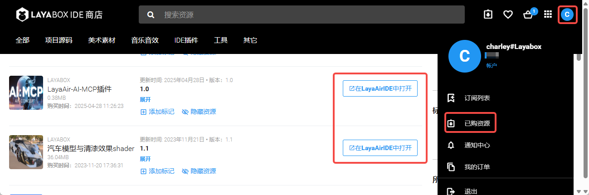 

(Figure 2-1)

Clicking "Open LayaAirIDE" in the pop-up browser window will launch `LayaAir3-IDE` and bring up the resource import panel. After the resource package finishes loading, you can see its structure, as shown in animated GIF 2-2. Developers can select all or only the required resources, then click the `Import` button to import them into the project.

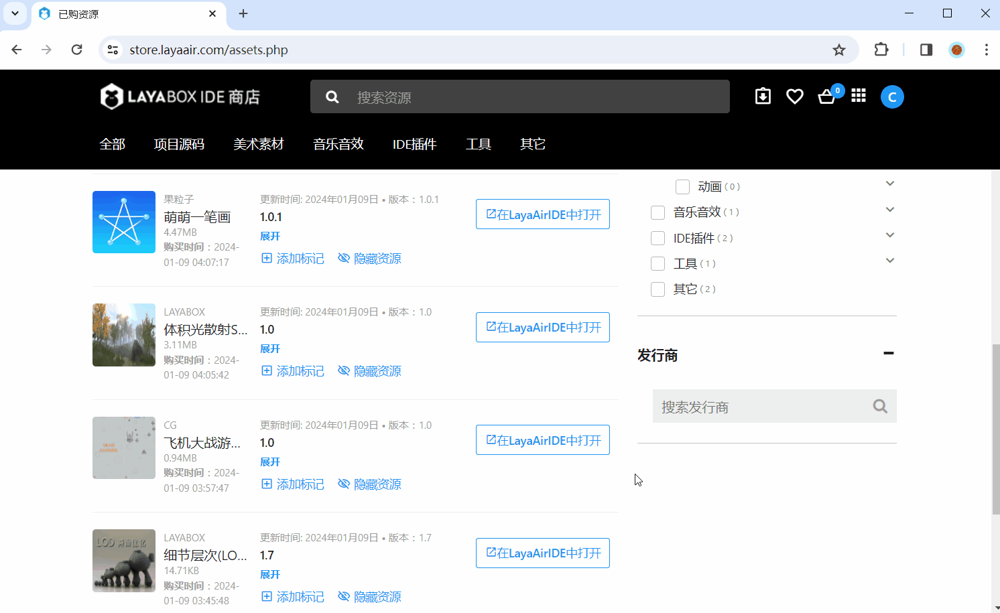 

(Animated GIF 2-2)

### 2.2 Importing Resource Packages from a Network Address

If a developer's resource package is not uploaded to the resource store but to their own server, we can also import it using an accessible network address (only IDE-exported resource packages with the `.layapkg` suffix are supported). The operation path is: `Tools` -\> `Import Resource Package from Network`, as shown in Figure 2-4.

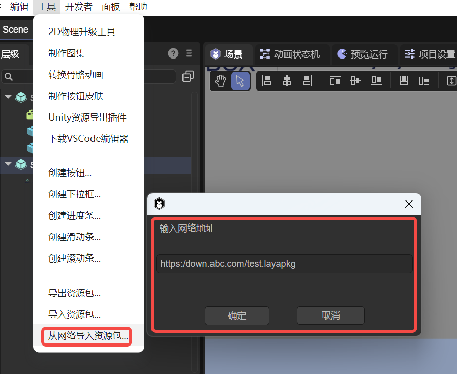 

(Figure 2-4)

The rest of the process is consistent with the previous sections.

### 2.3 Local Resource Package Import

If the resource package is stored locally on the IDE's hard drive, it can also be imported directly from the local machine. The operation path is: `Tools` -\> `Import Resource Package`, as shown in Figure 2-5.

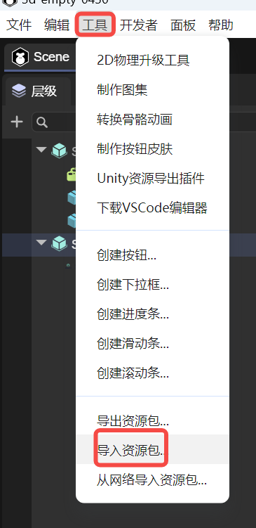 

(Figure 2-5)

After selecting the local resource package (only IDE-exported resource packages with the `.layapkg` suffix are supported) in the pop-up resource selection window, the rest of the process is consistent with the previous sections.

## 3\. Package Manager Resource Import

### 3.1 Importing Resource Packages from the Package Manager

Resources visible in the resource store's [`Purchased Assets`](https://www.google.com/search?q=%5Bhttps://store.layaair.com/assets.php%5D\(https://store.layaair.com/assets.php\)) list can not only be opened and imported from the resource store webpage but also directly downloaded and imported from the IDE's package manager. The operation flow is: `Developer` menu -\> `Package Manager` -\> Select resource package -\> `Download` -\> `Import`, as shown in Figure 3-1.

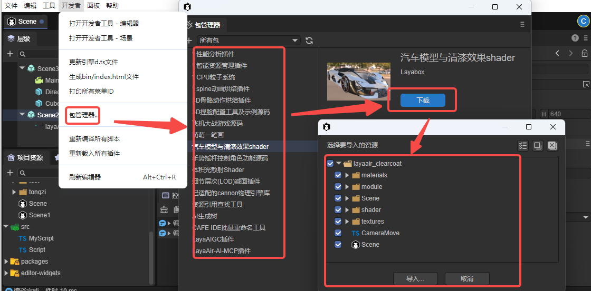 

(Figure 3-1)

### 3.2 Differences Between Installed and Downloaded Packages

The most fundamental difference between importing from the IDE's package manager and importing from the resource store webpage is that the package manager allows for **installing/uninstalling** resource packages in addition to downloading them, as shown in Figure 3-2.

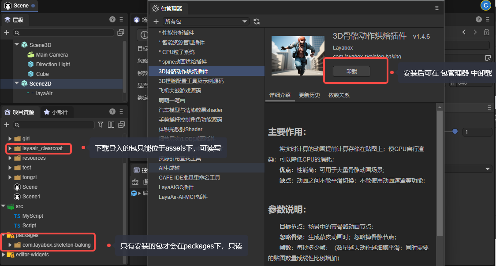 

(Figure 3-2)

Unlike downloaded resource packages which can only reside in the `assets` directory, **installed resource packages are located under `packages`**, offering clearer categorization and structure.

However, resource packages under `packages` are **read-only** and cannot be edited or developed further within the project. They are commonly used for IDE functional extensions and plugins.

**Resource packages imported from the resource store can only be located in the `assets` directory**, therefore, **it is recommended to use the package manager to import or install resource packages.**

> The rules for submitting installation packages to the resource store differ from ordinary downloadable packages. For detailed explanations, please refer to the separate document: [Resource Package Export and Submission to Resource Store](https://www.google.com/search?q=../exportToStore/readme.md).

### 3.3 Member-Exclusive Resource Packages

In addition to the free and purchasable resource packages available in the resource store, the package manager also includes some official engine plugin installation packages that are not found in the resource store. These installation packages require purchasing a membership, with corresponding account permissions activated based on the number of seats. Once permissions are activated, they will be displayed and allowed for installation, as shown in Figure 3-3.

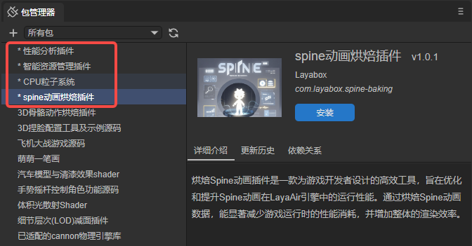 

(Figure 3-3)

Currently available are: Performance Analysis Plugin, Smart Resource Management Plugin, CPU Particle System, Spine Animation Baking Plugin. More official built-in plugin functions will be updated later, subject to what is actually displayed in the IDE's package manager.

If you wish to learn more and inquire about purchasing, please visit the relevant webpage: [https://layaair.com/LayaAirEnterprise/](https://www.layaair.com/LayaAirEnterprise/)

## 4\. Updating Resource Packages

### 4.1 Syncing the Latest Version in the Resource Store

**It's crucial to note** that resource package updates **must be performed on the resource store website**, specifically in the [`Purchased Assets`](https://www.google.com/search?q=%5Bhttps://store.layaair.com/assets.php%5D\(https://store.layaair.com/assets.php\)) list. You need to manually synchronize (update) the latest version in your purchased list first. The package manager cannot actively update versions that have not been updated on the webpage (even if you see an update button, it won't successfully update to the latest version until synchronized on the webpage).

Taking "LayaAIGC Plugin" as an example, developers should first check the **update log** content to decide whether to update.

Before confirming the update, **it is recommended that developers export and back up their old resource packages** (just in case, to prevent irreversible versions). After clicking the **Update** button, the latest version will be synchronized in your purchased list.

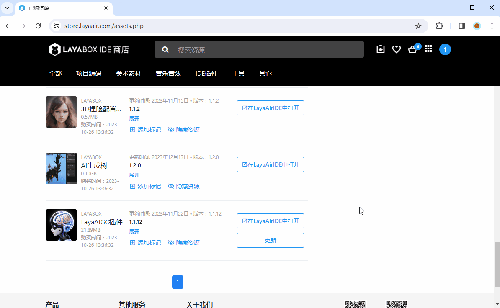 

(Animated GIF 4-1)

After the update is complete, it's recommended to return to the IDE and re-download or reinstall via the package manager.

If it's just a regular managed package import, you can also operate directly on the webpage by clicking "**Open in LayaAirIDE**" to re-import the updated resource package.

### 4.2 Updating Resource Packages in the IDE

After synchronizing the version on the **Resource Store** webpage's [`Purchased Assets`](https://www.google.com/search?q=%5Bhttps://store.layaair.com/assets.php%5D\(https://store.layaair.com/assets.php\)) list, return to the `Package Manager` and click the `Update` button to complete the package update, as shown in Figure 4-2.

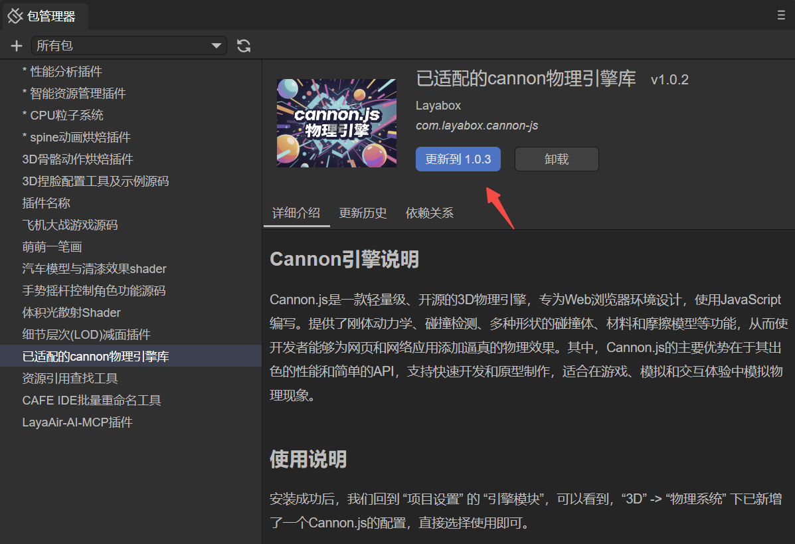 

(Figure 4-2)

### 4.3 Updating Local Plugin Packages

For local plugin packages, clicking the update button, as shown in Figure 4-3, will automatically update the directory where the plugin was installed. Therefore, if you don't change the directory, you can simply copy and replace the original plugin directory, then directly click the update button. You don't need to use the '+' sign in the upper left corner to install by selecting a directory.

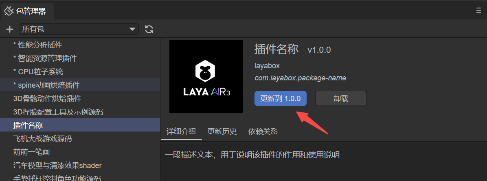 

(Figure 4-3)

> Since the version number of local installation packages is not as crucial, to save performance and efficiency, the update button does not read the actual version number of the plugin directory. Developers can consider it a regular update button. The version number displayed on the button is based on the shared resource store version format and directly uses the already installed version number.

## 5\. Related Tutorials

### 5.1 Related Documents

  - [Plugin Development Guide](https://www.google.com/search?q=../plug-in/readme.md)
  - [Resource Package Export and Submission to Resource Store](https://www.google.com/search?q=../exportToStore/readme.md)

### 5.2 Video Tutorials

[LayaAir Resource Store Tutorial Collection](https://www.bilibili.com/video/BV1oQ4y1E7j3)