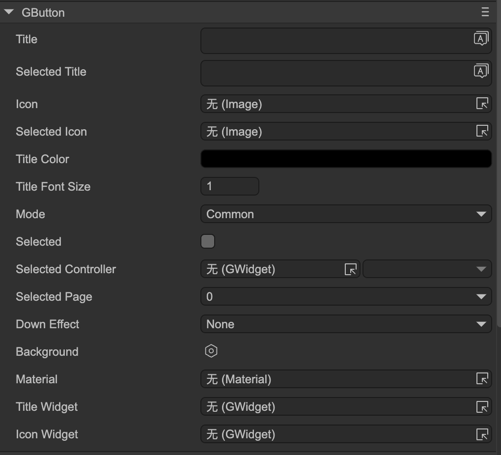
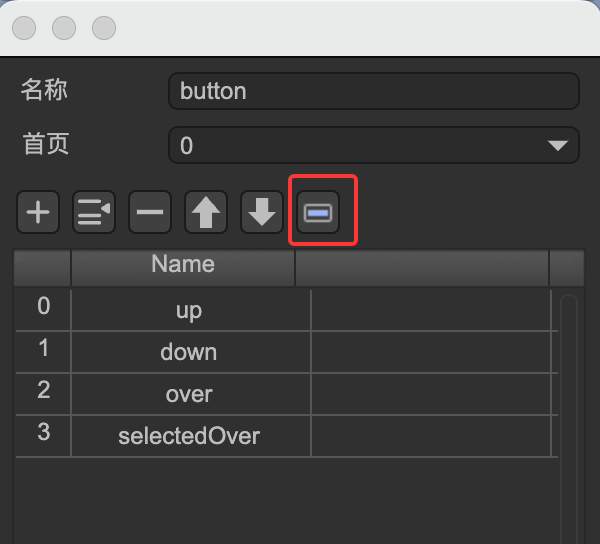

# Button (GButton)

Author: Gu Zhu

  

* **Title** — The button title. You must first set the `Title Widget`.
* **Selected Title** — Title when the button is selected; meaningful for check or radio buttons.
* **Icon** — The button icon. You must first set the `Icon Widget`.
* **Selected Icon** — Icon when the button is selected; meaningful for check or radio buttons.
* **Title Color** — Color of the title text.
* **Title Font Size** — Font size of the title.
* **Mode** — Button mode:

  * `Common` — Normal button.
  * `Check` — Check button. Clicking toggles between selected and unselected states.
  * `Radio` — Radio button. Clicking sets it to selected; cannot automatically deselect. Usually multiple radio buttons form a **radio group**. See [Controller and Button Interaction](../controller/readme.md) for details. Radio buttons are also used in selection-mode panels.
* **Selected** — Selected state; relevant for check or radio buttons.
* **Selected Controller** — See [Controller and Button Interaction](../controller/readme.md).
* **Selected Page** — See [Controller and Button Interaction](../controller/readme.md).
* **Down Effect** — Built-in press effects; meaningful for normal buttons. If these are insufficient, use the button’s internal controller to implement custom effects:

  * `Dark` — The button darkens when pressed.
  * `UpScale` — The button enlarges when pressed.
  * `DownScale` — The button shrinks when pressed.
* **Sound** — Plays a sound when the button is pressed.

### Functional Widgets Binding

These properties bind the button’s functional sub-components. Note: if the button node is part of a prefab instance, these properties are hidden.

* **Title Widget** — Sets the text sprite. Changing the Title property actually modifies this component.
* **Icon Widget** — Sets the icon sprite. Changing the Icon property actually modifies this component.

### Button Controller

Typically, a button contains a **button controller** named `"button"`. This is optional if no special effects are needed.

Controller pages:

* **up** — Normal state.
* **down** — Normal button pressed state / selected state for check or radio buttons.
* **over** — Mouse pointer hovers over the button.
* **selectedOver** — Selected state when the mouse pointer hovers over the button.
* **disabled** — Button is disabled.
* **selectedDisabled** — Selected state when the button is disabled.

A standard 4-state button usually uses **up/down/over/selectedOver**. On mobile devices, **up/down** may suffice.
When a button is disabled, a default gray effect is applied. To customize, design using **disabled** and **selectedDisabled** pages.

In the controller design page, you can quickly add these pages using the button highlighted in the red box, as shown below:

  
(Fig. 1-1)
