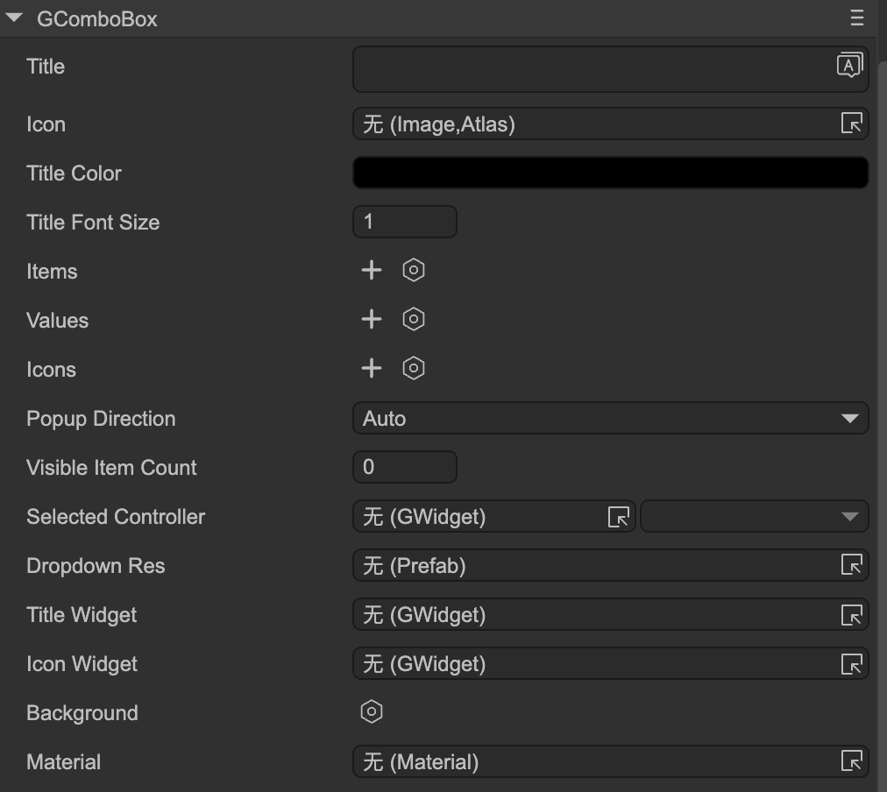

# Dropdown (GComboBox)

Author: Gu Zhu

  

* **Title** — Dropdown title. You must first set the `Title Widget`.
* **Icon** — Dropdown icon. You must first set the `Icon Widget`.
* **Title Color** — Color of the title text.
* **Title Font Size** — Font size of the title.
* **Items** — Titles of each item in the dropdown.
* **Values** — Values for each item, used in code logic.
* **Icons** — Icons for each item.
* **Popup Direction** — Direction the dropdown opens:

  * `Auto` — Automatically determines direction based on dropdown position. For example, if the dropdown is near the bottom of the stage, it will open upwards to avoid clipping content.
  * `Up` — Opens upward.
  * `Down` — Opens downward.
* **Visible Item Count** — Limits the number of visible items. Items exceeding this count are scrollable.
* **Selected Controller** — See [Controller and Dropdown Interaction](../controller/readme.md).

### Functional Widgets Binding

These properties bind the dropdown’s functional sub-components. Note: if the dropdown node is part of a prefab instance, these properties are hidden.

* **Dropdown Res** — Dropdown resource, which is a prefab. Typically designed as a background + list. The background should adapt to the container’s width and height. The list must be named `"list"` and usually requires vertical scrolling.
* **Title Widget** — Sets the text sprite.
* **Icon Widget** — Sets the icon sprite.

### Button Controller

The dropdown usually contains a controller named `"button"`, since its behavior is similar to a button. Design it like a button:

* When the dropdown is clicked and expanded, the `"button"` controller stays on the `"down"` page.
* When the dropdown collapses, the `"button"` controller returns to `"up"` or `"over"` page.
