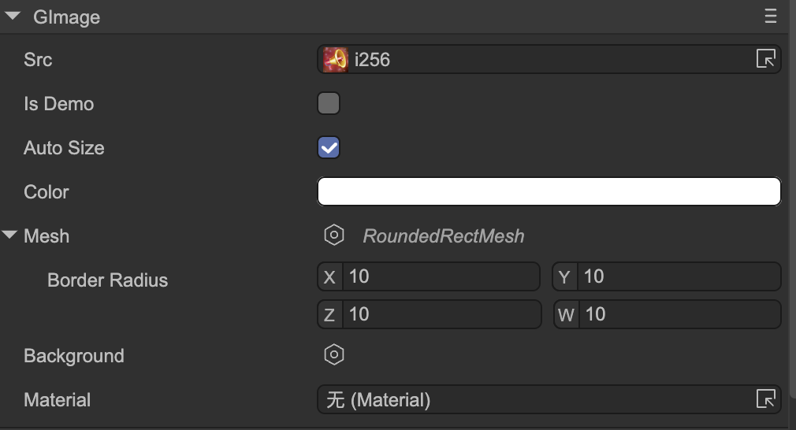

# Image (GImage)

Author: Gu Zhu

  

* **Src** — Image resource.
* **Is Demo** — The content set in `Src` is only for demo purposes. It will be displayed in the IDE but automatically cleared on publishing.
* **Auto Size** — Whether to automatically adjust size. If `Auto Size` is true, changing `Src` will automatically resize the node to match the image size.
* **Color** — Tint color of the image.
* **Mesh** — Provides a custom mesh for the renderer. Built-in supported types include:

  * **RoundedRectMesh** — Masks the image as a rounded rectangle.
  * **ProgressMesh** — Creates a fill effect at a specified ratio; supports horizontal, vertical, circular, and other directions.
  * **CircleMesh** — Masks the image as a circle.
  * **FlipMesh** — Flips the image horizontally or vertically.
  * **RegularPolygonMesh** — Masks the image as a regular polygon.
