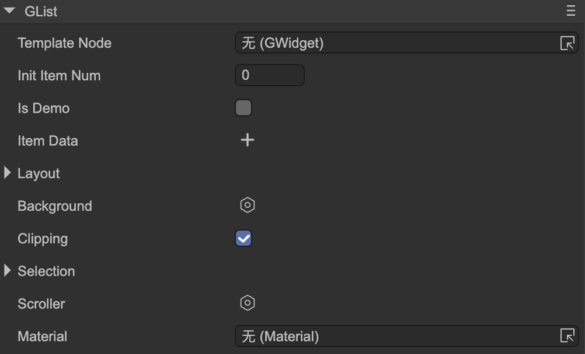

# List (GList)

Author: Gu Zhu

  

* **Template Node** — The template for item nodes. Drag a node from the hierarchy panel. This node must be a child of the GList.
* **Init Item Num** — Initial number of items. If greater than 0, the specified number of items will be automatically created.
* **Is Demo** — If checked, `Init Item Num` only takes effect in the IDE; it has no effect at runtime, serving only as a demo in the IDE.
* **Item Data** — Allows simple data assignment for each item.
* **Layout** — See [Layout Containers](../layout/readme.md).
* **Clipping** — Whether clipping is enabled. Content exceeding the container size will be hidden.
* **Selection** — See [Selection Support](../selection/readme.md).
* **Scroller** — See [Scroller Support](../scroller/readme.md).

---

## 1. Managing List Content

At runtime, you can modify the list’s children using APIs like `addChild` or `removeChild`. However, in practice, list content is frequently updated. A typical scenario is clearing the list and re-adding items after receiving backend data.

Creating and destroying UI objects repeatedly consumes significant CPU and memory. To address this, **GList** includes an object pool.

### Using the Object Pool

* **addItemFromPool** — Retrieves an object from the pool (or creates a new one) and adds it to the list. If no argument is passed, it uses the list’s “item resource” setting; you can also specify a URL to create a specific object.
* **getFromPool** — Retrieves an object from the pool or creates a new one.
* **returnToPool** — Returns an object to the pool.
* **removeChildToPool** — Removes an item and returns it to the pool.
* **removeChildToPoolAt** — Removes an item at a specific index and returns it to the pool.
* **removeChildrenToPool** — Removes a range of items, or all items, returning them to the pool.

> Smart use: `addItemFromPool = getFromPool + addChild`, and `removeChildToPool = removeChild + returnToPool`.

Be careful: an ever-growing pool can harm performance, but not using a pool also impacts performance.

#### Common Mistakes

**Mistake 1:**

```typescript
aList.addChild(obj);
aList.removeChildrenToPool();
```

Adding objects without the pool but returning them when clearing causes the pool to grow indefinitely, possibly leading to memory overflow.
**Fix:** Use the pool when adding: replace `addChild` with `addItemFromPool`.

**Mistake 2:**

```typescript
for(let i=0;i<10;i++)
    aList.addItemFromPool();

aList.removeChildren();
```

Here, items are added but removed without returning to the pool, causing memory leaks.
**Fix:** Use `aList.removeChildrenToPool()` instead of `removeChildren()`.

> **Note:** Removing an item is different from destroying it. If you remove an item and will not use it again, destroy it. If it will be reused, keep a reference. **Do not destroy items placed in the pool.**

### Using Callbacks

Instead of looping `addChild` or `addItemFromPool`, you can define an item renderer function:

```typescript
function renderListItem(index:number, obj:GButton) {
    obj.title = "" + index;
}
```

> If using a pool, the callback may be called multiple times for the same object. Be careful with event listeners and avoid temporary functions to prevent duplicates.

Set the function as the list renderer:

```typescript
aList.itemRenderer = renderListItem;
```

Then set the total number of items:

```typescript
// Creates 100 items; note that numChildren is read-only and cannot be used here
aList.numItems = 100;
```

If the new item count is smaller than the current count, extra items are returned to the pool. To update a specific item, call:

```typescript
renderListItem(index, aList.getChildAt(index));
```

---

## 2. Virtual List

For very large lists (hundreds or thousands of items), creating display objects for every item is expensive. **GList** supports virtual lists: only items within the visible range are created, and data is dynamically applied.

### Requirements for Virtual Lists

* Define an **itemRenderer** function.
* Create a **Scroller**; lists without a Scroller cannot be virtual.

Enable virtual mode:

```typescript
aList.setVirtual();
```

> **Note:** Virtual mode can only be enabled; it cannot be disabled.

### Best Practices

* Simplify logic in `itemRenderer`; avoid Promises, I/O, or heavy computations.
* Do not modify ITEM instances directly in asynchronous callbacks. Instead, save the ITEM index, check if the item exists upon completion, and update it if present.
* Avoid creating new objects in `itemRenderer` to prevent excessive GC.

In virtual lists:

* ITEMs are reused; `itemRenderer` is called whenever an item is refreshed.
* Display objects and item indices differ. Use `numItems` for item count and `numChildren` for display object count.
* `selectedIndex` refers to the **item index**, not the display object index. Use `itemIndexToChildIndex` and `childIndexToItemIndex` to convert between the two:

```typescript
// Convert item index to display object index
let childIndex = aList.itemIndexToChildIndex(1);

// Convert display object index to item index
let itemIndex = aList.childIndexToItemIndex(1);
```

### Accessing Off-Screen Items

For virtual lists, off-screen items do not have display objects. To access, scroll them into view first:

```typescript
aList.scrollToView(500, false); // false disables animation
let index = aList.itemIndexToChildIndex(500);
let obj = aList.getChildAt(index);
```

### Updating Virtual Lists

Virtual lists separate data and rendering. Modify your data and refresh the list; do not manipulate item objects directly.

* Methods: set `numItems` or call `GList.refreshVirtualList()`.
* **Do not use `addChild` or `removeChild` on virtual lists.**

### Variable Item Sizes

* Change `width`, `height`, or `size` in `itemRenderer`.
* Associate internal components with item content; changes in content update item size automatically.

> Other methods of changing item size externally are not allowed, or layout will break. Use `refreshVirtualList()` if needed.

### Mixed Item Types

Define an item provider function:

```typescript
function getListItemResource(index:number) {
    let msg = _messages[index];
    return msg.fromMe ? "url1.lh" : "url2.lh";
}
aList.itemProvider = getListItemResource;
```

### Virtual List Layout

* Horizontal, vertical, and paged virtual lists have fixed items per row/column.
* For non-uniform items, insert placeholders with defined width to maintain layout.

---

## 3. Loop List

Loop lists are circular and must be virtual. Enable with:

```typescript
aList.setVirtualAndLoop();
```

* Supports only single-row or single-column layouts; not flow or paged layouts.
* Because indices may appear at different positions in a loop, avoid relying on item indices when scrolling. Use Scroller APIs (`scrollLeft`, `scrollRight`, `scrollUp`, `scrollDown`) to move by one step accurately.
