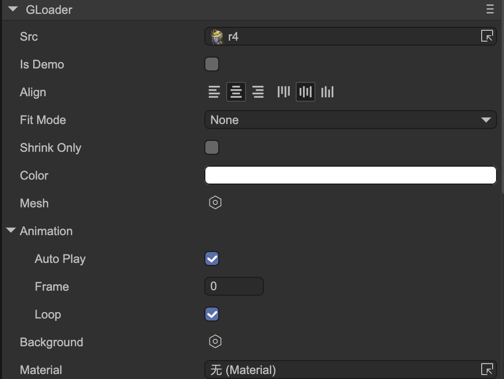

# Loader (GLoader)

Author: Gu Zhu

  

* **Src** — Image resource or an atlas resource representing a frame sequence animation.
* **Is Demo** — The `Src` content is only for demonstration in the IDE. It will automatically be cleared when published.
* **Align** — Horizontal and vertical alignment.
* **Fit Mode** — Adaptation mode:

  * **None** — No scaling. The image retains its original size.
  * **Fill** — Stretch to fill the container’s display area.
  * **Contain** — Scale the image proportionally so it fits entirely within the container. May leave empty spaces.
  * **Cover** — Scale the image proportionally to fill the entire container. Parts may overflow if the aspect ratio does not match.
  * **Cover Width** — Similar to `Cover`, but width is strictly fit. Height may overflow.
  * **Cover Height** — Similar to `Cover`, but height is strictly fit. Width may overflow.
* **Shrink Only** — If checked, the image will not be enlarged regardless of the `Fit Mode`.
* **Color** — Image color.
* **Mesh** — Provides a custom mesh for the renderer. See the Mesh property description of images.
* **Animation** — If `Src` is an animation resource, animation settings can be configured here. See GMovieClip settings for details.
