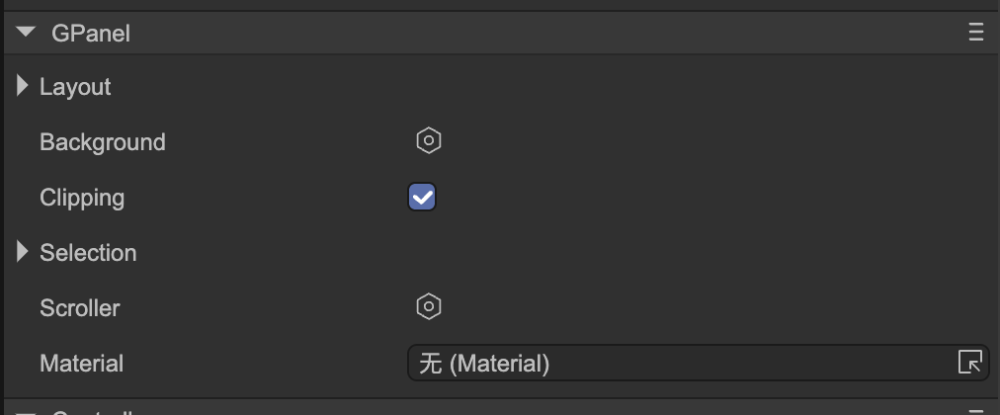

# Panel Container (GPanel)

Author: Gu Zhu

  

* **Layout** — Refer to *Layout Container*.
* **Clipping** — Whether to enable clipping. When enabled, content that exceeds the container’s size will be hidden.
* **Selection** — Refer to [Selection Support](../selection/readme.md).
* **Scroller** — Refer to [Scrolling Support](../scroller/readme.md).

