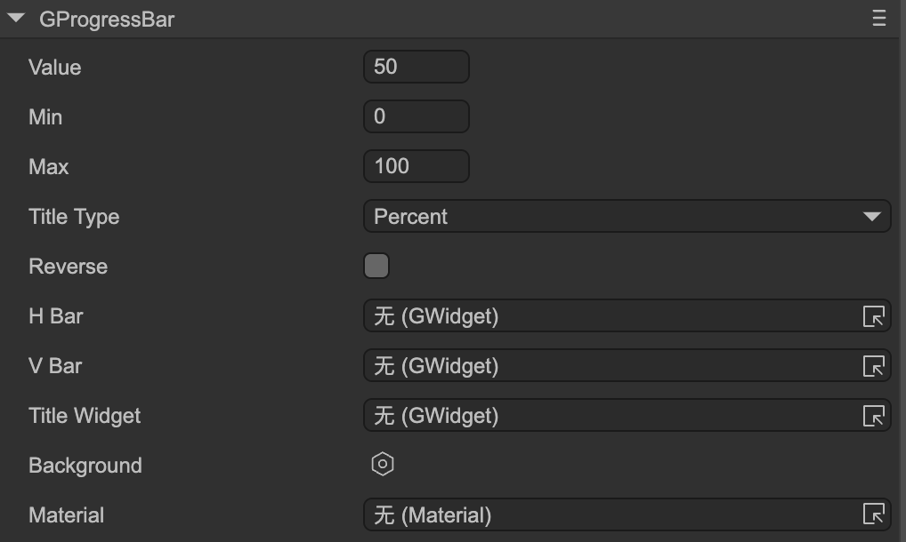
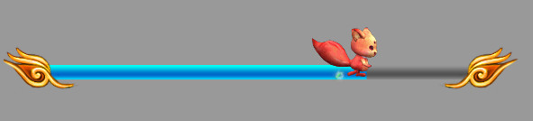

# Progress Bar (GProgressBar)

Author: Gu Zhu

  

* **Value** — Progress value, should be between `Min` and `Max`.
* **Min** — Minimum progress value.
* **Max** — Maximum progress value.
* **Title Type** — Title format. Must first set the `Title Widget`.

  * **Percent** — Displays percentage, e.g., "50%".
  * **ValueAndMax** — Displays current value and maximum value, e.g., "50/100".
  * **Value** — Displays the current value, e.g., "50".
  * **Max** — Displays the maximum value, e.g., "100".
* **Reverse** — For horizontal progress bars, normally the bar extends to the right as progress increases. If reversed, the right edge is fixed, and the bar extends to the left as progress increases. For vertical progress bars, normally the bar extends downward as progress increases. If reversed, the bottom edge is fixed, and the bar extends upward as progress increases.

  * Compare the two progress bars below: the first is a normal progress bar, and the second is reversed.

    
    

  (Figure 1-1)

The following properties are used to bind functional components of the progress bar. Note: These properties are hidden when the progress bar node is an instance of a prefab.

* **H Bar** — Horizontal bar sprite. Its width changes as the progress changes, typically used for horizontal progress bars. Make sure the sprite’s width matches the maximum value of the progress bar.

  This sprite can be of any type, not limited to images. Specifically, if it is an image or loader containing a `ProgressMesh`, the fill ratio of the `ProgressMesh` changes as the progress changes, rather than the sprite’s width.

* **V Bar** — Vertical bar sprite. Its height changes as the progress changes, typically used for vertical progress bars. Make sure the sprite’s height matches the maximum value of the progress bar.

  This sprite can be of any type, not limited to images. Specifically, if it is an image or loader containing a `ProgressMesh`, the fill ratio of the `ProgressMesh` changes as the progress changes, rather than the sprite’s height.

* **Title Widget** — Title text widget. Its text content automatically updates based on the `Title Type` when progress changes.

You can use component associations to create more dynamic progress bars. For example, in the progress bar below, a moving squirrel is linked to the bar component with a “right->right” association, so it moves along with the progress.

  

(Figure 1-2)
