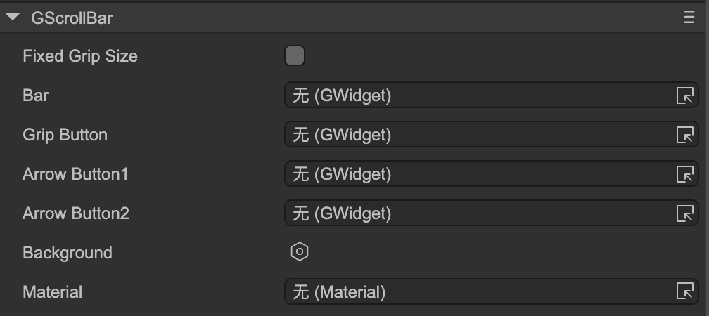

# Scroll Bar (GScrollBar)

Author: Gu Zhu

  

* **Fixed Grip Size** — Whether to use a fixed grip size. Normally, the scroll bar’s grip (the draggable slider) resizes based on the scrollable area. If the scroll area is small, the grip becomes larger; if the scroll area is large, the grip becomes smaller. If you want the grip to remain the same size at all times, check this option. Once enabled, the grip size will stay at its original size.

The following properties are used to bind functional components of the scroll bar:

* **Bar** — The bar sprite. This defines the range in which the grip can slide up/down or left/right. Usually, an empty node can be used as a placeholder.
* **Grip Button** — The grip (slider) sprite in the middle of the scroll bar.
* **Arrow Button 1** — For a horizontal scroll bar, this represents the left arrow; for a vertical scroll bar, it represents the top arrow. Optional—if your scroll bar has no arrows, it can be ignored.
* **Arrow Button 2** — For a horizontal scroll bar, this represents the right arrow; for a vertical scroll bar, it represents the bottom arrow. Optional—if your scroll bar has no arrows, it can be ignored.

Do not drag the scroll bar component directly onto the stage or create it dynamically at runtime. **[Scroller](../scroller/readme.md)** automatically generates scroll bars for containers. Besides specifying scroll bar resources in the Scroller’s properties, you can also set global default scroll bar resources in *Project Settings → UI System*, so you don’t need to configure them every time.
