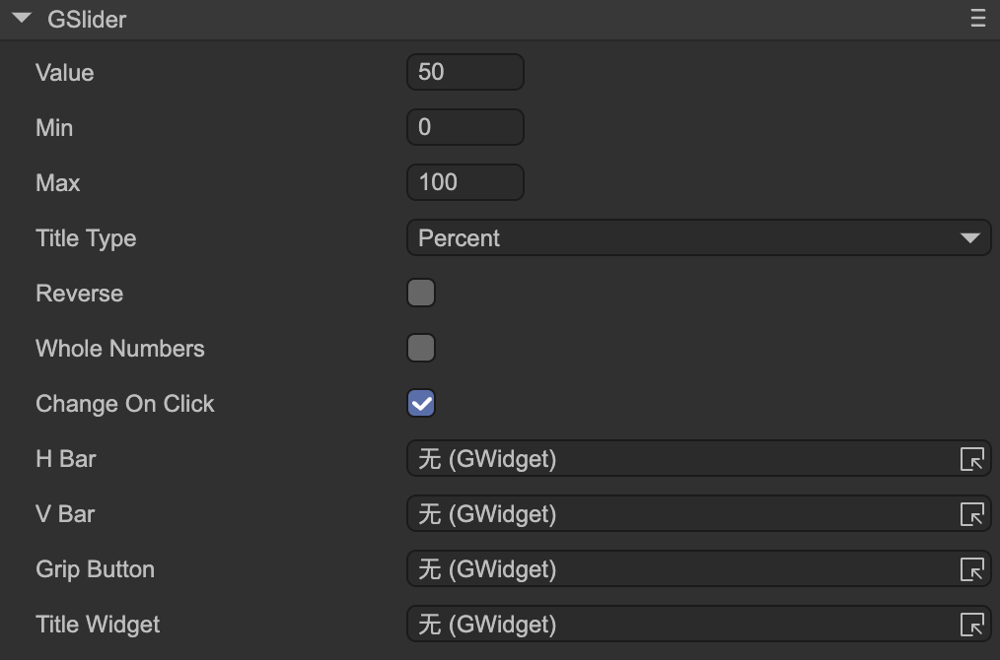

# Slider (GSlider)

Author: Gu Zhu

  

* **Value** — The current progress value, which should be between `Min` and `Max`.
* **Min** — The minimum value of the slider.
* **Max** — The maximum value of the slider.
* **Title Type** — Type of title display. You must first set the `Title Widget`.

  * **Percent** — Displays as a percentage, e.g., “50%”.
  * **ValueAndMax** — Displays current value and maximum, e.g., “50/100”.
  * **Value** — Displays the current value only, e.g., “50”.
  * **Max** — Displays the maximum value only, e.g., “100”.
* **Reverse** — For horizontal sliders, normally the fill bar extends to the right as the value increases; if reversed, the right edge stays fixed and the fill bar extends to the left. For vertical sliders, normally the fill bar extends downward; if reversed, the bottom edge stays fixed and the fill bar extends upward.
* **Whole Numbers** — When enabled, the slider stops only at integer positions, ensuring the value is always an integer. Useful for stepped sliders.
* **Change On Click** — When enabled, clicking anywhere on the slider changes its value directly. If disabled, the value can only be changed by dragging the grip.

The following properties are used to bind functional components of the slider. Note: these properties are hidden when the slider node is part of a prefab instance.

* **H Bar** — Horizontal bar sprite. When the value changes, the width of this sprite is adjusted. Typically used for horizontal sliders. Make sure the width represents the slider at its maximum value.

  This sprite can be any type, not limited to images. If it uses a `ProgressMesh` (e.g., in an image or loader), changing the value adjusts the mesh’s fill ratio rather than the sprite’s width.

* **V Bar** — Vertical bar sprite. When the value changes, the height of this sprite is adjusted. Typically used for vertical sliders. Make sure the height represents the slider at its maximum value.

  This sprite can be any type, not limited to images. If it uses a `ProgressMesh`, changing the value adjusts the mesh’s fill ratio rather than the sprite’s height.

* **Grip Button** — The slider’s draggable grip. The grip should be linked to the bar object and positioned at the maximum value. The linkage is as follows:

  * **Forward**: grip’s left edge linked to `bar` (horizontal) or top edge linked to `bar_v` (vertical).
  * **Reverse**: grip’s top edge linked to `bar` (horizontal) or bottom edge linked to `bar_v` (vertical).

* **Title Widget** — The title label. Its text content automatically updates based on the `Title Type` when the slider value changes.
