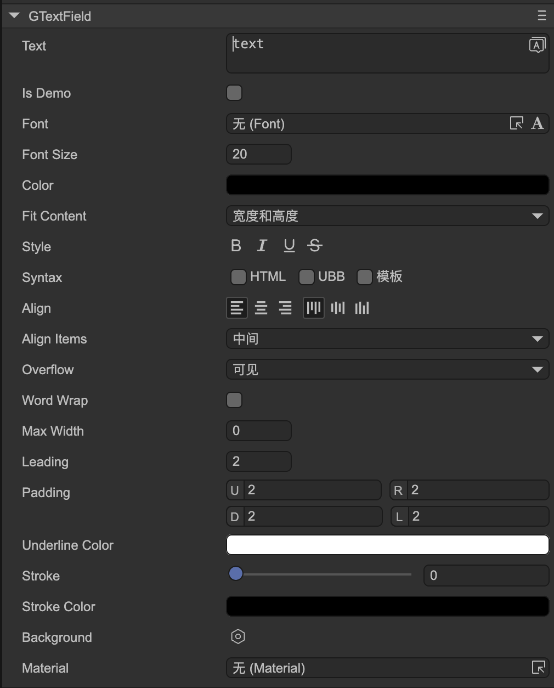

# Text (GTextField)

Author: Gu Zhu

  

* **Is Demo** — The text set here is only for demo purposes, visible in the IDE. It will be automatically cleared upon publishing.
* **Fit Content** — Adjusts the text field size according to its content.

  * **None** — No adjustment. The text field size does not change to match the text.
  * **Both** — Adjusts both width and height of the text field to match the text size.
  * **Height** — Adjusts only the height of the text field to match the text height.

Other properties have the same meaning as in the engine’s `Text` component. Please refer to the engine documentation for details.
