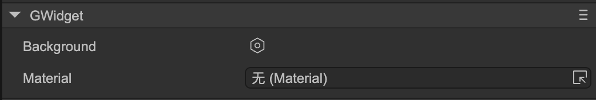
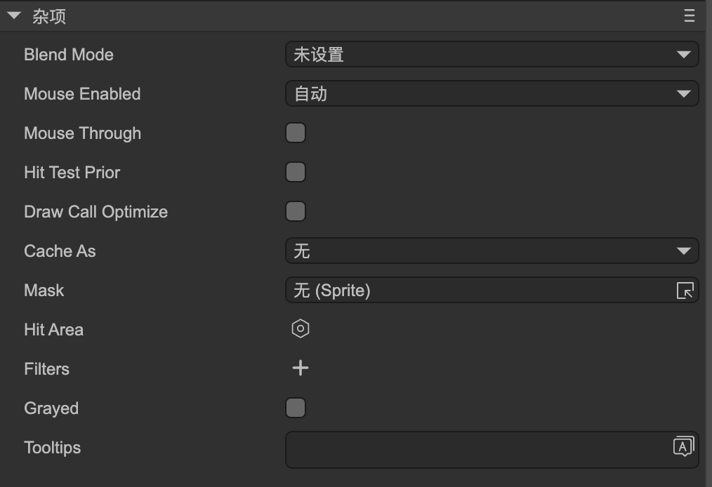
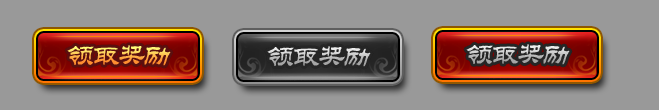

# Widget (GWidget)

Author: Gu Zhu

  

  

* `Background` – Sets the background color, border width, and border color for the widget.
* `Grayed` – When checked, the widget will appear in a grayed-out state. Note that being grayed does **not** mean it cannot be clicked; to disable clicking, you also need to set the `Mouse Enabled` property. By default, graying is implemented using a color filter, but you can also customize it using a controller.

  For example, a button component consists of a background and an image/text on top. In the left image, it shows the normal state; in the middle image, it shows the grayed state applied. If you want only the image/text to gray while keeping the background unchanged, you can define a controller named `grayed` in the component to control the gray effect specifically. Once this controller exists, the default overall graying effect is disabled.

  

* `Tooltips` – When the mouse hovers over the widget, a text tooltip appears, and it disappears when the mouse leaves. To use tooltips, follow these steps:

  * Create a prefab with a root node of type GLabel and configure its text widget so the system can set the tip text to the label’s `Title` property.
  * Open “Project Settings -> UI System” and drag your prefab into the “Tooltip” input field.

### text and icon

Images and text are the two most fundamental display elements in the UI system. Accessing and setting a component’s title and icon is a high-frequency operation, so the GWidget base class provides the `text` and `icon` properties.

For example, for an image, the following two lines are equivalent:

```typescript
aImage.src = 'xxx.png';
aImage.icon = 'xxx.png';
```

For a button, the following two lines are equivalent:

```typescript
aButton.text = 'hello';
aButton.title = 'hello';
```

Therefore, if the exact node type is unknown but you need to set a title, you can use `text`. For instance, setting the text of a GTextField uses `text`, setting a GButton’s title uses `title`, but using `text` works for both. The same applies to `icon`.
