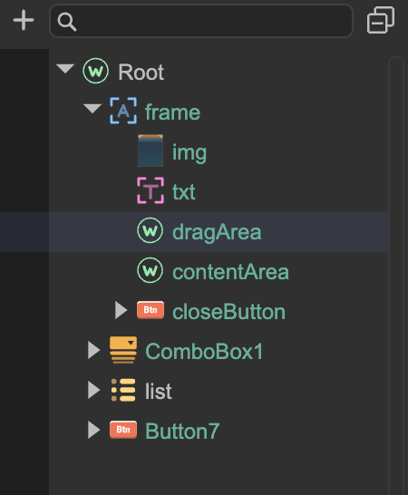

# Window (GWindow)

Author: Gu Zhu

A window is an advanced UI component that can be popped up, closed, or hidden. In other UI systems, it may also be called a Dialog; they are essentially the same type of component.

In the editor, you cannot directly create a GWindow node. GWindow must be constructed at runtime, but it is just a shell object. You need to design its content in the editor, usually using a prefab. There is no restriction on the root node type of the prefab. Typically, a node named `"frame"` is placed inside the prefab, as shown in the figure below. In this example, the `frame` itself is another prefab, which makes it easier to reuse.

  

The `frame` node is usually of type GLabel, making it easy to modify the window title. Additionally, children of the `frame` node with specific names can enable common window functions:

* `closeButton` – A button named `closeButton` will automatically serve as the window’s close button. Clicking it will hide the window.
* `dragArea` – A widget named `dragArea` will automatically serve as the window’s draggable area. When the user clicks and drags this area, the window moves accordingly.
* `contentArea` – A widget named `contentArea` will serve as the main content area of the window. This area is used only for `showModalWait`. When calling `showModalWait`, the window will be locked. If `contentArea` is set, only that region is locked; otherwise, the entire window is locked. If you want the window to remain draggable and closable while in modal wait, do not let `contentArea` cover the title bar.

Note: All the above conventions are optional. Whether the window contains a `frame` or whether the `frame` contains conventionally named widgets does not affect the window’s normal display or closing behavior.

Once the window content prefab is ready, you can create and use the window at runtime as follows:

```TypeScript
let win = new GWindow();
win.contentPane = ((await Laya.loader.load("Examples/windows/Window1.lh")) as Laya.Prefab).create();
win.show();
```

You can also extend the GWindow class:

```TypeScript
class MyWindow extends Laya.GWindow {

    protected onInit() {
        this.contentPane = ((await Laya.loader.load("Examples/windows/Window1.lh")) as Laya.Prefab).create();
    }

    protected onShown() {
        // Handle logic after the window is shown, e.g., update UI
    }

    protected onHide() {
        // Handle logic after the window is hidden
    }
}

let win = new MyWindow();
win.show();
```

### Modal Wait / Locking

Windows have a special locking feature. For example, when a window is waiting for a network request, it can be locked so that users cannot interact with its contents. To lock a window, a prefab is used to block interaction and optionally show a loading symbol or text. Set this prefab in “Project Settings -> UI System -> Window Modal Wait”.

```TypeScript
aWindow.showModalWait();

// Execute asynchronous operation

aWindow.closeModalWait();
```

### Modal Window

Windows can also be modal. A modal window prevents users from clicking on content behind it.

```TypeScript
aWindow.modal = true;

class MyWindow extends Laya.GWindow {
    constructor() {
        super();
        this.modal = true;
    }
}
```

When a modal window is shown, a gray overlay can automatically appear behind it. The color of this overlay can be customized:

```TypeScript
Laya.UIConfig2.modalLayerColor = "#333333";
```

When a window is closed via the close button or by calling `GWindow.hide`, it is hidden rather than destroyed. This design allows windows to be opened and closed frequently, usually with a long lifecycle. If the window will no longer be used, you must call `destroy` manually.
