# Controller

Author: Gu Zhu

## Overview

The **Controller** is one of the core features of the new UI system. It supports common UI behaviors such as:

* **Pagination** — A component can consist of multiple pages and can be switched visually in the IDE (WYSIWYG).
* **Button States** — Buttons usually have multiple states (pressed, hovered, etc.). Controllers can assign different display content for each state.
* **Property Variations** — Controllers allow a component to have multiple appearances and switch between them easily.

## 1. Controller Design

A controller is a property of the `GWidget` class, so **any UI component** can have one.

You can create a controller in the IDE as shown below:

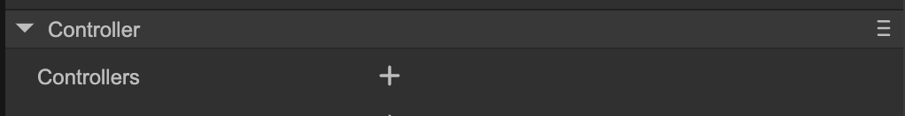  
(Fig. 1-1)  

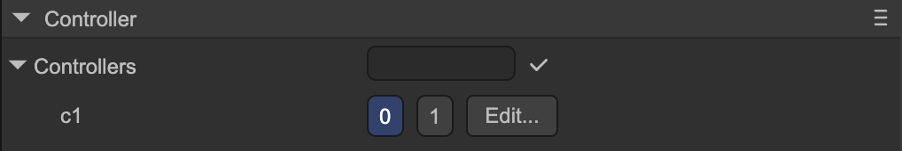  
(Fig. 1-2)  

Once created, if the node is the **root of a prefab**, you can quickly switch controller pages in the scene view top bar:

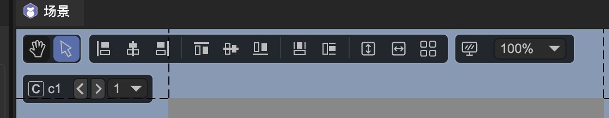  
(Fig. 1-3)  

Click the **“Edit”** button or the **“c”** icon to enter the controller editing interface:

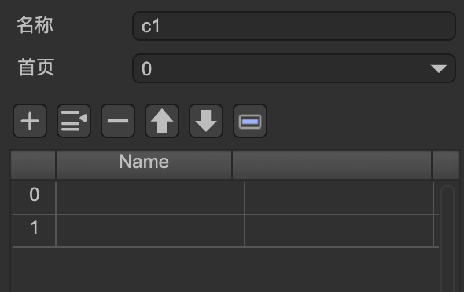  
(Fig. 1-4)  

Controller properties:

* **Name** — The name of the controller. Controllers within the same component must have unique names.
* **Home Page** — The default page when initialized, usually 0.
* **Pages** — Each page has an index and an optional name.

  * If no name is given, pages can only be switched via index in code.
  * If named, pages can be switched via name or index.


## 2. Property Control (Gears)

Each UI node can change its properties when any controller page changes (its own or another node’s controller).
This is called **Property Control**, and each controlled property is represented as a **Gear**.

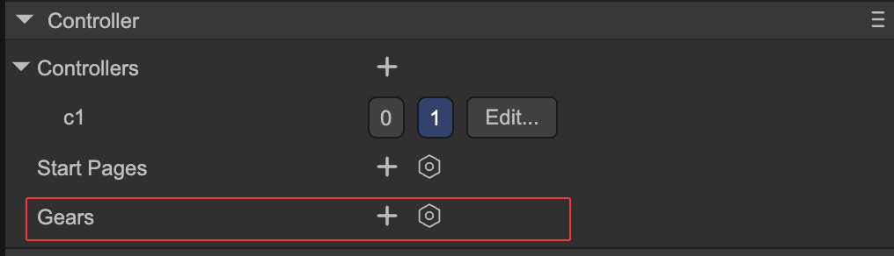  
(Fig. 2-1)  

Click the **“+”** icon to select a property to control:

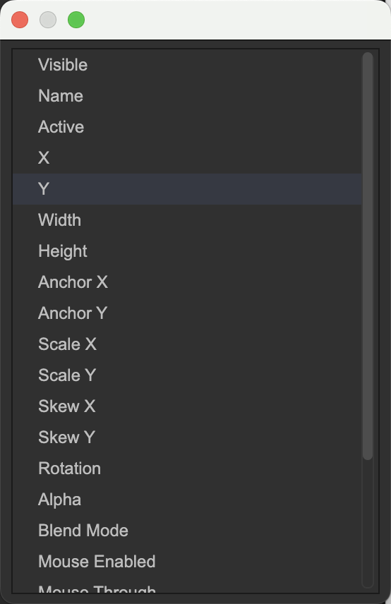  
(Fig. 2-2)  

For example, selecting the **“X”** property means setting different X coordinates for different controller pages:

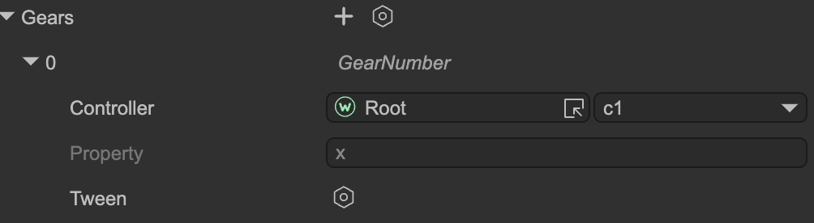  
(Fig. 2-3)  

**Property settings:**

* **Controller** — Choose the controller controlling this property (own or other node).
* **Property** — The property being controlled (read-only).
* **Tween** — Enable animation.

  * Example: page 1 X = 100, page 2 X = 200. Switching without tween instantly sets X = 200; with tween, X transitions smoothly from 100 → 200.

After creating the tween instance:

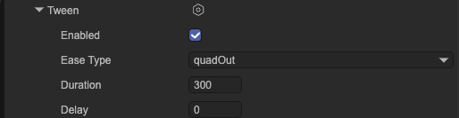  
(Fig. 2-4)  

* **Enabled** — Whether to use animation.
* **Ease Type** — Easing curve or motion type.
* **Duration** — Tween duration in milliseconds.
* **Delay** — Delay before starting the tween after page switch in milliseconds.

In the Gear interface, you don’t directly set X values.
To assign different X values per page, simply switch to the page in the controller and modify the component’s X coordinate in the IDE.
The IDE automatically records the value per page.

### Special Case: “Visible” Property

If the controlled property is **Visible**, the interface and operation differ:

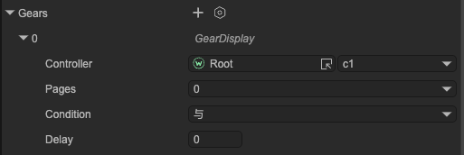  
(Fig. 2-5)  

* This **Visible** flag is independent of the component’s own `visible` property; it controls node visibility externally.
* **Pages** — Select the page(s) where the component will be visible; it will be hidden on other pages.
* **Condition** — If multiple Visible gears exist, their logic is combined here:

  * `AND` — Visible only if all conditions are met.
  * `OR` — Visible if any condition is met.
* **Auto-delay hide** — If visibility and other animated properties (like X) are controlled together, the component will remain visible until animations complete, then hide.


## 3. Interaction with Buttons

Controllers can link to **buttons**, so when a button is clicked or its state changes, the controller page changes accordingly:

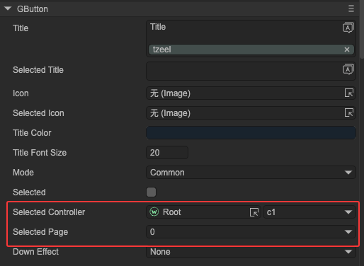  
(Fig. 3-1)  

Button behavior by type:

* **Normal Button** — Switches controller to the assigned page when clicked.
* **Radio Button** — Switches controller to the assigned page when selected.

  * When the controller changes to the page, the button is selected.
  * When the controller switches away, the button is deselected.
* **Checkbox** — When checked, switches controller to the assigned page;
  when unchecked, switches to the other page (e.g., controller has pages 0 & 1, assigned page = 0, uncheck → switch to page 1).

This mechanism can implement a **RadioGroup** — multiple mutually exclusive radio buttons.
Create a controller with multiple pages and connect each radio button to a page to form a radio group.

In code, get or set the selected button via `selectedIndex` or `selectedPage`.

By also binding other element properties (like visibility) to the same controller, you can implement a **TabControl**.
Hence, the new UI system does not include built-in `TabControl` or `RadioGroup` components — controllers can handle them easily.


## 4. Interaction with Dropdowns

Controllers can link with **Dropdowns**.

* Changing the dropdown selection automatically switches the controller to the corresponding page index.
* Changing the controller page updates the dropdown selection.

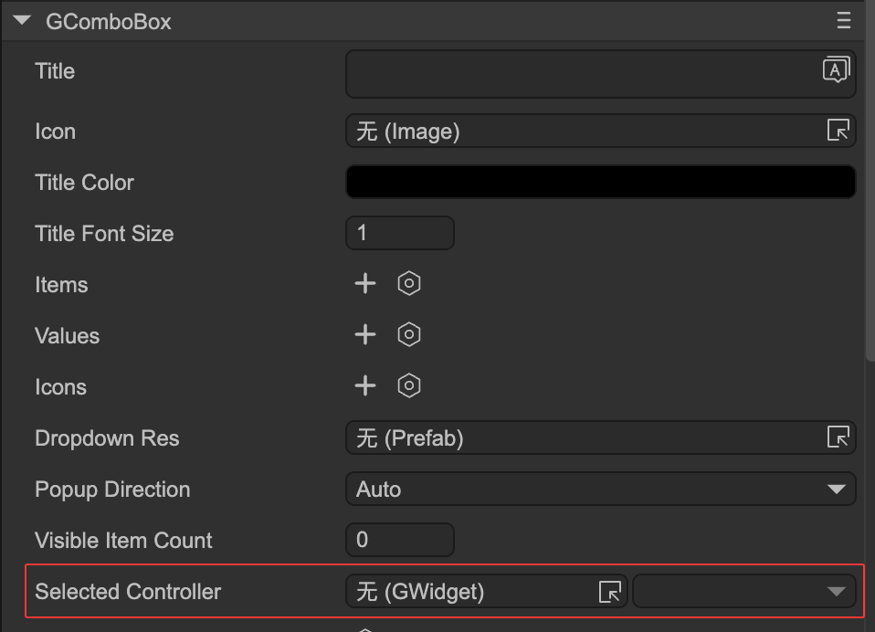  
(Fig. 4-1)  


## 5. Interaction with Selection

Controllers can link with **Selection** components.

* Changing the selection automatically updates the controller page.
* Changing the controller page updates the selection index.

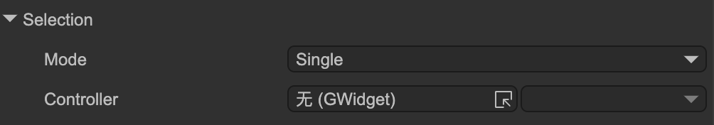  
(Fig. 5-1)  


## 6. Common API

During runtime, controllers can be used as follows:

```typescript
let c1 = aWidget.getController("c1");

// Set active page by index
c1.selectedIndex = 1;

// Or set by page name
c1.selectedPage = "page_name";

// Get current active page
console.log(c1.selectedIndex);

// Another simple way to change page
aWidget.setPage("c1", 1);
```

Controller change event:

```typescript
c1.on(Laya.Event.CHANGED, () => {
    console.log(c1.selectedIndex);
});
```

