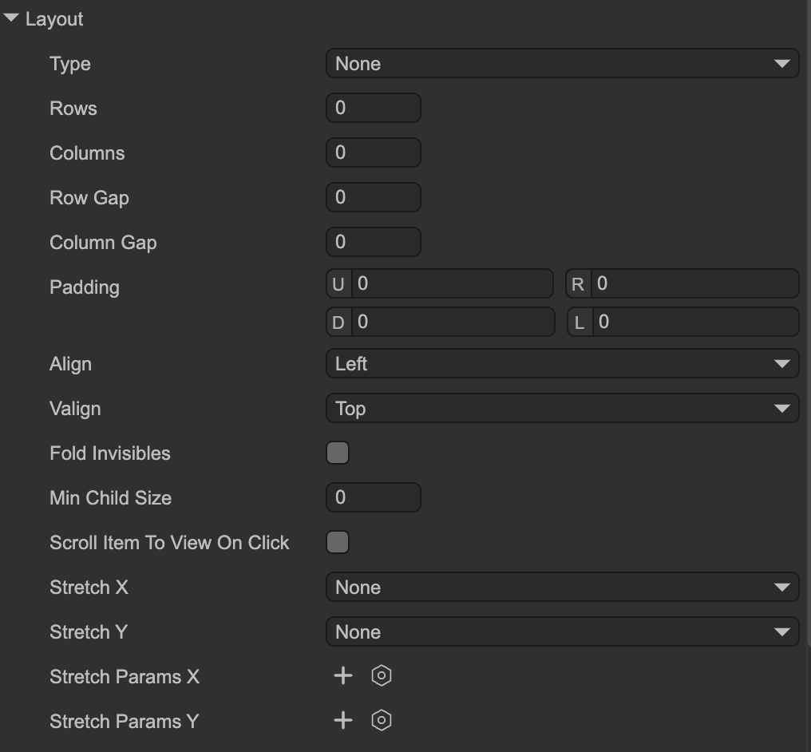

# Layout Containers

Author: Gu Zhu

When creating UI that adapts to different screen resolutions, layout containers are another commonly used method besides the relational system. Layout containers typically refer to **GBox**, but derived classes such as **GPanel** and **GList** have similar functionality.

---

## 1. Editor Operations

  
(Figure 1-1)  

### Layout Properties

* **Type**: Layout type

  * `None` – No layout. Child nodes maintain their original position and size.
  * `Single Column` – One item per row, vertically arranged.
  * `Single Row` – One item per column, horizontally arranged.
  * `FlowX` – Items are arranged horizontally. When reaching the right edge of the viewport or a specified number of columns, it wraps to a new row.
  * `FlowY` – Items are arranged vertically. When reaching the bottom of the viewport or a specified number of rows, it wraps to a new column.
* **Rows**: Only applicable to `FlowY` layouts. If set to a value > 0, a new column starts after this many items.
* **Columns**: Only applicable to `FlowX` layouts. If set to a value > 0, a new row starts after this many items.
* **Row Gap**: Distance between rows. Can be negative.
* **Column Gap**: Distance between columns. Can be negative.
* **Padding**: Set internal padding on all four sides of the container.
* **Align**: Horizontal alignment of items.
* **Valign**: Vertical alignment of items.
* **Fold Invisibles**: If checked, invisible items (`visible=false`) are ignored in the layout and occupy no space. If unchecked, space is reserved for invisible items, resulting in blank placeholders.
* **Min Child Size**: When automatically resizing child nodes based on layout, their size will not be smaller than this value. For example, if set to 30 and a node’s calculated width is 10, it will be adjusted to 30.
* **Scroll Item To View On Click**: If checked, clicking an item partially visible in the viewport will automatically scroll it fully into view.
* **Stretch X**: Horizontal stretching behavior:

  * `None` – No stretching; item width remains unchanged.
  * `Stretch` – Scale items to fill the viewport width. For example, in a `Single Column` layout (one item per row), the item’s width becomes the viewport width.
  * `Resize to Fit` – Adjust viewport width to fit the maximum width of all items horizontally. The item widths remain unchanged.
* **Stretch Y**: Vertical stretching behavior. Same as `Stretch X` but for height.
* **Stretch Params X**: Parameters for horizontal stretching. An array where each element corresponds to a column in order. Note that invisible columns due to `Fold Invisibles` are skipped in alignment.

  * `Ratio` – Proportional width for the column. For example, 0.5 means the column occupies 50% of the available width.
  * `Priority` – Determines which items adjust first when width exceeds or is insufficient. Runtime values are normalized to -1, 0, or 1.
  * `Min` – Minimum width of items in this column.
  * `Max` – Maximum width of items in this column.
  * `Fixed` – Column width is fixed; item widths remain unchanged.
* **Stretch Params Y**: Parameters for vertical stretching. Same as `Stretch Params X` but for height.

---

## 2. Common API

When layout properties change, the container is automatically marked as dirty and refreshed before the next render. Exception: when modifying `stretchParamsX` or `stretchParamsY`, you must manually mark the layout as changed:

```typescript
// No need to manually mark as dirty
aBox.layout.foldInvisibles = true;

// Manual dirty flag required
aBox.layout.stretchParams.push(new StretchParam().setRatio(0.5));
aBox.setLayoutChangedFlag();

aBox.layout.stretchParamsX[0].ratio = 0.8;
aBox.setLayoutChangedFlag();
```

The container automatically refreshes layout positions when child nodes’ positions, sizes, visibility change, or when children are added/removed. If you need to immediately access the correct coordinates of items:

```typescript
aBox.layout.refresh();
```
