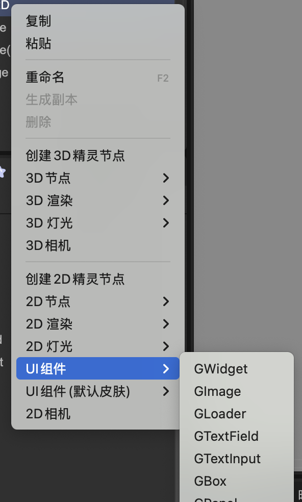
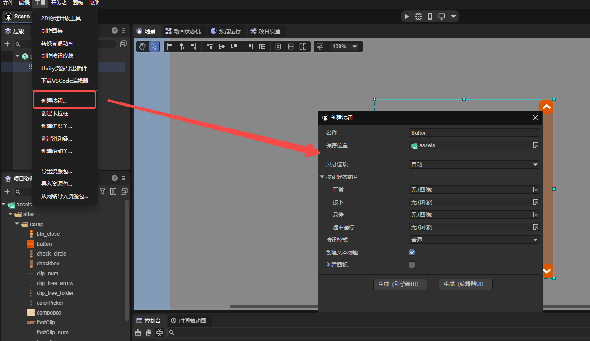

# New UI System in FairyGUI

Author: Gu Zhu

---

## Basic Overview

### 1. Node Types

In the new UI system, the base class for all components is `GWidget`, which derives from the engine’s `Sprite` class. This means all properties and methods of `Sprite` are available to `GWidget`, giving it all the functionality of a normal 2D node.

The built-in component types in the new UI system are categorized as follows:

* **Image Display**: `GImage`, `GLoader`

  * Both `GImage` and `GLoader` can be used for basic image display. `GImage` is lighter, so when a picture is dragged onto the stage in the IDE, `GImage` is created by default.
  * `GImage` always stretches the image to fill the node’s width and height. `GLoader` allows options such as stretching, centering, or maintaining aspect ratio when the image size differs from the node size.
  * `GLoader` can also display frame-based animations; its `src` property can point to a single image URL or a frame-sequence animation (atlas file).

* **Text Handling**: `GTextField`, `GTextInput`

  * `GTextField` is for displaying static text and wraps the engine’s `Text` class. It supports plain text, rich text, and mixed text-image layouts.
  * `GTextInput` is for user input and wraps the engine’s `Input` class.

* **Layout Containers**: `GBox`

  * `GBox` manages the layout of child nodes. It supports setting alignment, spacing, and arrangement direction. Common layouts include single row, single column, multiple rows/columns, and paging.

* **Panel Containers**: `GPanel`, `GList`, `GTree`

  * `GPanel` derives from `GBox` and adds functionality such as clipping child nodes and enabling scrolling.
  * `GList` and `GTree` derive from `GPanel` and are used for list and tree structures. `GList` supports virtualization for high-performance display of large datasets.

* **Behavior Components**: `GLabel`, `GButton`, `GComboBox`, `GProgressBar`, `GSlider`, `GScrollBar`

  * These components use a **composition design pattern**, separating display and behavior. The component implements behavior logic but has no built-in display. You must bind display components (like text or images) for them to render content.
  * Example: A `GButton` dragged onto the stage will appear blank until a `GTextField` is bound as its title or a `GImage` is bound as its icon.
  * Typically, these components are packaged as prefabs in the IDE for convenience (e.g., default button prefabs in “UI Components”).
  * This design allows flexible customization of the display portion without needing to export modified behavior components, enabling highly customizable UI components.

---

### 2. Editor Operations

When creating scenes or prefabs in the IDE, `GWidget` and its derived classes can be added directly to the node tree, similar to the old UI system.

  
(Figure 1-1)  

  
(Figure 1-2)  

---

### 3. Common Issues

* **Why doesn’t setting a GButton’s title have any effect?**
  `GButton` is a behavior component with no built-in display. You need to create your own button or use the prebuilt button prefab from “UI Components (default skin)”. The same applies to combo boxes, progress bars, etc.

* **How to change the three-state images of a prefab button?**
  Buttons don’t have a “three-state image” property. Simply setting three image URLs isn’t sufficient for customizable buttons because image size, position, and other properties may vary. The new system recommends creating separate prefabs for each skin. The IDE also provides a shortcut to generate button prefabs under `Tools -> Create Button`.

  
(Figure 1-3)  

* **Why doesn’t a GLabel display text?**
  Use `GTextField` for text. `GLabel` is not a text component; it is a behavior component, generally used as a root node in prefabs.

* **About GRoot**
  `GRoot` is the root node of the UI system and is automatically created when the game starts. There is only one `GRoot` instance, always displayed above all scenes. Usually, you add UI directly to scenes (`Scene2D`), not under `GRoot`. If you use `GRoot.showPopup` or display a `GWindow`, the content is automatically added under `GRoot`. Access the singleton instance via `GRoot.inst`.
