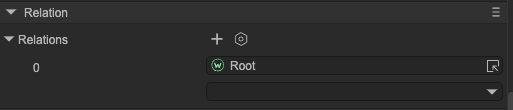
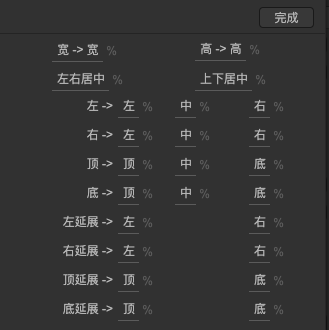
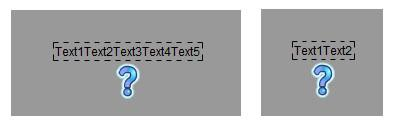
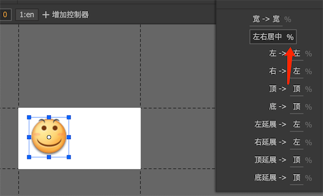
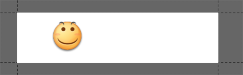

# Relation System

Author: Gu Zhu

The relation system is used to implement relative layouts between UI nodes. Unlike other UI frameworks that generally only allow defining relationships between a node and its parent, this system allows defining relationships between **any two nodes** with more interactive options.

---

## 1. Editor Operations

The properties for setting relations are shown in Figure 1-1:

  
(Figure 1-1)  

Select the target node in the first input box, then click the second input box to open the interface shown in Figure 1-2. Here you can enable or disable relations with the target node:

  
(Figure 1-2)  

---

### 1.1 Relation Types

For explanation, assume the node being adjusted is **A**, and the target node is **T**:

* **Left->Left** – Keeps the left-side distance X between T and A constant when T’s left position changes. Note: Left->Left with a container component has no effect since moving the container moves all internal nodes without changing their relative positions.

* **Left->Center** – Keeps the distance X between T’s center and A’s left side constant. The center of T can move either because T moves or its width changes.

  * Example: If a text automatically resizes and an icon is set with Left->Center relation to the text, the icon stays centered relative to the text even as the text size changes (Figure 1-3).

  
(Figure 1-3)  

> Note: Relations only take effect when the target node moves or resizes. Setting Left->Center does **not** automatically center the node; the initial position must be set manually.

* **Left->Right** – Keeps the distance X between T’s right side and A’s left side constant. This is useful in complex layouts.

* **Center->Center** – Keeps the distance X between T’s center and A’s center constant.

* **Right->Left**, **Right->Center**, **Right->Right** – Similar to the above but aligned from the right side. When A’s width changes, A may automatically move to maintain the distance X.

* **Left Extend->Left** – When T’s left side moves, A’s left side moves too, but its right side remains fixed, effectively stretching A.

* **Left Extend->Right**, **Right Extend->Left**, **Right Extend->Right** – Variants for stretching relative to different sides. Right Extend->Right is commonly used for automatic container expansion.

  * Example: A container with Right Extend->Right relation to a text will expand its width automatically based on the text width. Manual width adjustments on the container have no effect.

* **Width->Width** – Keeps the width difference X between T and A constant. When T’s width changes, A’s width changes accordingly.

  * Example: A background image with Width->Width relation to a container stretches with the container (Figures 1-7 and 1-8).

> Note: The relation system does **not** preserve aspect ratio. To maintain image proportions, use the Loader component with its fill options.

* Vertical relations (Top->Top, Top->Center, Top->Bottom, Center->Center, Bottom->Top, etc.) work similarly to the horizontal ones.

---

### 1.2 Percentage-Based Relations

Relations can maintain **proportional distances** instead of fixed pixel distances. Enable the “%” checkbox when setting up a relation:

* Example: A smiley icon with a Left->Center relation to a container at 25% of the container width (Figure 1-9). When the container width doubles from 200px to 400px, the icon moves proportionally to 100px, maintaining the 1/4 relative distance (Figure 1-10).

  
(Figure 1-9)  

  
(Figure 1-10)  

---

### 1.3 Common API

Relations can also be dynamically added or removed at runtime:

```typescript
aWidget.addRelation(bWidget, Laya.RelationType.Size);

aWidget.removeRelation(bWidget, Laya.RelationType.Size);
```
