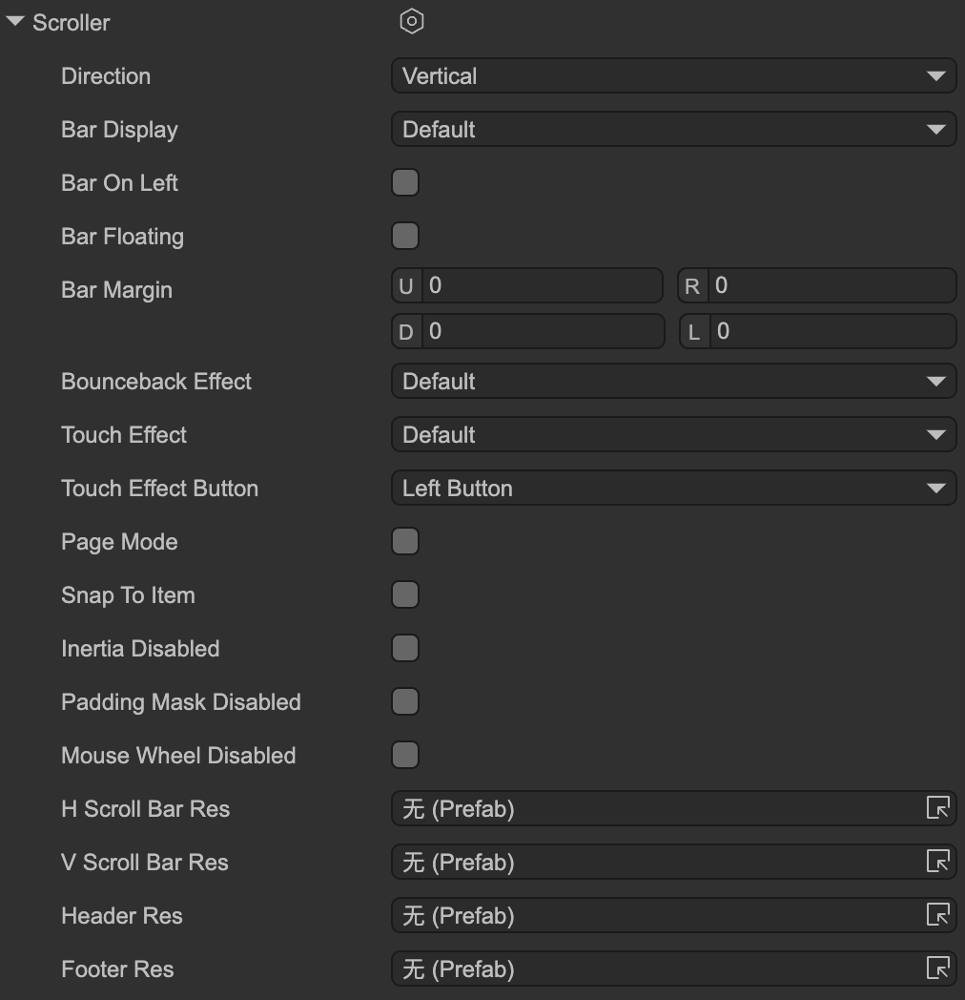

# Scroll Support

Author: Gu Zhu

Scroll support can be enabled for `GPanel` and its derived classes. This feature is called **Scroller**. Note that **Scroller** and **ScrollBar** are different concepts. A Scroller can automatically add scroll bars to a container, hide them, or not add them at all. Whether scroll bars are visible does not affect the scroll functionality.

---

## 1. Editor Operations

  

* **Direction** – Scroll direction:

  * `Vertical` – Vertical scroll.
  * `Horizontal` – Horizontal scroll.
  * `Both` – Both vertical and horizontal.

* **Bar Display** – Scroll bar visibility options:

  * `Default` – Use the default value (`UIConfig2.defaultScrollBarDisplay`).
  * `Always` – Always show the scroll bar.
  * `OnOverflow` – Show scroll bar only when content exceeds viewport.
  * `OnScroll` – Show scroll bar only when scrolling occurs.
  * `OnOverflowAndScroll` – Show scroll bar only when content overflows **and** scrolling occurs.
  * `Hidden` – Always hide.

* **Bar On Left** – Whether the scroll bar appears on the left side.

* **Bar Floating** – When enabled, the scroll bar does not occupy space in the viewport and floats above it. Useful for mobile thin, semi-transparent scroll bars that appear only during scrolling.

* **Bar Margin** – Offset of the scroll bar relative to its normal position.

* **Bounceback Effect** – Whether content can move past the edge of the viewport and snap back. Common on mobile platforms.

  * `Default` – Use `UIConfig2.defaultScrollBounceEffect`.
  * `On` – Enable bounce effect.
  * `Off` – Disable bounce effect.

* **Touch Effect** – Enables drag-to-scroll behavior on touch devices. Generally used on mobile; less common on PC.

  * `Default` – Use `UIConfig2.defaultScrollTouchEffect`.
  * `On` – Enable touch scroll.
  * `Off` – Disable touch scroll.

* **Touch Effect Button** – If `Touch Effect` is enabled, select which mouse button it applies to.

* **Page Mode** – Scrolls by viewport-sized pages rather than pixels. Common on mobile; may conflict with dragging scroll bars on PC.

* **Snap To Item** – Scroll position automatically snaps to items. After scrolling ends, ensures the viewport aligns with an item’s top (or left) edge.

* **Inertia Disabled** – Disable inertial scrolling. Normally, after dragging and releasing, the scroll continues based on the release velocity and decelerates to zero. Disable this to stop inertial scrolling.

* **Padding Mask Disabled** – Disables clipping of container padding. By default, content outside padding is clipped.

* **Mouse Wheel Disabled** – Disable scrolling with the mouse wheel.

* **H ScrollBar Res / V ScrollBar Res** – Scroll bar resources. Usually not necessary; set globally in UI system settings. Can be overridden here.

* **Header Res / Footer Res** – Resources for header and footer.

---

## 2. Common API

Common Scroller APIs include:

* **viewWidth / viewHeight** – Viewport width and height.
* **contentWidth / contentHeight** – Content width and height.
* **percX / percY / setPercX / setPercY** – Get or set scroll position as a percentage (0-1). The `set` methods allow easing.
* **posX / posY / setPosX / setPosY** – Get or set scroll position in pixels. Max scroll distance: vertical = contentHeight – viewHeight, horizontal = contentWidth – viewWidth. Use `set` methods for smooth transitions.
* **pageX / pageY** – For page mode, get or set the current page index. Total pages = contentWidth/viewWidth or contentHeight/viewHeight.
* **scrollLeft / scrollRight / scrollUp / scrollDown** – Scroll N * step pixels in the specified direction. Step is used for arrow buttons and mouse wheel (wheel = step * 2). Note: Snap-to-item or page mode may affect behavior.
* **scrollToView** – Scroll to make a specific item visible in the viewport.
* **step** – Defines the distance of one “scroll step.” Used by scroll methods, scroll bar arrows, and mouse wheel.
* **cancelDragging** – Stop or cancel a drag in progress.

You can listen to scroll changes; any change in scroll position will trigger this event:

```typescript
aPanel.scroller.on(Laya.UIEvent.Scroll, () => {});
```
