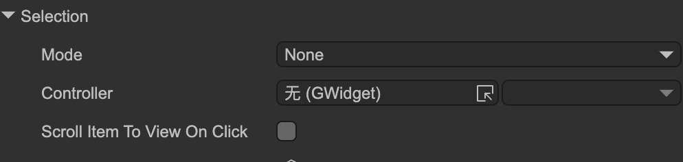

# Selection Support

Author: Gu Zhu

`GPanel` and its derived classes (`GList`, `GTree`) provide **selection** functionality. Child nodes of type `GButton` in **radio mode** participate in this feature.

---

## 1. Editor Operations

  

* **Mode** – Selection mode:
  * `None` – No selection.
  * `Single` – Single selection. Selecting one item will deselect others.
  * `Multiple` – Multiple selection. Use Shift + Left Click or Ctrl + Left Click to select multiple items.
  * `MultipleBySingleClick` – Multiple selection via single clicks. Designed for mobile where Shift/Ctrl are unavailable. Click once to select, click again to deselect.
  * `Disabled` – Disables selection. Clicking buttons will have no selection effect.
  
* **Controller** – A controller can be linked to the selection. When the selection changes, the controller jumps to the corresponding page. Conversely, when the controller jumps to a page, the corresponding item in the selection is also selected.

* **Scroll Item To View On Click** – When enabled, clicking a partially visible child node automatically scrolls the container so the item is fully visible.

---

## 2. Common API

Common selection operations include add, remove, clear, and query:

```typescript
// Select the 10th child
aPanel.selection.add(10);

// Deselect the 10th child
aPanel.selection.remove(10);

// Clear all selections
aPanel.selection.clear();

// In single-selection mode, get the index of the currently selected child
let selectedIndex = aPanel.selection.index;

// In multi-selection mode, get all selected child indices
let indices = aPanel.selection.get();
```
