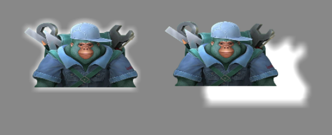

# Post-Processing

## 1. Overview

Post-processing is mainly used to implement various special visual effects, allowing images to achieve the best artistic quality. With post-processing, you can use a single art asset to achieve different visual styles. The engine supports four 2D post-processing effects: color adjustment, grayscale, blur, and glow.

### 1.1 Creating a Post-Processing Effect

Select a node, create a post-processing instance, and then add post-processing effects to the effect list. Once created, the effect will be visible:


The **Enabled** property on the post-processing instance determines whether the effect is active. This property applies to all effects and is enabled by default:


### 1.2 Adding Multiple Effects

You can add multiple post-processing effects to a single node, and the same effect can be added multiple times. These effects stack and are applied simultaneously:


## 2. Color Adjustment Effect

`ColorEffect2D` is a color adjustment effect. By modifying its parameters, it can change the visual style without altering the main structure of the image. It does not deform the node but adjusts brightness, contrast, saturation, and hue. Proper use of this effect can also correct abnormal exposure issues.

### 2.1 Basic Properties

The color adjustment effect has the following properties:


* **Enabled**: Toggle the effect on or off.
* **Color**: Adjusts the overall color tone of the image.
* **Brightness**: Controls the lightness or darkness of the image.
* **Contrast**: Adjusts the intensity of differences between light and dark areas.
* **Saturation**: Controls the vividness of colors.
* **Hue**: Changes the color’s position on the color wheel.

### 2.2 Code Example

You can also create a color effect via code:

```typescript
const { regClass, property } = Laya;

@regClass()
export class Script extends Laya.Script {
    @property(Laya.Sprite)
    public sp: Laya.Sprite;

    onAwake(): void {
        // Create post-processing instance
        this.sp.postProcess = new Laya.PostProcess2D();

        // Create color effect
        let colorEffect2D = new Laya.ColorEffect2D();

        // Add effect to effect array
        let effectGroup: Laya.PostProcess2DEffect[] = [];
        effectGroup.push(colorEffect2D);

        // Assign effect array to node
        this.sp.postProcess.effects = effectGroup;

        // Set properties
        colorEffect2D.color(0.5, 0.5, 0.5, 1);
        colorEffect2D.adjustBrightness(30);
        colorEffect2D.adjustContrast(8);
        colorEffect2D.adjustSaturation(30);
        colorEffect2D.adjustHue(-15);
    }
}
```

## 3. Grayscale Effect

The grayscale effect is a special case of the color effect. Developers don’t need to set individual parameters; the engine handles it automatically. It is commonly used to indicate a disabled state. When a UI component enables “grayed out” or disables mouse events, the engine automatically applies the grayscale effect.

### 3.1 Basic Properties

In the IDE, the grayscale effect has only one configurable property: **Enabled**:


### 3.2 Code Example

```typescript
const { regClass, property } = Laya;

@regClass()
export class Script extends Laya.Script {
    @property(Laya.Sprite)
    public sp: Laya.Sprite;

    onAwake(): void {
        this.sp.postProcess = new Laya.PostProcess2D();
        let grayEffect2D = new Laya.GrayscaleEffect2D();

        let effectGroup: Laya.PostProcess2DEffect[] = [];
        effectGroup.push(grayEffect2D);

        this.sp.postProcess.effects = effectGroup;
    }
}
```

## 4. Blur Effect

Blur is a common image processing technique that reduces details and noise to create a soft or hazy effect.

### 4.1 Basic Properties

The blur effect has two main properties:


* **Enabled**: Toggle the effect on or off.
* **Strength**: Controls the intensity of the blur. Higher values make the image less sharp.

### 4.2 Code Example

```typescript
const { regClass, property } = Laya;

@regClass()
export class Script extends Laya.Script {
    @property(Laya.Sprite)
    public sp: Laya.Sprite;

    onAwake(): void {
        this.sp.postProcess = new Laya.PostProcess2D();
        let blurEffect2D = new Laya.BlurEffect2D();

        let effectGroup: Laya.PostProcess2DEffect[] = [];
        effectGroup.push(blurEffect2D);

        this.sp.postProcess.effects = effectGroup;

        // Set blur strength
        blurEffect2D.strength = 10;
    }
}
```

## 5. Glow Effect

Glow adds a halo effect to a node, creating a ring of light around it.

### 5.1 Basic Properties

The glow effect has the following properties:


* **Enabled**: Toggle the effect on or off.
* **Offset**: The offset of the glow relative to the node. Below shows the difference with and without offset:



* **Blur**: Determines the softness of the glow edges. Higher values produce more blurred edges.
* **Color**: The glow color. Combined with offset, you can create shadow-like effects:


### 5.2 Code Example

```typescript
const { regClass, property } = Laya;

@regClass()
export class Script extends Laya.Script {
    @property(Laya.Sprite)
    public sp: Laya.Sprite;

    onAwake(): void {
        this.sp.postProcess = new Laya.PostProcess2D();
        let glowEffect2D = new Laya.GlowEffect2D();

        let effectGroup: Laya.PostProcess2DEffect[] = [];
        effectGroup.push(glowEffect2D);

        this.sp.postProcess.effects = effectGroup;

        // Set properties
        glowEffect2D.offsetX = 10;
        glowEffect2D.offsetY = 10;
        glowEffect2D.blur = 5;
        glowEffect2D.color = "#33ff00ff";
    }
}
```
