# Drawing Graphics

## 1. Drawing Graphics in IDE

In LayaAir, you can use the Graphics component on a `Sprite` object to draw various graphics, as shown in Animation 1-1.

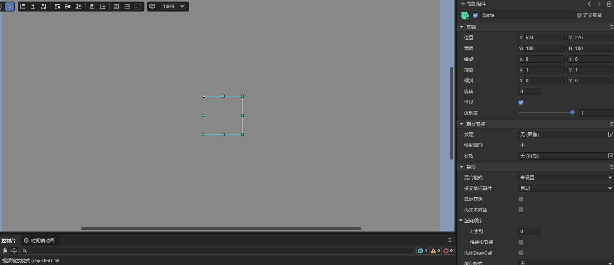  

(Animation 1-1)

In the IDE, you can use these options to draw Graphics, as shown in Figure 1-2.

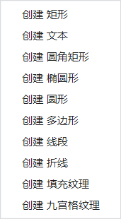

(Figure 1-2)

In the LayaAir engine, the `laya.display.Graphics` class provides various vector drawing methods in its API:

* `drawRect`
* `fillText`
* `drawPath`
* `drawCircle`
* `drawPie`
* `drawLine`
* `drawLines`
* `drawPoly`
* `drawCurves`
* ...

Below, we will explain these Graphics methods in detail.

## 2. Drawing Rectangles and Rounded Rectangles

### 2.1 Drawing Rectangles in IDE

In the Graphics component of a `Sprite` object, you can click `+` to create a drawing command. Select the first option, `Create Rectangle (DrawRectCmd)`. After creation, it looks like Figure 2-1.

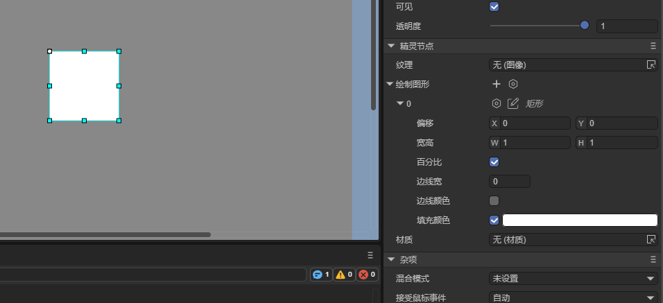  

(Figure 2-1)

* **Offset:** The rectangle’s offset relative to the Sprite object on the X and Y axes.
* **Size:** The size of the rectangle. By default, it uses percentage values, but you can uncheck Percent to use pixels.
* **Percent:** When checked, the rectangle’s size is a percentage of the Sprite object’s size; when unchecked, it uses pixels.
* **Line Width:** The width of the rectangle’s border.
* **Line Color:** The color of the rectangle’s border.
* **Fill Color:** The fill color of the rectangle.

Animation 2-2 demonstrates how to use these properties:

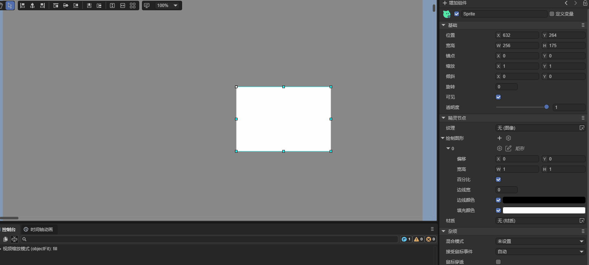  

(Animation 2-2)

### 2.2 Drawing Rectangles with Code

In LayaAir, the `drawRect()` method is used to draw vector rectangles. Its detailed description is as follows:

```typescript
/**
 * Draw a rectangle.
 * @param x         Starting X position.
 * @param y         Starting Y position.
 * @param width     Rectangle width.
 * @param height    Rectangle height.
 * @param fillColor Fill color or gradient object.
 * @param lineColor (Optional) Border color or gradient object.
 * @param lineWidth (Optional) Border width.
 * @param percent   Whether position and size are percentage values.
 */
drawRect(x: number, y: number, width: number, height: number, fillColor: any, lineColor: any = null, lineWidth: number = 1, percent?: boolean): DrawRectCmd {
    return this.addCmd(DrawRectCmd.create(x, y, width, height, fillColor, lineColor, lineWidth, percent));
}
```

Example:

```typescript
let sp = new Laya.Sprite();
// Draw rectangle
sp.graphics.drawRect(20, 20, 100, 50, "#ffff00", "#00ff00", 5, false);
this.owner.addChild(sp);
```

In this example, `20,20` is the starting coordinate of the rectangle. `100` is the width to the right (negative for left), and `50` is the height downward (negative for upward).

Effect:

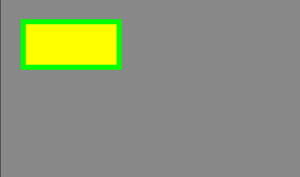  

(Figure 2-3)

### 2.3 Drawing Rectangles with drawPath

The `drawPath()` method of the `laya.display.Graphics` class can draw vector graphics based on a path:

```typescript
/**
 * Draw a path.
 * @param x      Starting X position.
 * @param y      Starting Y position.
 * @param paths  Path array, supports [["moveTo",x,y],["lineTo",x,y],["arcTo",x1,y1,x2,y2,r],["closePath"]].
 * @param brush  (Optional) Brush settings, e.g., {fillStyle:"#FF0000"}.
 * @param pen    (Optional) Pen settings, e.g., {strokeStyle,lineWidth,lineJoin,lineCap,miterLimit}.
 */
drawPath(x: number, y: number, paths: any[], brush: any = null, pen: any = null): DrawPathCmd {
    return this.addCmd(DrawPathCmd.create(x, y, paths, brush, pen));
}
```

Example:

```typescript
let sp = new Laya.Sprite();
// Custom path
let path:Array<any> =  [
  ["moveTo", 0, 0], // Move pen to point A
  ["lineTo", 100, 0], // Draw to point B
  ["lineTo", 100, 50], // Draw to point C
  ["lineTo", 0, 50],  // Draw to point D
  ["closePath"]        // Close path
];
// Draw rectangle
sp.graphics.drawPath(20, 20, path, {fillStyle: "#ff0000"});
this.owner.addChild(sp);
```

The first two coordinates `20,20` control the starting position, and the third parameter defines the path. `moveTo` moves the pen without drawing, `lineTo` draws a line to the specified point, and `closePath` closes the path.

Compared to `drawRect`, using `drawPath` for rectangles is less convenient, but it helps understand the parameters.

Effect (points A, B, C, D are shown for explanation purposes only):

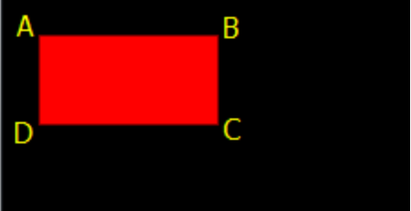  

(Figure 2-4)

### 2.4 Drawing Rounded Rectangles in IDE

In the Graphics component of a `Sprite` object, click `+` and select `Create Rounded Rectangle (DrawRoundRectCmd)`. The interface looks like Figure 2-5.

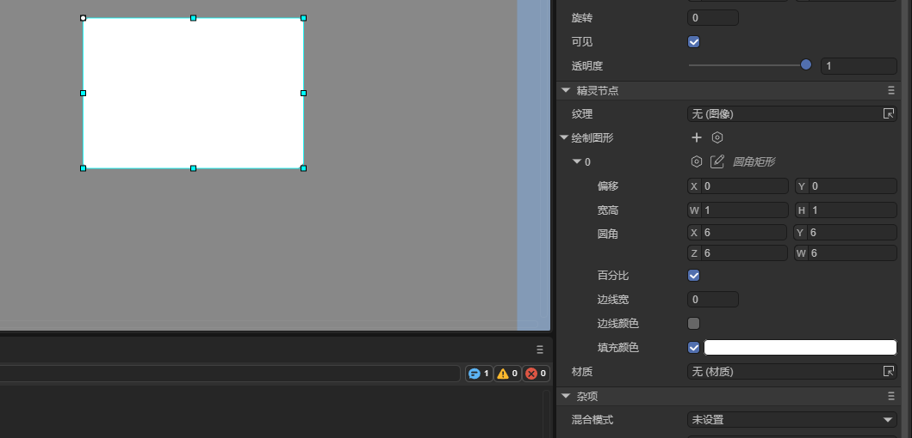  

(Figure 2-5)

* **Offset:** Rounded rectangle offset relative to the Sprite object on X and Y axes.
* **Size:** Rounded rectangle size, default percentage; uncheck Percent to use pixels.
* **Border Radius:** Corner radii. X: top-left, Y: top-right, Z: bottom-left, W: bottom-right.
* **Percent:** Use percentage or pixel values.
* **Line Width:** Border width.
* **Line Color:** Border color.
* **Fill Color:** Fill color.

### 2.5 Drawing Rounded Rectangles with Code

The `drawRoundRect()` method draws rounded rectangles:

```typescript
/**
 * Draw a rounded rectangle
 * @param x         Starting X position.
 * @param y         Starting Y position.
 * @param width     Rectangle width.
 * @param height    Rectangle height.
 * @param lt        Top-left radius
 * @param rt        Top-right radius
 * @param lb        Bottom-left radius
 * @param rb        Bottom-right radius
 * @param fillColor Fill color or gradient object
 * @param lineColor (Optional) Border color
 * @param lineWidth (Optional) Border width
 * @param percent   (Optional) Use percentage for position and size
 */
drawRoundRect(x: number, y: number, width: number, height: number, lt: number, rt: number, lb: number, rb: number, fillColor: any, lineColor: any = null, lineWidth: number = 1, percent?: boolean) {
    return this.addCmd(DrawRoundRectCmd.create(x, y, width, height, lt, rt, lb, rb, fillColor, lineColor, lineWidth, percent));
}
```

Example:

```typescript
let sp = new Laya.Sprite();
sp.graphics.drawRoundRect(200, 200, 300, 300, 20, 20, 20, 20, "#ffff00", "#00ff00", 5, false);
this.owner.addChild(sp);
```

Effect:

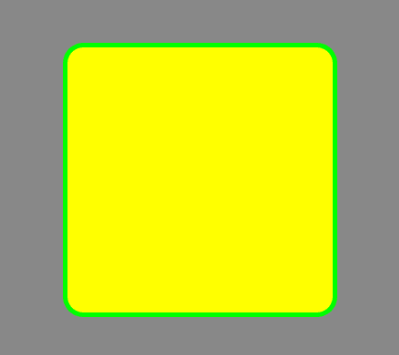  

(Figure 2-6)

### 2.6 Drawing Rounded Rectangles with drawPath

You can also use `drawPath` to draw rounded rectangles or arcs. The steps:

1. Set the starting point: `["moveTo", x, y]`
2. Draw a straight line: `["lineTo", x, y]`
3. Draw an arc: `["arcTo", p1.x, p1.y, p2.x, p2.y, r]`

#### Example Parameters

```
["moveTo", 50, 50], ["lineTo", 150, 50], ["arcTo", 200, 50, 200, 100, 50]
```

Effect shown in Figure 2-7:

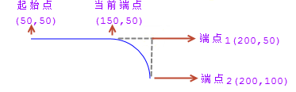

* `["moveTo",50,50]` sets the pen start.
* `["lineTo",150,50]` draws a straight line to (150,50).
* `["arcTo",200,50,200,100,50]` draws an arc of radius 50 using points (150,50), (200,50), (200,100).

#### Rounded Rectangle Example

```typescript
let sp = new Laya.Sprite();
var path:any[] =  [
    ["
```


moveTo", 0, 0],
["lineTo",400,0],
["arcTo", 500, 0, 500, 30, 30],
["lineTo",500,200],
["arcTo", 500, 300, 470, 300, 30],
["lineTo",30,300],
["arcTo", 0, 300, 0, 270, 30],
["lineTo",0,100],
["arcTo", 0, 0, 30, 0, 30],
];
sp.graphics.drawPath(100, 100, path, {fillStyle: "#ff0000"});
this.owner.addChild(sp);

````

Effect:  

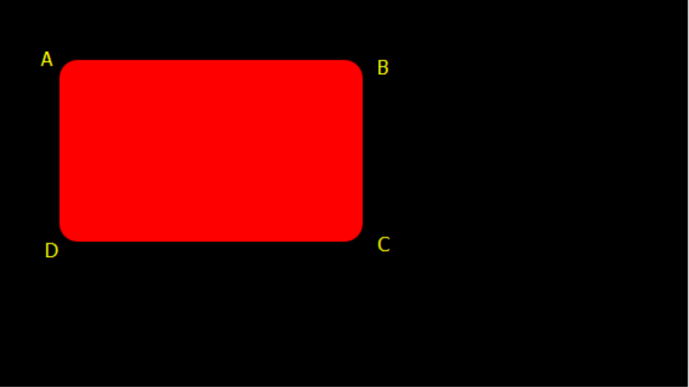  

Corrected path for border display:  

```typescript
sp.graphics.drawPath(100, 100, path, {fillStyle: "#ff0000"},{"strokeStyle":"#ffffff","lineWidth":"10"});
````

Effect:

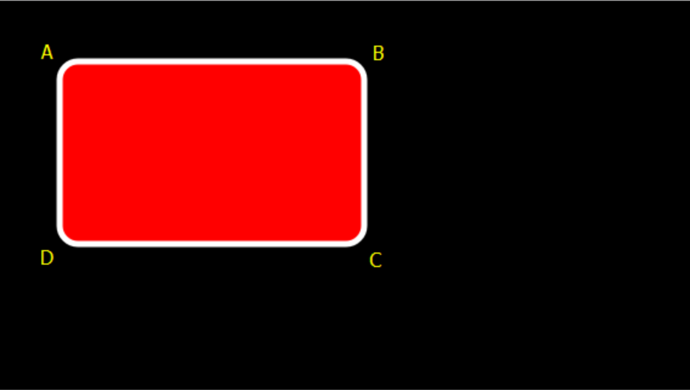  

(Figure 2-10)

## 3. Drawing Circles, Ellipses, and Pie Sectors

### 3.1 Drawing Circles in IDE

In the Graphics component, click `+` and select `Create Circle (DrawCircleCmd)`.

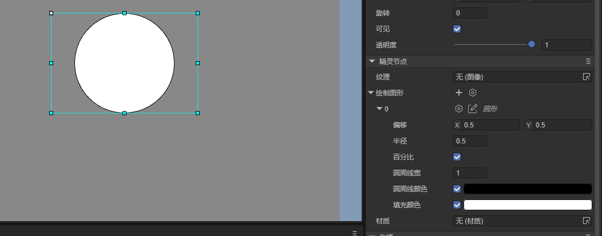  

(Figure 3-1)

* **Offset:** Circle offset relative to the Sprite object.
* **Radius:** Circle radius.
* **Percent:** Use percentage or pixel values.
* **Line Width:** Circle line width.
* **Line Color:** Circle line color.
* **Fill Color:** Circle fill color.

### 3.2 Drawing Circles with Code

```typescript
let sp = new Laya.Sprite();
sp.graphics.drawCircle(80,80,50,"#ff0000");
this.owner.addChild(sp);
```

Effect:

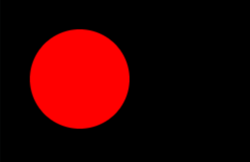  

(Figure 3-2)

### 3.3 Drawing Ellipses in IDE

Click `+` and select `Create Ellipse (DrawEllipseCmd)`.

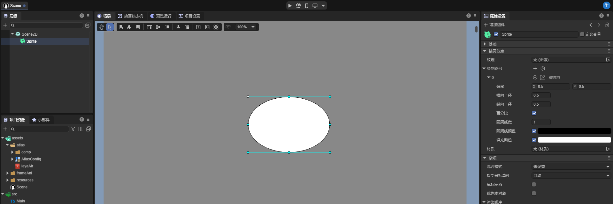  

(Figure 3-3)

* **Offset:** Ellipse offset.
* **Width/Height:** Horizontal and vertical radius.
* **Percent:** Use percentage or pixel values.
* **Line Width:** Ellipse line width.
* **Line Color:** Ellipse line color.
* **Fill Color:** Ellipse fill color.

### 3.4 Drawing Ellipses with Code

```typescript
let sp = new Laya.Sprite();
sp.graphics.drawEllipse(200, 200, 50, 100, "#ff0000", "#ffffff", 5);
this.owner.addChild(sp);
```

Effect:

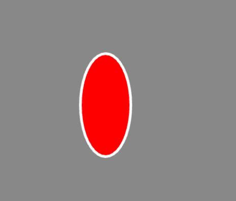  

(Figure 3-4)

### 3.5 Drawing Pie Sectors with Code

```typescript
let sp = new Laya.Sprite();
sp.graphics.drawPie(80, 80, 50, 90, 180, "#ff0000");
this.owner.addChild(sp);
```

Effect:

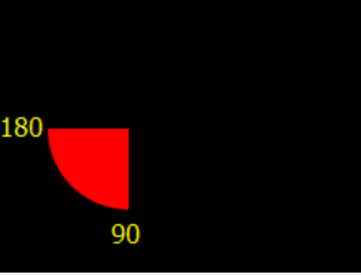  

(Figure 3-5)

## 4. Drawing Triangles, Polygons, and Data-Based Shapes

### 4.1 Drawing Triangles/Polygons in IDE

Click `+` and select `Create Polygon (DrawPolyCmd)`.

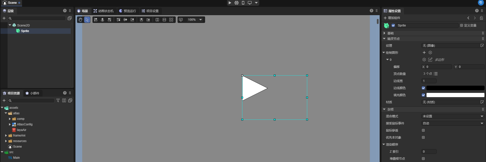  

(Figure 4-1)

* **Offset:** Polygon offset.
* **Points:** Collection of polygon points (triangle = 3 points).
* **Line Width:** Border width.
* **Line Color:** Border color.
* **Fill Color:** Fill color.

Animation 4-2 shows creating a polygon:

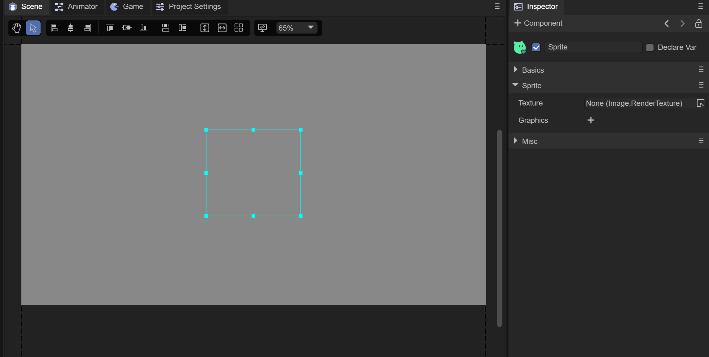  

(Animation 4-2)

### 4.2 Drawing Triangles with Code

```typescript
let sp = new Laya.Sprite();
sp.graphics.drawPoly(30, 28, [0, 100, 50, 0, 100, 100], "#ffff00");
this.owner.addChild(sp);
```

Effect:

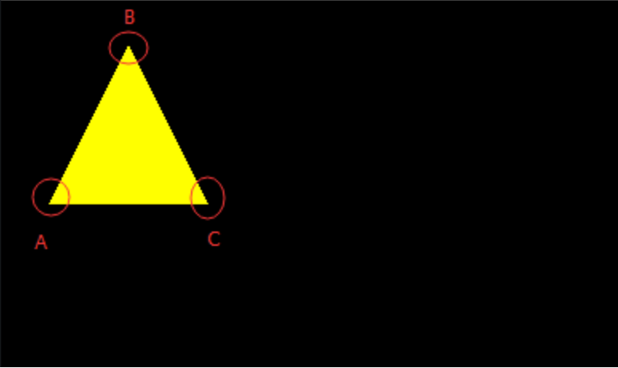  

(Figure 4-3)

Coordinates are relative to the first two parameters `30,28`. Changing these shifts the whole shape.

### 4.3 Drawing Polygons with Code

```typescript
let sp = new Laya.Sprite();
sp.graphics.drawPoly(30, 28, [0, 100, 50, 0, 100, 100, 75, 150, 25, 150], "#ffff00");
this.owner.addChild(sp);
```

Effect:

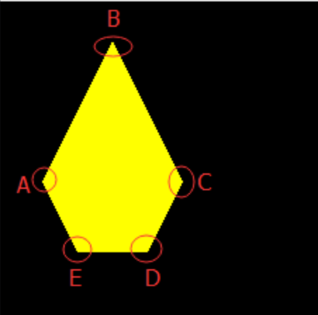  

(Figure 4-4)

### 4.4 Drawing Shapes Based on Path Data

Example: Drawing a five-pointed star:

```typescript
let sp = new Laya.Sprite();
var path: Array<number> = [];
path.push(0, -130);  // A
path.push(33, -33);  // B
path.push(137, -30); // C
path.push(55, 32);   // D
path.push(85, 130);  // E
path.push(0, 73);    // F
path.push(-85, 130); // G
path.push(-55, 32);  // H
path.push(-137, -30);// I
path.push(-33, -33); // J
sp.graphics.drawPoly(Laya.stage.width / 2, Laya.stage.height / 2, path, "#FF7F50");
this.owner.addChild(sp);
```

Effect:

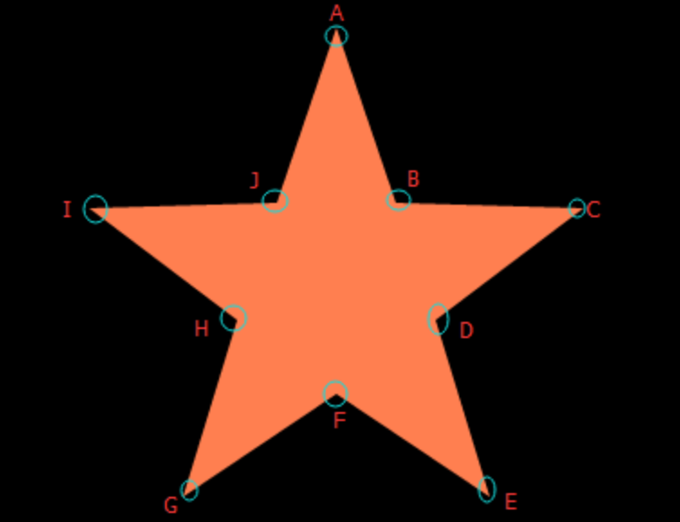  

(Figure 4-5)

This approach improves code readability and can also be applied to triangles or other polygons for more flexible use.


## 5. Drawing Lines and Polylines

### 5.1 Drawing Lines in IDE

In the `Graphics` component of a `Sprite` object, you can click `+` to create a drawing command. Select **Create Line (DrawLineCmd)** to draw a line. After creation, it looks like Figure 5-1:

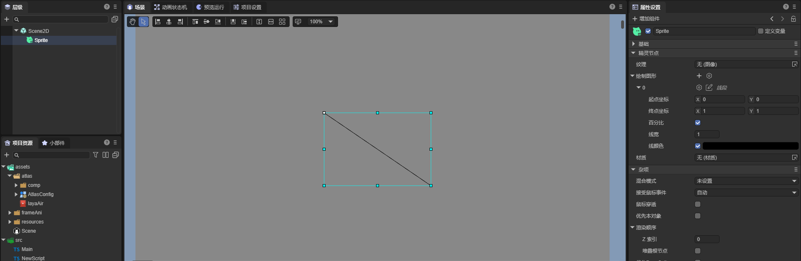

(Figure 5-1)

* **From**: The starting point of the line, relative to the Sprite object, X and Y offsets.
* **To**: The end point of the line, relative to the Sprite object, X and Y offsets.
* **Percent**: If checked, the start and end points are percentages of the Sprite object’s size; if unchecked, they are pixel values.
* **Line Width**: The width of the line.
* **Line Color**: The color of the line.

---

### 5.2 Drawing Lines with Code

In LayaAir, the `drawLine()` method of `laya.display.Graphics` is used to draw lines. Its API is as follows:

```typescript
/**
 * Draw a line.
 * @param fromX   X-axis start position.
 * @param fromY   Y-axis start position.
 * @param toX     X-axis end position.
 * @param toY     Y-axis end position.
 * @param lineColor Line color.
 * @param lineWidth (Optional) Line width.
 */
drawLine(fromX: number, fromY: number, toX: number, toY: number, lineColor: string, lineWidth: number = 1): DrawLineCmd {
    return this.addCmd(DrawLineCmd.create(fromX, fromY, toX, toY, lineColor, lineWidth));
}
```

Example:

```typescript
let sp = new Laya.Sprite();
// Draw a straight line
sp.graphics.drawLine(10, 58, 146, 58, "#ff0000", 3);
this.owner.addChild(sp);
```

Effect:

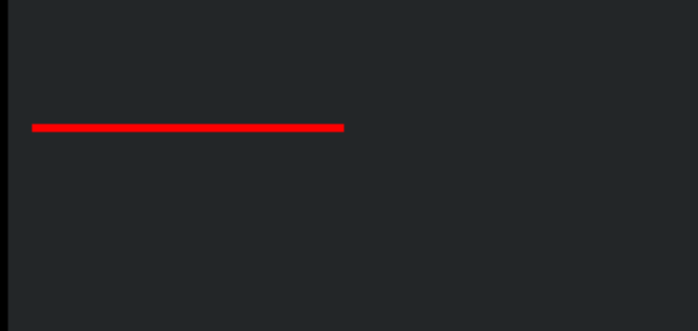

(Figure 5-2)

---

### 5.3 Drawing Polylines in IDE

In the `Graphics` component, click `+` and select **Create Polyline (DrawLinesCmd)** to draw a polyline. After creation, it looks like Figure 5-3:

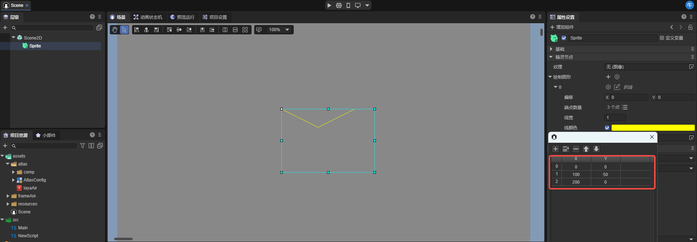

(Figure 5-3)

* **Offset**: Offset of the line relative to the Sprite object (X and Y in pixels).
* **Points**: Array of line points.
* **Line Width**: Line width.
* **Line Color**: Line color.

---

### 5.4 Drawing Polylines with Code

The `drawLines()` method in `laya.display.Graphics` draws polylines. Note the “s” at the end of `drawLines`—don’t forget it. API details:

```typescript
/**
 * Draw a series of lines (polyline).
 * @param x        X-axis start position.
 * @param y        Y-axis start position.
 * @param points   Array of points: [x1, y1, x2, y2, x3, y3...].
 * @param lineColor Line color or gradient object.
 * @param lineWidth (Optional) Line width.
 */
drawLines(x: number, y: number, points: any[], lineColor: any, lineWidth: number = 1): DrawLinesCmd | null {
    if (!points || points.length < 4) return null;
    return this.addCmd(DrawLinesCmd.create(x, y, points, lineColor, lineWidth));
}
```

Example:

```typescript
let sp = new Laya.Sprite();
// Draw a polyline
sp.graphics.drawLines(20, 88, [0, 0, 39, -50, 78, 0, 120, -50], "#ff0000", 3);
this.owner.addChild(sp);
```

Effect:

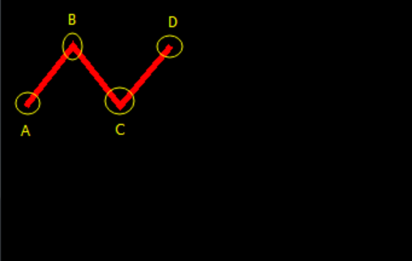

(Figure 5-4)

**Note:** The third parameter, `points`, is a relative coordinate array. `[0,0]` is the first point, `[39,-50]` is the second, `[78,0]` the third, and `[120,-50]` the last. All points are relative to the first two parameters (`x=20, y=88`). Changing `20,88` moves the entire polyline.

---

## 6. Drawing Curves

Curves are more complex than straight lines due to coordinate relationships. LayaAir draws Bézier curves, so we first explain Bézier curve basics, then the engine API.

### 6.1 Bézier Curve Basics

Bézier curves are mathematical curves used in 2D graphics. They consist of:

* Start point (anchor)
* End point (anchor)
* Two control points

Adjusting the control points changes the curve shape. Curves can be linear (1st order), quadratic (2nd order), cubic (3rd order), or higher. Vector graphics tools often use these via the pen tool.

#### 6.1.1 Linear Bézier Curve (1st order)

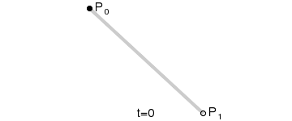

* A simple line from P0 to P1, controlled by parameter t (0 ≤ t ≤ 1).

#### 6.1.2 Quadratic Bézier Curve (2nd order)


* Uses a control point P1 between start P0 and end P2.

#### 6.1.3 Cubic Bézier Curve (3rd order)

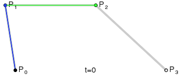

* Uses two control points to define curve shape.

Higher-order Bézier curves exist but are less common.

---

### 6.2 Drawing Quadratic Bézier Curves with Code

LayaAir uses `drawCurves()` for quadratic Bézier curves:

```typescript
/**
 * Draw a series of curves.
 * @param x         X-axis start position.
 * @param y         Y-axis start position.
 * @param points    Control and anchor points: [controlX, controlY, anchorX, anchorY, ...].
 * @param lineColor Line color or gradient.
 * @param lineWidth (Optional) Line width.
 */
drawCurves(x: number, y: number, points: any[], lineColor: any, lineWidth: number = 1): DrawCurvesCmd {
    return this.addCmd(DrawCurvesCmd.create(x, y, points, lineColor, lineWidth));
}
```

Example:

```typescript
let sp = new Laya.Sprite();
// Draw a curve
sp.graphics.drawCurves(10, 58, [0, 0, 19, -100, 39, 0], "#ff0000", 3);
this.owner.addChild(sp);
```

Effect:

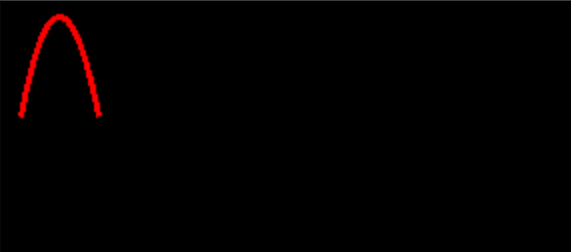

Adding more points makes the curve more complex:

```typescript
sp.graphics.drawCurves(10, 58, [0, 0, 19, -100, 39, 0, 58, 100, 78, 0], "#ff0000", 3);
```

Effect:

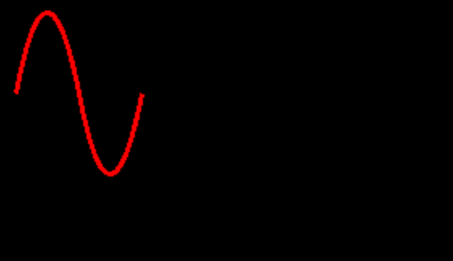

**Note:** Points are relative to `x=10, y=58`. Changing `10,58` moves the entire curve.

---

## 7. Drawing Text

### 7.1 Drawing Text in IDE

In the `Graphics` component, click `+` and select **Create Text (FillTextCmd)**. After creation:

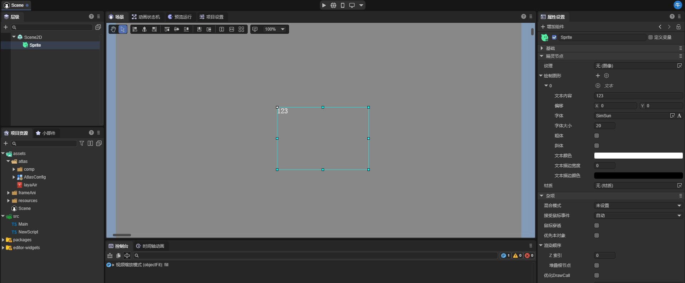

(Figure 7-1)

* **Text**: Displayed text.
* **Offset**: Offset relative to the Sprite origin.
* **Font**: Font family.
* **Font Size**: Font size.
* **Bold/Italic**: Bold or italic style.
* **Fill Color**: Text color.
* **Stroke**: Stroke width (0 = no stroke).
* **Stroke Color**: Stroke color.

---

### 7.2 Drawing Text with Code

```typescript
/**
 * Draw text on canvas.
 * @param text Text content.
 * @param x X-axis position.
 * @param y Y-axis position.
 * @param font Font style, e.g., "20px Arial".
 * @param color Text color, e.g., "#ff0000".
 * @param textAlign Alignment: "left", "center", "right".
 */
fillText(text: string | WordText, x: number, y: number, font: string, color: string, textAlign: string): FillTextCmd {
    return this.addCmd(FillTextCmd.create(text, x, y, font, color, textAlign, 0, ""));
}
```

Example:

```typescript
let sp = new Laya.Sprite();
sp.graphics.fillText("LayaAir", 100, 100, "20px Arial", "#ff0000", "center");
this.owner.addChild(sp);
```

Effect:

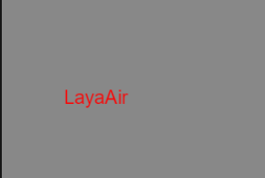

(Figure 7-2)

---

## 8. Drawing Filled Textures

### 8.1 Drawing Filled Textures in IDE

Click `+` in `Graphics` and select **Create Fill Texture (FillTextureCmd)**:

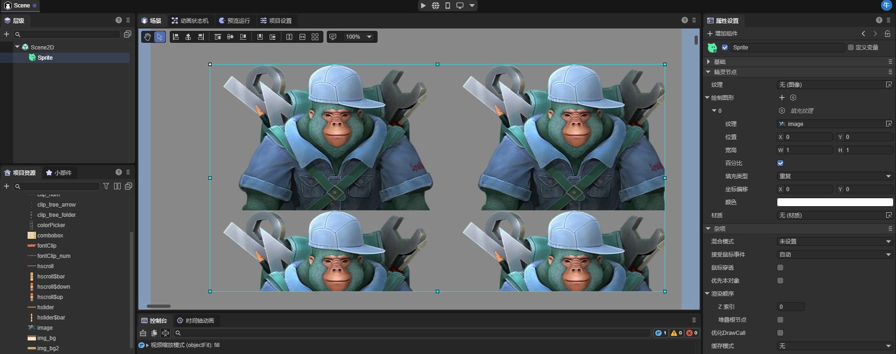

(Figure 8-1)

* **Texture**: Set texture image.
* **Position**: Offset relative to Sprite.
* **Size**: Texture size; can be percent or pixel.
* **Percent**: Use percentage or pixel values.
* **Type**: Repeat type: repeat, repeat-x, repeat-y, no-repeat.
* **Offset**: Texture offset in pixels.
* **Color**: Texture color.

---

### 8.2 Drawing Filled Textures with Code

```typescript
Laya.loader.load("resources/layaAir.png").then((res: Laya.Texture) => {
    let sp = new Laya.Sprite();
    sp.graphics.fillTexture(res, 0, 0, 500, 500, "repeat");
    this.owner.addChild(sp);
});
```

Effect:

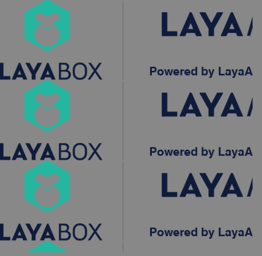

(Figure 8-2)

---

## 9. Drawing 9-Slice Textures

### 9.1 Drawing 9-Slice Textures in IDE

Click `+` in `Graphics` and select **Create 9-Slice Texture (Draw9GridTextureCmd)**:

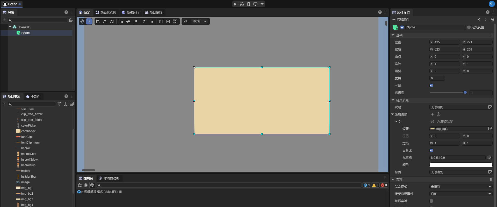

(Figure 9-1)

* **Texture**: Set texture image.
* **Position**: Offset relative to Sprite.
* **Size**: Texture size.
* **Percent**: Percentage or pixel.
* **Size Grid**: Nine-slice scaling grid: top, right, bottom, left, repeat flag.
* **Color**: Texture color.

---

### 9.2 Drawing 9-Slice Textures with Code

```typescript
Laya.loader.load("atlas/comp/image.png").then((res: Laya.Texture) => {
    let sp = new Laya.Sprite();
    sp.graphics.draw9Grid(res, 0, 0, 1024, 626, [0, 0, 0, 0, 1]);
    this.owner.addChild(sp);
});
```

Effect:

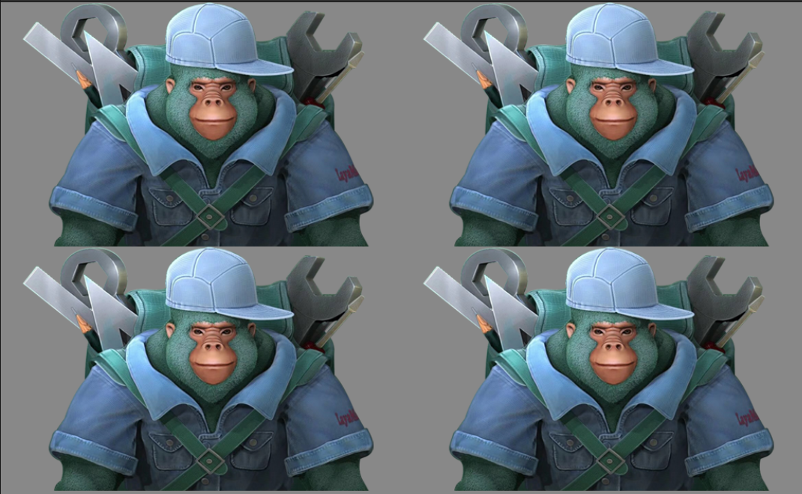

(Figure 9-2)

---

## 10. Anti-Aliasing Vector Graphics

On PC browsers, vector graphics in LayaAir may appear jagged due to performance optimizations. On mobile devices with higher pixel density, this is less noticeable.

To enable smoother lines, set:

```typescript
Laya.Config.isAntialias = true;
```

Or enable it in project settings:

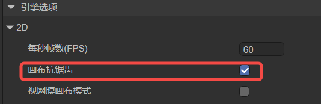

(Figure 10-1)

