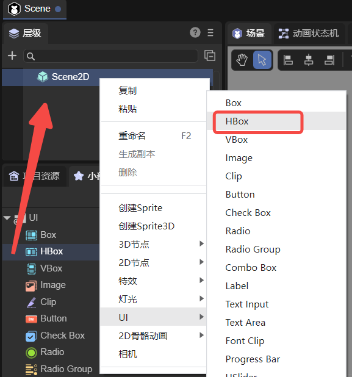
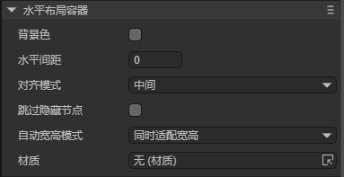
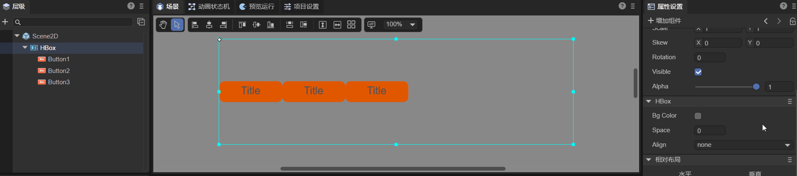
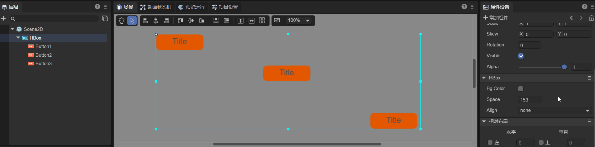
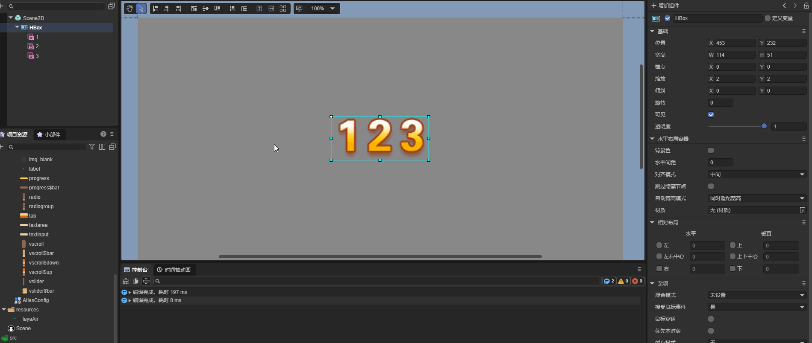
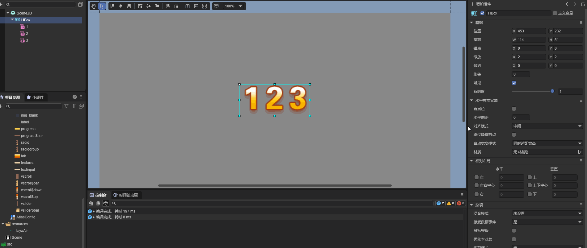
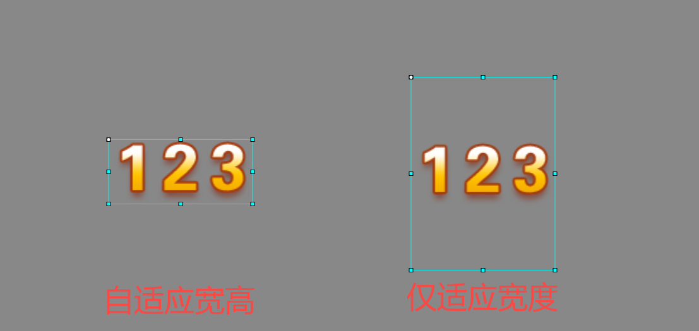

# Horizontal Layout Container Component (HBox)

HBox is essentially a **container-type component**, and like all container components, it inherits from `Box`.
It is commonly used for **horizontal layout** and provides more refined features compared to a standard `Box`.
For detailed property definitions, refer to the [API documentation](https://layaair.com/3.x/api/Chinese/index.html?version=3.0.0&type=2D&category=UI&class=laya.ui.HBox).

---

## 1. Creating an HBox in LayaAir IDE

### 1.1 Creating an HBox

You can visually create an HBox directly in the **Hierarchy Panel** of the IDE, as shown in Figure 1-1.
Right-click in the *Hierarchy* window to create one, or drag it in from the *Widgets* panel.



(Figure 1-1)

---

### 1.2 HBox Properties

The unique properties of the HBox component are shown below:



(Figure 1-2)

| Property         | Description                                                                                                                                                                                                              |
| ---------------- | ------------------------------------------------------------------------------------------------------------------------------------------------------------------------------------------------------------------------ |
| **bgColor**      | Background color. You can input a color value such as `#ffffff`, or select one using the color picker.                                                                                                                   |
| **space**        | The horizontal spacing between child objects, in pixels.                                                                                                                                                                 |
| **align**        | Vertical alignment mode for layout elements. Options are:<br>• `none` – no vertical alignment<br>• `top` – align to top<br>• `middle` – align to center vertically<br>• `bottom` – align to bottom<br>Default is `none`. |
| **skipHidden**   | Defaults to `false`. When enabled, hidden nodes are automatically skipped during layout.                                                                                                                                 |
| **autoSizeMode** | Automatically adjusts width and/or height. Options:<br>• `none` – no auto-sizing<br>• `both` – auto width and height<br>• `width` – auto width only                                                                      |

The `space` property defines the horizontal gap between child elements (in pixels).
You can enter a number directly or drag with the mouse to adjust it.
Assume an HBox contains three Button components — adjusting the `space` property produces the effect shown in Animation 1-3:



(Animation 1-3)

Regardless of how child nodes are positioned in the IDE, once the `align` property is set, they will automatically align vertically according to that setting (Animation 1-4):



(Animation 1-4)

If **Skip Hidden Nodes** is **unchecked**, the layout leaves an empty space for hidden elements (Animation 1-5).
In this example, the “2” bitmap font’s `disabled` property is set to `true`, so an empty slot appears:



(Animation 1-5)

When **Skip Hidden Nodes** is **enabled**, hidden items are ignored during layout (Animation 1-6).
Here, the same “2” element is disabled, but no gap appears:



(Animation 1-6)

Auto-size modes mainly include **width & height auto-fit** and **height-only auto-fit**, as shown in Figure 1-7:



(Figure 1-7)

---

### 1.3 Controlling HBox with Script

In the **Scene2D** properties panel, add a custom script component.
Then, drag the HBox into the exposed property field.
For demonstration purposes, add some child nodes under the HBox.
Example script:

```typescript
const { regClass, property } = Laya;

@regClass()
export class NewScript extends Laya.Script {

    @property({ type: Laya.HBox })
    public hbox: Laya.HBox;

    // Called once when the component is activated
    onAwake(): void {
        this.hbox.pos(100, 100);
        this.hbox.bgColor = "#ffffff";
        this.hbox.space = 100;
        this.hbox.align = "middle";
    }
}
```

---

## 2. Creating an HBox via Code

Sometimes you may need to create UI elements dynamically through code.
The following example creates an `UI_HBox` class that constructs an HBox with three Button components for demonstration.

```typescript
const { regClass, property } = Laya;

@regClass()
export class UI_HBox extends Laya.Script {

    private hbox: Laya.HBox;
    private btn1: Laya.Button;
    private btn2: Laya.Button;
    private btn3: Laya.Button;

    // Button skin resource
    private skins: string = "atlas/comp/button.png";

    // Called once when the component is activated
    onAwake(): void {
        Laya.loader.load(this.skins).then(() => {
            this.createBtn();
            this.createHbox();
            // Add HBox component to the scene
            this.owner.addChild(this.hbox);
        });
    }

    // Create Button components
    private createBtn(): void {
        this.btn1 = new Laya.Button(this.skins);
        this.btn2 = new Laya.Button(this.skins);
        this.btn3 = new Laya.Button(this.skins);
    }

    // Create HBox component
    private createHbox(): void {
        this.hbox = new Laya.HBox();
        this.hbox.pos(100, 100);
        this.hbox.size(600, 300);
        this.hbox.bgColor = "#ffffff";
        this.hbox.addChild(this.btn1);
        this.hbox.addChild(this.btn2);
        this.hbox.addChild(this.btn3);
        this.hbox.space = 100;
        this.hbox.align = "middle";
    }
}
```

This example demonstrates how to programmatically generate an HBox container, add buttons as children, and apply layout configurations dynamically.
