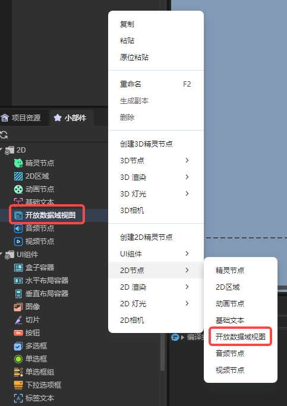
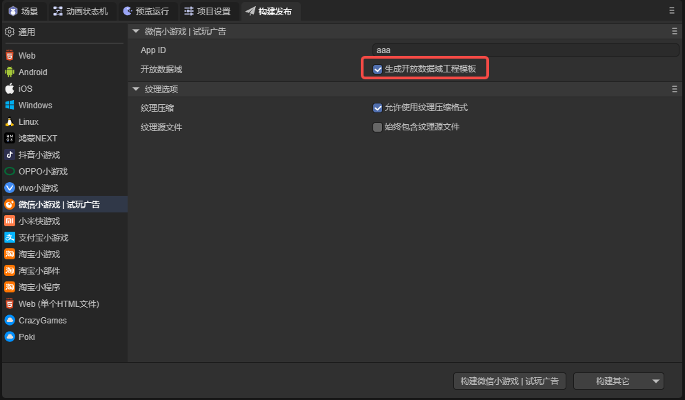
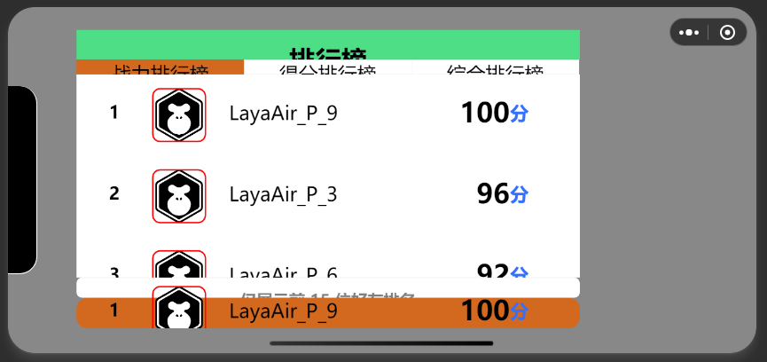
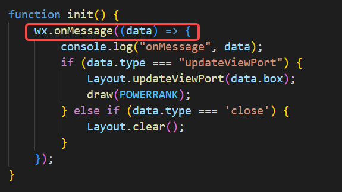
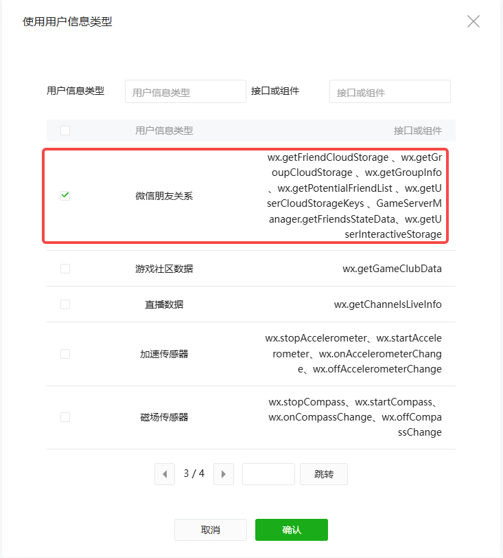
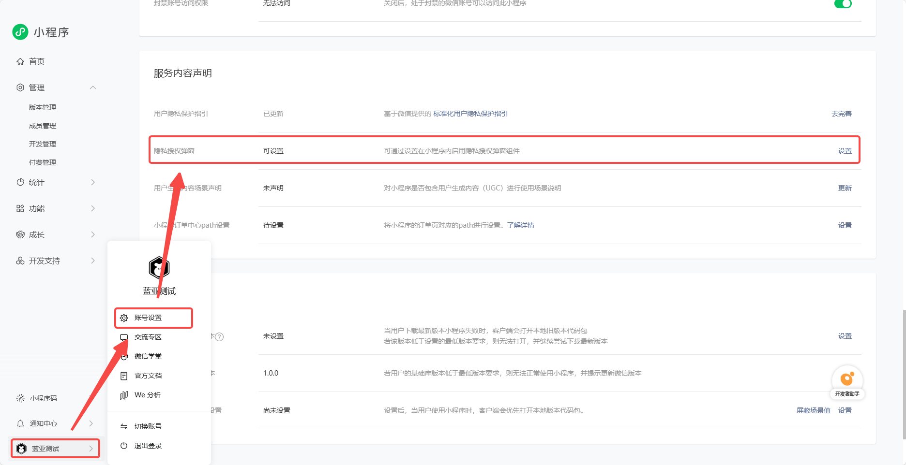
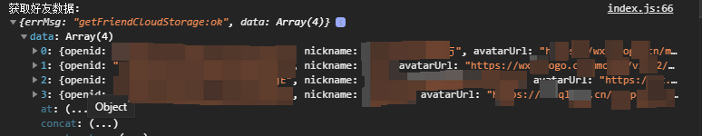

# Open Data Context

## 1. Introduction to Open Data Context

The **Open Data Context** is a closed, independent JavaScript environment. When developing WeChat Mini Games, developers often want to implement social features, such as leaderboards or inviting other players to compete. These features require access to players’ private data. However, for security reasons, WeChat does not provide direct access to such data.


*Figure 1-1: Leaderboard Example*

To address this, WeChat provides the **Open Data Context**, a separate environment where developers can access certain player data and process it. The Open Data Context is isolated from the main game logic (main domain), and communication is **one-way from main domain to Open Data Context**.

Key points developers need to understand to use Open Data Context:

1. **Creating the Open Data Context** – add a view node in the scene, and create an Open Data Context project file in the published Mini Game build.
2. **Communication between main domain and Open Data Context** – send messages and player data from the main domain and handle them in the Open Data Context.
3. **Rendering in the Open Data Context** – use the canvas engine to render data on the sharedCanvas accessible by both main and Open Data Contexts.

---

## 2. Creating an Open Data Context

You can create an Open Data Context node by:

* Right-clicking in the hierarchy panel, or
* Dragging from the widget panel:



You can also create it via script. Add a custom component to a `Scene2D` node with the following code:

```typescript
const { regClass, property } = Laya;

@regClass()
export class NewScript extends Laya.Script {
    constructor() {
        super();
    }

    onAwake(): void {
        let opendata = new Laya.OpenDataContextView();
        Laya.stage.addChild(opendata);
        opendata.pos(100,100);
        opendata.size(500,500);
    }
}
```

After creating the Open Data Context view node, you also need to create an **Open Data Context project file** for WeChat Mini Game development.

* Go to the **Build & Publish** panel, and check **Generate Open Data Context Project Template**. Then build the project:



* In the output folder, the `openDataContext` folder contains the Open Data Context project:


* The template contains a working example you can run in WeChat Developer Tools:



**Notes about the template option:**

1. Checking this option is optional; you can manually create `openDataContext` if desired.
2. If the folder already exists, the engine will not overwrite it.
3. If unchecked, the engine deletes any existing `openDataContext` folder during build; ensure your code is backed up.

---

## 3. Communication between Main Domain and Open Data Context

One main feature of the Open Data Context is building leaderboards. You need to access player scores, avatars, and nicknames, and sometimes control the Open Data Context from the main domain. There are a few ways to communicate:

### 1. `postMessage` and `onMessage`

* **`postMessage`**: sends messages from the main domain to Open Data Context.
* **`onMessage`**: listens for messages in the Open Data Context.

Example: add a component to a `Scene2D` node:

```typescript
const { regClass, property } = Laya;

@regClass()
export class Script extends Laya.Script {
    onAwake(): void {
        //@ts-ignore
        const openDataContext = wx.getOpenDataContext();

        openDataContext.postMessage({
            text: "Message from main domain",
        });
    }
}
```

In the Open Data Context’s `index.js` file, `onMessage` receives messages:




> Note: Messages may print twice because the engine also triggers `postMessage`.

`postMessage` is useful for events requiring immediate updates, e.g., refreshing the leaderboard after a button click.

---

### 2. `setUserCloudStorage` and `getFriendCloudStorage`

These methods store and retrieve user cloud data. Scores generated in-game may be uploaded to the server and retrieved later.

* **Writing data with `setUserCloudStorage`**:

```typescript
const { regClass, property } = Laya;

@regClass()
export class Script extends Laya.Script {
    onAwake(): void {
        let KVDataList = [];
        for (let i = 0; i < 5; i++) {
            KVDataList.push({ key: "test" + i, value: "" + i * 1000 });
        }

        //@ts-ignore
        wx.setUserCloudStorage({
            KVDataList,
            success: () => console.log("Data saved successfully"),
            fail: () => console.log("Failed to save data"),
            complete: () => console.log("Call complete")
        });
    }
}
```

* **Reading data with `getFriendCloudStorage`**:

In `index.js` of the Open Data Context:

```javascript
wx.getUserCloudStorage({
    keyList: ["test1", "test5"],
    success: res => console.log("Data retrieved:", res),
    fail: () => console.log("Failed to retrieve data"),
    complete: () => console.log("Call complete")
});
```

**Important:** To access user data, your Mini Program must obtain user authorization:

* Go to WeChat Mini Program management → Account Settings → Service Content Declaration → User Privacy Protection Guide.
* Add **WeChat Friend Relationship**, complete the declaration, and enable the privacy authorization popup.






After this, you can access data of friends who have played the game.

---

## 4. Rendering in Open Data Context

After retrieving data (e.g., for a leaderboard), you need to render it. Open Data Context renders to a canvas, and you can use standard canvas APIs. To simplify development, using a lightweight canvas engine is recommended.

We will use **[minigame-canvas-engine (Layout)](https://wechat-miniprogram.github.io/minigame-canvas-engine/)**.

* **Layout** uses Web development concepts:

  * `template` → structure of the Open Data Context (like HTML)
  * `style` → layout and styles (like CSS)
  * `JS` → interaction logic

Example `index.js`:

```javascript
const Layout = require("./engine.js").default;
let sharedCanvas = wx.getSharedCanvas();
let sharedContext = sharedCanvas.getContext("2d");

let template = `
  <view id="container">
    <text id="testText" class="redText" value="hello canvas"></text>
  </view>
`;

let style = {
    container: {
        width: 400, height: 200, backgroundColor: "#ffffff",
        justifyContent: "center", alignItems: "center",
    },
    testText: { color: "#ffffff", width: "100%", height: "100%", lineHeight: 200, fontSize: 40, textAlign: "center" },
    redText: { color: "#ff0000" },
};

function init() {
    wx.onMessage((data) => {
        Layout.clear();
        Layout.init(template, style);
        Layout.layout(sharedContext);
    });
}

init();
```

**Layout API:**

* `Layout.updateViewPort` – update canvas viewport info.
* `Layout.clear` – clear canvas and layout tree.
* `Layout.init(template, style)` – initialize layout tree.
* `Layout.layout(context)` – draw layout tree to canvas.

`template` is XML-like. `style` is key-value for layout properties. Learn more in the [Layout documentation](https://wechat-miniprogram.github.io/minigame-canvas-engine/components/overview.html).

---

### 1. Template Engine

A template engine combines data with pre-defined templates to generate text (HTML/XML). This separates data from presentation logic.

Example using **doT.js**:

```javascript
function tplFunc(it) {
  var out = '<view id="container"><text id="testText" class="redText" value="' + it.title + '"></text></view>';
  return out;
}

const it = { title: 'hello canvas' };
let template = tplFunc(it);
console.log(template);
```

Template engines support conditions, loops, and interpolation. Any engine that generates valid XML strings is fine.

For Open Data Context, developers should understand Web front-end basics, CSS, and **Flex layout**, since Layout only supports Flex.

* [CSS Tutorial](https://www.runoob.com/css/css-tutorial.html)
* [Flex Layout Tutorial](https://www.ruanyifeng.com/blog/2015/07/flex-grammar.html)

---

## 5. Example Workflow

### 1. Create Project

* Create a 2D empty project with three nodes:

  

  * `TextInput` – user input for simulated player data (e.g., score)
  * `Button` – toggle Open Data Context display
  * `OpenDataContext` – Open Data Context node

---

### 2. Add Scripts

* **TextInput Script** – uploads input data to cloud:

```typescript
const { regClass, property } = Laya;

@regClass()
export class TextInput extends Laya.Script {
    declare owner: Laya.TextInput;

    onAwake(): void {
        this.owner.on(Laya.Event.BLUR, this, this.sendData)
    }

    sendData() {
        let KVDataList = [];
        let text = Number(this.owner.text);
        if(!isNaN(text) && text >= 0 && text <= 9999) this.owner.text = text.toString();
        else this.owner.text = "1000";

        KVDataList.push({ key: "playerData", value: this.owner.text });

        //@ts-ignore
        wx.setUserCloudStorage({
            KVDataList,
            success: () => console.log("Data saved"),
            fail: () => console.log("Failed"),
            complete: () => console.log("Complete")
        });
    }
}
```

* **Button Script** – toggles Open Data Context visibility and sends refresh message:

```typescript
const { regClass, property } = Laya;

@regClass()
export class Script extends Laya.Script {
    declare owner: Laya.Button;

    @property(Laya.OpenDataContextView)
    public openDataView: Laya.OpenDataContextView;

    openDataContext: any;

    onAwake(): void {
        //@ts-ignore
        this.openDataContext = wx.getOpenDataContext();
    }

    onMouseClick(evt: Laya.Event): void {
        this.openDataView.visible = !this.openDataView.visible;
        if (this.openDataView.visible) {
            this.openDataContext.postMessage({ type: 'reFresh' });
        }
    }
}
```

---

### 3. Template Function & Style

* Use [RankList demo](https://codepen.io/yuanzm/pen/QWZybox)
* Export template function via **doT** → replace `tplfn.js`
* Copy style from demo → `style.js`

---

### 4. Open Data Context JS (`index.js`)

```javascript
const style = require("./render/style.js");
const tplFn = require("./render/tplfn.js");
const Layout = require("./engine.js").default;

let sharedCanvas = wx.getSharedCanvas();
let sharedContext = sharedCanvas.getContext("2d");

function reFresh() {
    wx.getFriendCloudStorage({
        keyList: ["playerData"],
        success: res => draw(res),
        fail: err => console.log(err)
    });
}

function draw(res) {
    if (!res) return;

    let it = { data: [] };
    res.data.forEach(item => {
        let dataItem = item.KVDataList.length ? 
            { nickname: item.nickname, rankScore: item.KVDataList[0].value, avatarUrl: item.avatarUrl } :
            { nickname: item.nickname, rankScore: "1000", avatarUrl: item.avatarUrl };
        it.data.push(dataItem);
    });

    let template = tplFn(it);
    Layout.clear();
    Layout.init(template, style);
    Layout.layout(sharedContext);
}

```
