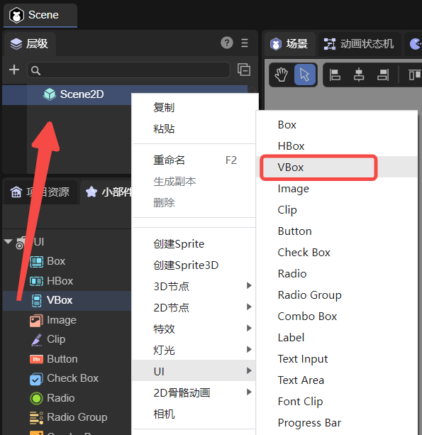
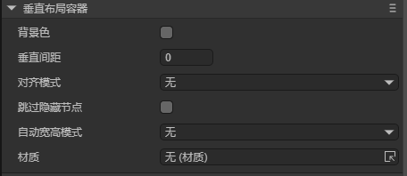
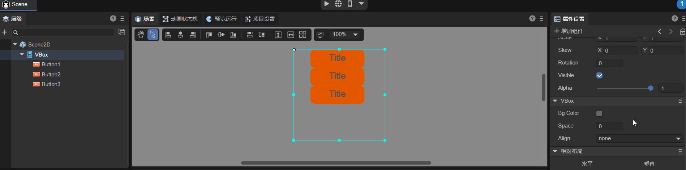
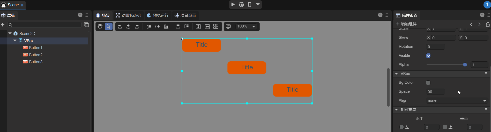
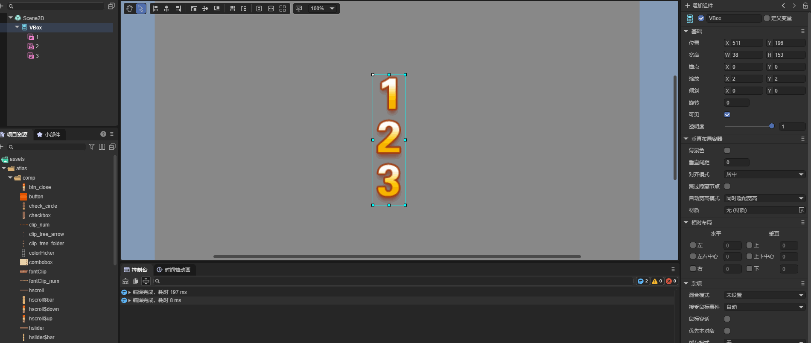
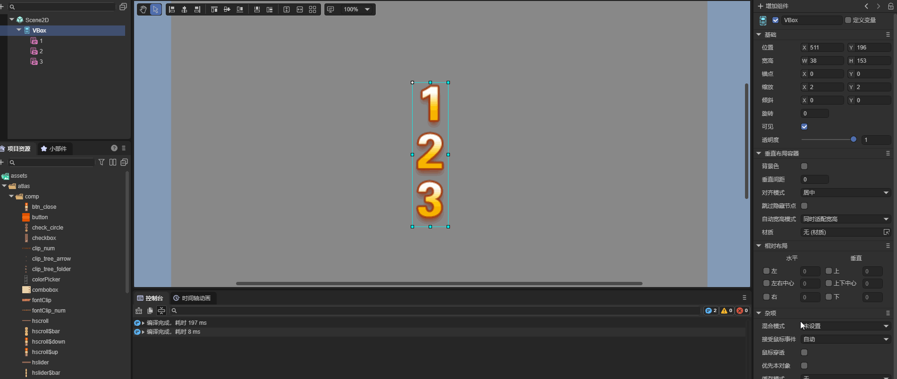
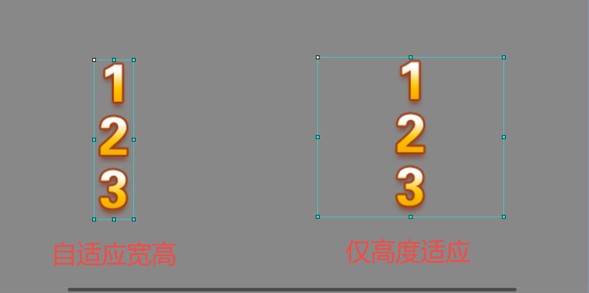

# Vertical Layout Container Component (VBox)

The `VBox` is a type of container component that inherits from `Box`. It is used for **vertical layout management**, providing more refined control compared to the base `Box` class.
For detailed properties of `VBox`, refer to the [API documentation](https://layaair.com/3.x/api/Chinese/index.html?version=3.0.0&type=2D&category=UI&class=laya.ui.VBox).

## 1. Creating a VBox Component via LayaAir IDE

### 1.1 Creating a VBox

You can visually create a `VBox` directly in the **Hierarchy panel** of the IDE, as shown in Figure 1-1.
You can either right-click in the **Hierarchy** window to create it or drag it from the **Widget** panel into the scene.



(Figure 1-1)

### 1.2 VBox Properties

The specific properties of the `VBox` component are as follows:



(Figure 1-2)

| Property                           | Function                                                                                                                                                                                                |
| ---------------------------------- | ------------------------------------------------------------------------------------------------------------------------------------------------------------------------------------------------------- |
| **bgColor (Background Color)**     | The background color. After checking the option, you can input a color value such as `#ffffff`, or use the color picker on the right to select a color.                                                 |
| **space (Vertical Spacing)**       | The vertical spacing between child elements, in pixels.                                                                                                                                                 |
| **align (Alignment Mode)**         | Controls the **horizontal alignment** of elements. There are four options: `none` (no alignment), `left` (left-aligned), `center` (center-aligned), and `right` (right-aligned). The default is `none`. |
| **skipHidden (Skip Hidden Nodes)** | Default is `false`. When checked, hidden child nodes will be automatically skipped during layout arrangement.                                                                                           |
| **autoSizeMode (Auto Size Mode)**  | Automatically adjusts size according to the selected mode. There are three options: `none` (no auto-resize), `both` (auto width & height), and `height` (auto height).                                  |

The `space` property sets the **vertical distance between child elements** in pixels. You can enter a numeric value manually or adjust it by dragging with the left mouse button.
For example, if the `VBox` contains three `Button` components, modifying `space` produces the effect shown in Animation 1-3.



(Animation 1-3)

No matter how the child nodes are arranged in the IDE, once the `align` property is set, they will be rearranged according to the corresponding **horizontal alignment**, as shown in Animation 1-4.



(Animation 1-4)

If **Skip Hidden Nodes** is **not checked**, hidden nodes will still occupy space during layout, as shown in Animation 1-5.
Here, the “2” bitmap font node’s `disable` property is set to `true`, resulting in a gap.



(Animation 1-5)

If **Skip Hidden Nodes** is **checked**, hidden nodes are ignored, as shown in Animation 1-6.



(Animation 1-6)

The **auto size modes** mainly include **both width & height auto-resize** and **height-only auto-resize**, as shown in Figure 1-7.



(Figure 1-7)

### 1.3 Controlling VBox with Script

In the `Scene2D` property panel, add a custom script component.
Then, drag the `VBox` node into the exposed property field.
Since one `VBox` alone cannot demonstrate layout effects, you can add several child nodes under it for testing.
Example code:

```typescript
const { regClass, property } = Laya;

@regClass()
export class NewScript extends Laya.Script {

    @property({ type: Laya.VBox })
    public vbox: Laya.VBox;

    // Executed once when the component is activated, after all nodes and components have been created.
    onAwake(): void {
        this.vbox.pos(100, 100);
        this.vbox.bgColor = "#ffffff";
        this.vbox.space = 30;
        this.vbox.align = "center";
    }
}
```

## 2. Creating a VBox Component via Code

Sometimes you may prefer to manage UI creation through code.
Here, we create a `UI_VBox` class to demonstrate how to create a `VBox` and add three `Button` components for display.

Example code:

```typescript
const { regClass, property } = Laya;

@regClass()
export class UI_VBox extends Laya.Script {

    private vbox: Laya.VBox;
    private btn1: Laya.Button;
    private btn2: Laya.Button;
    private btn3: Laya.Button;

    // Button skin resource
    private skins: string = "atlas/comp/button.png";

    // Executed once when the component is activated, after all nodes and components have been created.
    onAwake(): void {
        Laya.loader.load(this.skins).then(() => {
            this.createBtn();
            this.createvbox();
            // Add VBox to the owner
            this.owner.addChild(this.vbox);
        });
    }

    // Create Button components
    private createBtn(): void {
        this.btn1 = new Laya.Button(this.skins);
        this.btn2 = new Laya.Button(this.skins);
        this.btn3 = new Laya.Button(this.skins);
    }

    // Create VBox component
    private createvbox(): void {
        this.vbox = new Laya.VBox;
        this.vbox.pos(100, 100);
        this.vbox.size(600, 300);
        this.vbox.bgColor = "#ffffff";
        this.vbox.addChild(this.btn1);
        this.vbox.addChild(this.btn2);
        this.vbox.addChild(this.btn3);
        this.vbox.space = 80;
        this.vbox.align = "center";
    }
}
```
