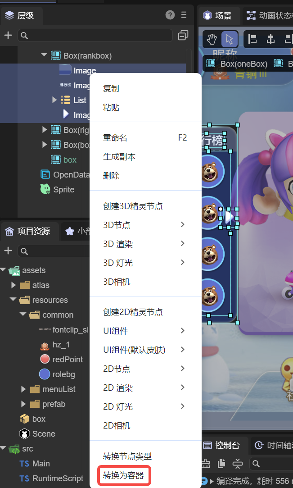
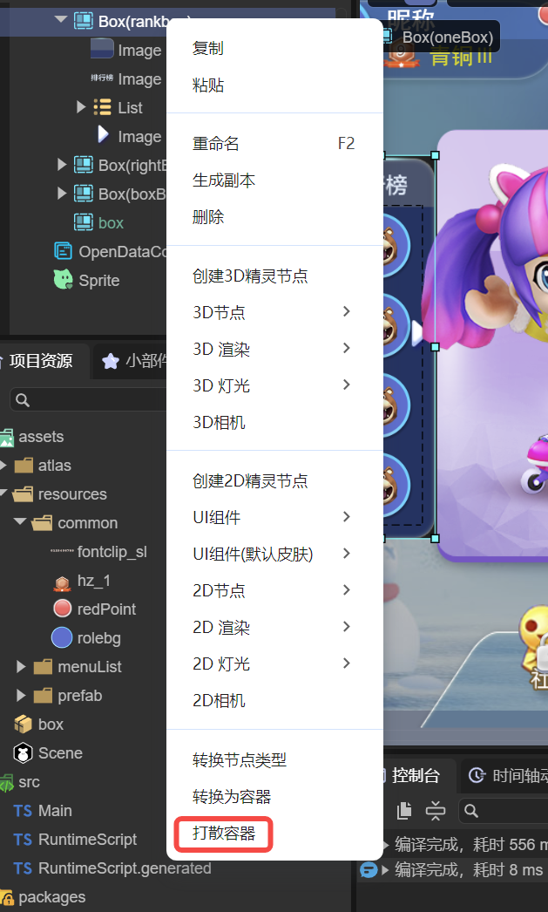

# UI Component Resource Naming Rules

> Author: Charley

In LayaAir’s **Classic UI System**, the naming of image resources determines how they are recognized in the IDE. **If an image file follows the UI component resource naming rules**, it will automatically be identified as a **2D Sprite Texture** when imported into the IDE and will default to using the **Gamma color space** for rendering.

If an image file **does not follow** the LayaAir UI naming convention, it will be recognized as a default texture type and use the **Linear color space** instead. The linear color space is typically used for **3D scene materials**, and since its color representation differs from Gamma space, this can lead to color distortion or mismatched visual results when used in 2D scenes.

Therefore, **for 2D image resources — especially in projects that mix 2D and 3D elements — it is strongly recommended to follow the UI resource naming rules before importing**. Doing so ensures the resources are correctly identified as sprite textures and rendered using the proper color space, avoiding manual post-import adjustments and ensuring consistent visual results and workflow efficiency.

## 1. Resource Naming Rules

LayaAir provides a set of standardized **naming rules** for commonly used UI components.

When image resources are named according to these rules, the IDE automatically recognizes them as basic UI components.

UI component resource naming falls into two categories: **Regular Resources** and **Composite Resources**.

### 1.1 Regular Resource Naming Rules

A **regular resource** corresponds to a single UI component.
For example, `img_layabox.png` will be recognized as an `Image` component.

**Naming rules for regular resources:**

| Component Name | Description       | Prefix      | Abbreviation |
| -------------- | ----------------- | ----------- | ------------ |
| Image          | Image             | image_      | img_         |
| Button         | Button            | button_     | btn_         |
| ComboBox       | Combo Box         | comboBox_   | combo_       |
| TextInput      | Text Input        | textInput_  | input_       |
| TextArea       | Text Area         | textArea_   | area_        |
| CheckBox       | Check Box         | checkBox_   | check_       |
| Label          | Label             | label_      | —            |
| RadioGroup     | Radio Group       | radioGroup_ | —            |
| Radio          | Radio Button      | radio_      | —            |
| Tab            | Tab Group         | tab_        | —            |
| Clip           | Bitmap Slice      | clip_       | —            |
| FontClip       | Bitmap Font Slice | fontClip_   | —            |

> Prefixes are **case-insensitive**.

### 1.2 Composite Resource Naming Rules

A **composite resource** consists of multiple images that together define a single UI component.
For example, `progress_loading.png` and `progress_loading$bar.png` together form a `ProgressBar` component.
Here, `progress_loading.png` is the background resource, while `progress_loading$bar.png` represents the progress indicator.

From this pattern, two key rules can be observed:

* Regardless of type, the prefix **before the underscore (`_`)** represents the component type and must appear **at the beginning of the filename**.
* For composite resources, a **dollar sign (`$`)** is used to append an auxiliary identifier after the main resource name to distinguish sub-elements within the component.

**Composite resource naming rules:**

| Component   | Description           | Prefix       | Abbreviation | Auxiliary Identifier                                             |
| ----------- | --------------------- | ------------ | ------------ | ---------------------------------------------------------------- |
| VScrollBar  | Vertical Scroll Bar   | vscrollbar_  | vscroll_     | `$bar` (scroll bar), `$up` (up button), `$down` (down button)    |
| HScrollBar  | Horizontal Scroll Bar | hscrollbar_  | hscroll_     | `$bar` (scroll bar), `$up` (left button), `$down` (right button) |
| ProgressBar | Progress Bar          | progressbar_ | progress_    | `$bar` (progress indicator)                                      |
| VSlider     | Vertical Slider       | vslider_     | —            | `$bar` (slider knob), `$progress` (optional progress bar)        |
| HSlider     | Horizontal Slider     | hslider_     | —            | `$bar` (slider knob), `$progress` (optional progress bar)        |

> Prefixes are **case-insensitive**.

**Examples:**

* A vertical scroll bar named “aa” consists of four resource files:
  `vscroll_aa.png`, `vscroll_aa$bar.png`, `vscroll_aa$up.png`, `vscroll_aa$down.png`.
* A progress bar named “bb” consists of two resource files:
  `progress_bb.png`, `progress_bb$bar.png`.
* A horizontal slider named “cc” consists of two or three files:
  `hslider_cc.png`, `hslider_cc$bar.png`, and optionally `hslider_cc$progress.png`.
  If the progress resource is missing, no error occurs — only the progress display will be omitted.

## 2. Creating and Releasing Container Components

Among container components, only those inheriting from the **UIGroup** class — namely `RadioGroup` and `Tab` — support automatic recognition and creation via naming prefixes.
Other container types **cannot be auto-detected** through naming rules and must be created manually in the IDE.

### 2.1 Creating Container UI Components

In the hierarchy panel, select one or more base components, then right-click and choose **Convert to Container** (or press **Ctrl + B**).
As shown in Figure 2-1, select the desired container type from the popup menu.

(Figure 2-1)

### 2.2 Releasing Container UI Components

If a container component is no longer needed, select it and press **Ctrl + U** to ungroup it, or right-click and select **Ungroup Container** from the bottom of the context menu, as shown in Figure 2-2.

(Figure 2-2)
