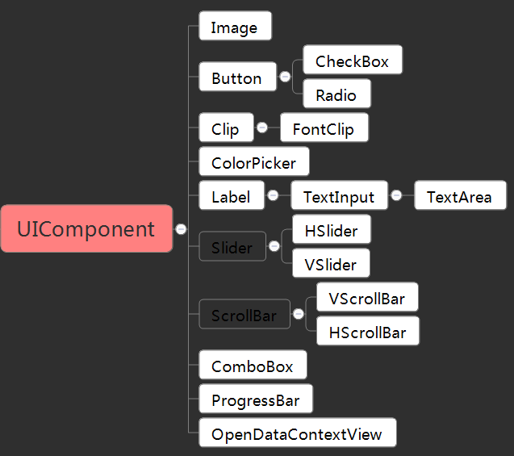
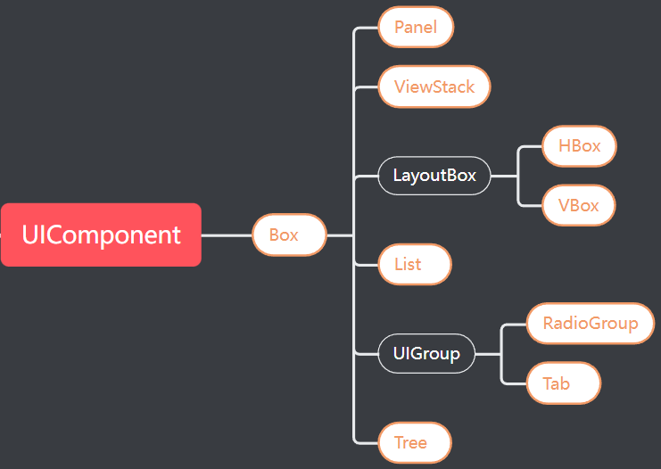
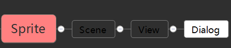
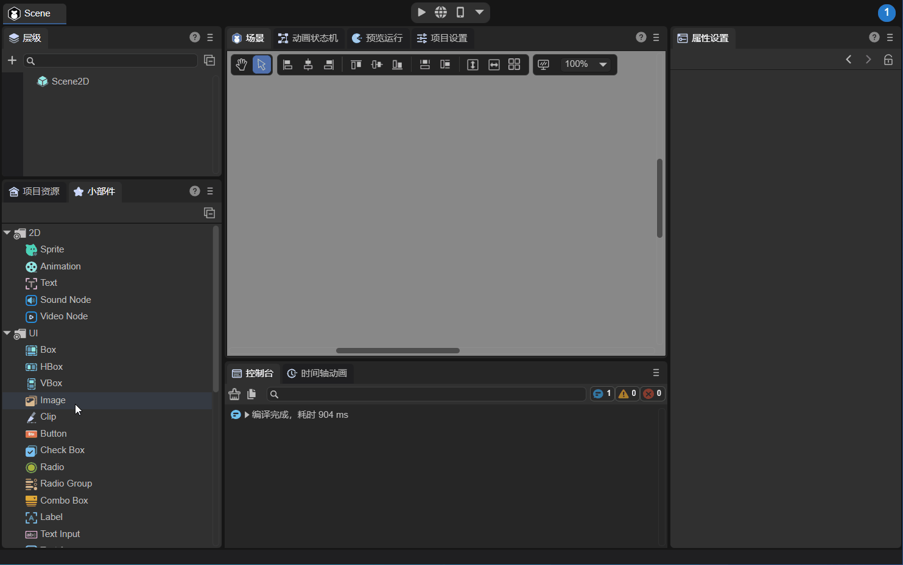
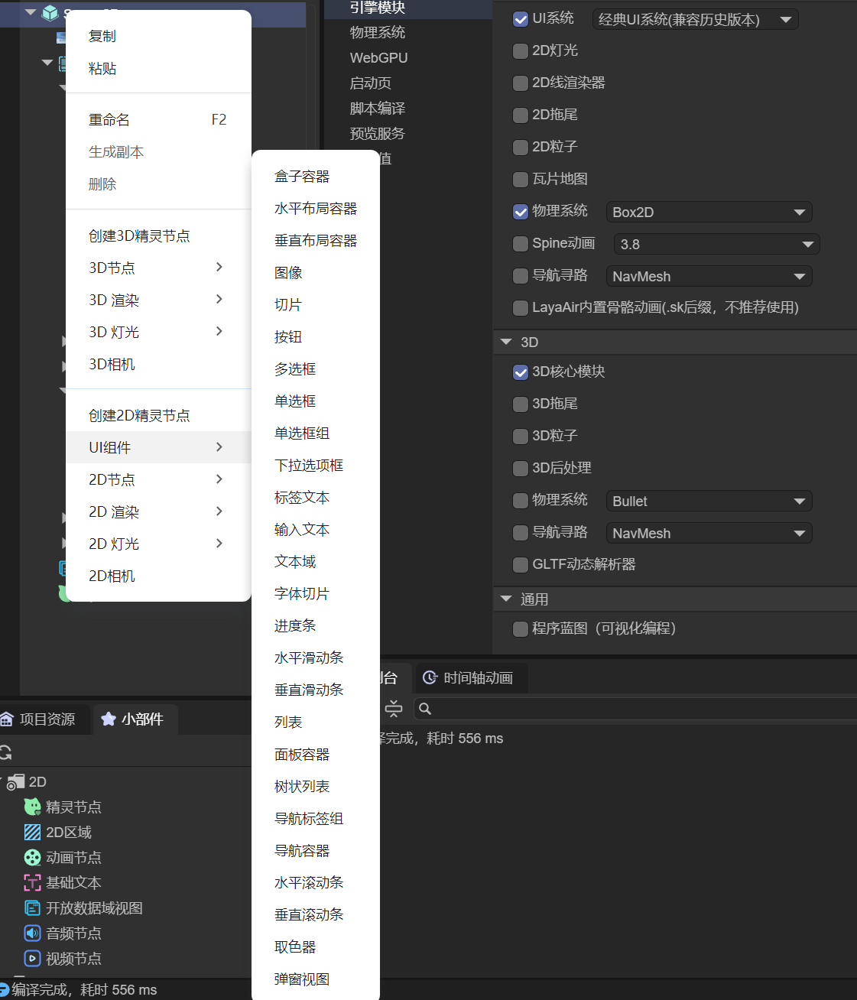
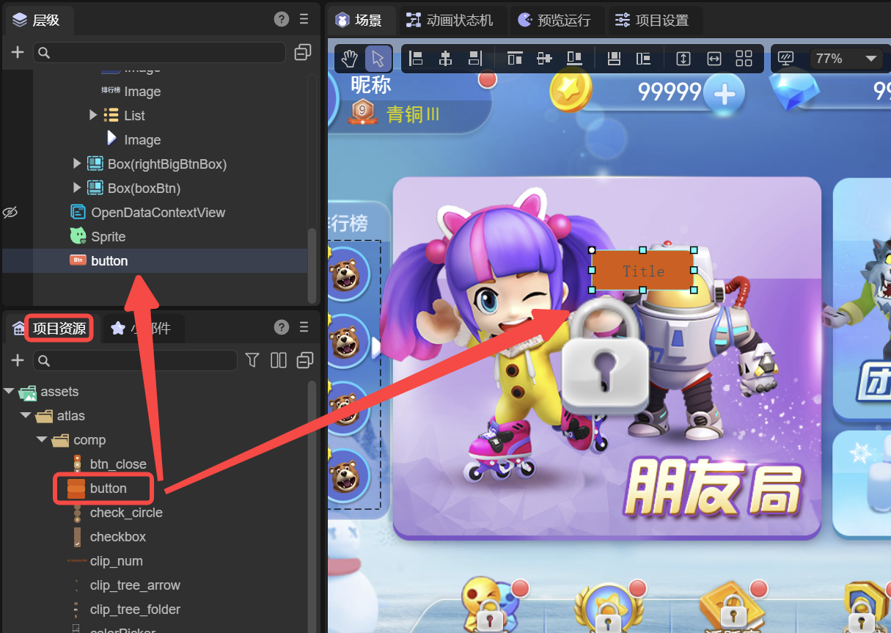
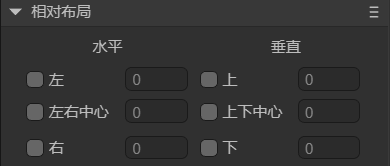
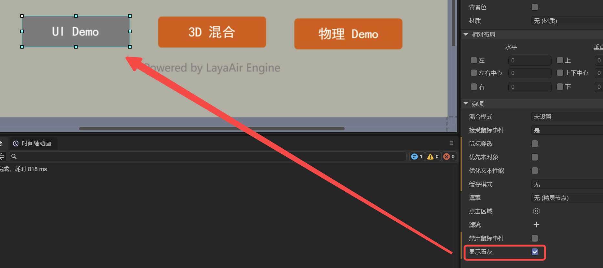

# Basic Usage and Structure of UI Components

> Author: Charley

**UI Components** are the core building blocks of the Classic UI System. They encapsulate a wide range of commonly used interface features, allowing developers to efficiently construct various types of user interfaces.

## 1. What Are UI Components

From an engine class hierarchy perspective, `UIComponent` serves as the **base class** for all UI components in the Classic UI System. In other words, all UI components are subclasses derived from `UIComponent`, sharing common interfaces and behavioral patterns.

UI components can be categorized into **basic components** and **container components**.
`Box` and all its subclasses are considered **container components**, responsible for hosting and arranging other UI nodes.
All other components (outside the `Box` hierarchy) are generally **basic components**, used for directly displaying interface elements such as text, images, and buttons.

### 1.1 Basic UI Components

There are 17 types of basic UI display components, all directly or indirectly inheriting from `UIComponent`, as shown in Figure 1-1 (highlighted).



(Figure 1-1)

### 1.2 Container Components

Including `Box` itself, there are **nine container components** that inherit from it, as shown in Figure 1-2 (highlighted).



(Figure 1-2)

These containers are not meaningful on their own — they must contain basic UI components as child nodes to form complete and functional UI elements.

For example:

* A `List` must include basic UI components as list item renderers.
* A `RadioGroup` serves as a container for multiple `Radio` components.

### 1.3 Dialog Components

From the class hierarchy, the **Dialog component** (`Dialog`) does **not inherit from `UIComponent`**, and therefore does not formally belong to the UI component system. Its inheritance structure is shown in Figure 1-3.



(Figure 1-3)

However, in practice, `Dialog` is one of the **most frequently used components** in the Classic UI System and is categorized as a UI component within the IDE. It is widely used for pop-up windows, alerts, and modal dialogs.

## 2. How to Use UI Components

There are **three main ways** to create UI components:

1. Drag components from the **Widgets Panel**.
2. Create components from the **Hierarchy Panel’s right-click menu**.
3. Name your image resources according to **UI Component Naming Rules** and drag them into the IDE — they’ll be recognized automatically.

### 2.1 Dragging from the Widgets Panel

The **Widgets Panel** includes both basic nodes and UI components. You can drag them directly into the **Hierarchy Panel** or the **Scene Editor Window**, as shown in Animation 2-1.



(Animation 2-1)

### 2.2 Creating via the Hierarchy Right-Click Menu

In the **Hierarchy Panel**, under the 2D node section, you can right-click and directly create a UI component, as shown in Figure 2-2.

  

(Figure 2-2)

### 2.3 Dragging from the Resource Panel

If a resource’s name follows the **UI Component Naming Rules** (see related documentation), dragging it into the hierarchy or scene view will cause the IDE to **automatically create the corresponding UI component**, as shown in Figure 2-3.



(Figure 2-3)

## 3. Base Properties of UI Components

UI components feature several special properties that are **unique to the UI System**, such as **relative layout**, **data binding**, **graying (gray effect)**, and **mouse event disabling**.
These features are **not available** in basic 2D objects like `Sprite`.

### 3.1 Relative Layout

As shown in Figure 3-1, every UI component supports a set of properties for **relative positioning**, whereas basic display objects (e.g., `Sprite`) only support **absolute positioning**.



(Figure 3-1)

In relative layout, the component’s position is calculated **relative to its parent node**, providing high flexibility and enabling automatic adaptation to different screen sizes and orientations — ensuring consistent and user-friendly UI layouts across devices.

Example code:

```typescript
this.xx.left = 0;
this.xx.right = 0;
this.xx.top = 0;
this.xx.bottom = 0;
this.xx.centerX = 0;
this.xx.centerY = 0;
```

### 3.2 Data Binding (`dataSource`)

In practice, data retrieved from a server may not always match the structure expected by UI components — especially when working with list components.
The `dataSource` property allows developers to map or transform the original data structure to fit the UI’s rendering requirements.

Example:

```typescript
import { ItemBoxBase } from "./ItemBox.generated";

const { regClass, property } = Laya;

@regClass()
export class Script extends ItemBoxBase {
    constructor() {
        super();
    }

    get dataSource(): any {
        return super.dataSource;
    }
    set dataSource(value: any) {
        super.dataSource = value;
        if (!value) return;

        // Assign data to child node properties
        if (value.avatar) {
            let redHot = this.getChildByName("avatar").getChildByName("redHot") as Laya.Image;
            redHot.visible = value.avatar.redHot.visible;
        }

        if (value.flag) {
            let flagText = this.getChildByName("flag").getChildByName("flagText") as Laya.Text;
            flagText.text = value.flag.flagText.text;
        }
    }
}
```

### 3.3 Graying and Disabling Mouse Events

Setting the `gray` property changes the component’s appearance to a **grayed-out state**, displaying colored elements in gray, as shown in Figure 3-2.
This is typically used to indicate that an element is “inactive” or “unavailable.”



Setting the `disabled` property will not only **disable mouse interactions** (e.g., prevent button clicks) but also **automatically apply the gray effect**, providing clear visual feedback that the component is non-interactive.

Example:

```typescript
this.xx.disabled = true;
```
