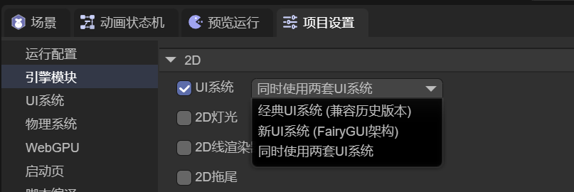
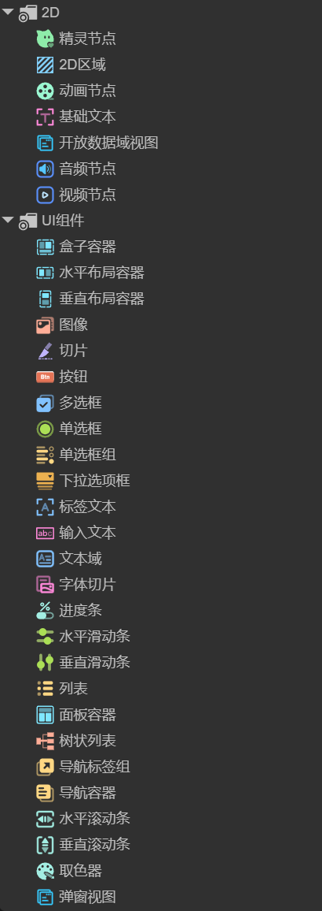
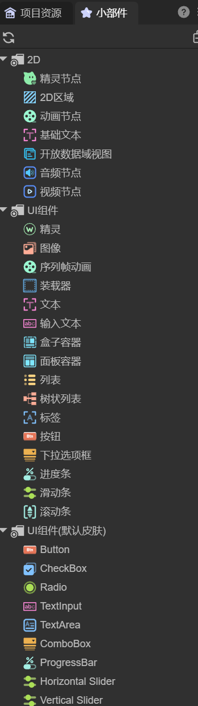

# UI Widgets

> Author: Charley

## 1. Overview of UI Widgets

UI widgets are the fundamental building blocks of user interfaces. They are independent, reusable UI components designed to implement interactive controls such as buttons, text boxes, sliders, and checkboxes.

Simply put, UI widgets are the *“building blocks”* of interface design. They encapsulate both visual presentation and interaction logic, allowing developers to efficiently construct and manage interface layouts.

In the **LayaAir 3** engine, UI widgets are mainly divided into two categories:

* **2D Base Objects** – Core 2D nodes from the engine itself. These do not depend on any UI framework and can be used with any UI solution.
* **UI System Components** – Visual controls provided by specific UI frameworks. These components depend on the selected UI system.

## 2. Support for Two UI Systems

Starting from **LayaAir 3.3**, the engine supports two complete UI systems, as shown in Figure 2-1.

(Figure 2-1)

### 2.1 Classic UI System (MornUI)

The classic UI system originates from the well-known **MornUI** framework of the Flash era. It was introduced into **LayaAir 1.0 (released in 2016)** by its creator, [**yung**](https://github.com/yungzhu), and has remained a stable and mature solution ever since.

It is well-suited for developers familiar with earlier versions of the LayaAir UI system who wish to continue using a proven, traditional workflow.

### 2.2 New UI System (FairyGUI)

The new UI system is based on the renowned **FairyGUI** framework. It was introduced and re-engineered for **LayaAir 3.3** by its creator, **Gu Zhu**, to fully integrate with the modern LayaAir3 engine architecture.

This system aligns better with modern UI design concepts and offers powerful, easy-to-use features. It is recommended for new users or developers already familiar with FairyGUI.

## 3. Usage Guidelines

### 3.1 UI System Compatibility

The two UI systems are **mutually incompatible**:

* When using the **Classic UI System**, components and features of the **New UI System** are **unavailable**, as shown in Figure 3-1.

(Figure 3-1)

* Conversely, when using the **New UI System**, components and features of the **Classic UI System** are **disabled**, as shown in Figure 3-2.

(Figure 3-2)

### 3.2 Using Both UI Systems Simultaneously

In the IDE, it is possible to **enable both UI systems at the same time**:

* Only **New UI System** components will appear in the component list — suitable for designing new UIs.
* **Classic UI System** components remain compatible — they can still be created and managed **via code**, though not directly within the IDE.

Regardless of which UI system is active, **2D base objects are always available** and can be freely combined with components from either system.

### 3.3 How to Use UI Widgets

UI widgets can be created in two ways:

* By **right-clicking** in the hierarchy panel and selecting the desired widget.
* By **dragging components** directly from the *widget panel* into the scene view or hierarchy panel for immediate use.
