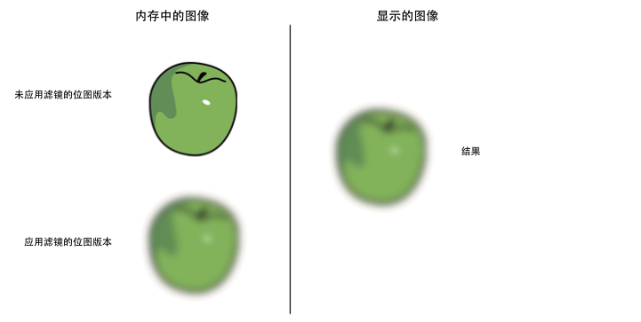
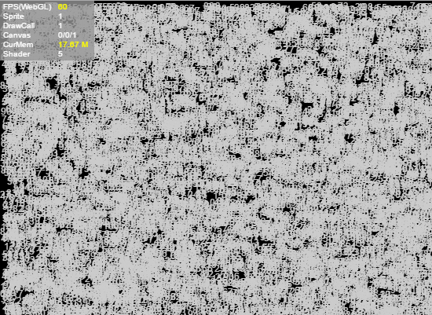
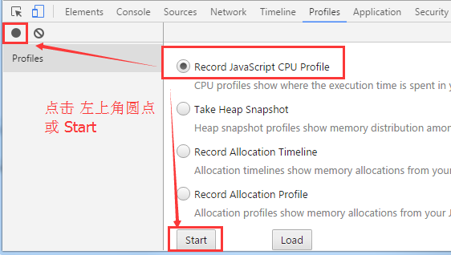
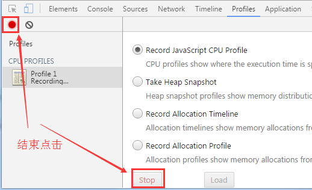
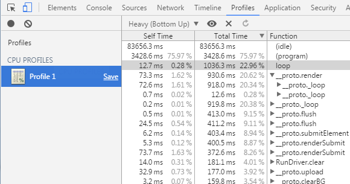
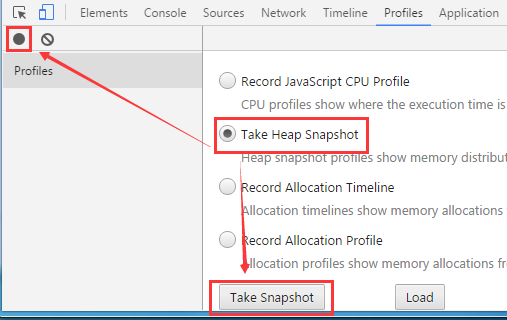
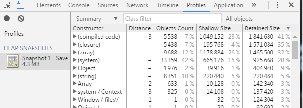
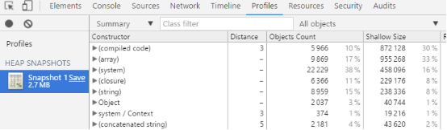
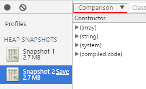

# Performance Optimization

## 1. Memory Optimization Methods

### 1.1 Optimize Memory Through Object Pooling

Object pooling is one of the most important optimization techniques in game development and a key factor affecting performance.
In games, many objects are constantly being created and destroyed, such as bullets fired by characters, visual effects appearing and disappearing, and NPCs being removed or respawned. These frequent creations and deletions can be costly, especially when the number of objects is large.
The object pool technique effectively solves this problem — when an object is removed, it is recycled into the pool, and when a new object is needed, it is retrieved from the pool.

The advantages are:

* Reduces the overhead of instantiation.
* Reuses objects to minimize memory allocation and garbage collection operations.

**Note:** When an object is removed, it is not immediately deleted from memory. Garbage collection only occurs when the system determines that memory is low. This process can cause lag because it consumes a lot of CPU resources.
**By using an object pool, you can reduce the number of temporary objects and significantly improve performance and stability.**

For more information, see [Object Pool](../../basics/common/Pool/readme.md).

---

### 1.2 Releasing Memory

JavaScript runtime cannot manually trigger garbage collection. To ensure an object can be collected, all references to it must be removed.
The `destroy()` method of `Sprite` helps by setting internal references to `null`.

Example:

```typescript
// Create a Sprite instance
var sp: Laya.Sprite = new Laya.Sprite();
// Destroy and clear internal references
sp.destroy();
```

Setting an object to `null` does not immediately delete it. The garbage collector runs only when the system considers memory low.
Garbage collection consumes CPU and can affect performance. Reusing objects helps reduce GC pressure.
You should also set unnecessary references to `null` to make GC faster.

Sometimes, when two objects reference each other, GC must scan to detect unreferenced objects, which is slower than reference counting.

---

### 1.3 Resource Unloading

During gameplay, many assets are loaded. These should be released once they are no longer needed, or they will remain in memory.

Example:

```typescript
var assets: Array<any> = [];
assets.push("resources/apes/monkey0.png");
assets.push("resources/apes/monkey1.png");
assets.push("resources/apes/monkey2.png");
assets.push("resources/apes/monkey3.png");
Laya.loader.load(assets).then(() => {
    for (var i: number = 0, len: number = assets.length; i < len; ++i) {
        var asset: string = assets[i];
        // Before clearing, resource exists in memory
        console.log(Laya.loader.getRes(asset));
        // Clear resource
        Laya.loader.clearRes(asset);
        // After clearing, resource is released
        console.log(Laya.loader.getRes(asset));
    }
});
```

---

### 1.4 Filters and Masks

Try to minimize the use of filters. Applying filters such as `BlurFilter` and `GlowFilter` to display objects causes two bitmaps to be created in memory.
Each bitmap matches the display object’s size — the first is a rasterized version, and the second is the filtered output:



(Figure 1-1)

When you modify a filter or the object itself, both bitmaps are recalculated, consuming memory and CPU.
In contrast, `ColorFilter` has negligible GPU cost under WebGL.

**Best practice:** use image-editing tools to pre-bake filter effects into static bitmaps. Avoid runtime filter generation to reduce CPU/GPU load — especially for static graphics that won’t change.

---

# 2. Rendering Optimization

### 2.1 Optimizing Sprites

1. Minimize unnecessary nesting and the number of Sprites.
2. Remove or hide objects outside the visible area (`visible = false`).
3. Use `cacheAs` on containers with static content to reduce draw calls. Separate dynamic and static elements.
4. Objects outside a `Panel`’s visible area are not rendered, so they don’t consume performance.

---

### 2.2 Optimizing Draw Calls

1. Use `cacheAs` on complex static content to reduce draw calls.
2. Ensure that images from the same atlas are rendered consecutively — interleaving different atlases increases draw calls.
3. Use a single atlas for all resources in one panel when possible.

---

### 2.3 Optimizing Canvas

Avoid using `cacheAs` in the following cases:

1. Simple objects (like a single character or image) — caching won’t help.
2. Containers with frequently changing content (like animations or timers).

You can check the first value in the Canvas statistics to see if it’s constantly redrawing.

---

### 2.4 CacheAs

`cacheAs` can cache a display object as a static image. When a child changes, the cache updates automatically, or you can manually call `reCache()`.

Cache modes:

1. `"none"` — no caching (default).
2. `"normal"` — command caching.
3. `"bitmap"` — renderTarget caching (WebGL only, limited to 2048x2048).

Setting `staticCache = true` prevents auto updates; call `reCache()` manually.

Benefits:

* Reduces node traversal and vertex calculations.
* Reduces draw calls.

Example (10,000 texts):

```typescript
class Test {
    private text: Laya.Text;
    constructor() {
        Laya.init(550, 400, Laya.WebGL);
        Laya.Stat.show();
        var textBox = new Laya.Sprite();
        for (var i = 0; i < 10000; i++) {
            this.text = new Laya.Text();
            this.text.text = (Math.random() * 100).toFixed(0);
            this.text.color = "#CCCCCC";
            this.text.x = Math.random() * 550;
            this.text.y = Math.random() * 400;
            textBox.addChild(this.text);
        }
        Laya.stage.addChild(textBox);
    }
}
```

Without cache: FPS ~52
With cache (`textBox.cacheAs = "bitmap";`): FPS ~60


(Figure 2-2)

---

### 2.5 Text Stroke

Outlined text requires an extra draw call, doubling CPU cost.
Alternatives:

* Use `cacheAs` for static text.
* Use bitmap fonts for frequently changing text.

---

### 2.6 Skip Text Layout (Direct Render)

If text layout is unnecessary (e.g., single-line), use `changeText()` to update directly without layout recalculation:

```typescript
this.text.text = "text";
Laya.stage.addChild(this.text);
this.text.changeText("text changed.");
```

Conditions:

* Single-line only.
* No style changes (color, font weight, alignment, etc.).

---

## 3. Reducing CPU Usage

### 3.1 Minimize Dynamic Property Lookups

Frequent property lookups are costly. Cache them in local variables:

```typescript
foo() {
    var prop = this.target.prop;
    this.process1(prop);
    this.process2(prop);
    this.process3(prop);
}
```

---

### 3.2 Recycle Performance-Heavy Operations

Avoid running unnecessary loops or timers when not in use.

Example:

```typescript
Laya.timer.frameLoop(1, this, this.animateFrameRateBased);
Laya.stage.on("click", this, this.dispose);
dispose() {
    Laya.timer.clear(this, this.animateFrameRateBased);
}
```

Always clear timers when objects are destroyed.

---

### 3.3 Getting Display Object Bounds

1. `getBounds()` or `getGraphicBounds()` — calculates boundaries (not efficient if called frequently).
2. Set `autoSize = true` — auto-calculates size when children change (not suitable for containers with many children).
3. Use `size(width, height)` manually for best performance.

---

### 3.4 Adjust Frame Rate by Activity

* `Stage.FRAME_FAST`: Full frame rate (e.g., 60 or 120).
* `Stage.FRAME_SLOW`: Half the display refresh rate.
* `Stage.FRAME_MOUSE`: Switches between fast and slow based on mouse activity.

When using `FRAME_MOUSE`, FPS increases during interaction and drops when idle.

---

### 3.5 Using callLater

`callLater()` defers function execution to the end of the current frame, avoiding redundant updates.

Example:

```typescript
Laya.timer.callLater(this, update);
```

Combining multiple property changes will now trigger `update()` only once instead of multiple times.

---

### 3.6 Image/Atlas Loading

Processing many images or atlases at once can cause lag.
Load resources in groups (by level, scene, etc.) and unload unused ones to free memory.

---

# 4. Other Optimization Strategies

### 4.1 Limit Particle Effects

Particles consume CPU when drawn as vectors.
WebGL uses GPU acceleration, but excessive particles still impact performance, especially on mobile.

### 4.2 Limit Rotation, Scaling, and Alpha

These properties consume performance. WebGL reduces the cost, but minimizing usage is still beneficial.

### 4.3 Avoid Creating Objects or Heavy Computation Inside Timers

`Laya.timer.loop()` and `frameLoop()` run continuously, so avoid creating objects or running complex logic inside them.

### 4.4 Avoid Excessive autoSize and getBounds

Both require computation and impact performance — use sparingly.

### 4.5 Avoid try-catch Inside Hot Functions

Functions wrapped in `try-catch` run significantly slower.

---

# 5. Using Chrome Performance Profiler

You can access the Chrome DevTools Profiler via right-click → “Inspect” or pressing `F12`.

### 5.1 CPU Usage Analysis

#### Start CPU Profiler

Select `Record JavaScript CPU Profile`, then click the **Start** button or the solid circle in the upper-left corner. Chrome will begin recording method executions on the current webpage, as shown in Figure 5-1.


(Figure 5-1)

#### Stop CPU Profiler Monitoring

To stop the profiler monitoring, click the **Stop** button (or the red solid circle on the left), as shown in Figure 5-2.


(Figure 5-2)

#### View CPU Profiler Records

After stopping monitoring, a monitoring result file will be listed under **Profiles** on the left. Click to open this monitoring result file, as shown in Figure 5-3.


(Figure 5-3)

The monitoring results are displayed as a data table. You can find function names provided in the Function column based on consumption ranking, and optimize areas with higher performance consumption.

---

### 5.2 Memory Usage Analysis

#### Start Memory Analysis

Select `Take Heap Snapshot` and click the **Take Snapshot** button (you can also click the black solid circle on the left), as shown in Figure 5-4.


(Figure 5-4)

The generated memory snapshot file records the current webpage object count, occupied memory size, and other data in a data table format.

#### Memory Snapshot Records

After starting memory analysis, a memory snapshot record file for the current webpage will quickly be generated under the **Profiles** section on the left. Click to view related data, as shown in Figure 5-5.


(Figure 5-5)

#### Memory Snapshot Analysis

After taking the first memory snapshot, click the circle in the upper-left corner to record a new memory snapshot. Click to select the second memory snapshot, and you can choose **Comparison mode** to compare the changes between the second snapshot and the first snapshot. Through analysis, optimize the webpage.


(Figure 5-6)


(Figure 5-7)

---

## 6. Using Texture Compression

**Benefits:**

1. **Reduces memory usage** — Especially important for mobile applications. Excessive memory usage can easily cause crashes on low-end devices.

2. **Reduces bandwidth usage** — In mobile game applications, a large number of textures are transmitted to the GPU during rendering. Without limitations, this not only seriously affects rendering performance but also causes severe overheating issues.

For details, see [Texture Compression](../../IDE/uiEditor/textureCompress/readme.md).
