# Post Processing

## I. Post Processing Overview

Post-processing is one of the essential technologies in modern games. By performing secondary processing on the final image rendered by the 3D scene, it achieves different visual effects or artistic styles.

The following two images demonstrate the depth-of-field blur effect in the engine. As you can see, after enabling post-processing, the background of the scene becomes blurred.

> Effect without post-processing

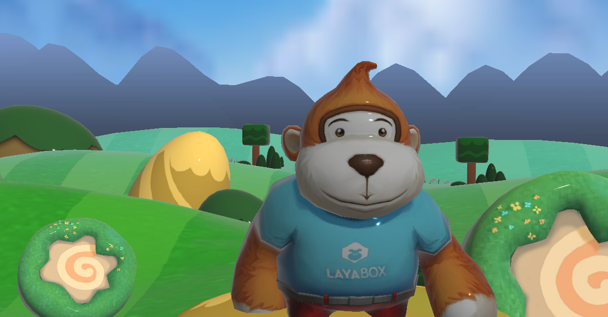

Figure 1-1

> Effect with post-processing enabled

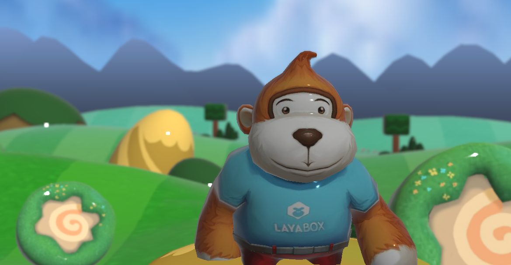

Figure 1-2

## II. Adding Post Processing Effects

### 2.1 Adding to Scene

Select the camera node in the Hierarchy panel, and you will see the Post Processing property in the Property Settings panel:

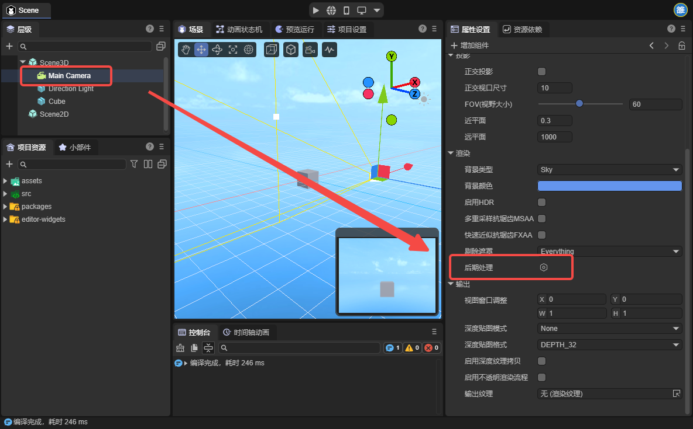

Figure 2-1

Click "Create Instance" to create a post-processing instance:

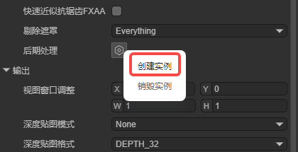

Figure 2-2

You can see the following options. Let's explain them one by one:

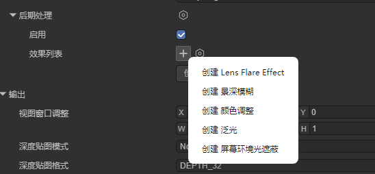

Figure 2-2

## III. Built-in Post Processing Types

### 3.1 Lens Flare Effect

**Lens Flare** is a post-processing effect that simulates the optical characteristics of a physical camera. By capturing intense light areas in the image, it simulates **geometric flares**, **starbursts**, and **glare** produced by light reflections between lens groups. In 3D development, this technology effectively enhances the impact of light sources, eliminates the "plastic feel" of rendering, and is a core means of improving **cinematic quality** and **visual impact**.

For example, the obvious flares in the following image are lens flares:

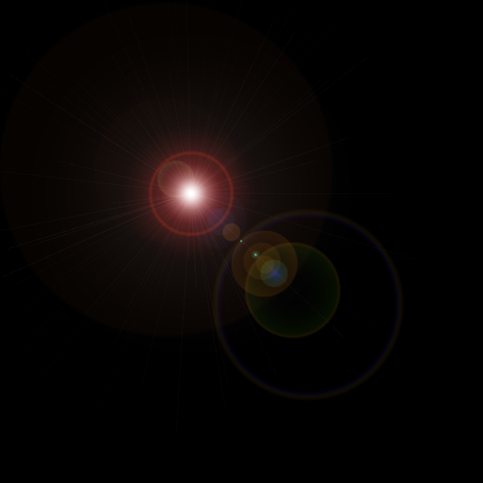

Figure 3-1-1

In the engine, click "Create" to use it, as shown in Figure 3-1-2:

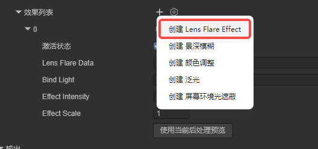

Figure 3-1-2

The lens flare post-processing parameters are described below:

| Parameter | Type | Description | Default Value |
|------|------|------|--------|
| `active`          | boolean       | Whether to activate this element (all post-processing effects have this parameter, will not be mentioned again) | true |
| `lensFlareData` | LensFlareData | Lens flare data (contains all elements) | null |
| `bindLight` | Light | Bound light source (must be set) | null |
| `effectIntensity` | number | Overall effect intensity | 1.0 |
| `effectScale` | number | Overall effect scale | 1.0 |

First is `lensFlareData`. We can create it via code or directly create a new one in the Assets panel, as shown in Figure 3-1-3:

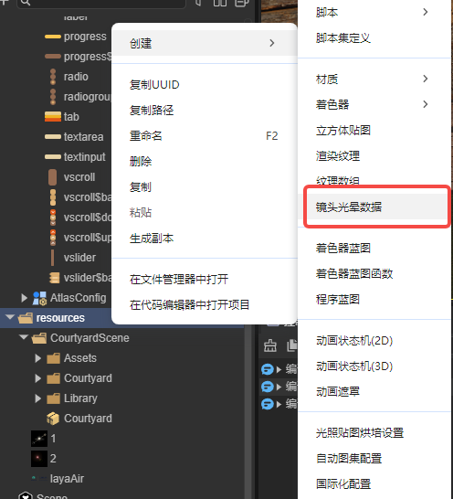

Figure 3-1-3

The lens flare properties are shown in Figure 3-1-4:

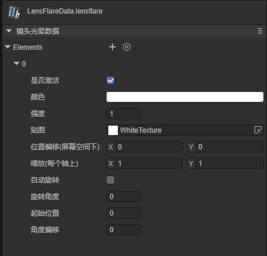

| Parameter | Type | Description | Default Value |
|------|------|------|--------|
| `texture` | BaseTexture | Texture for the flare element | Texture2D.whiteTexture |
| `tint` | Color | Color of the flare element | Color(1,1,1,1) |
| `intensity` | number | Intensity of the flare element | 1.0 |
| `startPosition` | number | Start position (0=light source center, 1=screen edge) | 0.0 |
| `angularOffset` | number | Angular offset (0-360 degrees) | 0.0 |
| `rotation` | number | Rotation angle | 0.0 |
| `autoRotate` | boolean | Whether to auto-rotate | false |
| `scale` | Vector2 | Scale (x, y) | Vector2(1, 1) |
| `positionOffset` | Vector2 | Position offset (screen space, x, y) | Vector2(0, 0) |

Figure 3-1-4

Drag the texture into the decorator, then drag the lens flare data and light into it to achieve the effect shown in Figure 3-1-5:

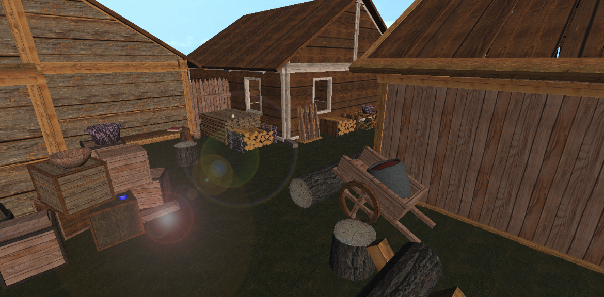

Figure 3-1-5

### 3.2 Gaussian Depth of Field (GaussianDoF)

**Depth of Field Blur** is a common post-processing effect that simulates the focal characteristics of a camera lens. In real life, a camera can only sharply focus on objects within a certain distance; objects closer or farther from the camera will be somewhat out of focus. Click "Create" to use it, as shown in Figure 3-2-1:

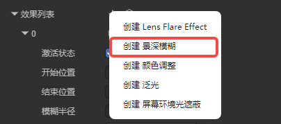

Figure 3-2-1

The depth of field blur parameters are as follows:

| Parameter | Type | Description | Default Value | Range |
|------|------|------|--------|----------|
| `Far Start` | number | Depth at which far blur begins (world space units) | 10.0 | > 0 |
| `Far End` | number | Depth at which maximum blur radius is reached (world space units) | 30.0 | >= farStart |
| `Max Radius` | number | Maximum blur radius | 1.0 | 0.0 - 2.0 |

The applied effect is shown in Figure 3-2-2. You can see that the distant houses become blurred:

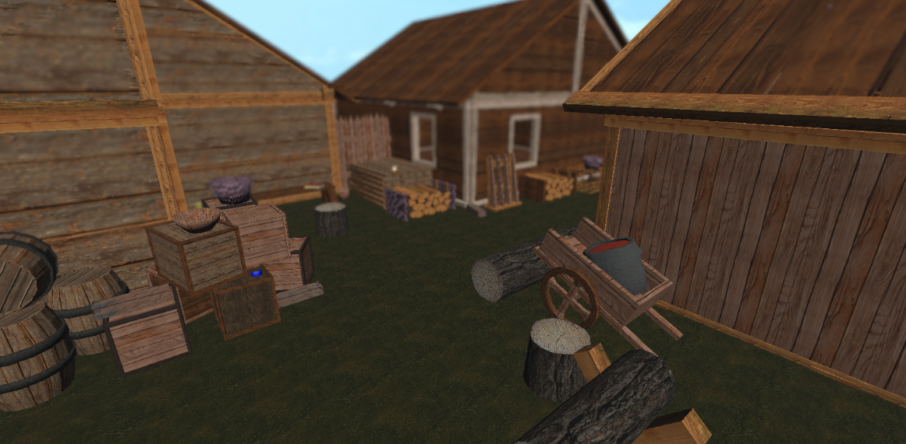

Figure 3-2-2

### 3.3 Color Grading (ColorGradEffect)

**Post-processing Color Grading** is like adding a real-time "movie filter" to your 3D scene. After scene rendering is complete, by adjusting the image's **brightness, contrast, saturation**, and **hue**, it unifies the global visual style. It can transform the original rendered image from a plain "digital look" into an artistic effect with a specific atmosphere—for example, adding blue tones to create a lonely sci-fi feel, or increasing contrast to simulate a desert under the scorching sun. This effect uses LUT (Look-Up Table) technology for efficient color adjustment. Click "Create" to use it, as shown in Figure 3-3-1:

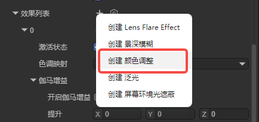

Figure 3-3-1

### Color Grading Parameters Overview

#### ToneMapping

| Parameter | Type | Description | Default Value |
|------|------|------|--------|
| `toneMapping` | ToneMappingType | Tone mapping type (None/ACES) | ToneMappingType.None |

#### Lift/Gamma/Gain

| Parameter | Type | Description | Default Value | Range |
|------|------|------|--------|------|
| `Enable` | boolean | Whether to enable | false | true/false |
| `Lift` | Vector3 | Shadow adjustment | Vector3(0,0,0) | -1 to 1 |
| `Gamma` | Vector3 | Midtone adjustment | Vector3(1,1,1) | 999 to 0.5 |
| `Gain` | Vector3 | Highlight adjustment | Vector3(1,1,1) | 0 to 2 |

#### Color Adjust

| Parameter | Type | Description | Default Value | Range |
|------|------|------|--------|------|
| `Enable` | boolean | Whether to enable color adjustment | false | true/false |
| `PostExposure` | number | Exposure value | 1.0 | - |
| `Contrast` | number | Contrast | 1.0 | 0-2 |
| `Saturation` | number | Saturation | 1.0 | 0-2 |
| `HueShift` | number | Hue shift | 0.0 | -0.5 to 0.5 |
| `colorFilter` | Color | Color filter (multiply) | Color(1,1,1,1) | - |

#### White Balance

| Parameter | Type | Description | Default Value | Range |
|------|------|------|--------|------|
| `Enable` | boolean | Whether to enable white balance | false | true/false |
| `Temperature` | number | Color temperature | 0.0 | -100 to 100 |
| `Tint` | number | Tint | 0.0 | -100 to 100 |

#### Split Toning

| Parameter | Type | Description | Default Value | Range |
|------|------|------|--------|------|
| `Enable` | boolean | Whether to enable split toning | false | true/false |
| `Split Shadow` | Vector3 | Shadow tone | Vector3(0.5,0.5,0.5) | 0-1 |
| `SplitHighlights` | Vector3 | Highlight tone | Vector3(0.5,0.5,0.5) | 0-1 |
| `Split Balance` | number | Balance value | 0.0 | -1 to 1 |

#### Shadows/Midtones/Highlights

| Parameter | Type | Description | Default Value | Range |
|------|------|------|--------|------|
| `Enable` | boolean | Whether to enable | false | true/false |
| `Shadows` | Vector3 | Shadow adjustment | Vector3(1,1,1) | 0-5 |
| `Midtones` | Vector3 | Midtone adjustment | Vector3(1,1,1) | 0-5 |
| `Highlights` | Vector3 | Highlight adjustment | Vector3(1,1,1) | 0-5 |
| `ShadowLimitStart` | number | Shadow start point | 0.0 | 0-1 |
| `ShadowLimitEnd` | number | Shadow end point | 0.33 | 0-1 |
| `HighLightLimitStart` | number | Highlight start point | 0.55 | 0-1 |
| `HighLightLimitEnd` | number | Highlight end point | 1.0 | 0-1 |

### 3.4 Bloom Effect

**Bloom** is a physical phenomenon that simulates real camera imaging or human vision. When light is extremely intense, it "spills over" the edges of objects, creating a soft halo effect around them. It makes glowing objects (like light tubes, magic effects, the sun) look like they're actually "emitting heat or energy." Click "Create" to use it, as shown in Figure 3-4-1:

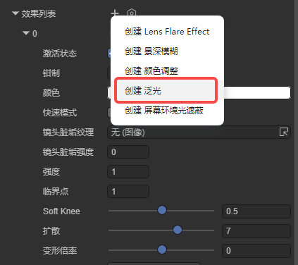

Figure 3-4-1

The bloom post-processing parameters are described below:

| Parameter | Type | Description | Default Value | Range |
|------|------|------|--------|------|
| `Clamp` | number | Clamp value, sets pixel value to control bloom amount (gamma space) | 65472 | - |
| `color` | Color | Bloom color, can adjust bloom hue | Color(1,1,1,1) | - |
| `FastMode` | boolean | Fast mode, reduces quality to improve performance | false | true/false |
| `DirtTexture` | BaseTexture | Dirt texture (optional), for adding lens dirt effects | null | - |
| `DirtIntensity` | number | Dirt intensity, controls dirt effect strength | 0.0 | ≥ 0 |
| `Intensity` | number | Bloom filter intensity, controls bloom effect strength | 1.0 | ≥ 0 |
| `Threshold` | number | Bloom threshold, pixels below this brightness are filtered out (gamma space) | 1.0 | ≥ 0 |
| `SoftKnee` | number | Soft knee strength, gradient transition below threshold | 0.5 | 0.0 - 1.0 |
| `Diffusion` | number | Diffusion value, changes bloom spread range, affects internal iterations | 7.0 | 1.0 - 10.0 |
| `AnamorphicRatio` | number | Anamorphic ratio, creates visual distortion by warping bloom | 0.0 | -1.0 - 1.0 |

By adjusting the bloom intensity, we can achieve the following effect. As shown in Figure 3-4-2, you can see the sky has a bloom effect, like a huge light shining into the scene:

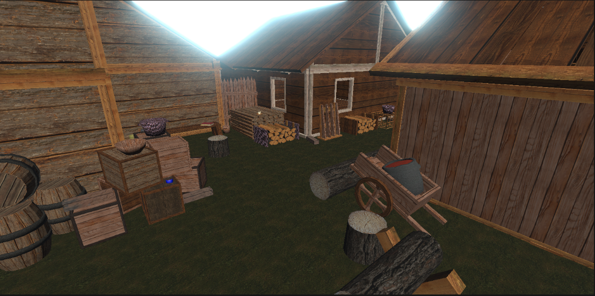

Figure 3-4-2

### 3.5 Screen Space Ambient Occlusion (ScalableAO)

Ambient occlusion is used to calculate points in the scene that are exposed to ambient lighting. It then darkens areas hidden from ambient light, such as creases, holes, and spaces between close objects.

You can achieve ambient occlusion in two ways: as a full-screen post-processing effect in real-time. Real-time ambient occlusion can be resource-intensive. Its impact on processing time depends on screen resolution and effect properties.

In the IDE, click "Create" to use it, as shown in Figure 3-5-1:

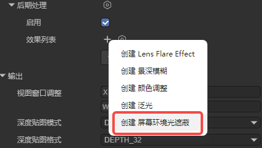

Figure 3-5-1

Scalable ambient occlusion parameter types:

|  Parameter Type  |                   Parameter Description                   |
| :--------: | :------------------------------------------: |
|  AO Color  |             Set ambient occlusion color             |
| Intensity  |              Ambient occlusion intensity              |
|   Radius   | Set sampling point radius to control ambient occlusion area range |
| AO Quality |      Ambient occlusion effect quality (High-Medium-Low)      |

When the effect is intensified, the on/off comparison is shown in animated Figure 3-5-2. You can see obvious shadow effects on the hidden edges of the model:

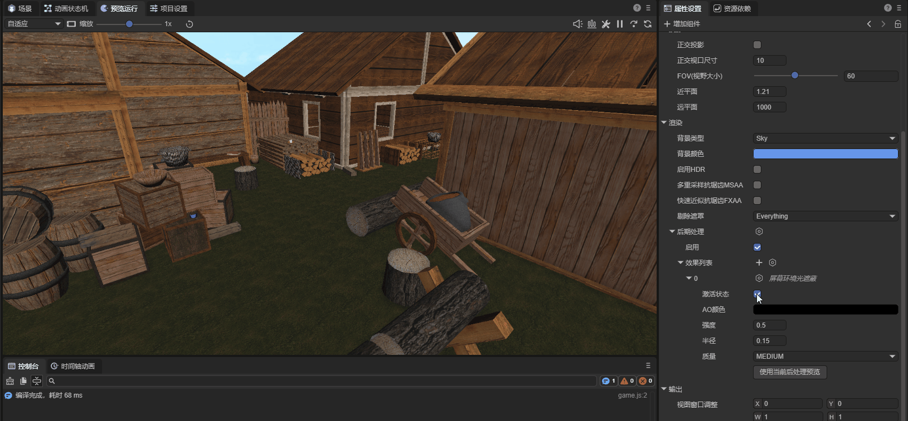

Animated Figure 3-5-2

## IV. Custom Post Processing Types

In the 3.0 engine, after writing your own post-processing effect, add the keyword **@regClass()** before the class definition to explicitly display the custom post-processing effect in the Camera's post-processing component effect list.

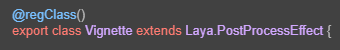

Figure 4-1

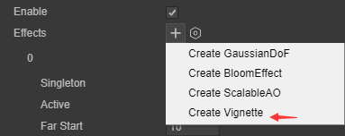

Figure 4-2
