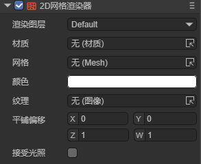
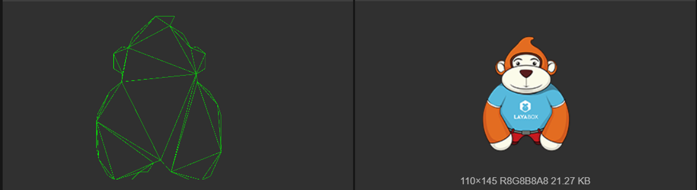
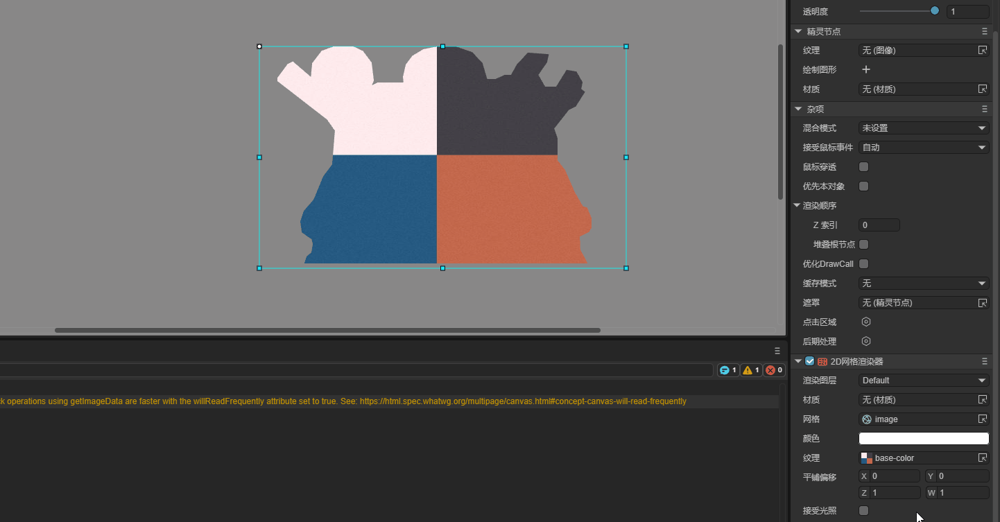
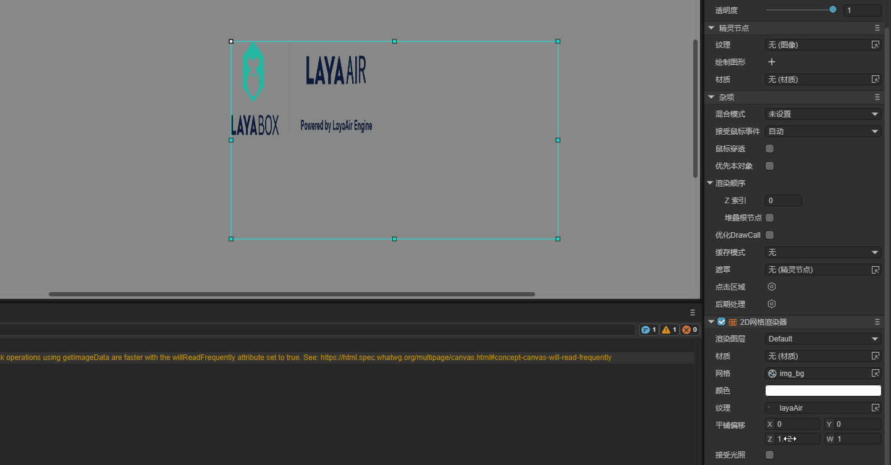

# 2D Mesh Renderer

## 1. Introduction

The 2D Mesh Renderer (Mesh2DRender) is used to display and render 2D meshes in 2D scenes, supports texture rendering, can set rendering colors, and can add custom materials to receive 2D lighting effects. Developers can use it to create complex 2D graphic effects, supports custom mesh shapes, and is suitable for making 2D game elements that require precise mesh control.

In game development, the 2D mesh renderer can achieve more complex and fine visual effects in 2D games. For example, creating 2D characters with special lighting effects, creating complex-shaped 2D objects, and implementing complex 2D effects.

In summary, this component can help developers break through the limitations of traditional 2D rendering and create richer and more unique effects.

## 2. Using in LayaAir-IDE

In LayaAir-IDE, create a sprite and add a 2D mesh renderer component to the sprite. As shown in Animated Figure 2-1.


(Figure 2-1)

The component properties after adding are shown in Figure 2-2.



(Figure 2-2)

The `Render Layer` and `Receive Lighting` properties are both related to lighting. For specific usage, please refer to the [2D Lighting](../../BaseLight2D/readme.md) documentation. Below, other properties are introduced separately:

### 2.1 Material

The 2D mesh renderer supports adding custom materials. In LayaAir-IDE, create a default material as BaseRender2D. As shown in Figure 2-3.


(Figure 2-3)

Add the material to the material property of the 2D mesh renderer. Developers can also change this shader template to customize effects.

> For 2D shader usage, please check the document [Custom 2D Shader](../../../../../2D/advanced/customShader/readme.md).

As shown in Figure 2-4, using a custom shader achieves a gradient effect.


(Figure 2-4)

The shader code is as follows:

```glsl
Shader3D Start
{
    type:Shader3D,
    name:baseRender2D,
    enableInstancing:true,
    supportReflectionProbe:true,
    shaderType:2,
    uniformMap:{
        u_gradientDirection: {type: Vector2, default:[1,1]},    // Gradient direction
        u_gradientStartColor: {type:Vector4, default:[1,1,1,1]},       // Gradient start color
        u_gradientEndColor: {type:Vector4, default:[1,1,1,1]}        // Gradient end color    
    },
    attributeMap: {
        a_position: Vector4,
        a_color: Vector4,
        a_uv: Vector2,
    },
    defines: {
        BASERENDER2D: { type: bool, default: true }
    }
    shaderPass:[
        {
            pipeline:Forward,
            VS:baseRenderVS,
            FS:baseRenderPS
        }
    ]
}
Shader3D End

GLSL Start
#defineGLSL baseRenderVS

    #define SHADER_NAME baseRender2D

    #include "Sprite2DVertex.glsl";

    void main() {
        vec4 pos;
        //Calculate position first, then clip
        getPosition(pos);
        vertexInfo info;
        getVertexInfo(info);

        v_texcoord = info.uv;
        v_color = info.color;

        #ifdef LIGHT_AND_SHADOW
            lightAndShadow(info);
        #endif


[Content continues with shader code...]
```

This shader implements a gradient effect by defining gradient direction, start color, and end color properties. Developers can modify the shader code according to their needs to achieve various custom 2D rendering effects.

        gl_Position = pos;
    }

#endGLSL

#defineGLSL baseRenderPS
    #define SHADER_NAME baseRender2D
    #if defined(GL_FRAGMENT_PRECISION_HIGH) 
    precision highp float;
    #else
    precision mediump float;
    #endif

    #include "Sprite2DFrag.glsl";

    void main()
    {
        clip();
        vec4 textureColor = texture2D(u_baseRender2DTexture, v_texcoord);

        // Calculate gradient factor
        float gradientFactor = dot(v_texcoord, normalize(u_gradientDirection)) * 0.5 + 0.5;
        
        // Mix gradient colors
        vec4 gradientColor = mix(u_gradientStartColor, u_gradientEndColor, gradientFactor);
        textureColor *= gradientColor;
        
        #ifdef LIGHT_AND_SHADOW
            lightAndShadow(textureColor);
        #endif

        textureColor = transspaceColor(textureColor);
        setglColor(textureColor);
    }
    
#endGLSL
GLSL End
```

### 2.2 Mesh

2D meshes can be created in two ways. One method is the built-in LayaAir-IDE method. As shown in Figure 2-5, in the project resource panel, right-click on the image where you need to create a mesh and select "Create 2D Mesh".


(Figure 2-5)

Another method is through code creation. Refer to the code for `generateCircleVerticesAndUV` and `generateRectVerticesAndUV` in Section 3.

### 2.3 Texture and Color

The texture selection doesn't have to be the same as the image selected when creating the mesh. For example, if the image used to create the mesh is the one in Figure 2-6,



(Figure 2-6)

The texture can use the image in Figure 2-7,


(Figure 2-7)

The final effect is shown in Figure 2-8,


(Figure 2-8)

You can also change the color, the effect is shown in Figure 2-9,


(Figure 2-9)

### 2.4 Tiling Offset

The tiling offset property can change the position and scaling of the texture. The position change effect is shown in Animated Figure 2-10.



The scaling change effect is shown in Animated Figure 2-11.



## 3. Using Through Code

Create a new script in LayaAir-IDE, add it to the Scene2D node, then add the following code to implement a 2D mesh renderer effect:

```typescript
const { regClass, property } = Laya;

@regClass()
export class Mesh2DRender extends Laya.Script {

    @property({type: Laya.Sprite})
    private layaMonkey: Laya.Sprite;

    //Executed after the component is enabled, for example after the node is added to the stage
    onEnable(): void {
        Laya.loader.load("resources/layabox.png", Laya.Loader.IMAGE).then(() => {
            this.setMesh2DRender();
        });
    }

    // Configure 2D mesh renderer
    setMesh2DRender(): void {
        let mesh2Drender = this.layaMonkey.getComponent(Laya.Mesh2DRender);
        // Add mesh
        mesh2Drender.sharedMesh = this.generateCircleVerticesAndUV(100, 100);
        let tex = Laya.loader.getRes("resources/layabox.png");
        mesh2Drender.texture = tex;
        // mesh2Drender.color = new Laya.Color(0.8, 0.15, 0.15, 1);
        // mesh2Drender.lightReceive = true;
    }

    /**
     * Generate a circular 2D mesh
     * @param radius The radius of the circle
     * @param numSegments The number of segments the circle is divided into, the more segments the smoother the circle
     */
    private generateCircleVerticesAndUV(radius: number, numSegments: number): Laya.Mesh2D {
        // 2π
        const twoPi = Math.PI * 2;
        // Vertex array
        let vertexs = new Float32Array((numSegments + 1) * 5);
        // Index array
        let index = new Uint16Array((numSegments + 1) * 3);
        var pos = 0;

        // Generate vertices on the circumference
        for (let i = 0; i < numSegments; i++, pos += 5) {
            const angle = twoPi * i / numSegments;
            // Calculate vertex coordinates
            var x = vertexs[pos + 0] = radius * Math.cos(angle);
            var y = vertexs[pos + 1] = radius * Math.sin(angle);
            vertexs[pos + 2] = 0; // z-coordinate is always 0 (2D)
            // Calculate UV coordinates
            vertexs[pos + 3] = 0.5 + x / (2 * radius); // Map x from [-radius, radius] to [0,1]
            vertexs[pos + 4] = 0.5 + y / (2 * radius); // Map y from [-radius, radius] to [0,1]
        }
        //Center point
        vertexs[pos] = 0;
        vertexs[pos + 1] = 0;
        vertexs[pos + 2] = 0;
        vertexs[pos + 3] = 0.5;
        vertexs[pos + 4] = 0.5;

        // Generate triangle indices
        for (var i = 1, ibIndex = 0; i < numSegments; i++, ibIndex += 3) {
            index[ibIndex] = i;
            index[ibIndex + 1] = i - 1;
            index[ibIndex + 2] = numSegments;
        }
        // Handle the last triangle: connect the last vertex, first vertex, and center
        index[ibIndex] = numSegments - 1;
        index[ibIndex + 1] = 0;
        index[ibIndex + 2] = numSegments;
        // Vertex declaration
        var declaration = Laya.VertexMesh2D.getVertexDeclaration(["POSITION,UV"], false)[0];
        let mesh2D = Laya.Mesh2D.createMesh2DByPrimitive([vertexs], [declaration], index, Laya.IndexFormat.UInt16, [{ length: index.length, start: 0 }]);
        return mesh2D;
    }
}
```

The final effect is shown in Figure 3-1,


(Figure 3-1)

The example shows a circular mesh. Below is the code for a rectangular mesh,

```typescript
    /**
     * Generate a rectangular 2D mesh
     * @param width The width of the rectangle
     * @param height The height of the rectangle
     */
    private generateRectVerticesAndUV(width: number, height: number): Laya.Mesh2D {
        const vertices = new Float32Array(4 * 5);
        const indices = new Uint16Array(2 * 3);
        let index = 0;
        vertices[index++] = 0;
        vertices[index++] = 0;
        vertices[index++] = 0;
        vertices[index++] = 0;
        vertices[index++] = 0;

        vertices[index++] = width;
        vertices[index++] = 0;
        vertices[index++] = 0;
        vertices[index++] = 1;
        vertices[index++] = 0;

        vertices[index++] = width;
        vertices[index++] = height;
        vertices[index++] = 0;
        vertices[index++] = 1;
        vertices[index++] = 1;

        vertices[index++] = 0;
        vertices[index++] = height;
        vertices[index++] = 0;
        vertices[index++] = 0;
        vertices[index++] = 1;

        index = 0;
        indices[index++] = 0;
        indices[index++] = 1;
        indices[index++] = 3;

        indices[index++] = 1;
        indices[index++] = 2;
        indices[index++] = 3;

        const declaration = Laya.VertexMesh2D.getVertexDeclaration(["POSITION,UV"], false)[0];
        const mesh2D = Laya.Mesh2D.createMesh2DByPrimitive([vertices], [declaration], indices, Laya.IndexFormat.UInt16, [{ length: indices.length, start: 0 }]);
        return mesh2D;
    }
```

Just replace `generateCircleVerticesAndUV` in the example code. The effect is shown in Figure 3-2.


(Figure 3-2)
