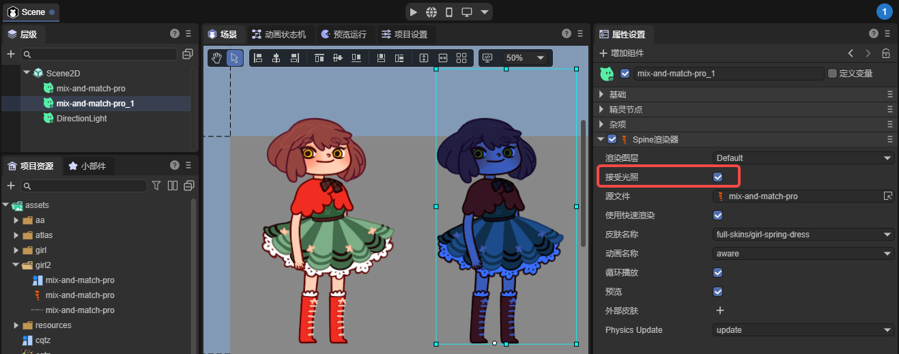
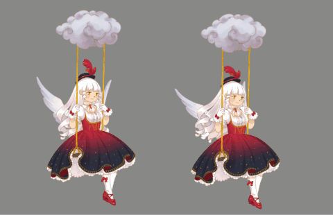
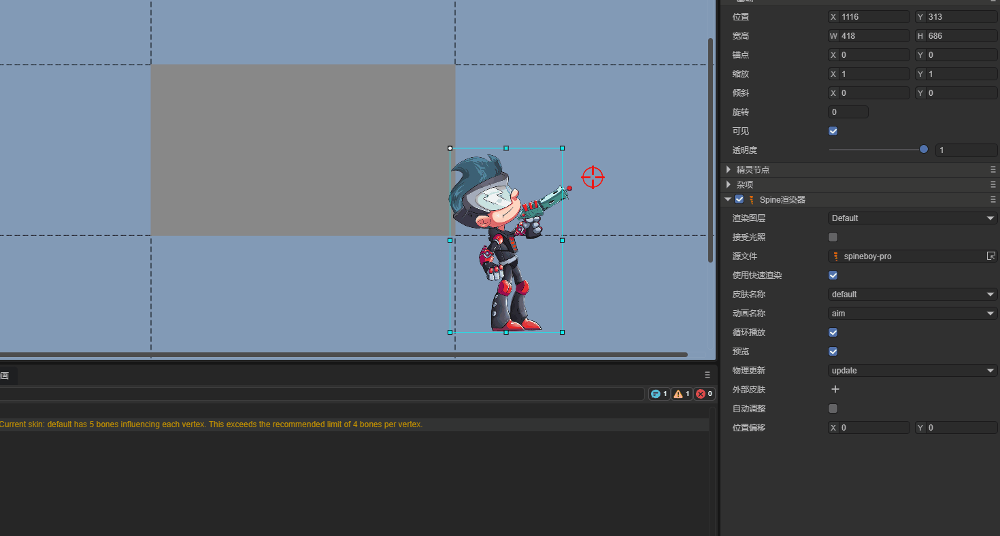
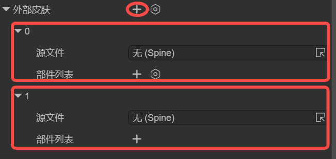
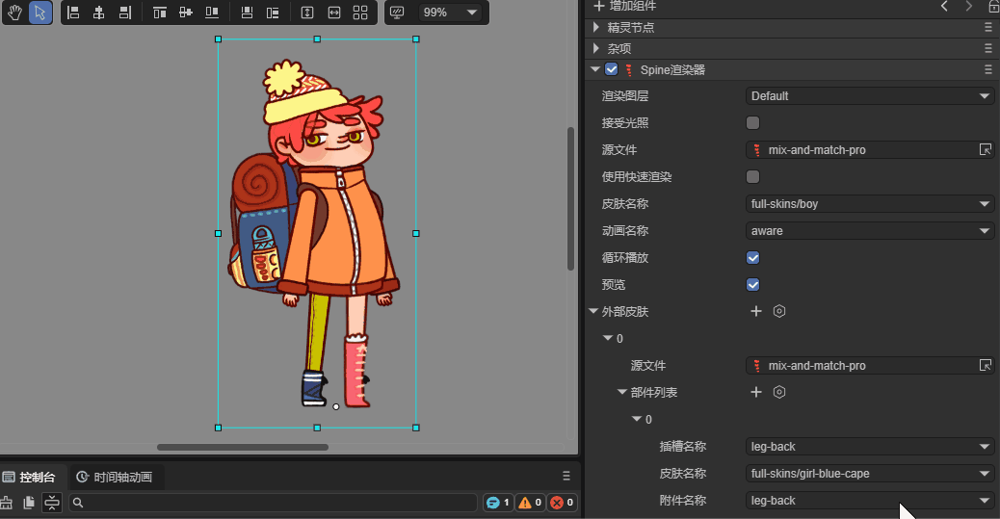
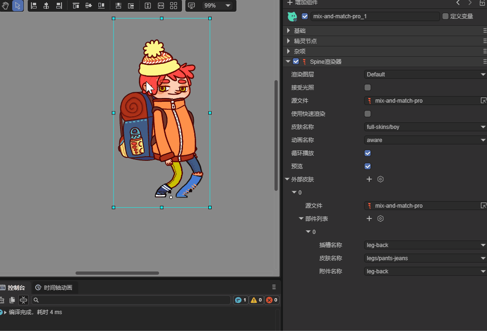

# Spine Renderer (`Spine2DRenderNode`)

> Author: Charley

## 1. Getting Started with Spine

Spine is a professional 2D skeletal animation tool widely used in game development. It adopts a bone-driven animation approach, using keyframe interpolation and mesh deformation to make character or object animations smoother and more resource-efficient than frame-by-frame animation.

> How to create Spine skeletal animations is not covered in this article. Interested developers can visit the [Spine website](https://esotericsoftware.com/spine-academy) to learn more.

### 1.1 Which Spine Runtimes Are Supported

Spine mainly consists of two parts: the Spine editor and Spine runtime. The Spine editor is used to create and adjust animations, supporting importing bitmap resources, binding bones, adjusting keyframes, and setting animation parameters.

Spine runtime is a series of open-source libraries officially provided. The LayaAir engine integrates Spine animation rendering by introducing the Spine runtime.

Currently, LayaAir supports Spine runtime library versions 3.7, 3.8, 4.0, 4.1, and 4.2. Developers can select the corresponding Spine runtime version through the IDE's `Project Settings` → `Engine Module` → 2D → Spine Animation. The operation interface is shown in Figure 1-1.


(Figure 1-1)

**Note**: The IDE cannot automatically identify the Spine version. Therefore, developers need to manually select the corresponding version of the runtime library based on the Spine resource version to ensure correct Spine operation.

### 1.2 Basic Spine Usage Workflow

After placing Spine resources in the resource directory (assets), you can directly drag Spine files (`.skel` or `.json`) to the hierarchy panel for use. At this time, a 2D sprite node will be automatically created, and a `Spine Renderer` component will be automatically created on this node, with the Spine source file path pointing to the dragged Spine resource by default. As shown in Figure 1-2.


(Figure 1-2)

Of course, developers can also add a `Spine Renderer` component to an already created node by adding a component. The operation is shown in Animated Figure 1-3.


(Figure 1-3)

If the Spine component is added normally and the Spine resource is specified, but **cannot be displayed in the IDE**, it's usually because the runtime library version is incorrect. You need to first confirm the Spine resource version and select the correct Spine runtime library version as shown in Figure 1-1.

When dynamically loading and using through code, you also need to pay attention to the Spine resource's runtime library version.

An example of dynamic code addition is as follows:

```typescript
const { regClass, property } = Laya;
@regClass()
export class Demo extends Laya.Script {
    spine: Laya.Spine2DRenderNode;
    //Executed after component is activated, at this time all nodes and components have been created. This method only executes once
    onAwake(): void {
        // Load Spine animation data resource (json file). Note: must be set to Laya.Loader.SPINE type, otherwise json won't be recognized as SPINE resource
        Laya.loader.load("girl2/mix-and-match-pro.json", Laya.Loader.SPINE).then(() => {
            // Add Spine renderer component to sprite node
            this.spine = this.owner.addComponent(Laya.Spine2DRenderNode);
            this.spine.source = "girl2/mix-and-match-pro.json"; // Set Spine animation data source
            this.spine.skinName = "full-skins/girl"; // Set skin name
            this.spine.play("idle", false); // Play animation named "idle", false means don't loop
        });
    }
}
```

## 2. Spine Panel Property Description

### 2.1 Render Layer layer

The render layer is mainly used for whether it's affected by the 2D lighting system and other render layer related logic effects.

For example, after setting the render layer to `abc`, as shown in Figure 2-1. When allowing lighting reception, the current node's Spine animation can be affected by 2D lights with the `Layer Mask` set to `abc`.


(Figure 2-1)

> For how lights affect render layers, please refer to the ["2D Lighting"](../../BaseLight2D/readme.md) documentation

### 2.2 Receive Lighting lightReceive

By default, Spine is not affected by lighting. Only after checking "Receive Lighting" will it be affected by lights.

As shown in Figure 2-2, two identical Spine animations. The Spine on the right is affected by a blue 2D directional light.



(Figure 2-2)

### 2.3 Source File source

The resource file path for Spine animation. Resource format is `.skel` or `.json`.

### 2.4 Use Fast Render useFastRender

The Spine component enables fast render by default. In this state, it adopts a series of optimization strategies such as GPU computation, significantly improving Spine animation performance.

However, this optimization strategy balances performance and memory by limiting the number of bones per vertex. That is, the bone control count per vertex cannot exceed 4.

When a vertex's bone control count exceeds 4, rendering abnormalities may occur. The engine will also issue a warning. As shown in Figure 2-3.


(Figure 2-3)

When rendering abnormalities occur, you can uncheck `Use Fast Render` to restore the normal rendering process. However, we recommend adjusting Spine art resources to obtain optimal animation playback performance.

### 2.5 Skin Name skinName

When multiple skins exist in Spine, by switching different skin names, you can preview the effects of different skins in the IDE. As shown in Figure 2-4.


(Figure 2-4)

Developers can also dynamically switch between different skins through code based on logic.

Example code is as follows:

```typescript
const { regClass, property } = Laya;

@regClass()
export class NewScript extends Laya.Script {
    spine: Laya.Spine2DRenderNode;
    onEnable(): void {
        //Get the spine component mounted on the IDE node
        this.spine = this.owner.getComponent(Laya.Spine2DRenderNode);
        let currentSkin: string = this.spine.skinName; // Record current skin state
        //Execute logic after playback stops
        this.owner.on(Laya.Event.STOPPED, this, () => {
            // Switch skin name through ternary operator
            currentSkin = currentSkin === "full-skins/girl" ? "full-skins/girl-blue-cape" : "full-skins/girl";
            this.spine.skinName = currentSkin;
            this.spine.play("idle", false); //Replay once after switching
            console.log(`Current skin switched to: ${currentSkin}`);
        });
    }
}
```

### 2.6 Animation Name animationName

In the previous example code, we played animations directly through the play method. For easier use in the IDE panel, we provide the accessor `animationName` which encapsulates the play method.

This allows developers to directly view all current Spine animation names in the IDE panel, used to switch and view animation effects with different names. The effect is shown in Figure 2-5.


(Figure 2-5)

### 2.7 Loop loop

Like animationName (animationName), loop is also a play method encapsulated for IDE visual operations to control whether to loop playback.

Checking means loop playback. Unchecking means play only once.

### 2.8 Preview preview

Preview is not an engine function. It's an IDE feature to control whether to play animation in scene editing mode.

Checking means playing Spine animation. Unchecking means not playing animation, only showing static frames.

### 2.9 Physics Update physicsUpdate

> Physics simulation functionality is only effective on Spine 4.2 and above versions. We currently only support setting none and update parameters.

- none: Don't use physics simulation;

- update: Enable physics update. After enabling, the animation's final pose is no longer completely determined by the timeline but will be affected by physics effects.

As shown in Animated Figure 2-6, the girl on the right, after `enabling physics update`, has her hair and dress affected by physics force, swinging naturally.



(Figure 2-6)

Specific physics parameters need to be set in the Spine editor. LayaAir only determines whether to enable it.

### 2.10 Auto Adjust autoAdjust
After enabling **Auto Adjust**, the engine reads the origin (0,0) from the Spine file and automatically calculates the node's anchor point based on this, keeping it consistent with the origin in the Spine editor.

This way, developers can easily complete operations like animation mirroring and rotation based on the anchor point. As shown in Animated Figure 2-7.



(Figure 2-7)

It's important to note that **after enabling this feature, the anchor point setting of the node where the Spine component is located will no longer take effect.**

If you still need additional position offset, you can use Spine's offset property or wrap it in an outer node for adjustment.

### 2.11 Offset offset

When the position calculated by **Auto Adjust** still has deviations from expectations, you can use **Offset** for precise fine-tuning of the final display position.

### 2.12 Premultiplied Alpha `premultipliedAlpha`

Usually, the LayaAir engine reads the Spine animation and 'Premultiplied Alpha' settings in the IDE, performing premultiplication processing on Spine textures based on the settings. Sometimes, the developer's images have already undergone premultiplied alpha processing, but neither Spine nor the IDE has the premultiplied alpha option checked. At this time, the engine will make incorrect judgments and processing. Enabling this option explicitly tells the engine that premultiplied alpha processing needs to be enabled.

## 3. External Skins externalSkins (Part Replacement)

The main function of `External Skins` is to introduce other Spine resources to replace attachments under different skins on the current Spine slots.

> External skin functionality doesn't support using fast render mode (useFastRender)

### 3.1 Introducing External Skin Resources

Each click on the `+` sign to the right of `External Skins` creates a sub-object property containing `Source File` and `Part List`. As shown in Figure 3-1.



(Figure 3-1)

The `Source File` in the sub-object list is the Spine resource file. The skins and attachments in the `Part List` are obtained from that source file.

In principle, each sub-object's `Source File` should correspond to a different Spine resource file and should not be duplicated. Because the engine will apply to every setting in the list, duplicate resource settings will override the previous identical setting.

It should be noted that the function of external skins is to replace attachments under another skin outside the current component's Spine skin.

If there are multiple sets of skins in the Spine resources under the current component, they can still be referenced in the external skin's sub-object list. As shown in Figure 3-2, just be careful not to reuse them in sub-objects.


(Figure 3-2)

### 3.2 Replacing Different Parts

The `Part List` in the `External Skins` sub-object list is used to handle which attachment under which skin in the source file corresponding to the current sub-object corresponds to which slot.

#### 3.2.1 Slot Name slot

`Slot Name` is the list of all slots in the current component's Spine resource file. Developers can select the corresponding slot name from the list to replace whichever slot they want. As shown in Figure 3-3.


(Figure 3-3)

#### 3.2.2 Skin Name skin

`Skin Name` comes from the complete skin list corresponding to the `Source File` in the `External Skins` sub-object.

In Spine, under the same skin, there will be different attachments. The effect is shown in Animated Figure 3-4.


(Figure 3-4)

Or rather, the same attachment name has different appearances under different skins. The effect is shown in Animated Figure 3-5. Switching different skin names changes the appearance of the right leg's skin.



(Figure 3-5)

#### 3.2.3 Attachment Name attachment

To facilitate needs like changing outfits or weapons, Spine is usually split into individual parts. This part has a professional term in Spine called `attachment`. Attachments need to be connected through slots. The effect is shown in Animated Figure 3-6.



(Figure 3-6)

### 3.3 Code Example for Replacing Parts

Visual operations are usually used to preview effects or change default settings. Replacing attachments is more commonly controlled through code, such as changing weapons.

Example code is as follows:

```typescript
const { regClass, property } = Laya;

@regClass()
export class NewScript extends Laya.Script {

    @property({ type: Laya.Button, caption: "Switch Button" })
    public btn: Laya.Button;

    spine: Laya.Spine2DRenderNode;

    //External skin
    weaponSkin: Laya.ExternalSkin = new Laya.ExternalSkin();
    //External skin list item
    weaponSkinItem: Laya.ExternalSkinItem = new Laya.ExternalSkinItem();


    //Executed after component is activated, at this time all nodes and components have been created. This method only executes once
    onAwake(): void {
        // Load Spine animation resources
        Laya.loader.load(["spine4.1/boss.json", "spine4.1/role.json"], Laya.Loader.SPINE).then(() => {
            // Add Spine renderer component to sprite node and return Spine renderer component after adding
            this.spine = this.owner.addComponent(Laya.Spine2DRenderNode);
            this.spine.source = "spine4.1/role.json"; // Set Spine animation data source
            this.spine.skinName = "default"; // Set skin name
            this.spine.play("att", true); // Play attack animation named "att", true means loop playback

            this.btn.on(Laya.Event.CLICK, this, this.changeAttachment); //Listen for click event to trigger weapon switching method

            //The following basic settings can be set in the IDE, so code doesn't need to add them. This is only to demonstrate code usage
            //Set external skin object
            this.spine.externalSkins = [this.weaponSkin];
            // Set data for external skin object
            this.weaponSkin.source = "spine4.1/boss.json"; // Set external skin data source
            this.weaponSkin.items = [this.weaponSkinItem];// Set external skin list item
            // Set data for external skin list item
            this.weaponSkinItem.slot = "taidao"; // Set slot name
            this.weaponSkinItem.skin = "default"; // Set skin name

        });
    }

    //Change weapon
    changeAttachment(): void {
        // Switch weapon based on current attachment state
        const newAttachment = this.weaponSkinItem.attachment === "weapon_1" ? "weapon_3" : "weapon_1";
        this.setAttachment("taidao", "default", newAttachment);
        console.log(`Switched to ${newAttachment}`);
    }

    //Set weapon attachment
    setAttachment(slot: string, skinName: string, attachmentName: string): void {
        this.weaponSkinItem.slot = slot; // Set slot name
        this.weaponSkinItem.skin = skinName; // Set skin name
        this.weaponSkinItem.attachment = attachmentName; // Set attachment name
        this.spine.resetExternalSkin(); // Reset loaded external skin to make settings take effect
    }
}
```

The code running effect is shown in Animated Figure 3-7.


(Figure 3-7)

## 4. Common Precautions (Must Read)

### 4.1 Playback Issues Caused by Asynchronous Loading

Sometimes, due to comprehensive reasons such as slightly larger Spine resources and slow user network speeds, the code controlling the Spine component may fail or error. This is because when lifecycle methods like onAwake and onEnable execute, the resource is still in asynchronous loading and hasn't finished loading yet. So usage problems occur.

The solution is to put slightly larger Spine resources in the preload queue and load them in advance.

Or listen to the `Laya.Event.READY` event before processing logic.

### 4.2 Must Specify Type When Loading Spine JSON

If developers load binary Spine resources, they can omit the type because Spine's binary suffix is quite unique and can be directly identified by the engine internally. However, JSON type is a general resource type that the engine cannot specify internally. Therefore, developers must specify the Spine type as `Laya.Loader.SPINE` type when loading. Example is as follows:

```typescript
// Load Spine animation data resource (json file). Note: must be set to Laya.Loader.SPINE type, otherwise json won't be recognized as SPINE resource
Laya.loader.load(["aa.json", "bb.json"], Laya.Loader.SPINE);
```

### 4.3 Display Differences with Transparent Blending

Some developers report that effects seen in Spine differ from engine effects. Common manifestations include insufficient brightness andnot obvious semi-transparent areas.

Actually, the above problems are almost all caused by texture configuration for transparent blending. Especially version 3.1 might be normal, but differences start appearing from 3.2.

Since LayaAir 3.2 started, distinctions were made between spine premultiplied and non-premultiplied blending methods.

If Spine has transparent blending needs, you cannot use the sprite texture texture type. You need to make the following changes to Spine resources in the IDE project:

- In the project resource panel, select textures in Spine resources.
- On the Spine texture's property panel, change the texture type to default type.
- Check sRGB color space
- Be careful not to check Premultiplied Alpha (also don't check when exporting from Spine)
- Click Apply

The above operations are shown in Figure 4-1:


(Figure 4-1)

Note: If the effect is incorrect after applying, refresh the IDE.
Also, if there are multiple Spines, you can select multiple textures and set them all at once. Or developers can write an IDE plugin to automatically handle the above operations.

### 4.4 Don't Actively Load Spine's Atlas and PNG

When developers preload Spine's atlas in code or in the IDE's Scene2D, warnings similar to the following will appear at runtime.

```sh
Failed to load 'http://localhost:18094/resources/ddlx_02/ddlx_02.atlas' Unexpected token 'd', "ddlx_02.pn"... is not valid JSON
```

This is because, although Spine's atlas and our engine's atlas file atlas have the same name, they're not the same thing. Our atlas information is in JSON format, while Spine's is not. So when loading, finding that the atlas isn't JSON, it reports the `"... load 'xxx.atlas'....is not valid JSON"` warning.

When developers load Spine, they only need to load the Spine main file (`.skel` or `.json`). Atlas and PNG don't need to be actively loaded by developers. The engine will automatically load associated resources based on the Spine main file.
