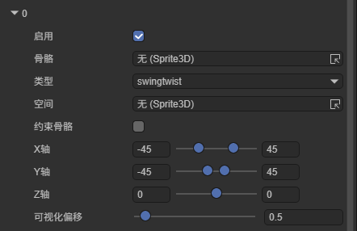
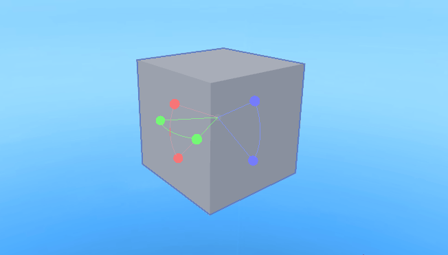
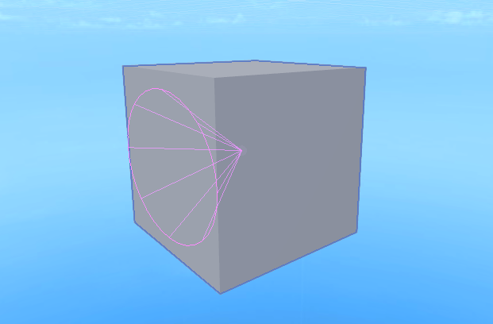

# Bone Constraints

## 1. Introduction

Bone constraints are a mechanism used to control and limit bone behavior. It's like adding a layer of "rules" to bones, allowing them to move automatically according to specific logic and avoiding unnatural poses. In the engine, the bone constraint component needs to be used in conjunction with the IK system.

Before reading this article, it's recommended that developers first understand [IK Chains](././ChainsIK/readme.md).

## 2. Creating Bone Constraints

The bone constraint component needs to be added to a node that already has an IK component to function properly.

In the property settings panel, click "Add Component" and you can find the bone constraint component in the animation options.

After adding the component, you also need to create bone constraints. Click the plus button to create:

## 3. Bone Constraint Properties

Bone constraints have the following properties:

`Enabled`: Whether to enable this constraint.

`Bone`: The bone node to be constrained.

`Type`: The type of constraint. There are three types: `hinge`, `euler`, and `swingtwist`.

​	`hinge`: The simplest constraint, similar to the structure of a book page turning, only allowing the bone to rotate around a fixed axis.

​	`euler`: Limits the rotation range of X, Y, and Z axes separately, suitable for joints that need independent control of three-axis rotation.

​	`swingtwist`: Decomposes rotation into two independent components: swing and twist. The swing component forms a conical constraint area, while the twist component rotates the bone around an axis. Generally used to simulate human ball-and-socket joints (such as shoulders).

`Space`: Constraint space, which defines the reference coordinate system for the constraint, affecting the direction and behavior of the constraint. When `space` is null, the constraint space aligns with the parent bone but preserves the current bone's position offset.

`Constrain Bone`: Whether to constrain bone direction.

`X Axis`: X-axis rotation angle range.

`Y Axis`: Y-axis rotation angle range.

`Z Axis`: Z-axis rotation angle range.

`Visual Offset`: Visualization height in `swingtwist` mode.

## 4. Editing Tools

Click the bone constraint's display editing tool button to display the bone constraint in the scene. Depending on the type selected for the bone constraint, the editing tool displays different content.

**hinge mode:**

In this mode, only the X-axis rotation angle range can be set, so the editing tool displays only one set of angles. Click and drag the white ball to adjust the upper and lower limits of the rotation range.

**euler mode:**

In this mode, the rotation range can be set separately for each of the three axes, so the editing tool displays three sets of angles. Click and drag the corresponding colored ball to change the rotation range of the corresponding axis.

**swingtwist mode:**

In this mode, the range cannot be changed by clicking and dragging. The editing tool only provides a preview of the range effect.
