# Inverse Kinematics

## 1. Introduction

For general animations, the engine reads data from animation files and sets it to the corresponding joints of the model skeleton. In this process, the position of child joints changes based on the position and rotation of parent joints. This is a process from root to tip, which we generally call `Forward Kinematics (FK)`.

`Inverse Kinematics (IK)` is the opposite process. Developers only need to set the position of the end node, and the engine automatically calculates the rotation and position of other nodes.

Compared to `Forward Kinematics (FK)`, `Inverse Kinematics (IK)` is more flexible. For example, if a character needs to move their arm, using `FK` requires creating an animation file. If you want the arm to move to another position, you need to create another animation file. If the character's arm needs to reach random positions, using `FK` is very difficult because developers cannot create an infinite number of animations. However, using `IK` doesn't have this problem. No matter where the character's arm needs to reach, developers only need to set the palm position, and the engine will automatically calculate the positions of nodes like the forearm and upper arm.

> You can see that after moving the cube node, the character's arm follows the cube's movement.

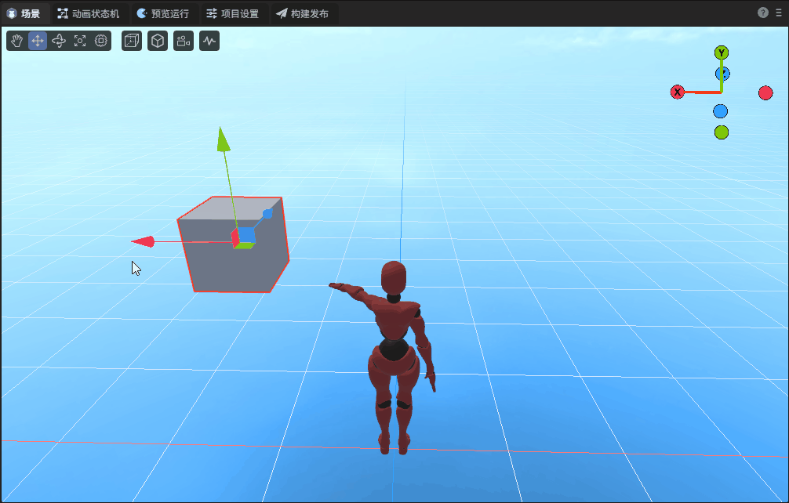

## 2. Creating ChainsIK

Select a node, click "Add Component" in the property settings panel, and you can find ChainsIK in the animation options.

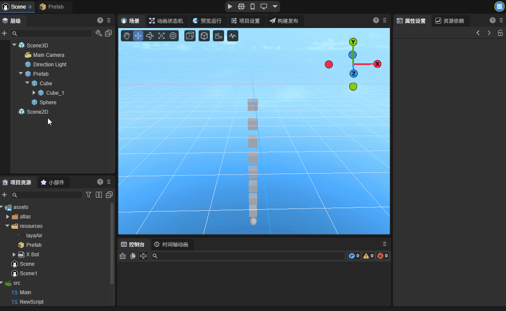

The ChainsIK component can be added to any 3D node, with no special requirements for node hierarchy. Developers can use it conveniently. The added component is shown in the figure below.

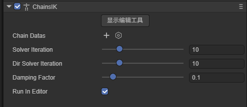

## 3. ChainsIK Properties

### 3.1 Creating Chain Datas

Click the plus button on the right side of Chain Datas to create a Chain Datas instance.

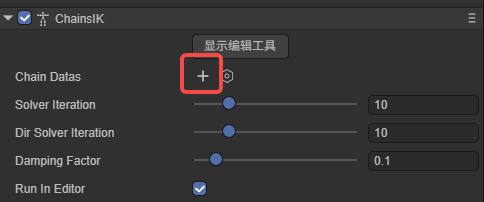

The content after creation is shown in the figure:

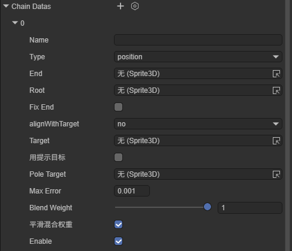

`Name`: The name of the bone data, defined by the developer. After setting the name, the corresponding Chain can be obtained through the `getChain(name: string)` method on the IK component. If not set, it defaults to using the `end` node's name.

`Type`: Type. There are two types: `position` and `lookAt`.

​	`position`: Position mode. In this mode, the end node of the chain will try to reach the set spatial coordinates as much as possible.

​	`lookAt`: Look-at mode. In this mode, the end node of the chain no longer tries to reach the target space, but the z-axis of the bone always points to the target point.

`End`: The endmost node in the IK chain, which is also the directly controlled part.

`Root`: The highest-level parent node in the IK chain.

`BoneDatas`: Bone data. After setting `End` and `Root`, the component will automatically retrieve the nodes between these two nodes and generate bone data. IK calculations are only performed when checked.

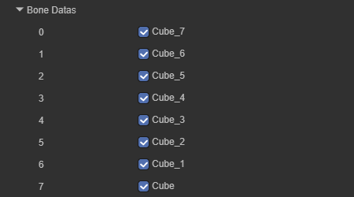

`FixEnd`: Whether to fix the parent joint of the end. When checked, the second-to-last joint doesn't participate in calculations.

`alignWithTarget`: End orientation alignment mode.

​	`no`: No alignment, only position following.

​	`y`: Y-axis alignment, commonly used for hand direction.

​	`all`: Full alignment, both position and rotation match the target.

`Target`: Target object. The IK chain will follow this object's position/orientation. Note that `Target` cannot be set to a node on `BoneDatas` or its child nodes, otherwise it will cause errors.

`enablePoleTarget`: Whether to enable the pole target.

`PoleTarget`: Pole target. For an IK chain, the same target position may have multiple joint configurations. When the position of `Target` remains unchanged, joints can bend either left or right. After setting `PoleTarget`, the joint will try to face this object, which can be used to prevent unnatural bending directions of elbows/knees.

`MaxError`: Maximum allowed error. IK functionality uses iterative algorithms to approach the target. Setting the maximum error can save calculation times and improve performance.

`blendWeight`: IK blend weight. Controls the blend ratio between IK solution results and animation data. When the value is 0, IK is completely disabled; when the value is 1, IK completely takes over the animation.

`smoothBlendWeight`: Smooth blend weight. When `blendWeight` changes, smoothly transition to the new value. The smaller the value, the smoother the transition, used to prevent jumps caused by sudden weight changes.

`Enable`: Whether to enable this data chain.

### 3.2 Display Editing Tools

After clicking "Show Editing Tool", corresponding properties will be displayed in the property settings panel.

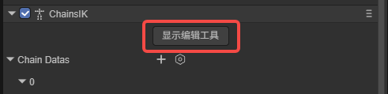

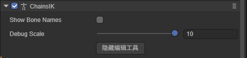

`ShowBoneNames`: Display bone names. When checked, bone names will be displayed at the starting point of bones.

​	`BoneNameScale`: Bone name scale. Displayed when `ShowBoneNames` is checked, used to adjust the size of bone names.

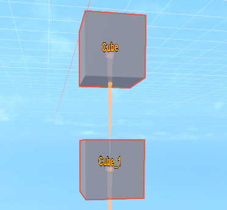

`DebugScale`: Scale. Controls the display size of bone chains, which can be adjusted according to needs.

In the scene, bone chains will be displayed based on node hierarchy. General bone chains will be displayed in white, while bone chains included in ChainDatas will be displayed in yellow.

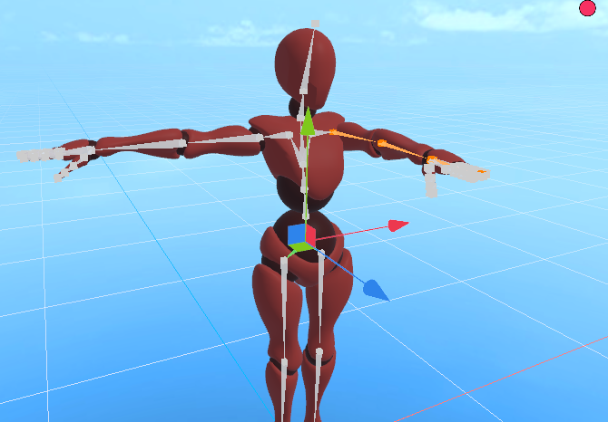

`ShowBoneNames`: Display bone names. When checked, bone names will be displayed at the starting point of bones.

`DebugScale`: Scale. Controls the display size of bone chains, which can be adjusted according to needs.

### 3.3 Other Properties

In addition to the various properties on Chain Datas, there are some properties on the IK component.

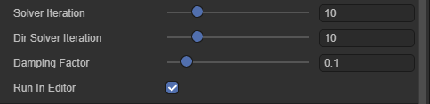

`SolverIteration`: Solver iteration count. This property controls the maximum number of IK solutions, used to balance solution accuracy and performance.

`DirSolverIteration`: Maximum iteration count for IK chains in `lookAt` mode.

`DampingFactor`: Damping factor, controls the smoothness of solutions. The smaller the value, the smoother the motion but slower convergence; the larger the value, the faster the response but may cause jitter.

`RunInEditor`: Whether to run in the editor.

## 4. Using ChainsIK

Here we demonstrate the basic usage flow of IK through a simple example.

Add a basic character model to the scene.

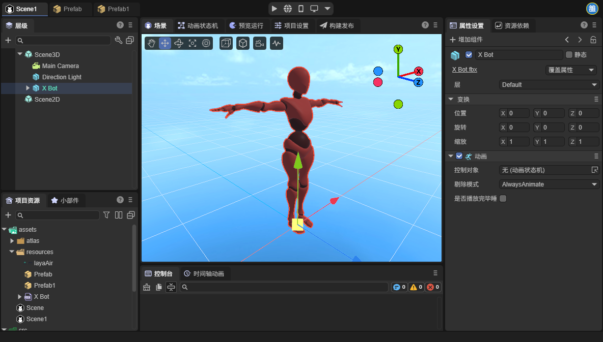

Next, let's clarify our goal: control the movement of the character's left arm through IK functionality.

First, add an IK component to the character's root node and create a ChainDatas:

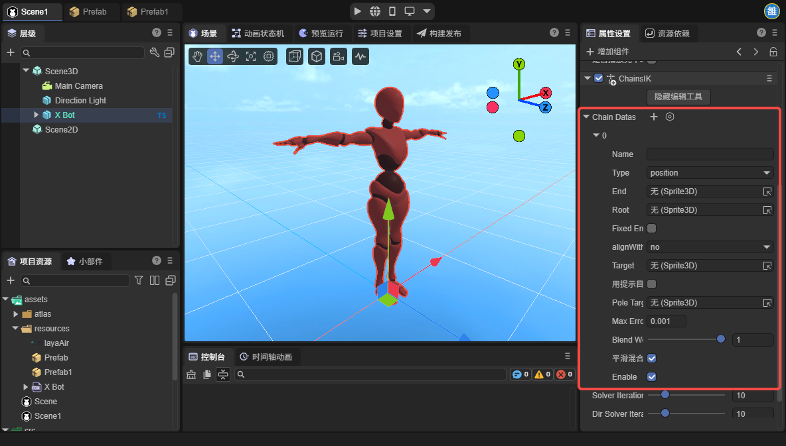

Expand the character's node hierarchy and find the node corresponding to the character's left arm. Set the left arm's root node to `Root`. Here we don't control finger nodes, so the end node of the bone chain is the palm node.

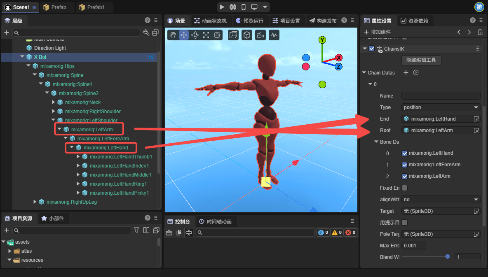

Add a node to the scene as a target node and move this node in front of the character:

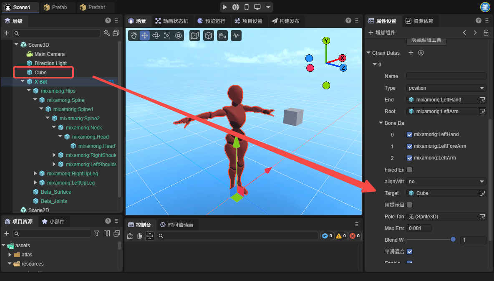

Here you can see that the character's arm already has movement, but the hand movement is not normal:

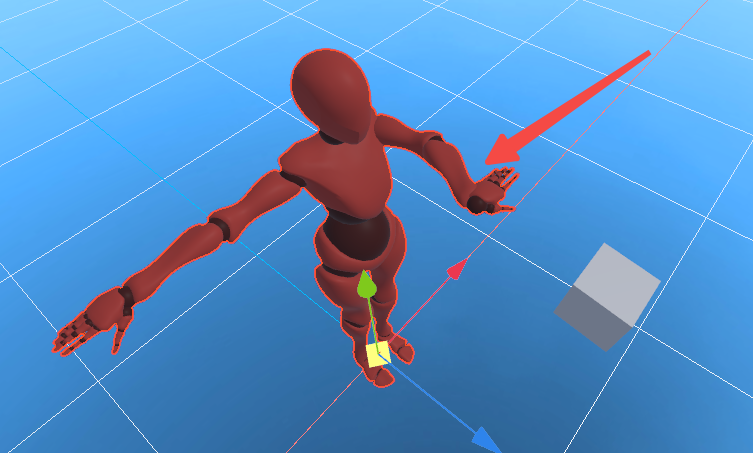

This is because the palm node as the end node is not rotated. We can solve this problem by adding an empty node. Find the node corresponding to the left palm, add a child node under this node, and adjust this node to the position of the fingertip:

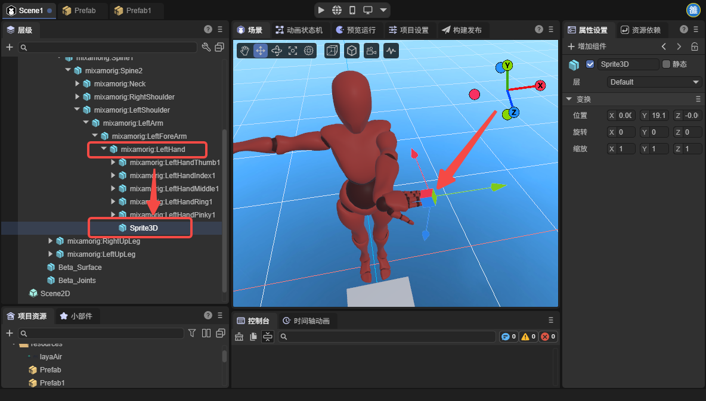

Then set this node as the IK's `End` node:

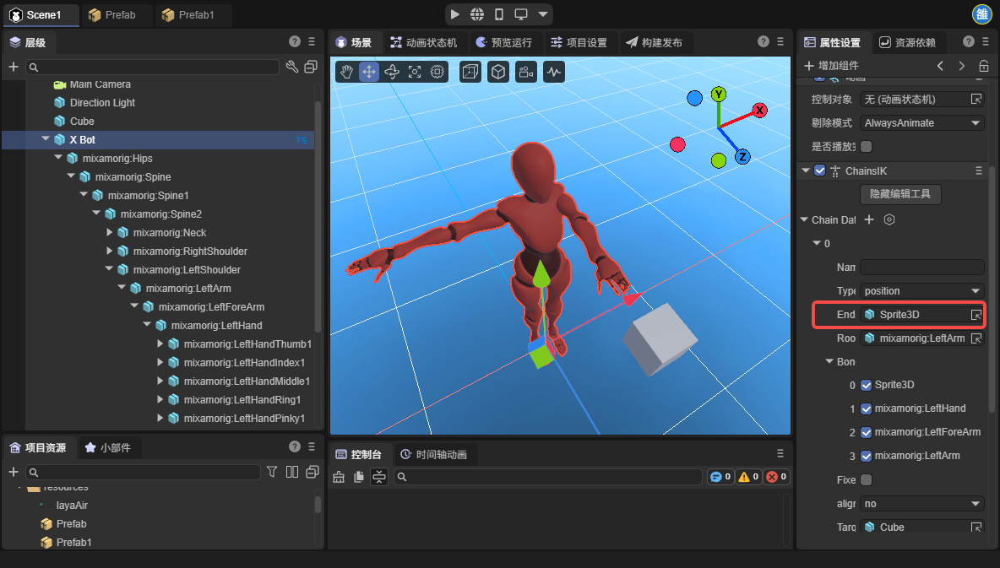

At this point, you can see that the palm node's effect returns to normal.
