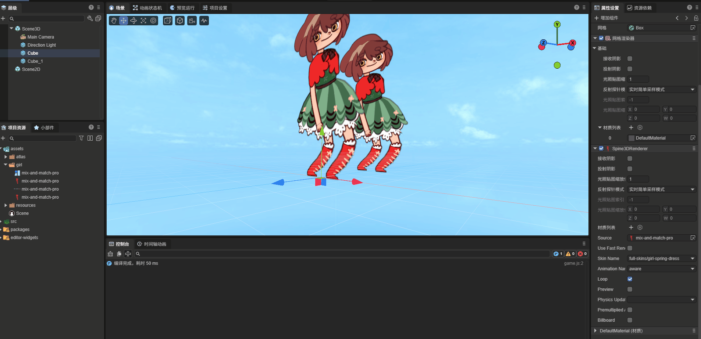
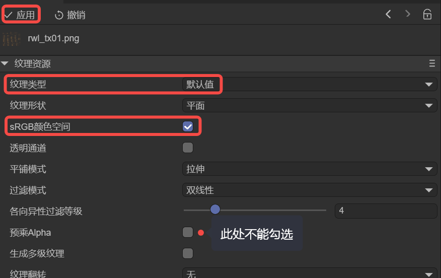

# Spine3D Renderer (`Spine3DRenderer`)

## 1. Getting Started with Spine3D

The Spine3D renderer is a component in the LayaAir engine used for playing Spine animations in 3D scenes. Compared to the 2D Spine renderer, the 3D version can control Spine animation display more flexibly in 3D space, supporting camera-facing, depth testing, lighting effects, and other 3D features.

> How to create Spine skeletal animations is not covered here. Interested developers can visit the [Spine website](https://esotericsoftware.com/spine-academy) for more information.

### 1.1 Which Spine Runtimes Are Supported

The Spine3D renderer shares the same Spine runtime library as the 2D Spine renderer. Currently, LayaAir supports Spine runtime libraries for versions 3.7, 3.8, 4.0, 4.1, and 4.2. Developers can select the corresponding Spine runtime version through `Project Settings` -> `Engine Modules` -> 3D -> Spine3D in the IDE, as shown in Figure 1-1.


(Figure 1-1)

**Note**: The IDE cannot automatically identify the Spine version, so developers need to manually select the corresponding version of the runtime library based on the Spine resource version to ensure correct Spine3D operation.

### 1.2 Basic Spine3D Usage Flow

Developers need to add the `Spine3D Renderer` component to a node by adding a component to an already created 3D node, as shown in Animated Figure 1-2.


(Animated Figure 1-2)

If the Spine3D component is added normally and the Spine resource is specified, but it doesn't display in the IDE, **usually the runtime library version is incorrect**. You need to first confirm the Spine resource version and select the correct version of the Spine3D runtime library as shown in Figure 1-1.

When dynamically loading and using through code, you also need to pay attention to the runtime library version of Spine resources.

An example of dynamic code addition is as follows:

```typescript
const { regClass, property } = Laya;
@regClass()
export class Demo extends Laya.Script {
    spine3D: Laya.Spine3DRenderer;
    // Executed after the component is activated, at which point all nodes and components have been created. This method only executes once.
    onAwake(): void {
        // Load Spine animation data resource (json file). Note: Must be set to Laya.Loader.SPINE type, otherwise the json won't be recognized as a SPINE resource
        Laya.loader.load("girl2/mix-and-match-pro.json", Laya.Loader.SPINE).then(() => {
            // Add Spine3D renderer component to 3D sprite node
            this.spine3D = this.owner.addComponent(Laya.Spine3DRenderer);
            this.spine3D.source = "girl2/mix-and-match-pro.json"; // Set Spine animation data source
            this.spine3D.skinName = "full-skins/girl"; // Set skin name
            this.spine3D.play("idle", false); // Play animation named "idle", false means don't loop
        });
    }
}
```

## 2. Spine3D Panel Properties

### 2.1 Source File source

The resource file path for the Spine animation, in `.skel` or `.json` format.

### 2.2 Use Fast Render useFastRender

The Spine3D component enables fast rendering by default. In this state, it uses a series of optimization strategies such as GPU computation to significantly improve Spine animation performance.

However, to balance performance and memory, this optimization strategy limits the number of bones per vertex, meaning the bone control count for a single vertex cannot exceed 4.

When the bone control count for a vertex exceeds 4, rendering abnormalities may occur. The engine will also provide warning reminders.

When rendering abnormalities occur, you can uncheck `Use Fast Render` to restore the normal rendering process. However, we recommend adjusting Spine art resources to achieve optimal animation playback performance.

### 2.3 Skin Name skinName

When there are multiple skin sets in Spine, switching different skin names allows you to preview different skin effects in the IDE, as shown in Figure 2-1.


(Figure 2-1)

Developers can also dynamically switch different skins through code based on logic.

Example code is as follows:

```typescript
const { regClass, property } = Laya;

@regClass()
export class NewScript extends Laya.Script {
    spine3D: Laya.Spine3DRenderer;
    onEnable(): void {
        // Get the spine3D component mounted on the IDE node
        this.spine3D = this.owner.getComponent(Laya.Spine3DRenderer);
        let currentSkin: string = this.spine3D.skinName; // Record current skin state
        // Execute logic after playback stops
        this.owner.on(Laya.Event.STOPPED, this, () => {
            // Switch skin name through ternary operator
            currentSkin = currentSkin === "full-skins/girl" ? "full-skins/girl-blue-cape" : "full-skins/girl";
            this.spine3D.skinName = currentSkin;
            this.spine3D.play("idle", false); // Re-play once after switching
            console.log(`Current skin switched to: ${currentSkin}`);
        });
    }
}
```

### 2.4 Animation Name animationName

In the example code earlier, we played animations directly through the play method. For easier use in the IDE panel, we provide an accessor `animationName` that encapsulates the play method.

This allows developers to directly view all current Spine3D animation names in the IDE panel, used to switch and view animation effects of different names. The effect is shown in Figure 2-2.


(Figure 2-2)

### 2.5 Loop Playback loop

Like animationName (animationName), loop playback (loop) also encapsulates the play method for controlling whether to loop playback, for visual operation within the IDE.

Checked means loop playback, unchecked means play only once.

### 2.6 Face Camera billboard

**Face Camera** is a unique feature of the 3D Spine renderer. When enabled, the Spine3D animation will always face the camera direction, similar to a billboard effect.

This is very useful for UI elements or effects that need to always face the player in 3D scenes. For example, damage numbers, floating text, indicator markers, etc. in games can all use this feature.

After enabling `Face Camera`, no matter how the camera moves or rotates, the Spine3D animation will automatically adjust its orientation to keep facing the camera. The effect is shown in Figure 2-3.



(Animated Figure 2-3)

### 2.7 Premultiplied Alpha premultipliedAlpha

Normally, the LayaAir engine reads the 'Premultiplied Alpha' settings from Spine animations and the IDE, and performs premultiplication processing on Spine textures according to the settings. Sometimes, the developer's images themselves have already undergone premultiplied alpha processing, but neither Spine nor the IDE has the premultiplied alpha option checked. In this case, the engine will make incorrect judgments and processing. Enabling this option explicitly tells the engine to enable premultiplied alpha processing.

### 2.8 Render Size renderSize
> This feature needs to be enabled in code

**Render Size** is used to control the display size of Spine3D animations. By setting the width (X) and height (Y) parameters, you can precisely adjust the display ratio of Spine3D.

When render size is not set, Spine3D will use the original dimensions of the Spine resource file. After setting render size, it will display according to the specified dimensions.

### 2.9 Enable Cache enableCache
> This feature needs to be enabled in code

**Enable Cache** is a performance optimization feature of the 3D Spine renderer. When enabled, the rendering data of Spine3D animations will be automatically cached, improving the performance of repeated playback.

After enabling cache, each frame of the animation will be cached. When playing the same animation again, the cached data can be used directly without recalculation, significantly improving performance.

### 2.10 Physics Update physicsUpdate

> Physics simulation functionality is only effective in Spine 4.2 and above.

Physics update is used to enable Spine's physics effects. When enabled, the final pose of the animation is no longer completely determined by the timeline, but will be affected by physics effects.

Unlike 2D Spine, 3D Spine's physics update can interact through the `physicsTranslate` method, supporting moving objects based on given coordinates.

## 3. Common Considerations (Must Read)

### 3.1 Playback Issues Caused by Asynchronous Loading

Sometimes due to comprehensive reasons such as slightly larger Spine resources and slower user network speeds, code controlling the Spine3D component may fail or error. This is because when lifecycle methods like onAwake and onEnable execute, the resources are actually still in asynchronous loading and haven't finished loading yet, so usage problems occur.

The solution is to put larger Spine resources into the preload queue and load them in advance.

Or listen to the `Laya.Event.READY` event before processing logic.

Example code is as follows:

```typescript
const { regClass, property } = Laya;

@regClass()
export class Demo extends Laya.Script {
    spine3D: Laya.Spine3DRenderer;
    onAwake(): void {
        // Load Spine animation data resource
        Laya.loader.load("spine/role.json", Laya.Loader.SPINE).then(() => {
            this.spine3D = this.owner.addComponent(Laya.Spine3DRenderer);
            this.spine3D.source = "spine/role.json";
        });

        // Listen for READY event
        this.owner.on(Laya.Event.READY, this, () => {
            console.log("Spine3D resource loading completed");
            this.spine3D.play("idle", true);
        });
    }
}
```

### 3.2 Must Specify Type When Loading Spine Json

If developers load binary Spine resources, they can omit the type because Spine's binary suffix is quite unique and can be directly specified by the engine internally. However, JSON type is a general resource type that the engine cannot internally specify, so developers must specify the Spine type as `Laya.Loader.SPINE` when loading, as shown in the following example:

```typescript
// Load Spine animation data resource (json file). Note: Must be set to Laya.Loader.SPINE type, otherwise the json won't be recognized as a SPINE resource
Laya.loader.load(["aa.json", "bb.json"], Laya.Loader.SPINE);
```

### 3.3 Display Differences with Transparent Blending

Some developers report that the effect seen in Spine differs from the engine effect, commonlymanifests as insufficient brightness, unclear semi-transparent areas, etc.

In fact, the above problems are almost all caused by texture configuration for transparent blending. Because LayaAir3D distinguishes between premultiplied and non-premultiplied blending methods for spine.

If Spine has transparent blending requirements, you cannot use sprite texture types. You need to make the following changes to Spine resources in the IDE project:

- Select the texture in Spine resources in the project resource panel.
- In the Spine texture's property panel, change the texture type to the default type.
- Check sRGB color space
- Note: Do not check premultiplied alpha (also don't check when exporting from Spine)
- Click Apply

The above operations are shown in Figure 3-1:



(Figure 3-1)

Note: If the effect is incorrect after applying, just refresh the IDE.
Also, if there are multiple Spines, you can select multiple textures and set them all at once. Or developers can handle the above operations automatically by writing an IDE plugin.

### 3.4 Don't Actively Load Spine's atlas and png

When developers preload Spine's atlas in code or in the IDE's Scene2D, the following warning will appear at runtime:

```sh
Failed to load 'http://localhost:18094/resources/ddlx_02/ddlx_02.atlas' Unexpected token 'd', "ddlx_02.pn"... is not valid JSON
```

This is because, although spine's atlas and our engine's atlas file share the same name, they are not the same thing. Our atlas information is in JSON format, while Spine's is not, so when loading, it finds that the atlas is not JSON and reports the `"... load 'xxx.atlas'....is not valid JSON"` warning.

When loading Spine, developers only need to load the Spine main file (`.skel` or `.json`). Neither atlas nor png need to be actively loaded by developers. The engine will automatically load associated resources based on the Spine main file.

### 3.5 Coordinate Conversion in 3D Scenes

When using Spine3D in 3D scenes, you need to pay attention to coordinate system conversion. Spine3D uses the 3D world coordinate system, which is different from the 2D scene coordinate system.

Developers can obtain and control Spine3D's world coordinates through the following methods:

```typescript
const { regClass, property } = Laya;

@regClass()
export class Demo extends Laya.Script {
    spine3D: Laya.Spine3DRenderer;
    onUpdate(): void {
        // Get world position
        let worldPos = this.owner.transform.position;
        console.log(`Spine3D world coordinates: ${worldPos.x}, ${worldPos.y}, ${worldPos.z}`);

        // Get screen coordinates (for click detection, etc.)
        let screenPos = this.spine3D._baseRenderNode.shaderData.getVector(Sprite3D.WORLDMATRIX);
    }
}
```

### 3.6 Fast Render Mode Limitations

Like 2D Spine, the fast render mode of 3D Spine has limitations on the number of bones controlling vertices. If a vertex in Spine resources is controlled by more than 4 bones, rendering errors may occur.

When the following warning appears, it's recommended to disable fast render mode:

```sh
WARNING: Vertex bone count exceeds limit (4)
```

Code to disable fast rendering:

```typescript
this.spine3D.useFastRender = false;
```

### 3.7 Version Requirements for Physics Features

**Physics Update** and **Physics Translate** features are only effective in Spine 4.2 and above. If using lower version Spine resources, calling these methods will have no effect.

Developers need to confirm the version before loading Spine resources to avoid calling incompatible features.

## 4. Performance Optimization Recommendations

### 4.1 Use Fast Rendering Appropriately

Fast render mode can significantly improve performance. It's recommended to enable it in the following situations:
- Spine resources are simple, vertex bone control count doesn't exceed 4
- Large number of Spine instances in the scene
- Games with high performance requirements

### 4.2 Enable Cache Appropriately

Cache functionality will occupy additional memory. It's recommended to enable it in the following situations:
- Animation loop playback time is long
- Same animation needs to be played repeatedly
- Animation data is complex, calculation cost is high

It's not recommended to enable cache in the following situations:
- Animation only plays once
- Memory resources are tight
- Frequently switching animations

### 4.3 Control Instance Count

In 3D scenes, too many simultaneously playing Spine3D instances will significantly increase Draw Call. It's recommended to manage Spine3D instances through object pools and promptly recycle unused instances.

### 4.4 Optimize Resource Loading

It's recommended to preload commonly used Spine resources to avoid stuttering caused by dynamic loading at runtime.

```typescript
// Preload commonly used Spine resources
Laya.loader.load([
    "spine/role_idle.json",
    "spine/role_run.json",
    "spine/role_attack.json"
], Laya.Loader.SPINE);
```
