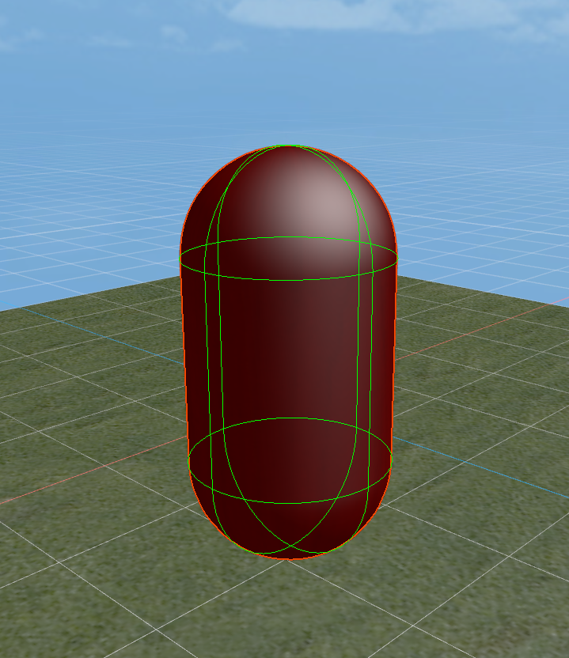
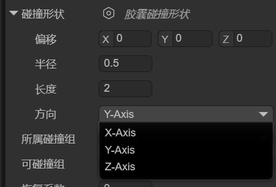
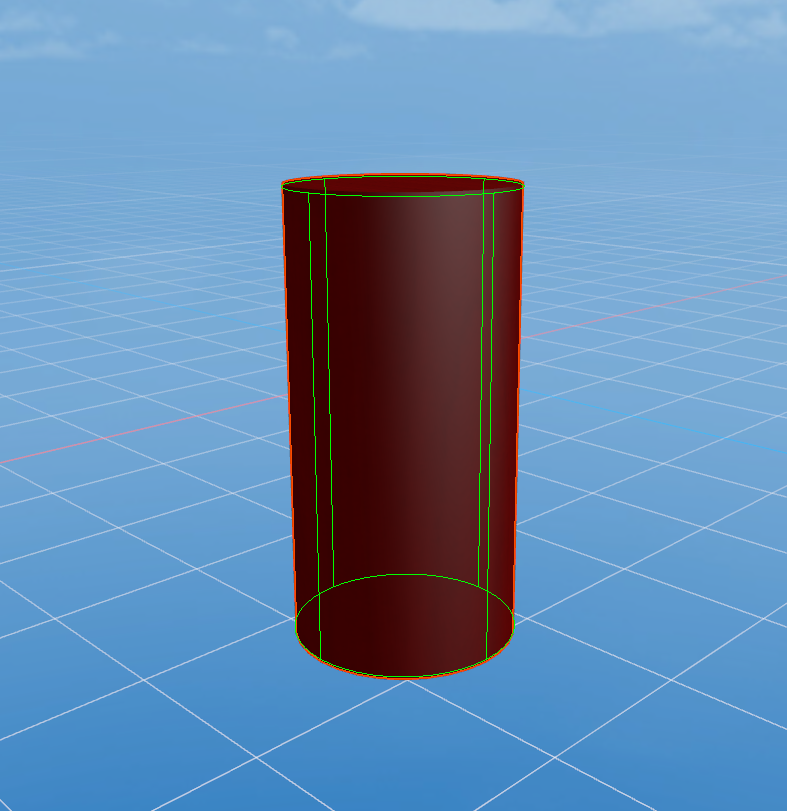
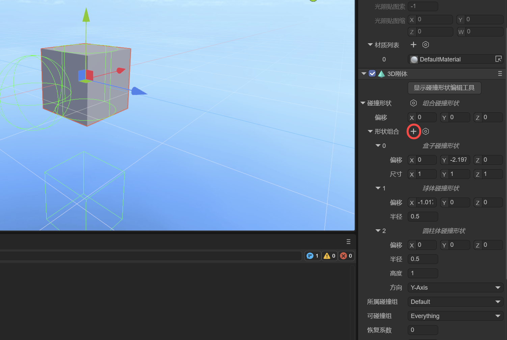
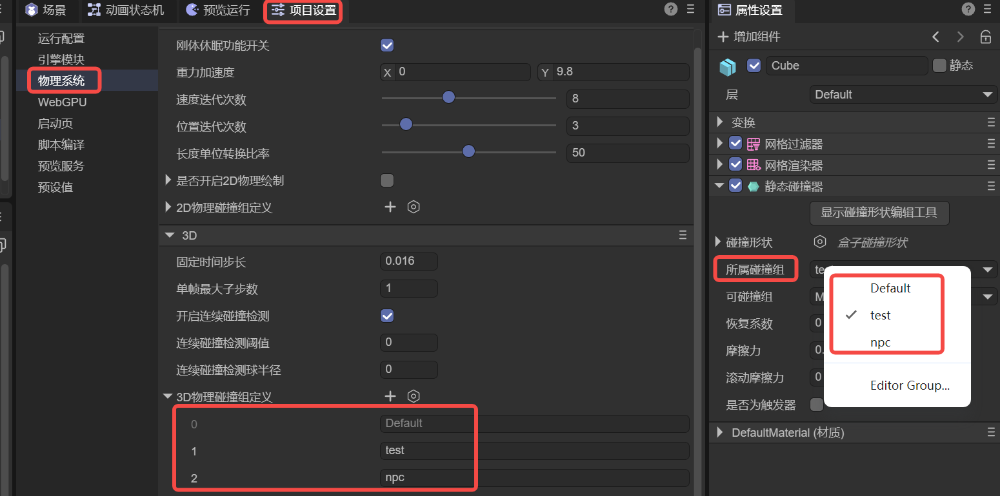
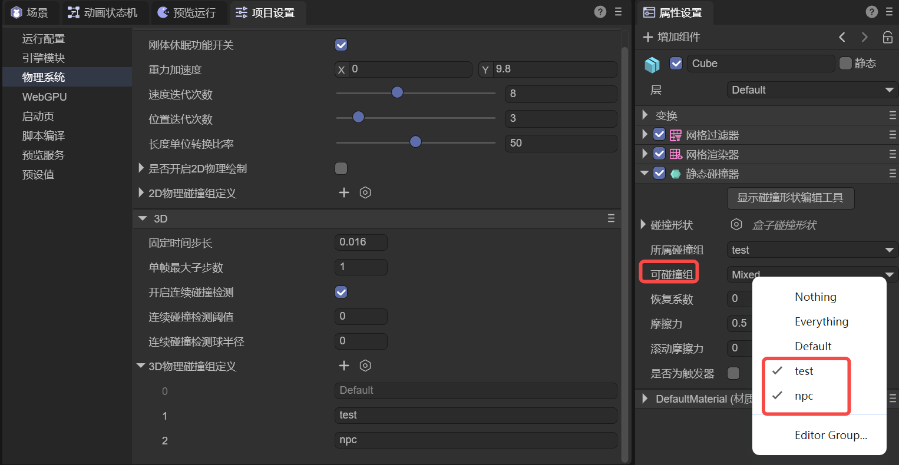
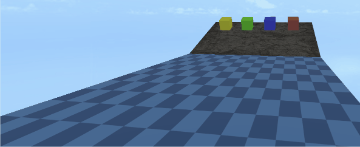
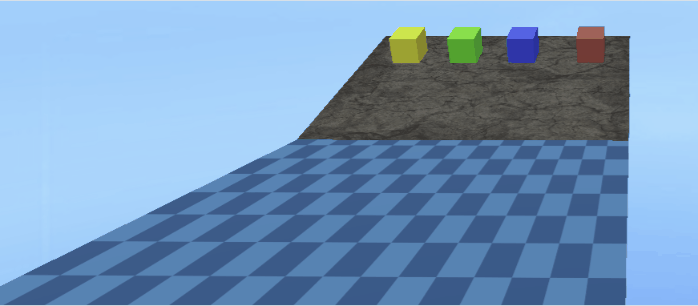

# Static Collider

> Author: Charley       Version \>= LayaAir 3.2

In the design of physics engines, static colliders have several key characteristics.

First, they remain absolutely static in position unless a developer directly modifies their transform properties through a script.

Unlike dynamic objects (such as rigid bodies represented by Rigidbody3D), static colliders are not affected by gravity, impulses, or other external forces. This means that no matter how other objects collide with them, the static collider will remain in its original position, without displacement or rotation.

The primary purpose of static colliders is to provide physical boundaries and obstacles for a scene, such as terrain, buildings, walls, platforms, and other fixed environmental elements. When a dynamic object (such as a character or item controlled by the physics engine) comes into contact with a static collider, the dynamic object can react according to physical rules, such as bouncing, sliding, or stopping. This allows objects in the game to interact with the environment in a realistic way without causing the environment itself to move.

From a performance perspective, static colliders are more efficient than dynamic rigid bodies. Since they do not need to calculate dynamic properties like position, velocity, or acceleration, they help improve performance and reduce unnecessary physics calculations.

In the LayaAir3 engine, the class for a **static collider** is **PhysicsCollider**. This is a physics component class that inherits from the PhysicsColliderComponent class and is used to simulate collision bodies for objects that **do not move** or are **not affected by physical forces**.


## 1\. Collider Base Class Properties

### 1.1 Collision Shape 

A **collision shape** is a geometry used to describe how an object detects and responds to collisions with other objects. It defines the object's physical boundary, or its external shape, so that the physics engine can accurately determine if objects are in contact and calculate the post-collision reaction.

The LayaAir engine supports several collision shapes, including Box, Sphere, Capsule, Cylinder, Cone, and Mesh, each suitable for different types of objects, as shown in Figure 1-1:
 

(Figure 1-1)

The choice of collision shape not only affects the accuracy of physical collision calculations but also directly impacts the performance of the game or physical simulation.

For dynamic objects, simpler collision shapes are usually chosen to improve efficiency, while for static objects, more complex collision shapes can be used to ensure higher accuracy. Choosing the right collision shape is a crucial step in 3D physical simulation, as it allows you to optimize system performance while ensuring the realism of physical effects.

#### 1.1.1 Box Collision Shape

A box collision shape is a rectangular prism or cube, as shown in Figure 1-2. It is suitable for simple, box-shaped objects like crates, building walls, and can be used for most regular-shaped objects.
 
(Figure 1-2)

You can set the position and size of the box collision shape using the `localOffset` and `size` properties, as shown in Figure 1-3.
 
(Figure 1-3)

#### 1.1.2 Sphere Collision Shape

The sphere collision shape is the simplest collision shape, using a sphere to represent the object's collision boundary, as shown in Figure 1-4. The physics engine checks the distance between spheres to determine if a collision has occurred.

Because its calculations are simple, it is more performant. The sphere collision shape is suitable for objects that are small and have a spherical shape, such as bullets, balls, and other simple objects.
 
(Figure 1-4)

You can set the position and size of the sphere collision shape using the `localOffset` and `radius` properties, as shown in Figure 1-5.
 
(Figure 1-5)
#### 1.1.3 Capsule Collision Shape

A capsule collision shape is composed of a cylinder and two hemispherical end caps, resembling the shape of a capsule, as shown in Figure 1-6. It is commonly used to simulate objects that are taller in the vertical direction but narrow, with a common application being for character controllers. In addition, the capsule shape is also suitable for other columnar objects, such as pillars or similar mechanical parts.
 
(Figure 1-6)

You can set the position, thickness, length, and orientation of the capsule collision shape using the `localOffset`, `radius`, `length`, and `orientation` properties, as shown in Figure 1-7.
 
(Figure 1-7)

#### 1.1.4 Cylinder Collision Shape

A cylinder collision shape is used to represent the collision boundary of a cylindrical object, typically for objects with a symmetrical shape. It is suitable for simulating tall, regular-shaped objects like pipes or columns, as shown in Figure 1-8. The cylinder shape is also often used for rotating objects, such as gears or rollers. Due to its simple geometric structure, calculations are relatively efficient.
 
(Figure 1-8)

You can set the position, thickness, height, and orientation of the cylinder collision shape using the `localOffset`, `radius`, `height`, and `orientation` properties, as shown in Figure 1-9.
 
(Figure 1-9)

#### 1.1.5 Cone Collision Shape

The cone collision shape is used to represent the collision boundary of a cone-shaped object. It has a circular base and a vertex, making it suitable for objects shaped like cones, as shown in Figure 1-10. The cone shape is often used to simulate objects with a conical structure, such as cone-shaped rocks, conical mechanical parts, spikes, and missiles, ensuring a natural physical reaction during collisions.
 
(Figure 1-10)

You can set the position, base size, height, and orientation of the cone collision shape using the `localOffset`, `radius`, `height`, and `orientation` properties, as shown in Figure 1-11.
 
(Figure 1-11)

#### 1.1.6 Mesh Collision Shape

The mesh collision shape uses the object's 3D model (mesh) as its collision boundary, as shown in Figure 1-12, allowing it to precisely match the object's shape. It is suitable for complex or irregular-shaped objects and provides very high collision accuracy. Due to the high computational cost of mesh colliders, they are typically only used for static objects (static colliders) and are not suitable for dynamic objects (3D rigid bodies). If you must use one on a dynamic object, the LayaAir engine will force it to use a convex hull for performance optimization.
 
(Figure 1-12)

You can set the position, mesh resource, and whether the engine should automatically process it as a convex hull (for performance optimization) using the `localOffset`, `mesh`, and `convex` properties, as shown in Figure 1-13.
 
(Figure 1-13)

#### 1.1.7 Compound Collision Shape

A compound collision shape combines multiple sub-collision shapes (called sub-shapes) into a single collider relative to the parent node's local offset. Essentially, it creates a "compound body" made up of multiple shapes at the physics engine's core, which is then treated as one rigid body.

In the IDE, after adding a compound collision shape, there is only one setting: `shapes`. You can add sub-shapes by clicking the `+` button, as shown in Figure 1-14.
 
(Figure 1-14)

> Note: When adding sub-shapes, you cannot use another compound collision shape.

#### 1.1.8 Collision Shape Editing Tool

Starting with LayaAir 3.2.4, in addition to property adjustments, a visual editing tool for collision shapes is provided, making it more intuitive for developers to edit collision shapes (except for mesh collision shapes).

The operation is simple: just click "Show Collision Shape Editing Tool" at the top of the collision shape. Once in editing mode, you will see several white cubes, which are the editing points, as shown in Figure 1-15.
 
(Figure 1-15)

By dragging these editing points, you can easily change the shape's appearance.

### 1.2 Collision Group 

When you have complex collision requirements, for example, wanting to collide with some objects but not others, you need to use grouping and specify which collision groups can collide with each other.

The `collisionGroup` property is used to specify which collision group the current collider belongs to. In the IDE, you can click on `Edit Group` to go to the `Physics System` section of `Project Settings` to add collision groups and their names. As shown in Figure 2-1.

(Figure 2-1)

It's important to note that the name of the collision group is for easy identification in the IDE, but the engine's API uses values that are powers of 2.

For example, `Default` in Figure 2-1 is $2^0$, which is 1, while the custom `npc` group is $2^2$, with an actual value of 4. Following this pattern, the collision group with group ID 3 has a value of 8.

Therefore, if you set collision groups in the code instead of the IDE, the value for the engine's API must be a power of 2.

Here is a code example:

```typescript
// Use code to specify which collision group a collider belongs to
xxx.collisionGroup = 1 << 3; // The value is 2 to the power of 3 (8), which can be simply understood as group ID 3, making it easier to align with the IDE concept.
```

### 1.3 Can Collide With 

In the IDE, you can set the value for **Can Collide With** by selecting multiple group names, as shown in Figure 3-1. This is used to specify which groups of colliders the current object can collide with.
 
(Figure 3-1)

In addition to specifying custom collision groups, `Nothing` at the top means it won't collide with any group, while `Everything` means it can collide with any group.

If developers need to pass values through code, they can also use bitwise operations, as shown in the following example:

```typescript
// Specify that collider xxx can collide with a specific collision group
xxx.canCollideWith = 1 << 2; // Only collides with the group with ID 2 (value is 4).

// Specify that collider xxx can collide with multiple collision groups
xxx.canCollideWith = (1 << 1) | (1 << 2) | (1 << 5); // Only collides with groups 1, 2, and 5.

// Specify that collider xxx cannot collide with certain groups, but can with all others
xxx.canCollideWith = -1 ^ (1 << 3) ^ (1 << 6); // Does not collide with groups 3 and 6, but can collide with any other group.
```

### 1.4 Restitution 

Restitution describes the elasticity of an object during a collision. A higher restitution value means a stronger bounce and less energy loss after a collision. A lower value means less bounce and more energy loss. In animated Figure 4-1, the restitution values for the falling boxes (3D rigid bodies) from left to right are 0, 0.5, and 1, respectively. The floor (static collider) has a restitution of 0.5.
 
(Animated Figure 4-1)

> Note that the effect of restitution depends on both colliding objects. For example, if one object has a restitution of 0, the overall restitution will be 0 regardless of the other object's value, meaning there will be no bounce.

### 1.5 Friction 

Friction is a force that resists relative motion or the tendency of relative motion between two objects in contact.

Friction is an important parameter used to simulate the resistance between objects in contact, affecting how easily an object slides on a surface. A higher value means greater friction, making it harder for the object to slide.

We set the friction of the boxes (3D rigid bodies) from left to right to 0.1, 0.3, 0.5, and 1. The friction of the ramp (static collider) is set to 0, and the floor (static collider) is set to 0.5. The effect is shown in animated Figure 5-1.
 
(Animated Figure 5-1)

When we set the ramp's (static collider) friction to 0.8 and keep other friction values the same, the effect is shown in animated Figure 5-2. Only the leftmost ball continues to roll, while the rightmost one slides slowly and is almost stationary.
 
(Animated Figure 5-2)

### 1.6 Rolling Friction 

Rolling friction is the force that resists the rolling motion of one object on the surface of another. When friction is too high, it can even affect rolling.

We set the rolling friction of the spheres (3D rigid bodies) from left to right to 0, 0.2, and 0.3. The rolling friction of the ramp (static collider) is set to 0. The effect is shown in animated Figure 6-1.
 
(Animated Figure 6-1)

We keep the rolling friction of the spheres (3D rigid bodies) the same but set the ramp's (static collider) rolling friction to 0.1. The effect is shown in animated Figure 6-2. Only the leftmost ball continues to roll, while the rightmost one slides slowly and is almost stationary.
 
(Animated Figure 6-2)

## 2\. Static Collider Properties

### 2.1 Is Trigger 

A trigger is a special type of collider that does not participate in normal physical collision calculations but is used to detect if an object has entered, exited, or is in contact with another object. Triggers are often used to fire physical collision events to execute specific logic, such as triggering in-game events, activating areas, or detecting if something has entered a specific zone.

When you check `isTrigger`, the collider acts as a trigger, only firing events and not creating a physical barrier. As shown in animated Figure 7-1, after setting the ramp as a trigger, the block passes directly through it and falls onto the non-triggering floor.
  
(Animated Figure 7-1)


## 3\. Related Documentation

### ["physics3D"](../../../physicsEditor/physics3D/readme.md)