# Timeline Animation Editor Guide

> Author: charley

LayaAir IDE's Timeline Animation Editor is suitable for editing both 2D and 3D animations.

In the feature introduction of this section, if operations are common to both 2D and 3D, defaults will use 3D as the example for explanation. If there are differences between 2D and 3D, additional explanation will be provided for the differences.

> As versions upgrade, some details in documentation screenshots may slightly differ. Use the actual IDE version as the standard. If changes are significant, we'll adjust promptly. If not adjusted in time, welcome to contact official customer service for feedback.

## I. Opening the Timeline Animation Editor

### 1.1 Creating Animations

#### 1.1.1 Creating Animations for Scene Nodes

Any node added to the scene can create an animation. The following introduction uses a cube as an example. First, create a cube node in the scene. After **selecting the cube node**, you can see the "Create" button in the `Timeline Animation Panel` at the bottom of the editor. As shown in Figure 1-1:

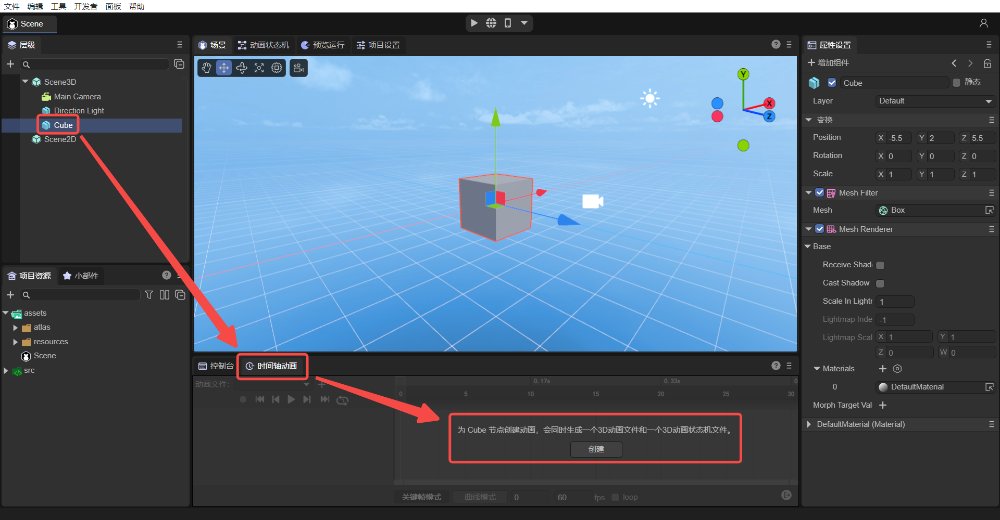

(Figure 1-1)

Clicking the "Create" button in Figure 1-1 pops up the interface shown in Figure 1-2, prompting the user to set the animation name (here renamed to "ani3d.lani").

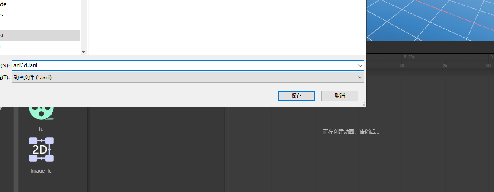

(Figure 1-2)

> [!Tip]
>
> 3D animation files have the `.lani` extension, 2D animation files have the `.mc` extension.

After saving the name, you can see the timeline animation editing panel, animation component, state machine, and animation file, indicating successful animation creation. As shown in Figure 1-3:

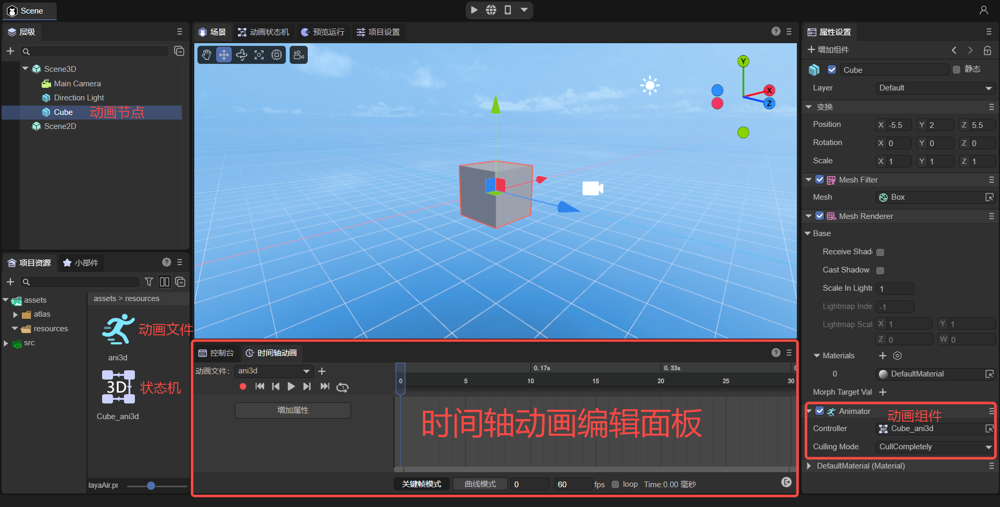

(Figure 1-3)

#### 1.1.2 Creating Animations in Prefabs

We can create animations not only on scene nodes but also in prefabs.

> If you don't understand prefabs, please first check the [Prefab Module](../../assets/prefab/readme.md) documentation.

From an operational perspective, creating animations in the scene and creating animations in prefabs have no essential difference.

**The main difference is:**

- Animations created on scene nodes are suitable for situations where the animation is only used once.

- Animations created in prefabs are suitable for situations where the animation needs to be reused multiple times.

#### 1.1.3 Animation File Extensions

3D-created animation file extension is `.lani`, 3D animation controller (also called animation state machine) file extension is `.controller`.

2D-created animation file extension is `.mc`, 2D animation state machine file extension is `.mcc`.

> When releasing to platforms with extension restrictions (such as WeChat mini-games), the IDE release function will automatically modify extensions. Developers just need to know this and still use relative paths as standard. The engine will automatically adapt file extensions for different platforms.

#### 1.1.4 Animation State Machine File Naming Rules

When creating an animation for a **node** for the first time, not only is an animation file named by the developer created, but an animation state machine file is also automatically created.

The state machine file name is composed of `animationNodeName_animationName`. The effect is shown in Figure 1-4.

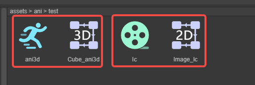

(Figure 1-4)

### 1.2 Directly Launching Animation Panel

If an animation component is already bound to a node, there's no need to create an animation again. Just click the **Launch Animation Panel** button at the bottom. As shown in Figure 1-5:

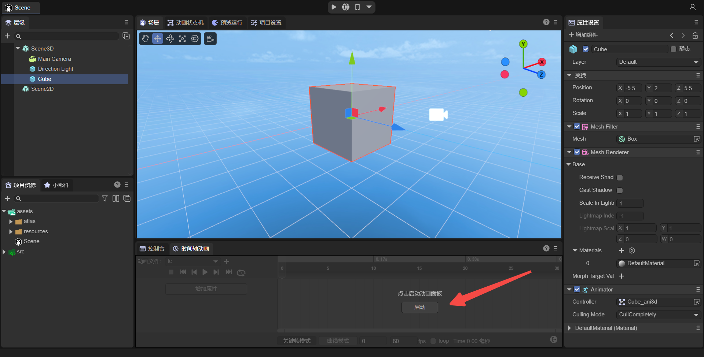

(Figure 1-5)

### 1.3 Adding Animation Component

When an animation has already been created and you just want to reuse an already created animation on a certain node, you can do so by adding an animation component.

Taking a sphere (Sphere) node as an example for introduction.

First, select the sphere node, click "Add Component" in the right-side property panel, select the Animator component. You can only see Animator in 3D nodes. If it's a 2D node, you can only select Animator2D.

> [!Tip|label:Tips]
>
> Animator2D is the 2D animation component, Animator is the 3D animation component.

The operation sequence is shown in animated Figure 1-6:

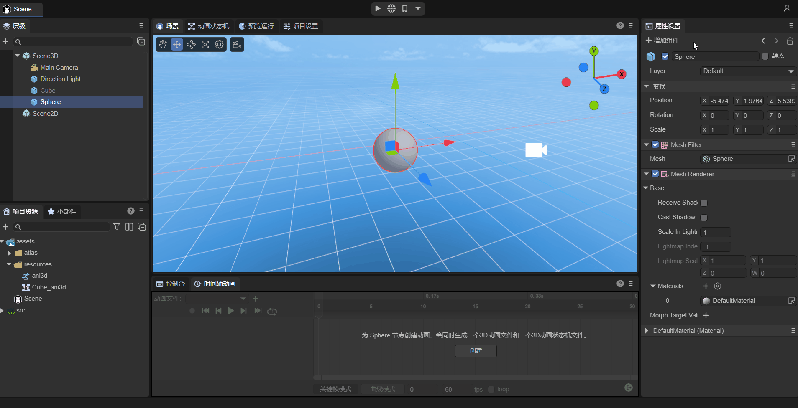

(Figure 1-6)

Then, you can see the Animator component in the property panel. Click Controller in the Animator component and select an existing animation state machine. As shown in Figure 1-7:

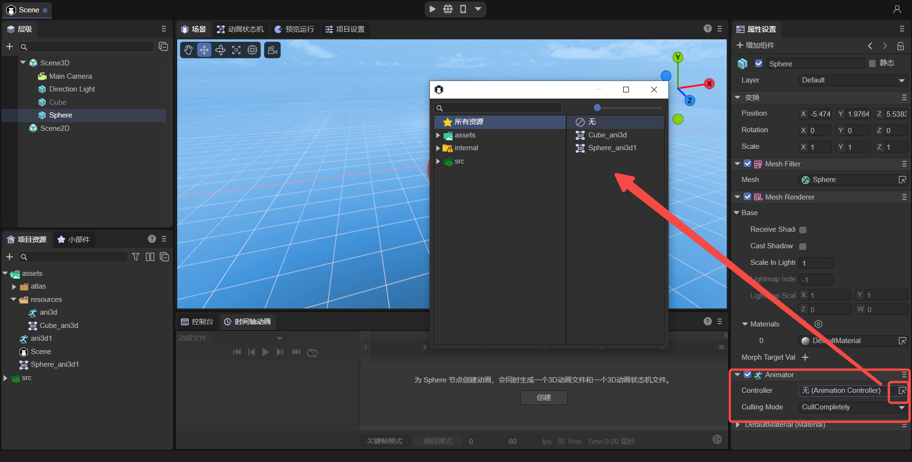

(Figure 1-7)

##### 1.3.1 Case with Animation State Machine and Animation File:

Taking the selection of "Sphere_ani3d1" animation state machine as an example, after selection, this animation is bound to the Sphere node. In the case of having both an animation state machine and animation file, after refreshing, click "Launch" in the animation editing panel. As shown in Figure 1-8:

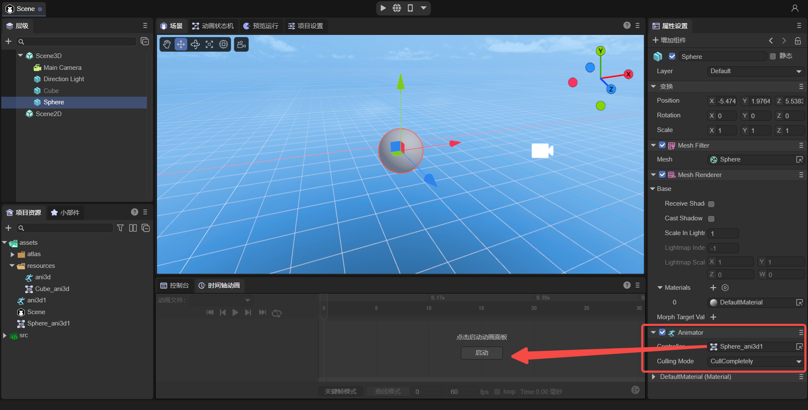

(Figure 1-8)

##### 1.3.2 Case with Animation State Machine but No Animation File:

If there's no animation in the animation state machine, after adding the animation component and setting the state machine, clicking "Launch" will remind you that there's no animation file. At this point, the window for creating a new animation file automatically pops up.

As shown in Figure 1-9:

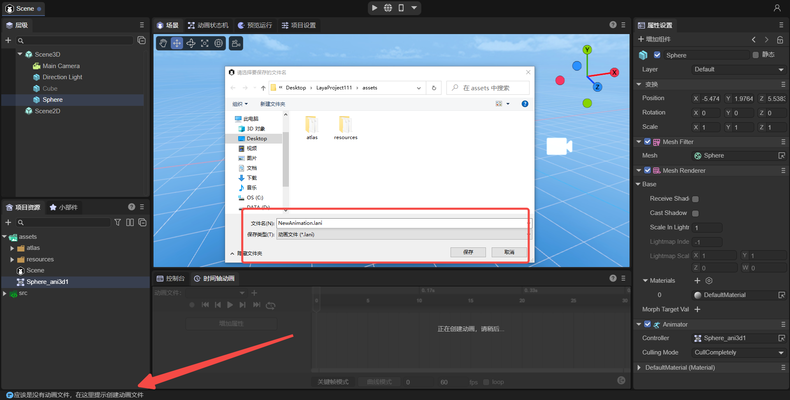

(Figure 1-9)

If you want to use an existing animation, directly drag the animation file from the resource window into the state machine view window. The effect is shown in Figure 1-10.

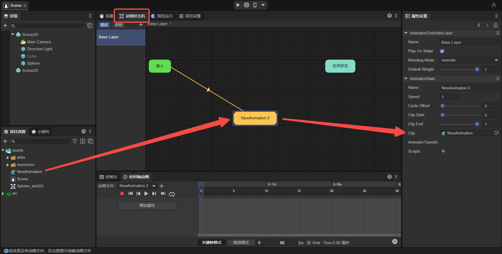

(Figure 1-10)

## II. Basic Concepts of Timeline Animation Editor

### 2.1 Keyframes, Empty Frames

#### 2.1.1 Keyframes

Keyframes refer to the frames where key actions occur in object motion changes, that is, frames storing property values.

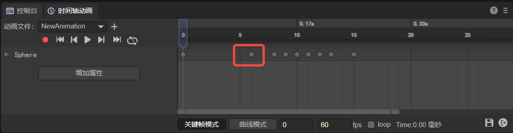

(Figure 2-1)

#### 2.1.2 Empty Frames

Empty frames refer to frames where no content is set, usually referring to frames between two adjacent keyframes.

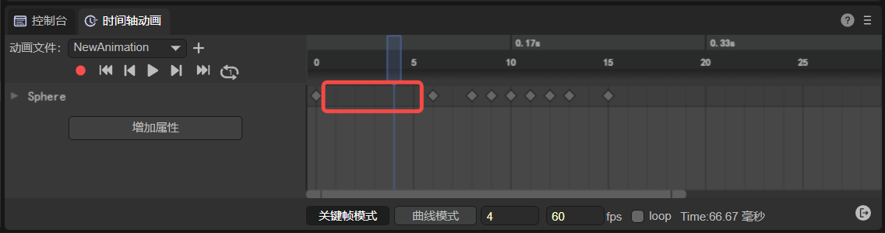

(Figure 2-2)

#### 2.1.3 Difference Between Keyframes and Empty Frames

Keyframes: Animation effect changes are determined based on property values stored on the keyframe.

Empty frames: The engine calculates property values during playback through interpolation algorithms, used for transitioning between two animation keyframes.

### 2.2 Current Frame

The frame where the current frame pointer is located, also the frame currently selected by mouse click.

Also, the editor window's bottom shows the position of the current frame pointer. Taking Figure 2-3 as an example, the current frame is at frame 6.

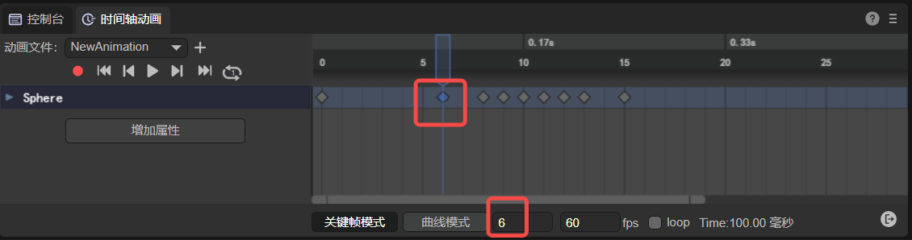

(Figure 2-3)

### 2.3 Playback Frame Rate

Refers to the number of animation frames played per second. As shown in Figure 2-4, the default value is 60.

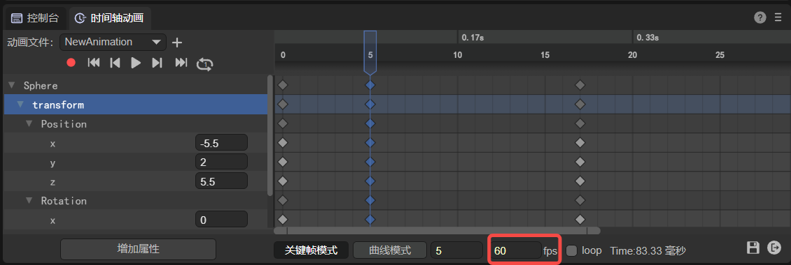

(Figure 2-4)

### 2.4 Animation Node Properties

The animation node properties are shown on the left side of Figure 2-5. When pointing to a certain keyframe and then adjusting property values, the adjusted property values are stored in that frame as the basis for keyframe effect changes.

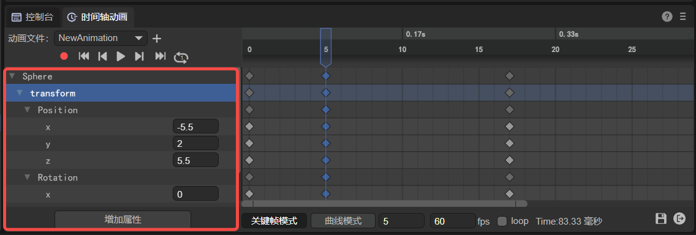

(Figure 2-5)

### 2.5 Curves, Tangents, Weights

#### 2.5.1 Curves

**Definition:**

Curves refer to the interpolation algorithm lines for frame transitions between two keyframes.

**Function:**

Used for property interpolation algorithms between two keyframes, adjusting the transition effect between animation keyframes.

**Appearance:**

Curve lines are the transition algorithm effects of property values between keyframes. The IDE uses cubic Bézier curves (also called third-order Bézier curves) algorithm to draw. The drawing principle is shown in animated Figure 2-6.

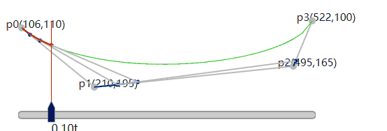

(Animated Figure 2-6)

In animated Figure 2-6, the red line is the final interpolation algorithm curve appearance. p0 is the start frame, p3 is the end frame, the vertical red pointer is the current frame's motion speed based on the curve.

Curve adjustment is determined by p1 and p2, which are determined by tangents and weights.

Curve appearance has both curve form and straight line form, as shown in Figure 2-7, both using cubic Bézier curve algorithm to draw.

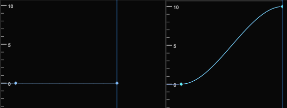

(Figure 2-7)

> [!Tip|label:Tips]
>
> All Bézier curve algorithm-drawn curves mentioned above are adjustable curves. Built-in easing curve templates in 2D animation are not Bézier curve algorithms.

#### 2.5.2 Curve Tangents

In animated Figure 2-6 above, the line segment from p0 to p1 is p0's tangent, and the line segment from p2 to p3 is p3's tangent. Tangent position affects curve shape.

Corresponding to the animation editor effect as in animated Figure 2-8:

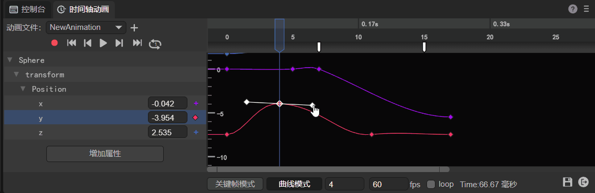

(Animated Figure 2-8)

#### 2.5.3 Curve Weights

Curve weight refers to the length of the curve tangent. The shortest cannot be lower than 0, the longest cannot exceed 1. That is, in animated Figure 2-6 above, the length between p0 and p3, these two keyframes.

Pay attention to animated Figure 2-9. When changing the weight length, the third line of tips also shows the current weight value.

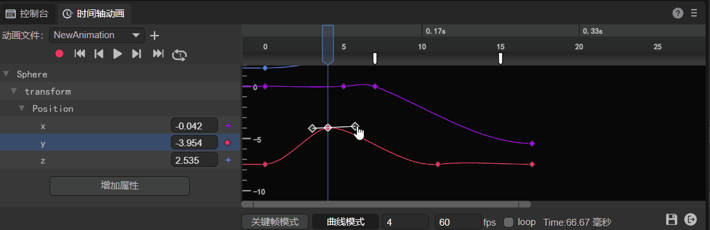

(Animated Figure 2-9)

> This just demonstrates the concept of weight adjustment. Section 6.1.2 below will introduce in detail how to adjust curve weights.

### 2.6 Rulers

Rulers are divided into horizontal rulers and vertical rulers. Horizontal rulers refer to animation frame rulers, vertical rulers refer to animation property value rulers. As shown in Figure 2-10.

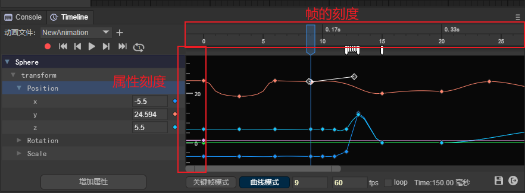

(Figure 2-10)

## III. Basic Interaction of Timeline Animation Editing Panel

### 3.1 Multi-Selection

#### 3.1.1 Box Selection

Continuously hold the left mouse button to box-select, all within the mouse selection area are selected.

#### 3.1.2 Continuous Area Multi-Selection

Shift + mouse click, all within the specified start and end frames and property range are selected.

#### 3.1.3 Interval Multi-Selection

Ctrl + mouse click, click whichever to select.

#### 3.1.4 Exclusion

Ctrl + mouse click, in the already selected state, holding Ctrl + mouse click can exclude that item.

#### 3.1.5 Multi-Selection Release

General: Selected first frame and last frame.

Curves: Display the selected highest and lowest property values, as well as first and last frame. As shown in Figure 3-1:

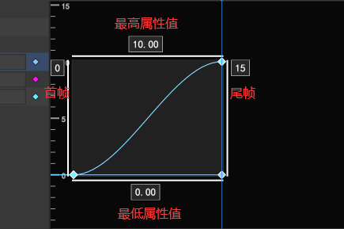

(Figure 3-1)

### 3.2 Mouse Left Button

#### 3.2.1 Single Click (Change Current Frame)

Change current frame position, the mouse click location becomes the current frame.

#### 3.2.2 Double Click

**Add Animation Event:**

Double-click the area shown in Figure 3-2 to add an animation event. Multiple animation events can be dispatched on one frame.

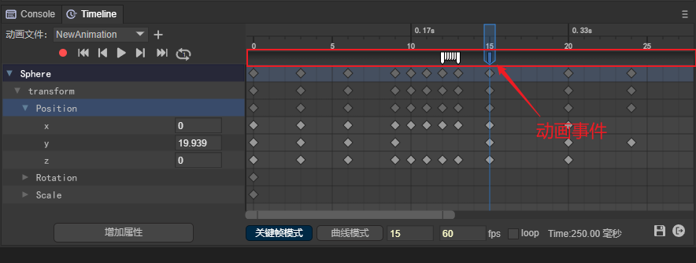

(Figure 3-2)

**Add Keyframe:**

Double-click the area shown in Figure 3-3 to add a keyframe.

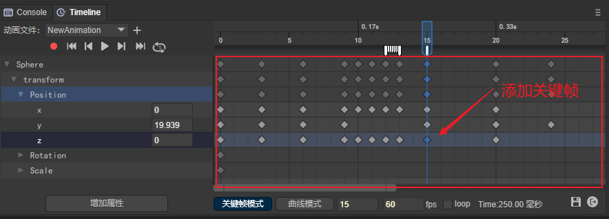

(Figure 3-3)

#### 3.2.3 Drag

**Drag Single Frame:**

Select a certain keyframe and drag to change that keyframe's position.

**Batch Drag Multiple Frames:**

You can also select multiple keyframes and drag them to change position as a whole.

### 3.3 Mouse Right Button

#### 3.3.1 Keyframe Mode

1. Add Keyframe: Right-click on the keyframe panel area to pop up the keyframe add menu. For example, the red 1 area in Figure 3-4, the number in parentheses indicates which frame to add to.

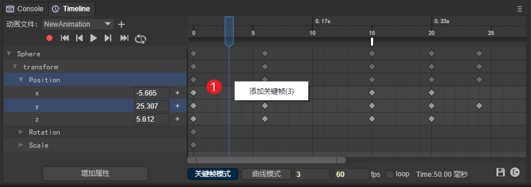

(Figure 3-4)

2. Add Animation Event: Right-click the area between the frame ruler and keyframe panel, as shown in Figure 3-5, to pop up the "Add Animation Event" menu. The number in parentheses indicates which frame to add to.

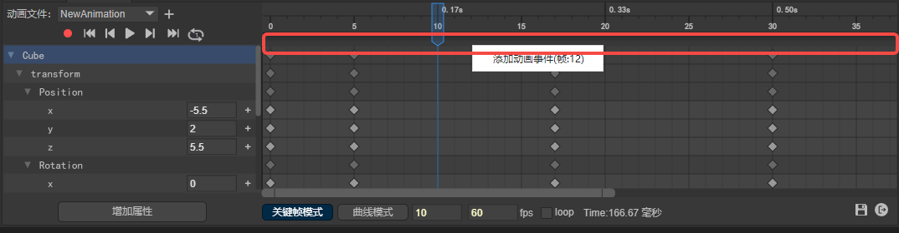

(Figure 3-5)

3. Click to select a certain keyframe, click right button to pop up the current keyframe function menu. As shown in Figure 3-6:

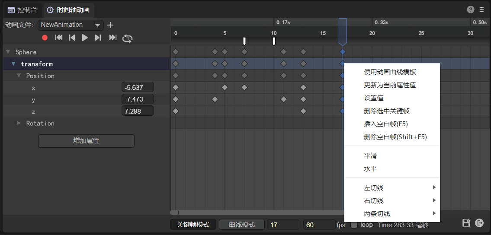

(Figure 3-6)

4. Right-click on (3) area to pop up the property add menu. As shown in Figure 3-7:

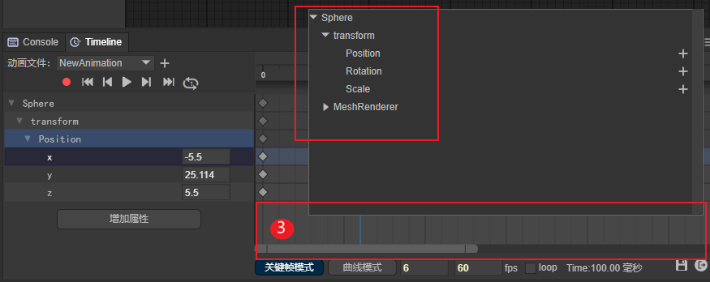

(Figure 3-7)

#### 3.3.2 Curve Mode

1. In curve mode, right-click on blank area to pop up the curve auto-position menu. As shown in Figure 3-8:

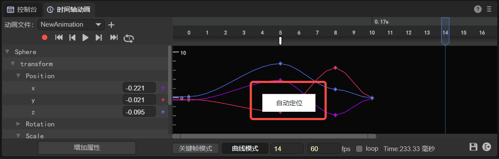

(Figure 3-8)

2. In curve mode, right-click on a keyframe to pop up the curve function menu. As shown in Figure 3-9:

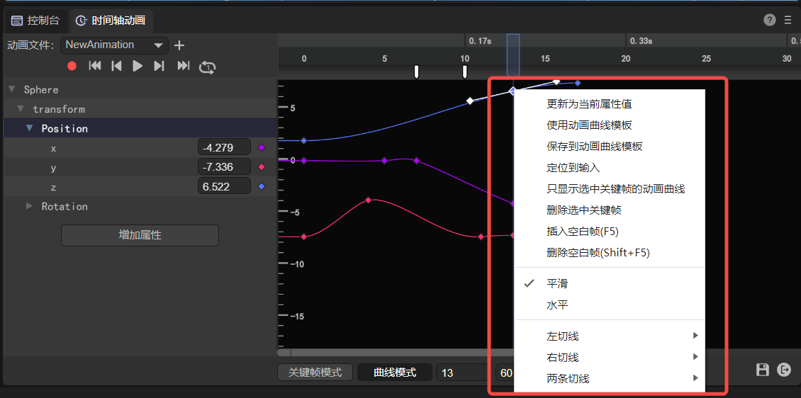

(Figure 3-9)

3. In curve mode, right-click on a curve to pop up the curve position menu. As shown in Figure 3-10:

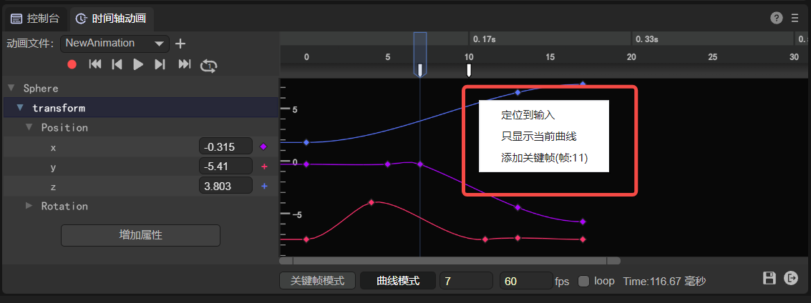

(Figure 3-10)

### 3.4 Scroll Wheel Operations

#### 3.4.1 Frame Display Zoom

In keyframe mode, directly scroll the wheel, zooming the frame ruler panel with the mouse pointer as center. As shown in animated Figure 3-11:

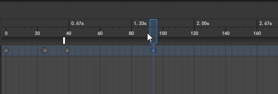

(Animated Figure 3-11)

#### 3.4.2 Property Display Zoom

In curve mode, use `Ctrl+scroll wheel` to zoom the property ruler panel with the mouse pointer as center. As shown in animated Figure 3-12:

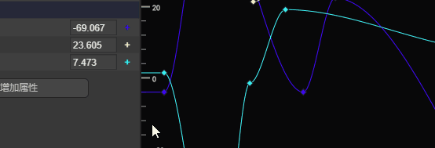

(Animated Figure 3-12)

#### 3.4.3 Frame and Property Simultaneous Zoom

In curve mode, directly scroll the wheel to zoom both frame and property ruler panels simultaneously with the mouse pointer as center. As shown in animated Figure 3-13:

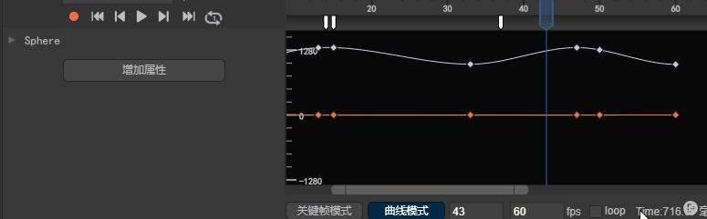

(Animated Figure 3-13)

#### 3.4.4 Animation Property Panel Vertical Scrolling

When multiple properties exceed the animation property panel's display area, for convenience you can directly use the mouse wheel to vertically scroll the property panel. As shown in animated Figure 3-14:

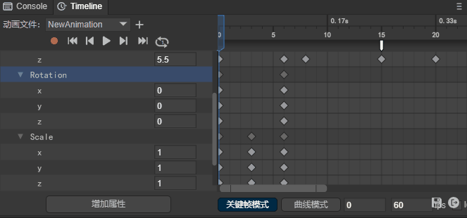

(Animated Figure 3-14)

#### 3.4.5 Animation Frame Panel Vertical Scrolling

When the mouse is on the animation frame panel, directly scrolling the mouse wheel only zooms the frame panel.

When we also need vertical scrolling, we can hold `Ctrl+scroll mouse wheel` in the animation frame panel for vertical scrolling operation, as shown in animated Figure 3-15:

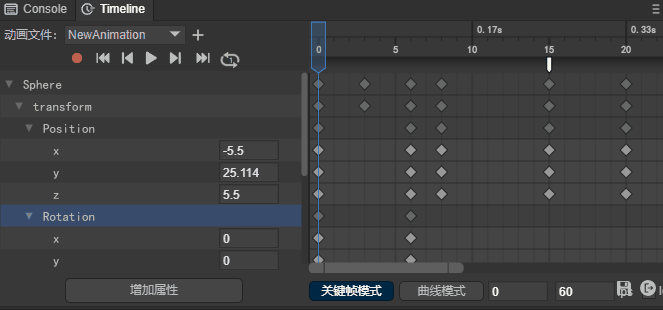

(Animated Figure 3-15)

## IV. Property Settings

### 4.1 Adding Properties

#### 4.1.1 Add via Button

As shown in Figure 4-1:

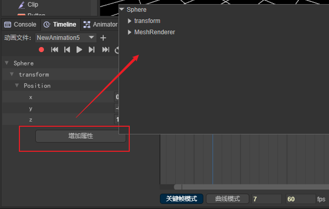

(Figure 4-1)

#### 4.1.2 Add via Right Click

As shown in Figure 4-2:

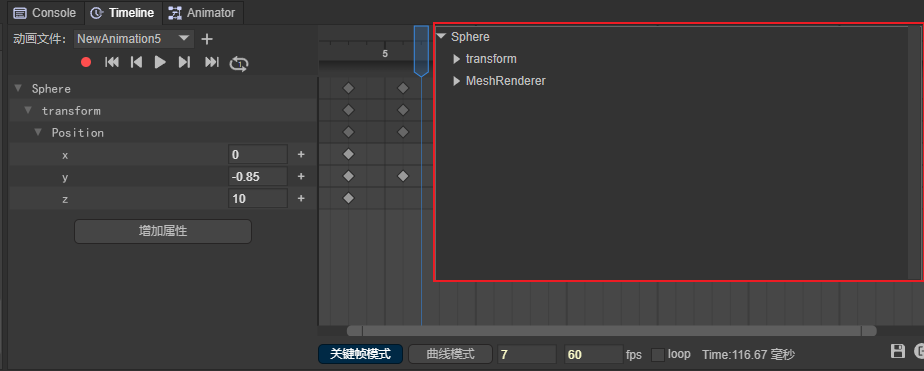

(Figure 4-2)

#### 4.1.3 Add via Recording

First, click the red record button. When the ruler bar turns red, it indicates entering recording state. At this point, by adjusting the Transform parameters on the right, you can add corresponding properties in the timeline animation editor. The operation is shown in Figure 4-3:

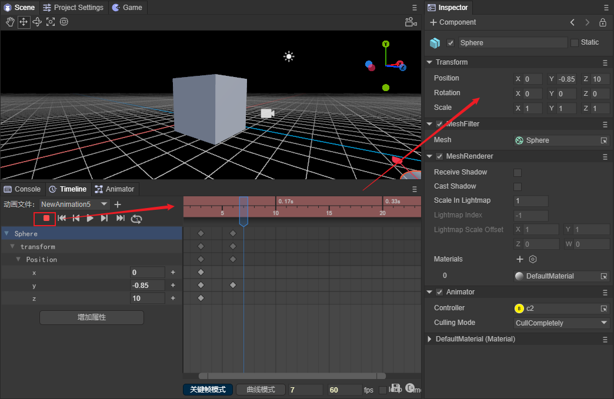

(Figure 4-3)

**Differences Between 2D Animation Properties and 3D Animation Properties:**

> [!Note]
>
> In 2D animation, each property value allows individual setting. In 3D animation, Vector properties cannot be omitted; deleting will auto-supplement.
>
> 2D animation defaults to recording mode, 3D animation needs to click the record button to enable recording mode.

### 4.2 Keyframe Property Settings

#### 4.2.1 Direct Input via Property Input Box

Directly input values in the input box. As shown in Figure 4-4:

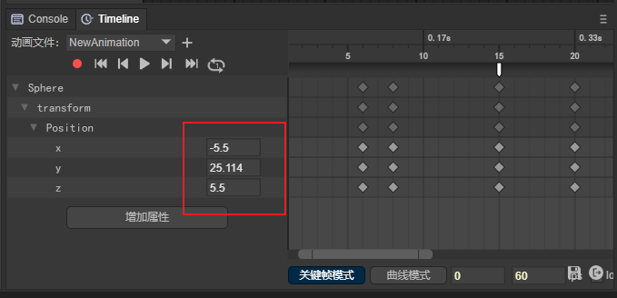

(Figure 4-4)

#### 4.2.2 Swipe Input via Property Input Box

Place the mouse on the input box. When the cursor becomes a bidirectional arrow, hold the left button and drag the mouse left and right to change the value.

#### 4.2.3 Synchronous Input in Recording Mode

Method 1: In recording mode, input by dragging in the view window. As shown in Figure 4-5:

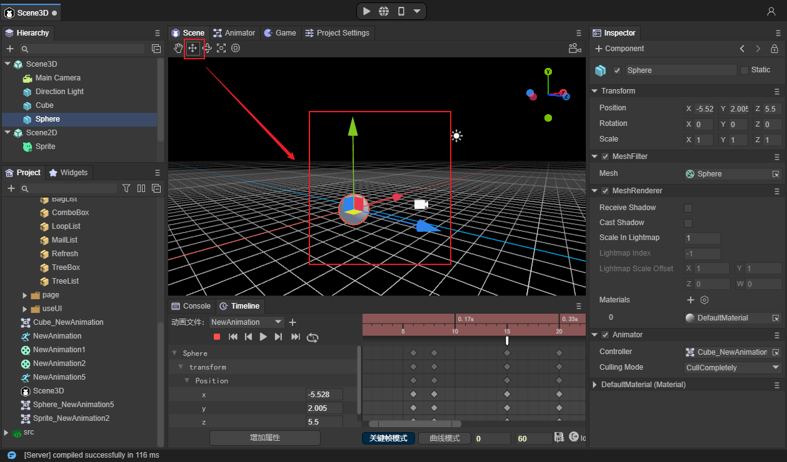

(Figure 4-5)

Method 2: In recording mode, input in the property window. As shown in Figure 4-6:

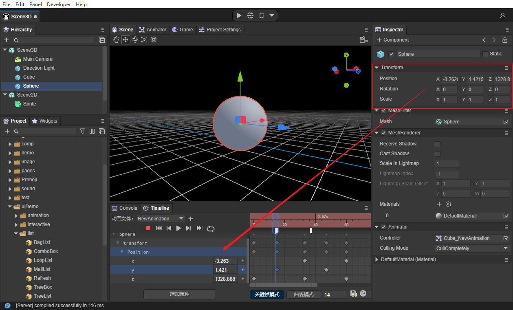

(Figure 4-6)

## V. Frame Panel Common Operations

### 5.1 Keyframe Management

#### 5.1.1 Add

**Add in Animation Frame Panel:**

In the animation frame panel, when properties already exist, add keyframes by double-clicking or right-clicking as shown in Figure 5-1.

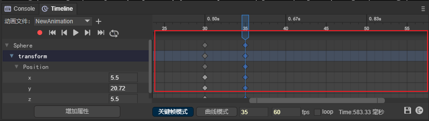

(Figure 5-1)

**Add in Animation Property Panel:**

Click the "+" to the right of the property in the animation property panel to add, as shown in Figure 5-2:

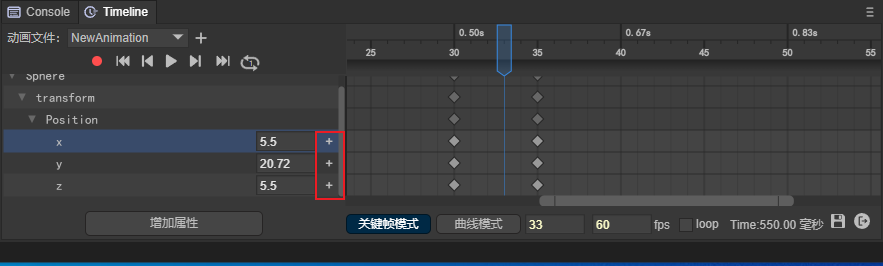

(Figure 5-2)

#### 5.1.2 Delete

Select a keyframe with the mouse and delete via the "delete" shortcut key or the "Delete Selected Keyframes" button in the right-click menu.

#### 5.1.3 Copy

Select a keyframe with the mouse and copy via "ctrl+C".

#### 5.1.4 Paste

Select a blank frame with the mouse and paste via "ctrl+V".

#### 5.1.5 Move

Select a keyframe with the mouse, hold the left button and drag.

### 5.2 Keyframe Batch Management

#### 5.2.1 Batch Pan

Batch pan refers to horizontally moving selected keyframes as a whole while keeping the spacing between keyframes unchanged.

The operation method is to batch select keyframes, then hold the mouse left button and drag to batch pan. As shown in animated Figure 5-3:

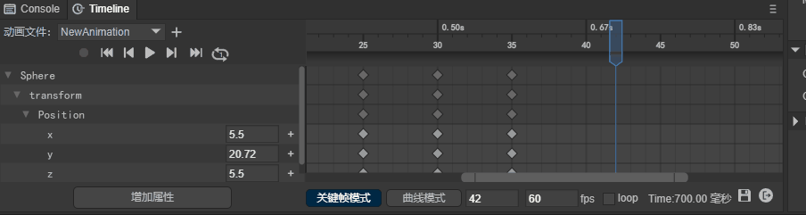

(Animated Figure 5-3)

#### 5.2.2 Insert Move

Insert move refers to inserting blank frames between every two keyframes among all selected keyframes. Therefore, the first frame position doesn't change, but the spacing of all subsequent keyframes increases or decreases.

**Increase Spacing:**

Select multiple keyframes and execute the insert blank frames operation. As shown in animated Figure 5-4:

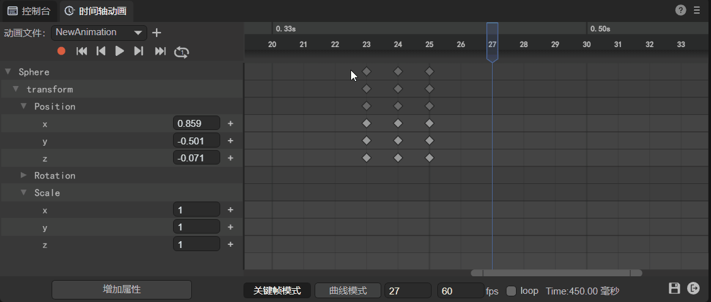

(Animated Figure 5-4)

> For ease of understanding in animated Figure 5-4, right-click operation is used, but recommend using the F5 shortcut key to insert blank frames.

**Decrease Spacing:**

Select multiple keyframes and execute the delete blank frames operation. When all blank frames between two keyframes are deleted, deletion stops. But it doesn't affect other keyframes' continued deletion operation. As shown in animated Figure 5-5:

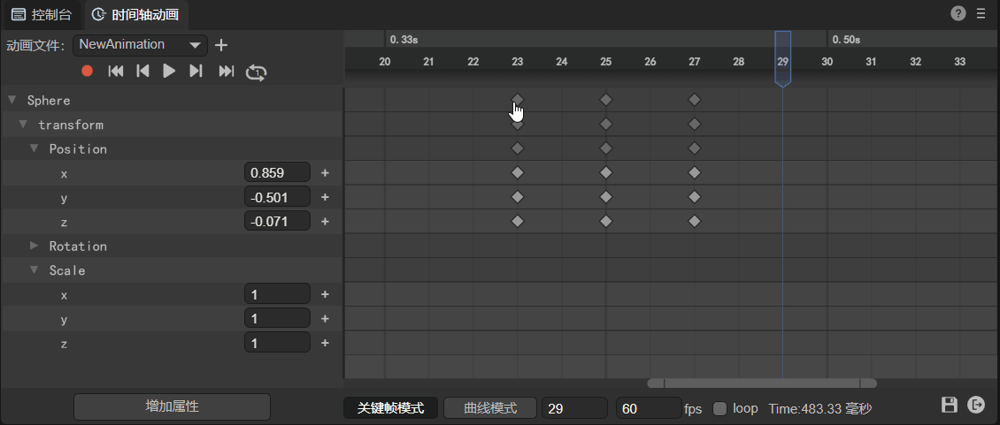

(Animated Figure 5-5)

> For ease of understanding in animated Figure 5-5, right-click operation is used, but recommend using the Shift + F5 shortcut key to delete blank frames.

#### 5.2.3 Batch Delete

Batch select keyframes, then use the "delete" shortcut key or the `Delete Selected Keyframes` option in the right-click menu to batch delete. As shown in animated Figure 5-6:

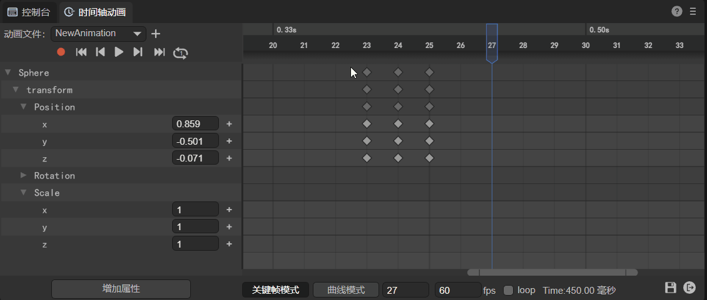

(Animated Figure 5-6)

### 5.3 Blank Frame Insertion

#### 5.3.1 Single Blank Frame Insertion

Increase: Select a keyframe and use the "F5" shortcut key or the "Insert Blank Frames" button in the right-click menu.

Delete: Select a keyframe and use the "shift + F5" shortcut key or the "Delete Blank Frames" button in the right-click menu.

#### 5.3.2 Batch Blank Frame Insertion

Increase: Select multiple keyframes and use the "F5" shortcut key or the "Insert Blank Frames" button in the right-click menu.

Delete: Select multiple keyframes and use the "shift + F5" shortcut key or the "Delete Blank Frames" button in the right-click menu.

### 5.4 Animation Events

#### 5.4.1 Add

In the frame panel area shown in Figure 5-7, you can add animation events by double-clicking or using the "Add Animation Event" button in the right-click menu.

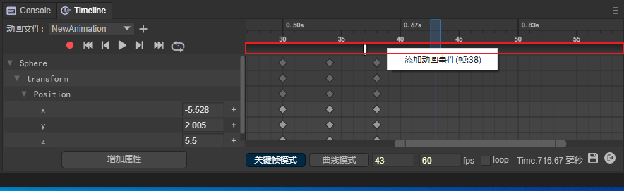

(Figure 5-7)

#### 5.4.2 Delete

Select an animation event with the mouse and delete it via the "delete" shortcut key or "Remove Animation Event" in the right-click menu.

> For specific usage of animation events, see section IX.

### 5.5 Keyframe Navigation

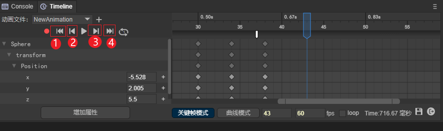

(Figure 5-8)

**Jump to First Frame**

Click the button shown as (1) in Figure 5-8 to quickly jump to the first frame.

**Jump to Previous Keyframe**

Click the button shown as (2) in Figure 5-8 to quickly jump to the previous frame.

**Jump to Next Keyframe**

Click the button shown as (3) in Figure 5-8 to quickly jump to the next frame.

**Jump to Last Frame**

Click the button shown as (4) in Figure 5-8 to quickly jump to the last frame.

### 5.6 Frame Panel Zoom

#### 5.6.1 Scroll Bar Zoom

Left zoom: Drag the left scroll bar to zoom the frame ruler to the left of the current keyframe.

Right zoom: Drag the right scroll bar to zoom the frame ruler to the right of the current keyframe.

The scroll bar is shown in animated Figure 5-9:

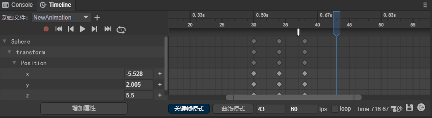

(Animated Figure 5-9)

#### 5.6.2 Wheel Zoom

1. Place the mouse on the frame ruler and scroll the wheel. At this point, the frame ruler zooms with the mouse position as center. As shown in animated Figure 5-10:

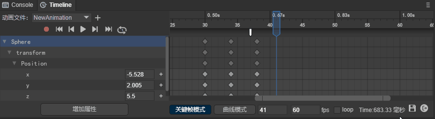

(Animated Figure 5-10)

2. Place the mouse on the property ruler and scroll the wheel. At this point, the property ruler zooms with the mouse position as center. As shown in animated Figure 5-11:

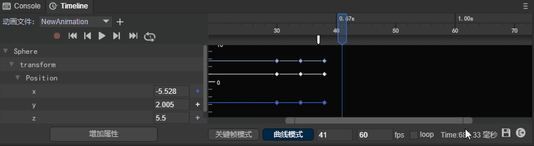

(Animated Figure 5-11)

> For locking specific ruler panels during wheel zooming, please refer back to section 3.5 shortcut keys.

## VI. Curve Mode Operations

### 6.1 Animation Curve Adjustment

#### 6.1.1 Using Animation Curve Templates

Animation curve templates can be divided into two types: built-in curve algorithms and custom curve algorithms.

After using the built-in curve algorithm, the curve cannot be arbitrarily adjusted.

Using the custom curve algorithm, the curve can be arbitrarily adjusted.

Opening method for curve templates: In curve mode, right-click on a keyframe and click "Use Animation Curve Template" in the right-click menu to open the curve template interface.

> [!Tip|label:Tips]
>
> Built-in curve algorithms only support 2D animation.

##### Built-in Curve Algorithms:

**Linear**: Linear animation, that is, uniform speed. Starts and ends at the same speed. Animation curve shown in Figure 6-1:

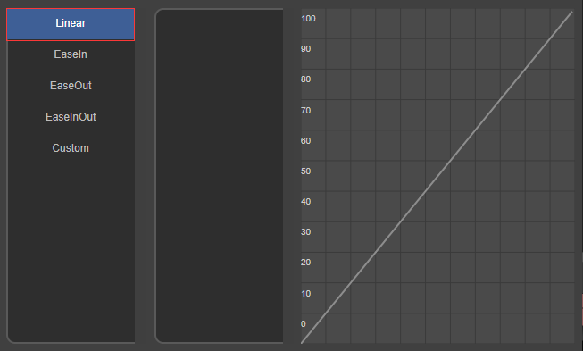

(Figure 6-1)

**EaseIn**: Entry easing curve, animation starts at low speed and continuously accelerates during the process. Animation curve shown in Figure 6-2:

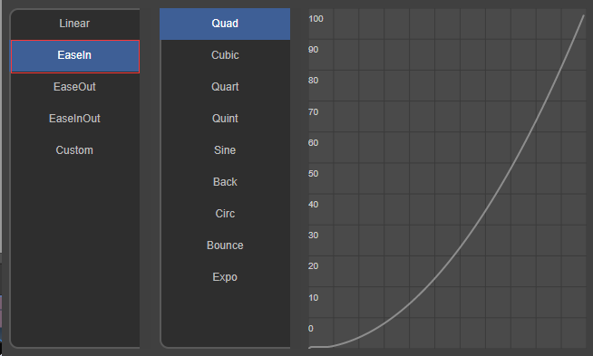

(Figure 6-2)

**EaseOut**: Exit easing curve, animation continuously decelerates during the process and ends at low speed. Animation curve shown in Figure 6-3:

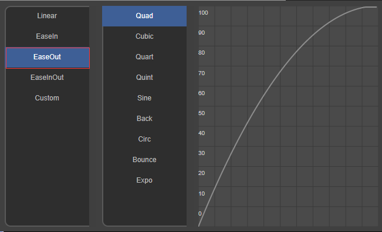

(Figure 6-3)

**EaseInOut**: Two-sided easing curve, animation starts at low speed, accelerates then decelerates, and exits at low speed. Animation curve shown in Figure 6-4:

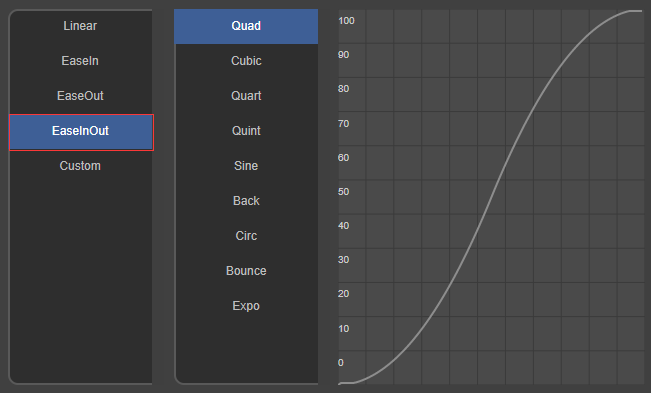

(Figure 6-4)

##### Custom Curve Algorithms:

**Custom**:

If the built-in curve templates can't meet your needs, developers can directly select Custom curve mode, then modify the curve trajectory in the panel area. As shown in Figure 6-5:

After modification, it can be saved for reuse.

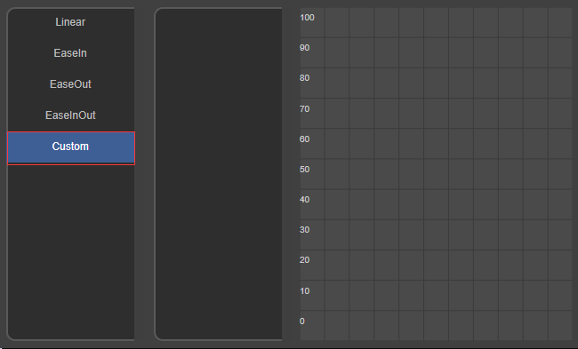

(Figure 6-5)

#### 6.1.2 Tangent Adjustment

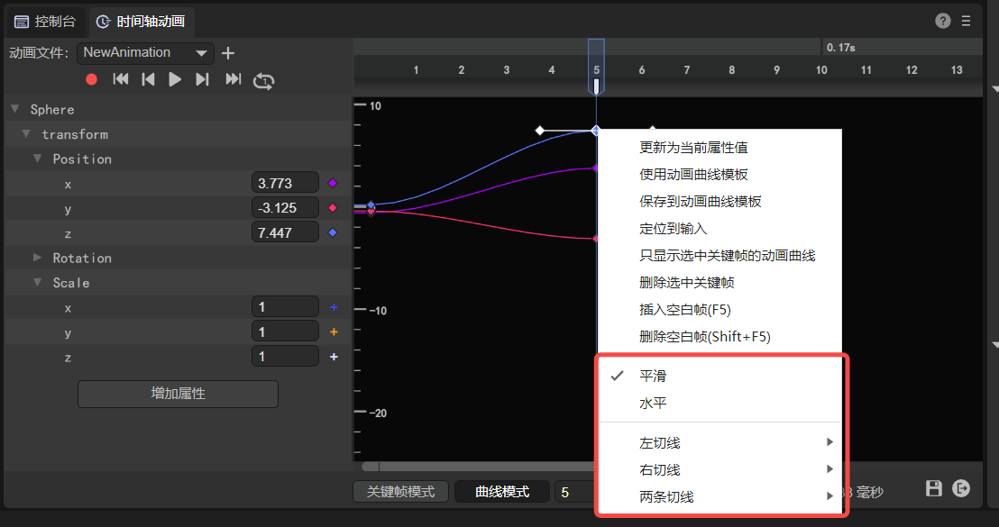

(Figure 6-6)

**Weight**:

- Default weight: The curve weight's default value is at one-third of the total weight length. This is the engine's optimized position, using Hermite interpolation algorithm with relatively good performance. Recommended for use.

  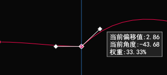

  (Figure 6-7)

- Custom weight: When "Lock Weight" is unchecked, it's custom weight. Custom weight is more flexible, but performance is not as good as default weight.

  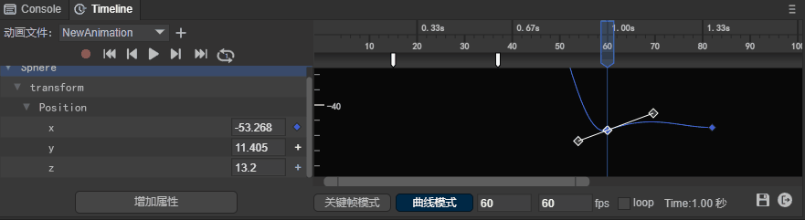

  (Animated Figure 6-8)

- Lock weight: After using custom weight, if you want to maintain this weight, you can lock the weight and only adjust tangent position.

  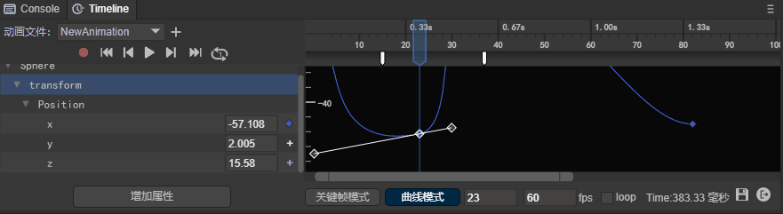

  (Animated Figure 6-9)

**Functions**:

- Left Tangent: Adjust the tangent settings for the left side of the current keyframe.
- Right Tangent: Adjust the tangent settings for the right side of the current keyframe.
- Both Tangents: Adjust the tangent settings for both sides of the current keyframe.

**Interpolation Transition**:

- linear: Adjust curve angle to make the curve appear as a straight line.

  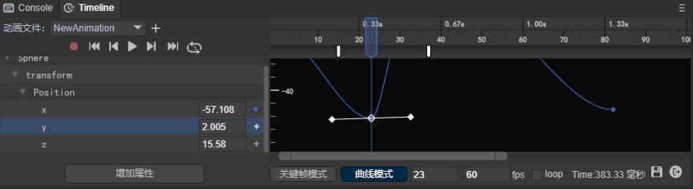

  (Animated Figure 6-10)

- constant: Adjust curve angle to make the curve appear as a right-angled polyline.

  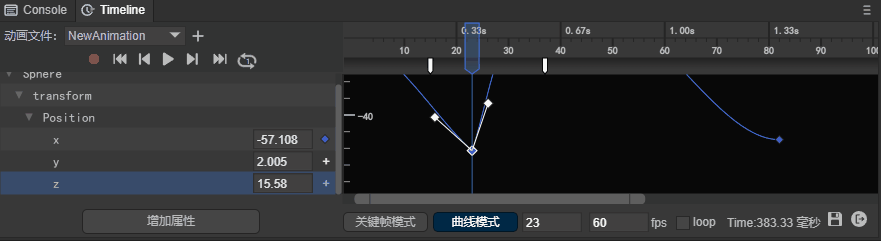

  (Animated Figure 6-11)

#### 6.1.3 Smooth

Unchecked state: The left and right sides of the keyframe can have curve left and right tangents set separately without affecting each other. However, this may result in insufficiently smooth transitions, forming sharp angles. As shown in Figure 6-12:

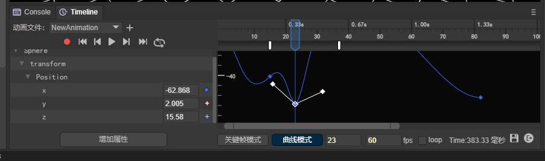

(Figure 6-12)

Checked state: The keyframe's both sides synchronously set curve tangents. After checking, transitions become smoother.

#### 6.1.4 Horizontal

Unchecked state: Custom curve tangent.

Checked state: After checking, the curve tangent quickly returns to horizontal position.

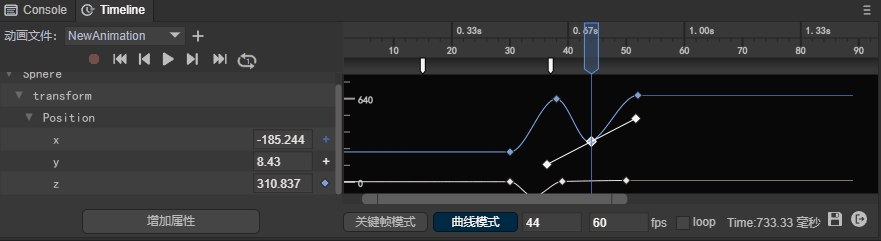

(Animated Figure 6-13)

### 6.2 Curve Positioning

#### 6.2.1 Position to Input via Curve

Right-click on a curve and click "Position to Input" in the right-click menu to quickly position to the parameter represented by that curve. Taking the green curve as an example, after clicking "Position to Input," you can find that the green curve represents the X parameter's change. As shown in animated Figure 6-14:

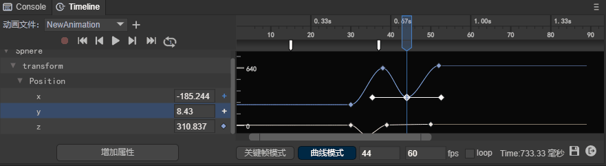

(Animated Figure 6-14)

#### 6.2.2 Auto Position

When a series of mouse operations cause the curve to not be visible in the curve panel display area, right-click and select "Auto Position" to make the curve quickly appear. As shown in animated Figure 6-15:

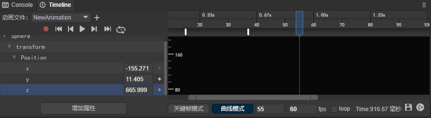

(Animated Figure 6-15)

### 6.3 Curve Display Filtering

#### 6.3.1 Filter Specific Curves in Animation Property Panel

In the animation property panel, double-click a parameter to quickly find a specific curve. As shown in animated Figure 6-16:

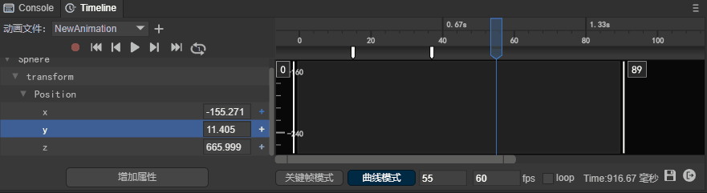

(Animated Figure 6-16)

#### 6.3.2 Filter Specific Curves in Curve Panel

In the curve panel, select a curve, right-click, and choose "Only Show Current Curve" in the right-click menu to filter to a specific curve. As shown in animated Figure 6-17:

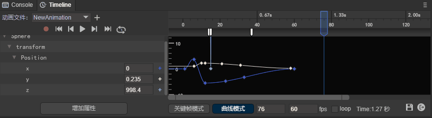

(Animated Figure 6-17)

## VII. Guide Lines

Guide lines are a path constraint tool that allows driving node (Node) displacement properties by editing spatial curves. This feature only affects a node's x and y axes (Position), not intervening in other properties like Scale or Rotation. The benefit of using guide lines is avoiding setting numerous cumbersome displacement keyframes on the timeline. Just adjust one line to complete complex path animation design.

### 7.1 Creating Guide Lines

After creating a 2D timeline animation (same for 3D), you can see the guide line button on the panel, as shown in Figure 7-1. Click "Guide Line" to initially create a guide line animation. The property name is PathPoint (if you want to edit the animation curve, you need to select the PathPoint property on the animation panel), as shown in Figure 7-2.

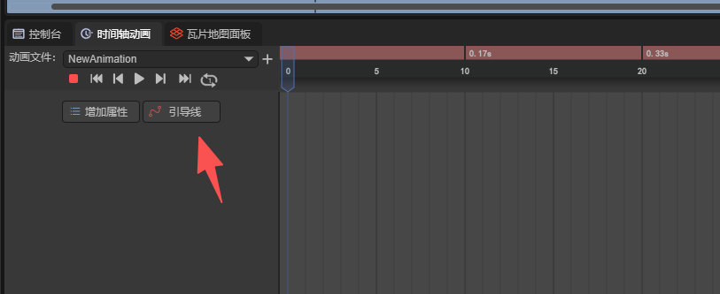

(Figure 7-1)

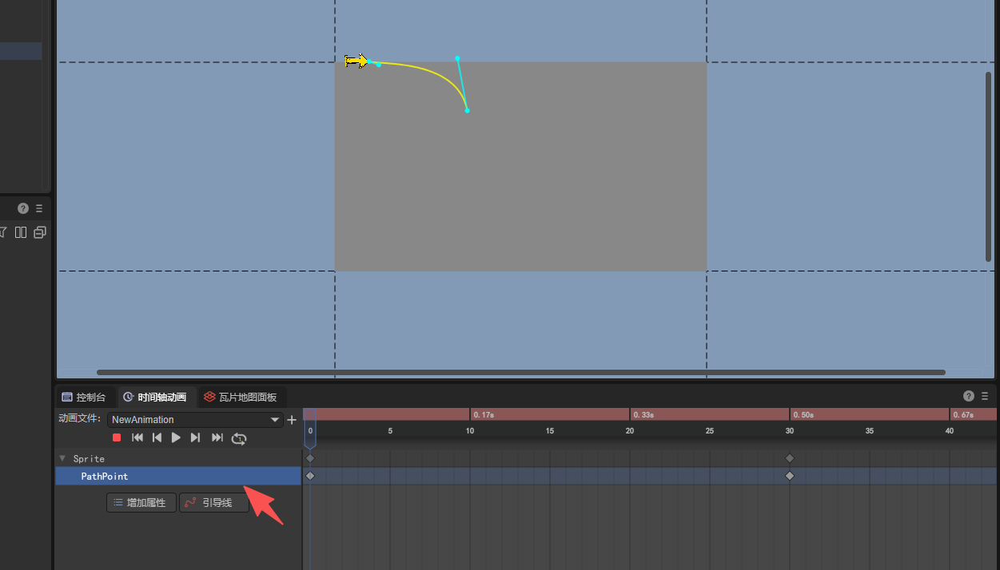

(Figure 7-2)

### 7.2 Editing Guide Lines

After selection, you can adjust the curve in the scene. Double-click the middle of the line to add key points (each node in the scene can independently create a guide line for editing). Hold Alt, then click on the curve's key point to delete curve key points. Double-click a key point to pop up the key point modification input box for more detailed and precise adjustment of the key point's position, as shown in Figure 7-3 (2D) and 7-4 (3D).

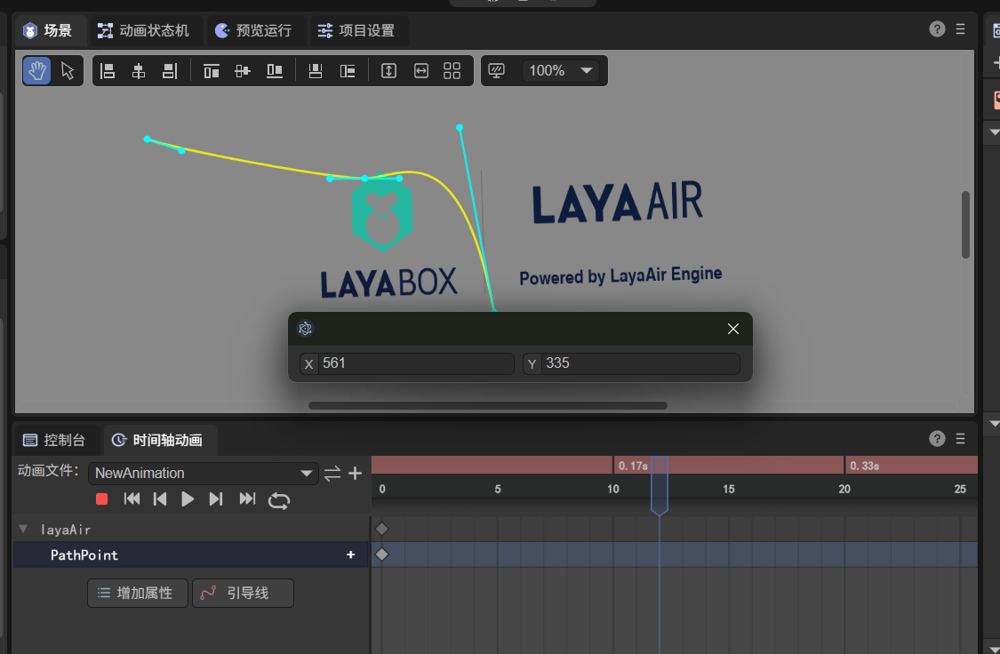

(Figure 7-3)

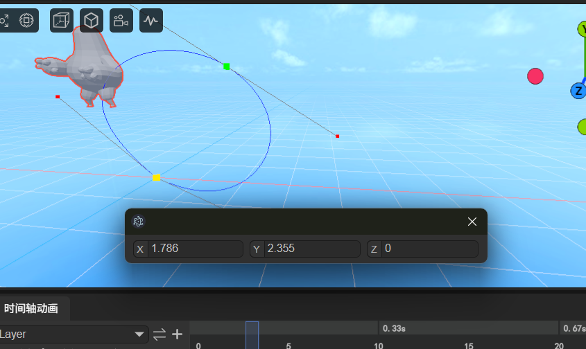

(Figure 7-4)

If you want the object to rotate following the curve's path during motion, right-click on PathPoint and select "Path Animation Follow Path Rotate" or "Path Animation Follow Motion Rotate".

The difference between the two:

Path Animation Follow Path Rotate: Regardless of whether the animation plays forward or backward, the angle at a certain point is always consistent. As shown in animated Figure 7-5:

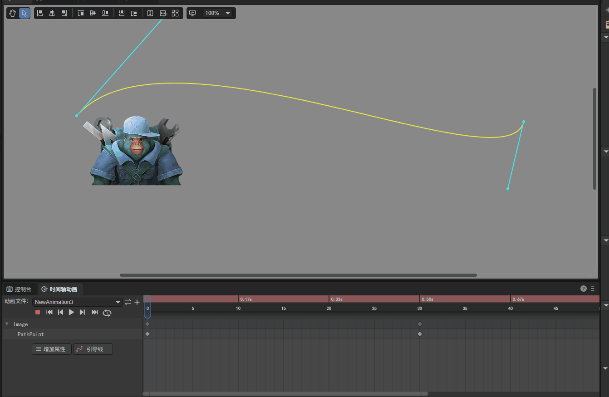

(Animated Figure 7-5)

Follow Animation Rotate: The rotation angle is automatically calculated based on the position between the previous frame and this frame, so forward and backward playback angles will differ. As shown in animated Figure 7-6:

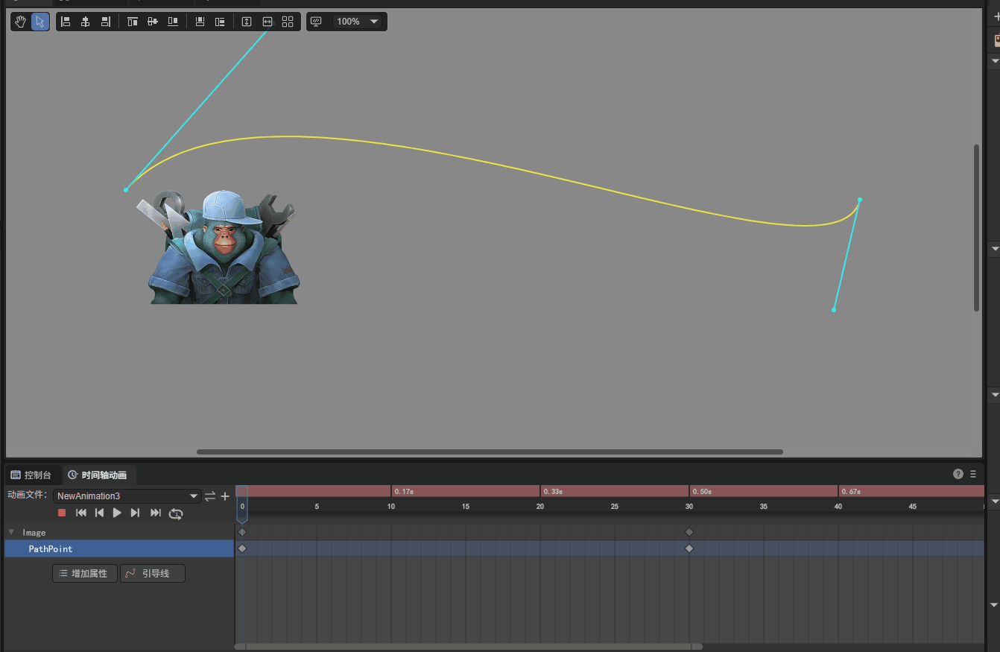

(Animated Figure 7-6)

## VIII. Playing Animations

### 8.1 Playing in Animation Panel

#### 8.1.1 Single Playback

Click the play button to play the animation. Default is single playback.

Click the button shown in Figure 8-1 to play the animation.

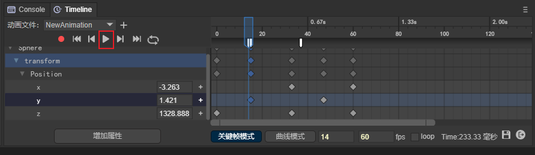

(Figure 8-1)

#### 8.1.2 Loop Playback

Animation preview defaults to single playback mode. When we see a number 1 in the middle of the loop icon, it indicates being in single playback mode. As shown in Figure 8-2.

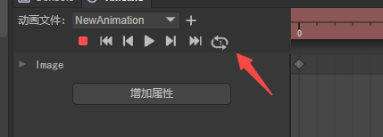

(Figure 8-2)

After clicking the single playback state button, the button enters loop icon state, as shown in Figure 7-3. At this point, the animation can loop infinitely.

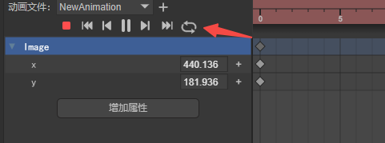

(Figure 8-3)

#### 8.1.3 Cancel Loop Playback

After clicking the loop playback state button, it stops the current loop playback state. At this point, you can see the number 1 in the middle of the loop icon again, indicating loop playback has been cancelled and returned to single playback mode.


(Figure 8-3)

> It should be noted that when changing from single playback mode to loop playback mode, since current status is not playing, it won't automatically switch to loop playback state.

### 8.2 Viewing Runtime Effects

Playback preview in the IDE is just the basic animation effect. In most cases, animations are paired with code interaction logic. At this point, you still need to view the final runtime effect in a browser.

Click the button shown in Figure 8-4 to view preview effects on different platforms.

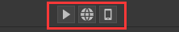

(Figure 8-4)

Since animation components can't play independently and must be attached to a scene, just run the scene where the animation is located to play the animation.

> If you want to independently view animation effects, you need to establish an animation effect test scene and attach it to the test scene.

### 8.3 Runtime Loop Playback

Loop playback preview in the IDE is unrelated to runtime loop playback.

If you need loop playback at runtime, check the loop state in Figure 7-5.

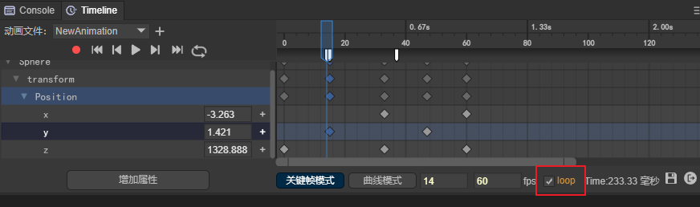

(Figure 8-5)

Without checking loop, it plays single at runtime.

## IX. Other

### 9.1 Saving Animation

As shown in Figure 9-1, click the save icon at the bottom of the timeline animation editor. Note that if you don't save, the animation will play according to the unsaved effect at runtime.

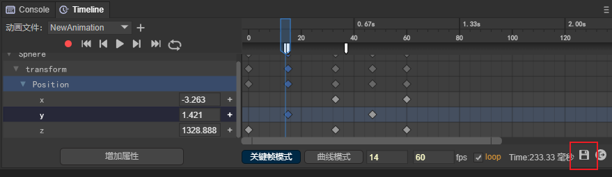

(Figure 9-1)

### 9.2 Exiting Animation Editor

Click the exit icon at the bottom of the timeline animation editor to exit the animation editor. As shown in Figure 9-2:

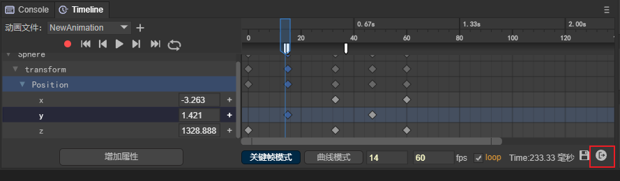

(Figure 9-2)

### 9.3 Shortcut Key Summary

| Shortcut Key | Function |
| --- | --- |
| F5 | Insert blank frames |
| Shift + F5 | Delete blank frames |
| Delete | Delete keyframes |
| Ctrl + C | Copy keyframes |
| Ctrl + V | Paste keyframes |
| Ctrl+Scroll | In keyframe mode, both animation property panel and animation frame panel scroll vertically simultaneously<br />In curve mode, lock frame ruler panel (no zoom), with mouse pointer as center, unlimitedly zoom property ruler panel precision. |
| Alt+Scroll | In curve mode, lock property ruler panel (no zoom), with mouse pointer as center, unlimitedly zoom frame ruler panel precision. (Unlimited zoom can cause when zoom stretches to 0 frames visible, no longer maintaining zoom center before zoom) |
| Alt+Shift+Scroll | In curve mode, lock property ruler panel (no zoom), with mouse pointer as center, limitedly zoom frame ruler panel precision. (Always maintains zoom center as mouse pointer during zoom. When zoom stretches to 0 frames visible, prohibits ruler precision reduction, only allows ruler precision increase) |
| Shift | In curve mode, continuously holding Shift key allows moving keyframes while always maintaining horizontal direction displacement, effective for both individual and batch movement. |
| Ctrl | In curve mode, continuously holding Ctrl key allows moving keyframes while always maintaining vertical direction displacement, effective for both individual and batch movement. |

## X. Using Animation Events

In section 5.4, we introduced animation event adding and deleting operations. Now let's see how to use animation events.

### 10.1 Property Settings

After adding an animation event, click the white event icon to set animation event properties in the IDE's right-side property panel, as shown in Figure 10-1:

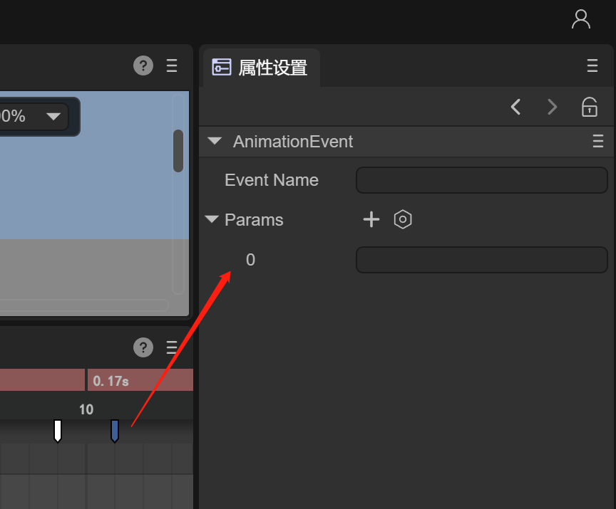

(Figure 10-1)

Event Name: The event method name called in script

Params: Parameters passed when calling the event method in script (string), can set multiple

As shown in Figure 10-2, for example, add an "event1" method name to this event, add two parameters, "a", "1", click save below:

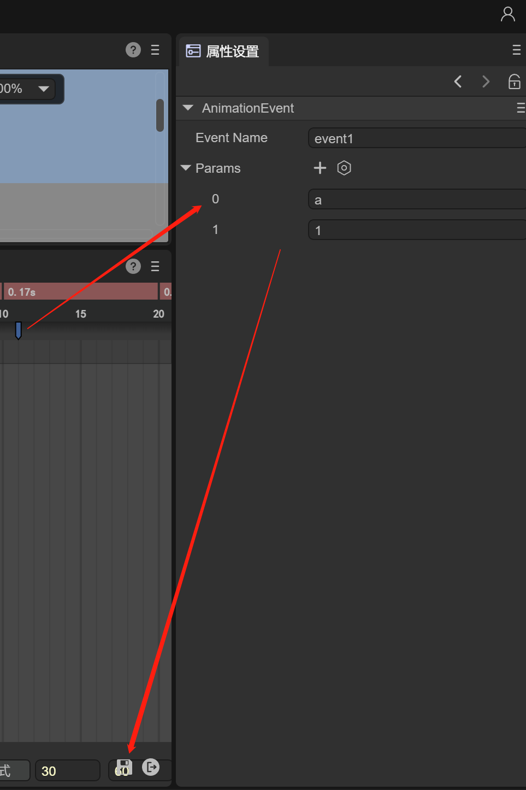

(Figure 10-2)

### 10.2 Monitoring in Script

After setting animation event properties, to listen to events and parameters, you need to add a script to the animation node.

Let's see how to add a script to an animation node through animated Figure 10-3:

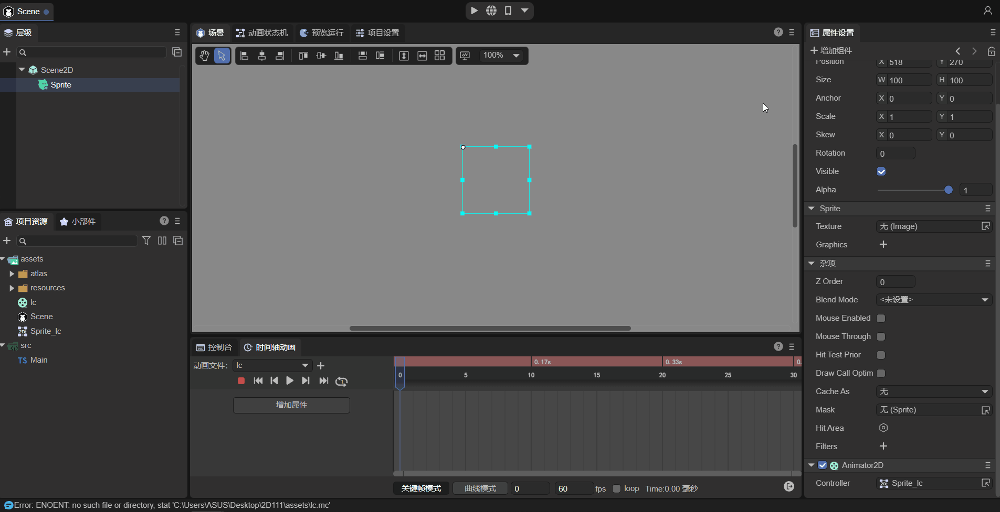

(Animated Figure 10-3)

After adding the script, you can listen to events and parameters in the script. Script code is as follows:

```typescript
const { regClass, property } = Laya;

@regClass()
export class Script extends Laya.Script {
    //declare owner : Laya.Sprite3D;

    constructor() {
        super();
    }

    event1(p1:any, p2:any): void {
        console.log("event1",p1,p2);
    }
}
```

Create the event1 method and receive two parameters in the script. Finally, let's run the animation and see the runtime result:

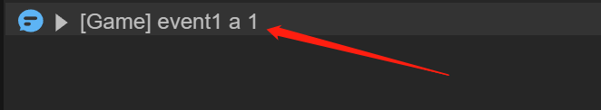

(Figure 10-4)
