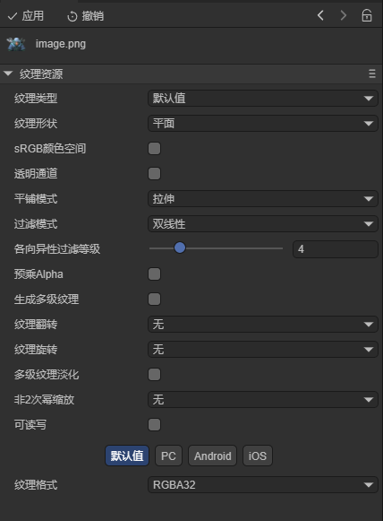
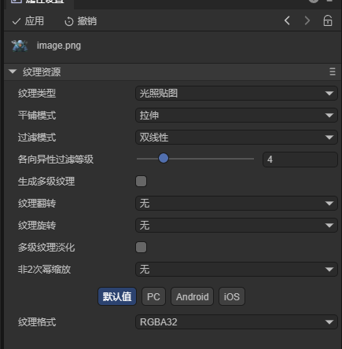
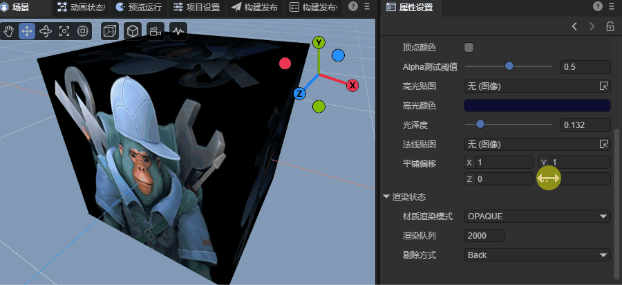
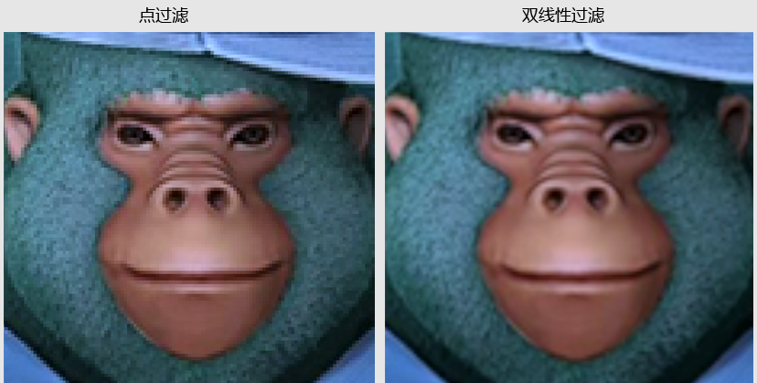
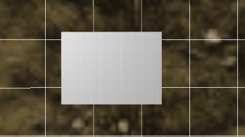
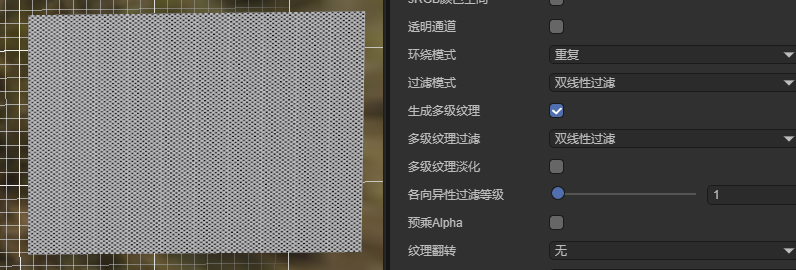
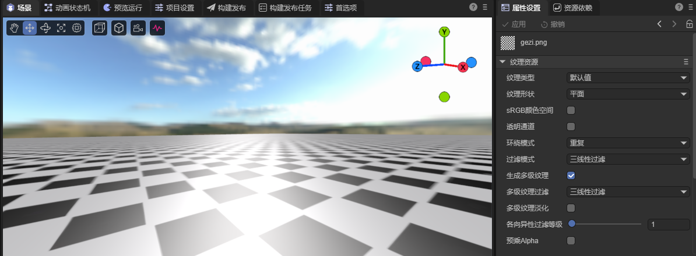

# Texture Resource Settings Description

> Author: Charley

Textures are important resources for expressing graphic details in game development. In the LayaAir engine, textures can be applied to 2D objects (such as Sprite, Image, etc.) and 3D objects (such as Sprite3D materials) to present images, colors, and details.

## 1. Texture Resource Basics

### 1.1 Types of Texture Resources
The LayaAir engine supports multiple types of texture resources:

- Regular texture resources: Conventional image textures, such as resources with png, jpg, webp suffixes;
- Compressed texture resources: Textures that can be directly read and displayed by the GPU are called compressed textures, such as PVRTC (iOS), KTX (Android) resources;
- Render texture resources: Texture resources used for off-screen rendering, capable of rendering 3D scenes onto 2D textures;
- Cubemap texture resources: Texture resources used for 3D effects such as environment maps and skyboxes;
- And so on...

**This document focuses on regular texture resources.** The **texture resources** mentioned below specifically refer to regular texture resources. For other types of textures, we can check the corresponding documents.

### 1.2 Texture Resource Settings

The conversion process from "image → texture" involves multiple processing steps such as format conversion, compression encoding, sampling methods, caching strategies, etc. These operations are closely related to the underlying graphics card instruction execution and memory upload parameters.

Since textures have different requirements in different usage scenarios (such as `2D UI`, model textures, lightmaps, etc.), developers need to reasonably configure various parameters according to specific uses to obtain ideal rendering effects.

The property settings of texture resources are used to tell the engine how to handle loading and rendering the texture.

In `LayaAir3 IDE`, after selecting a texture resource, the property panel displays the texture's parameter configuration area, large image preview window, and basic information such as size and format, as shown in Figure 1-1.

(Figure 1-1)

### 1.3 Regular Texture Resource Suffix Types

`LayaAir3` supports regular texture resource suffixes including: "`tga`", "`tif`", "`tiff`", "`png`", "`jpg`", "`jpeg`", "`webp`",

The most commonly used are resources with `png` suffix.

## 2. Common Properties of Texture Resources

### 2.1 Texture Type `textureType`

#### 2.1.1 Texture Type Concept

**Texture** is a `GPU` resource used to store image data—including color, normal, lighting information, etc.

**"Texture Type"** refers to how the engine understands, manages, and uses the purpose and characteristics of this texture.

It should be noted that "**texture type**" is different from "**texture resource type**".

The former focuses on the **usage purpose** of the texture in the rendering pipeline, while the latter focuses on the **data structure and storage method** of the texture at the `GPU` level.

In the `LayaAir3` engine, texture types are mainly divided into:

- Default value (default)
- Lightmap (`lightmap`)
- Sprite texture (`spriteTexture`)

#### 2.1.2 Default Value `default`

When selecting **Default**, it includes almost all common texture property settings. Its default property values tend toward common texture applications in `3D` scenes, as shown in Figure 2-1.

(Figure 2-1)

#### 2.1.3 Lightmap `lightmap`

When selecting **Lightmap**, it indicates that this texture is only used for lightmaps. The `IDE` will only display configuration properties related to lightmaps, and other unrelated properties will be hidden, as shown in Figure 2-2.

(Figure 2-2)

#### 2.1.4 Sprite Texture `spriteTexture`

When selecting **Sprite Texture**, it indicates that this texture is used in `2D` scenes, such as sprites or `UI`. Texture properties unrelated to `2D` rendering will not be displayed, as shown in Figure 2-3.

(Figure 2-3)

If applied to `2D` images, not using sprite texture for the texture type may cause abnormal texture colors, opaque transparent areas, and other issues.

#### 2.1.5 How to Set Texture Type on Import

In `LayaAir3-IDE`, **Default** is the default type for texture resources after being imported into the `IDE`.

If developers are developing `2D` projects and don't use `3D` texture settings at all, they can modify the default import setting for texture type to **Sprite Texture** through **Project Settings → Presets**.

In `3D` projects, it's generally recommended to keep the default import settings. If you need to use `2D UI` resources at the same time, there are two approaches:

- First, name resources in advance according to ["UI Component Resource Naming Rules"](https://layaair.com/3.x/doc/IDE/uiEditor/uiComponent/namingRule/readme.html), so that when importing into the `IDE`, they will be automatically recognized as sprite textures based on naming.
- Second, place `2D UI` resources together in the same directory, then batch select all texture resources in this directory and uniformly set them to sprite texture type.

### 2.2 Wrap Mode `wrapMode`

**Wrap Mode** is used to control how the GPU samples texture boundary pixels when texture coordinates (UV) exceed the `[0,1]` range.

Since model UV coordinates can exceed the texture's normalized range (`[0,1]`), the wrap mode determines how the exceeded area is displayed.

`LayaAir3` supports three wrap modes: Repeat (`repeat`), Clamp (`clamp`), Mirrored (`mirrored`);

#### 2.2.1 Repeat (`repeat`)

When selecting **Repeat**, when UV coordinates exceed `[0,1]`, the texture will start sampling again from the beginning. This mode creates continuous, looping texture effects on model surfaces. As shown in Animated Figure 2-4.

(Figure 2-4)

#### 2.2.2 Clamp (`clamp`)

When selecting **Clamp**, when UV exceeds `[0,1]`, the texture will repeatedly display the color of its outermost edge pixel. This makes the exceeded part look like it's being "stretched" from the edge. As shown in Animated Figure 2-5.

(Figure 2-5)

#### 2.2.3 Mirrored (`mirrored`)

When selecting **Mirrored**, the texture will repeat in a mirrored manner. The first interval `[0,1]` displays normally, the second interval `[1,2]` flips horizontally, the third interval `[2,3]` returns to normal, alternating in sequence. As shown in Animated Figure 2-6.

(Figure 2-6)

#### 2.2.4 Application Scenario Description

Wrap mode is mainly applied to `3D` material texture requirements. For `2D` sprites and `UI` textures, there's completely no need to set it.

When facing `2D` development needs, it can also be used in `2D` Shaders and `2D` rendering components that support setting texture offsets (such as `2D` mesh renderers).

### 2.3 Filter Mode `filterMode`

**Filter Mode** is used to control how the `GPU` calculates and interpolates pixel color values when textures are scaled (enlarged or reduced), thereby affecting texture clarity and smoothness.

When a texture on a model surface is stretched or compressed, one screen pixel often corresponds to multiple texture pixels (`Texel`). At this point, different filtering strategies need to be adopted for sampling interpolation.

#### 2.3.1 Point Filtering `point`

Each texture pixel has a "center point," which represents that pixel's color.

Point filtering, also called nearest point filtering, is the simplest filter mode. It doesn't perform interpolation calculations but directly selects **the texture pixel center closest to the sampling coordinates** and uses that pixel's color as the final sampling result.

For example, as shown in Figure 2-7, on the left are four pixels of different colors. The plus sign in the upper left corner represents the texture sampling coordinates. When sampling, it will select the pixel center closest to the sampling point (light blue on the right of the figure) as the output color.

(Figure 2-7)

This filter mode is very fast in terms of efficiency when enlarging, but will have obvious mosaic phenomena.

This filter mode has extremely high computational efficiency and is often used to maintain clear pixel block effects when enlarging textures. However, when shrinking or in motion, since multiple screen pixels will correspond to the same texture pixel area, it's easy to produce **Moiré patterns** or flickering phenomena, as shown in Animated Figure 2-8.

(Figure 2-8)

This is an aliasing problem caused by multiple pixels falling into the same texture pixel area. It needs to be solved using bilinear filtering combined with mipmaps.

Therefore, point filtering mode is often used for pixel-style games or low-resolution texture effects that need to maintain sharp edges.

#### 2.3.2 Bilinear Filtering `bilinear`

Bilinear filtering is an improved sampling method that introduces interpolation calculations on top of point filtering, capable of effectively reducing jagged edges and blockiness when enlarging textures.

Its principle is: when a sampling point falls between four texture pixels, the GPU reads the colors of the surrounding four pixels and performs **bilinear interpolation** based on the sampling point's position between them to calculate a smoothly transitioning color value. The effect is shown in Figure 2-9:

(Figure 2-9)

Compared to point filtering, bilinear filtering produces soft transitions at pixel edges, thereby significantly reducing jagged edges. However, when textures are significantly enlarged, the interpolation process causes the image to become slightly blurry. The comparison effect is shown in Figure 2-10.

(Figure 2-10)

Bilinear filtering is very effective when handling enlarged textures, but when textures are shrunk (i.e., one pixel covers multiple texture areas), flickering and Moiré pattern aliasing issues still occur. This is because bilinear filtering only works within a single Mipmap level and doesn't consider cross-level sampling.

Therefore, it's usually combined with **Mipmaps** to dynamically select appropriate sampling textures at different resolution levels to eliminate aliasing when shrinking.

The effect of bilinear filtering combined with mipmaps is shown in Animated Figure 2-11.

(Figure 2-11)

#### 2.3.3 Trilinear Filtering `trilinear`

Although bilinear filtering is better than point filtering, distant noise problems still exist, so bilinear filtering usually needs to be combined with mipmaps to solve noise and Moiré pattern problems.

However, when dealing with different levels of textures, jump phenomena may occur. This fuzzy-to-clear boundary is more obvious during motion.

Therefore, trilinear filtering performs an additional linear interpolation (i.e., "two linear interpolations") between adjacent two levels of mipmaps (`MipMap`), thereby achieving smooth transitions during level switching and no longer appearing abrupt. The effect is shown in Figure 2-12.

(Figure 2-12)

> In terms of performance consumption, from small to large: point filtering → bilinear filtering → trilinear filtering

#### 2.3.4 Application Scenario Description

Filter mode is more widely applied in `3D` rendering, but also plays an important role in `2D` scenes, especially when involving scaling or camera movement.

In `2D` rendering, usually a fixed sampling mode (point filtering or bilinear filtering) is chosen, while in `3D` scenes it's more commonly combined with `MipMap` or dynamically adjusted based on distance.

In `2D` scenes, filter mode is often used for **Spine animation textures** and **tile map** ground textures.

For example, when a character camera moves or scales in a `2D` scene, if using point filtering, texture sampling may not align precisely with screen pixels, causing slight jitter or waviness. In this case, bilinear filtering can be used for smoother visual effects.

### 2.4 Texture Flip `flip`

**Texture Flip** is mainly used to correct inconsistencies between texture coordinate and image data storage directions. Common flip methods include:

- **X-axis (horizontal) flip**: Flip the texture along the X axis, often used for mirror effects or character left-right symmetric animations.

- **Y-axis (vertical) flip**: Flip the texture along the Y axis, used to correct upside-down images;

> Texture flip doesn't affect the texture's own data, only adjusts the UV coordinate mapping direction during sampling.

### 2.5 Texture Rotate `rotate`

**Texture Rotate** is used to change the orientation of the texture on a surface, adjusted in 90° increments clockwise (left) or counterclockwise (right)

- **Left (clockwise)**: Rotate texture 90° clockwise.
- **Right (counterclockwise)**: Rotate texture 90° counterclockwise.

> Texture rotation doesn't affect the texture's own data, only adjusts the UV coordinate direction during sampling.

> [!Tip]
>
> It's important to note that for individual images in 2D atlases, setting texture flip and rotation is not supported.
>
> In the IDE, since textures are preprocessed, setting texture properties allows immediate viewing of single-image texture setting effects in IDE editing mode.
>
> But during runtime preview, the engine loads **atlas texture data**, not the original single image, so texture properties won't take effect, leading to **inconsistency between editor preview effects and actual runtime effects**.
>
> It's recommended that developers **don't set flip or rotation properties for images in auto atlases** to avoid runtime situations that don't meet expectations.

### 2.6 Non-Power of Two Scaling `npot`

When processing textures, graphics hardware's **ideal size is powers of two**, such as `128×128`, `512×256`, etc. Such textures are called **POT (Power Of Two) textures**.

When texture sizes aren't powers of two (called **`NPOT`**, Non-Power Of Two), some `GPU`s or old platforms may experience performance degradation or sampling anomalies when processing them. Therefore, engines usually perform automatic scaling or padding.

In `LayaAir3`, the "Non-Power of Two Scaling" option can be set to control how the engine handles `NPOT` textures:

- **None**: Keep original size (non-power of two may reduce performance in some environments, and in some cases will automatically adopt the **nearest** parameter setting);
- **Nearest**: Scale texture to the nearest power of two size; (e.g., 300×500 → 256×512);
- **Larger**: Always round up to the nearest power of two size (e.g., 300×500 → 512×512);
- **Smaller**: Round down to the nearest power of two size (e.g., 300×500 → 256×256).

> In modern `GPU`s, `NPOT` support is widely implemented, but automatic scaling can still improve performance and compatibility, especially in mobile or `WebGL` environments.

### 2.7 Read Write `readWrite`

The **Read Write** option determines whether a copy accessible by the CPU is retained after the texture is uploaded to the `GPU`.

By default, after texture data is uploaded to video memory, the CPU-side pixel data is released to save memory. At this time, the texture is **not readable/writable**.

If **"Read Write" is enabled**, the engine will retain an accessible copy of texture data in memory for the following operations at runtime:

- Getting pixel color values (such as picking, sampling analysis);
- Dynamically modifying pixels (such as drawing brushes, texture blending).

After enabling, the texture's memory usage will approximately double and reduce loading performance.

It's recommended to enable only when you need to dynamically read pixel data or access textures from the CPU in scripts, such as editor mode, debugging tools, or effect generation systems.

### 2.8 Texture Format `format`

**Texture Format** refers to the pixel data storage method of textures in the `GPU`.

It determines each pixel's color precision, whether it has an alpha channel, whether it's compressed, as well as video memory usage and rendering performance.

In `LayaAir3`, it supports **RGBA32** (R8G8B8A8), **RGB24** (R8G8B8), and **compressed texture format**. The choice of different texture formats directly affects memory consumption, loading speed, and image quality.

#### 2.8.1 `RGBA32` / `R8G8B8A8`

- **Description**: Each pixel occupies 32 bits (4 bytes), including red, green, blue, and alpha channels.
- **Characteristics**: Accurate color reproduction, complete transparency support, the most common standard texture format.
- **Application Scenarios**: UI elements, character textures, sprite textures with alpha channels, etc.

#### 2.8.2 `RGB24` / `R8G8B8`

- **Description**: Each pixel occupies 24 bits (3 bytes), no alpha channel.
- **Characteristics**: Saves video memory but doesn't support transparency.
- **Application Scenarios**: Background textures, ground surfaces, skyboxes, and other scenes that don't need transparency.

#### 2.8.3 Compressed Texture Format

- **Description**: Uses `GPU`-specific compression algorithms (such as `ETC`, `ASTC`, etc.) to efficiently store pixel data in video memory.
- **Characteristics**: Significantly reduces memory usage and performance consumption but may produce image distortion.
- **Application Scenarios**: Scenes with low texture quality requirements or motion. `UI` usually doesn't use compressed textures.

> Compressed textures need to be converted to formats supported by the corresponding platform by tools during build time and cannot be directly modified at runtime.
> Choosing the appropriate format not only affects image quality but also relates to the overall performance and loading experience of the game.

For compressed textures, there's a dedicated introduction document. Please jump to ["Compressed Texture Format"](../../uiEditor/textureCompress/readme.md) to view.

## 3. Sprite Texture Specific Properties

After selecting the sprite texture type, in addition to common texture resource property settings, there are two texture-specific settings: SizeGrid and Button Skin State.

### 3.1 SizeGrid `sizeGrid`

**SizeGrid** is a layout technique for **stretchable UI textures**.

By dividing the texture into nine regions, when stretching UI control dimensions, **it keeps the four corners from deforming, with only the middle and edge portions being smoothly stretched**.

This method is commonly used for UI elements that need adaptive sizing, such as buttons, panels, input boxes, bubble boxes, etc.

The SizeGrid parameter format is: top, right, bottom, left, whether to repeat fill. As shown in Figure 3-1.

(Figure 3-1)

Usually, SizeGrid properties can be set directly in UI components.

But for **frequently reused textures** like buttons, backgrounds, if you don't want to manually set `sizeGrid` in each component,

You can choose to set it uniformly on **texture resources**.

This way, all UI elements referencing this texture will automatically inherit the SizeGrid property, avoiding repeated settings and improving efficiency and consistency.

### 3.2 Button Skin State `stateNum`

**Button Skin State** is used to define the number and order of textures corresponding to a button under different interaction states.

In LayaAir's classic UI system, buttons usually use a skin texture containing multiple frame states. These states are arranged in a fixed order from top to bottom. The `stateNum` property is used to specify the number of states contained in that button skin.

The skin arrangement order for button states from top to bottom includes:

- **Out**: Default appearance when the mouse is not on the button;
- **Over**: Appearance when the mouse hovers over the button;
- **Down**: Appearance when the button is pressed;

When `stateNum = 3`, the button texture is equally divided into three segments, and at runtime, the corresponding area's texture is automatically switched based on button state (out, over, down).

If a button only contains two states (for example, mobile devices don't need an "over" state), `stateNum` can be set to `2`. At this time, the button texture is equally divided into two segments, only showing "out" and "down" skin appearances.

When set to `1`, the button will only use a single-state texture, won't cut the skin resource, and won't change during interaction. It's suitable for static decorative or non-interactive buttons.

**It should be noted** that if the skin state (`stateNum`) is set in the texture resource properties, this setting will be automatically inherited by the button component, and **the skin state option will no longer be displayed in the button component**.

When you want to separately configure skin state in the button component, please set the texture resource's button skin state `stateNum` property to **"Unset"**.

> [!Tip]
> It's recommended that when art resources create multi-state button skins, **arrange different state images from top to bottom**, ensuring consistent skin dimensions and seamless edge connections.
>
> If button state textures consist of multiple separate images, you can also use LayaAir3-IDE navigation menu → Tools → Make Button Skin to combine multiple single-state skins into one multi-state button skin. However, this tool can only convert one multi-state button skin at a time and is often used for small-volume button skin conversion needs.

## 4. Other Texture Properties

The default texture resource property configuration is relatively comprehensive, including configurations needed for lightmaps, so this section won't separately introduce lightmap configuration parameters.

The following content focuses on other texture properties besides common properties.

### 4.1 Texture Shape `textureShape`

**Texture Shape** is used to specify the dimension type of the texture in the GPU. Different shapes determine the texture's sampling method and application scenarios.

In LayaAir3, mainly two texture shape settings are provided: **2D** and **Cube**. The former is used for most materials and textures, while the latter is used for rendering effects with spatial directionality such as reflections and skyboxes.

#### 4.1.1 2D Texture

**2D Texture** is the most common texture type, used to sample pixel colors on a two-dimensional plane.

It's not only suitable for 2D games or UI elements but is also the most basic texture form in 3D rendering. For example, diffuse textures, normal textures, metallic textures, etc., on model surfaces.

Even panoramic sky material textures exist in the form of **2D textures**.

In the GPU, **2D texture** shape is sampled using a 2D coordinate system `UV (u,v)`, with coordinate ranges usually between `[0,1]`.

#### 4.1.2 Cube

Cubemap textures are used for skybox material textures and reflection map rendering effects.

There are two ways to form **cubemap textures**. One is a stereo texture composed of six square images.

The other is to take a single panoramic image and automatically convert it to a cubemap texture by setting the texture shape to cube in the IDE. As shown in Figure 4-1.

(Figure 4-1)

> [!Tip]
>
> It's important to note that if the texture's original size is smaller than 2 and doesn't meet panoramic sky texture requirements, even if this setting is applied, it will cause **cubemap texture** generation to fail. It cannot be used as a cubemap texture.

In LayaAir3-IDE, when the texture shape is set to cube, there are two related settings: cubemap size `cubemapSize`, cubemap file mode `cubemapFileMode`.

##### 4.1.2.1 Cubemap Size `cubemapSize`

This parameter represents the resolution of the cubemap texture, supporting automatic mode and multiple fixed values that are powers of two (minimum 2, maximum 2048) setting items. As shown in Figure 4-2.

(Figure 4-2)

The option value serves as the height dimension of the cubemap texture. The width dimension is twice the height.

For example, selecting 256 means the cubemap texture's height dimension is 256, and the width dimension is 512.

If developers choose "**Auto**" mode, the system will automatically calculate appropriate dimensions based on the **Non-Power of Two Scaling (npot)** property.

For example, original resources with dimensions 300 × 600:

- When **Non-Power of Two Scaling** value is **None**, the system automatically selects `Nearest` mode, scaling the texture to: 256 × 512.
- When **Non-Power of Two Scaling** value is **Larger**, scaling the texture to: 512 × 1024.

##### 4.1.2.2 Cubemap File Mode `cubemapFileMode`

This parameter is used to set the **pixel data format** of the cubemap, that is, the bit depth and composition method used by each pixel's color channels (red, green, blue, alpha). Different data modes affect the texture's **memory usage, rendering precision, and performance**.

In most cases, the default `R8G8B8` mode can already meet conventional skybox and reflection map needs. If you need higher precision or textures with alpha channels, you can choose higher bit depth modes according to project needs.

| Option Value | Description |
| ------------ | ----------- |
| R8G8B8 | 8-bit precision per pixel, 24-bit color depth total, no alpha channel. Suitable for standard skybox or environment maps. |
| R8G8B8A8 | 8-bit precision per pixel, 32-bit color depth total, includes alpha channel. Often used for cubemap textures with transparency effects. |
| R16G16B16 | 16-bit precision per pixel, 48-bit color depth total, no alpha channel. Higher color levels and transition smoothness, suitable for HDR (high dynamic range) maps. |
| R16G16B16A16 | 16-bit precision per pixel, 64-bit color depth total, includes alpha channel. Suitable for high-precision environment reflections or light caching. |
| R32G32B32 | 32-bit precision per pixel, 96-bit color depth total, no alpha channel. Suitable for professional rendering scenes requiring extremely high color precision. |
| R32G32B32A32 | 32-bit precision per pixel, 128-bit color depth total, includes alpha channel. Highest precision, used for physical-level light reflections (such as PBR reflection probes), with the highest memory overhead. |

### 4.2 sRGB Color Space `sRGB`

#### 4.2.1 sRGB Definition

**sRGB (Standard RGB)** is a standardized **RGB (Red Green Blue) color space** jointly proposed by **HP and Microsoft in 1996**, with the full name *Standard Red Green Blue*. It aims to **provide a unified color performance benchmark for different devices (displays, printers, network images)**.

It defines a standard gamma correction curve, approximately 2.2 nonlinear gamma, used to map linear RGB values to nonlinear display brightness. This mapping conforms to the human eye's perception laws of brightness, making colors appear more natural and balanced across different brightness ranges.

Since sRGB was designed considering human eye perception characteristics, its color gamut is relatively small but covers most common SDR displays, thereby ensuring color consistency across devices.

It should be noted that sRGB also has limitations: limited color range, unable to cover all visible colors; limited contrast, with smaller difference between brightest and darkest; not suitable for high dynamic range (HDR) content; in linear workflows, may cause color distortion or unnatural transitions.

#### 4.2.2 When to Use sRGB?

If the texture is used to store color information (such as diffuse/base color textures), you can check to use sRGB;

For textures storing physical properties or non-color data (such as normal textures, metallic, roughness, AO, etc.), sRGB should not be checked. Keep them in linear space to ensure physical calculation correctness.

### 4.3 Alpha Channel `alphaChannel`

In texture properties, the **Alpha Channel** is the core parameter for controlling texture transparency and blending effects.

It determines the pixel's visibility during rendering, thereby achieving effects such as **semi-transparent materials, additive blending, glass, smoke, leaves, UI element transparent edges**, etc.

In LayaAir3, this property is used to control whether the current texture contains alpha channel data and informs the rendering pipeline how to parse and use that channel.

- If `alphaChannel` is checked, it indicates that this texture contains alpha channel data, and the system will retain and process this channel during import and encoding.
- If unchecked, the texture is considered an **opaque texture**. Even if alpha information exists in the image source file, it will be ignored, thereby saving video memory and improving sampling efficiency.

### 4.4 Generate Mipmap `generateMipmap`

#### 4.4.1 What Are Mipmaps

Mipmaps are a set of texture images of the same origin, with their dimensions sequentially reduced by a ratio of 1/2. Level 0 is the original texture, and each continuing level is reduced to half the size of the previous level. This hierarchical relationship can continue recursively until 1 × 1 pixel.

For example, if the original texture size is 256 × 256 pixels, the mipmap has a total of 9 levels. Level 0 is the original size of 256. In addition, 8 extra levels (1-8) of textures are generated, with specific dimensions of: 128 × 128, 64 × 64, 32 × 32, 16 × 16, 8 × 8, 4 × 4, 2 × 2, 1 × 1 pixels. The schematic effect is shown in Figure 4-3:

(Figure 4-3)

In LayaAir3-IDE, these reduced images aren't directly generated for general texture resources like PNG. Instead, at runtime, the GPU automatically creates mipmaps in video memory.

Common texture dimensions correspond to levels as follows:

| Original Size | Total Mipmap Levels | Mipmap Level Dimension Reduction Order (from Level 0 to Last) |
| ------------- | ------------------- | ------------------------------------------------------------ |
| 2048 × 2048 | 12 | 2048 → 1024 → 512 →256 → 128 → 64 → 32 → 16 → 8 → 4 → 2 → 1 |
| 1024 × 1024 | 11 | 1024 → 512 → 256 → 128 → 64 → 32 → 16 → 8 → 4 → 2 → 1 |
| 512 × 512 | 10 | 512 → 256 →128 → 64 → 32 → 16 → 8 → 4 → 2 → 1 |
| 256 × 256 | 9 | 256 → 128 → 64 → 32 → 16 → 8 → 4 → 2 → 1 |
| 128 × 128 | 8 | 128 → 64 → 32 → 16 → 8 → 4 → 2 → 1 |

#### 4.4.2 Generate Mipmap `generateMipmap`

In section "2.3 Filter Mode", we already mentioned: when textures are shrunk, if only bilinear filtering is used, severe Moiré patterns will occur, as shown in Figure 4-4.

(Figure 4-4)

But after checking Generate Mipmap `generateMipmap`, the GPU will automatically create a series of reduced versions. After bilinear filtering, Moiré pattern phenomena can be effectively eliminated. The effect is shown in Figure 4-5.

(Figure 4-5)

Besides fixing visual artifacts, mipmaps have the following performance advantages:

- **Reduce video memory bandwidth reads**: For example, when objects are far from the camera, theoretically only a small portion of texture details is needed. Without mipmaps, the GPU needs to read the entire high-resolution texture. With mipmaps, the GPU can directly access smaller texture levels that match the distance, significantly saving bandwidth.
- **Reuse mipmaps in PBR rendering to achieve reflection blur**: For example, in physically based rendering (PBR), the renderer can read different mipmap levels of roughness textures to simulate **reflection blur**. When object surfaces are very smooth, it reads high-resolution mipmaps. When surfaces are very rough, it can read lower, blurrier mipmap levels, thereby **more realistically simulating distant reflected light blur** while saving calculations.

Of course, mipmaps also have a cost: they require additional video memory (about 33%–50% extra texture volume) and bring certain computational costs when generating. Whether to enable still needs to be weighed according to project needs.

#### 4.4.3 Mipmap Filter `mipmapFilter`

Mipmap filter `mipmapFilter` is an additional filtering setting for **compressed textures** after enabling "Generate Mipmap".

Why don't regular textures (like PNG, JPG, etc.) need to set it?

Because regular texture mipmap data is automatically generated by the GPU at runtime, while compressed textures (like KTX, ASTC, ETC) are **directly read by the GPU from their stored data** and won't generate reduced images at runtime.

Therefore:

- For regular textures: `mipmapFilter` doesn't need to be configured.
- For compressed textures: Need to enable `mipmapFilter` and select the filtering method used to generate each level of mipmap, so that complete mipmap data is generated during build.

The filtering methods are the same as the filter mode mentioned earlier, just with different application objects.

#### 4.4.4 Max MIP Levels `maxMipLevels`

Previously introduced that by default, mipmaps will start from the original size and sequentially reduce until generating a 1 × 1 pixel texture map.

However, in actual use, not all MIP levels bring visual benefits.

For many textures, when dimensions are reduced to a certain extent, continuing to generate lower-resolution MIP levels won't improve image quality but will:

- Make compressed formats produce obvious color blocks at very small sizes (especially PVRTC, ETC, etc.)
- Increase texture file size (limited to compressed textures only)
- Increase video memory usage
- Increase build time

Therefore, the amount of unnecessary data can be reduced by limiting the number of generated MIPs.

The role of `maxMipLevels` is to control the maximum number of MIPMAP chain levels to reduce **compressed texture file size** and **video memory usage**.

For example, a 64×64 texture can theoretically generate:

64 → 32 → 16 → 8 → 4 → 2 → 1 (total 7 levels),

But the smallest 2×2 and 1×1 levels are often meaningless and may even produce obvious color shifts when compressed by PVRTC or ETC.

At this time, `maxMipLevels` can be set to 5, which means generating:

Level 0 → Level 4 (total 5 levels),

That is: 64 → 32 → 16 → 8 → 4

This way, without affecting distant rendering effects, storage and video memory consumption from extra MIP levels can be reduced.

It should be noted that this setting only targets GPU compressed textures (like PVR, KTX, DDS).

Regular PNG/JPG source formats themselves don't contain MIPMAP, so they won't be affected, and setting this has no effect.

#### 4.4.5 Anisotropic Filtering Level `anisoLevel`

When 3D model surfaces tilt and extend into the distance (such as ground, roads, walls), traditional texture filtering techniques encounter difficulties.

To prevent excessive distant details causing pixel flickering (i.e., "Moiré pattern" phenomenon) and jump phenomena, mipmap technology and trilinear filtering are usually combined for processing.

The problem is that trilinear filtering assumes texture scaling proportions are the same in all directions (i.e., **isotropic**).

But on tilted surfaces, this isn't the case. When surfaces tilt, the texture's projection on the screen is often elongated, with extremely different scaling proportions in horizontal and vertical directions.

The result is that trilinear filtering incorrectly uses **overly blurred** Mipmap levels, making **nearby** tilted textures look okay. **Distant** tilted textures (like the horizon) become **a blur**, with details completely lost. As shown in Figure 4-6:

(Figure 4-6)

**Anisotropic filtering** is a texture sampling optimization technique specifically designed to solve the above problems.

It analyzes the texture's projection shape on the screen based on the angle between the viewing direction and surface normal (tilt degree), automatically identifying the texture's long axis (tilt direction) and short axis (vertical direction) on the screen projection for separate sampling.

For example, the **short axis (vertical)** continues using normal mipmap levels (maintaining clarity, avoiding flickering).

The **long axis (tilt)** performs **additional, stretched texture sampling** along the tilt direction without increasing blur. This effectively reduces blurring and jagged edges on distant or tilted surfaces, making planes like ground, walls, and roads maintain sharpness at perspective angles. As shown in Figure 4-7:

(Figure 4-7)

Anisotropic filtering level is used to control the intensity of "additional sampling" in the tilt direction. Higher values mean the filter can handle more extreme **tilt angles**, with higher image quality and better detail retention. But at the same time, video memory bandwidth and sampling performance consumption also increase.

- **`anisoLevel = 1`**: Disables anisotropic filtering, only using basic bilinear or trilinear filtering.
- **`anisoLevel > 1`**: Enables anisotropic filtering. Common optional values are 2, 4, 8, 16, corresponding to different clarity and performance consumption.

Recommendations:

- For **ground textures, wall textures, road textures** and other textures displayed in a tilted manner, enable higher levels (such as 8~16).
- For **normal textures, volume textures** and other resources that don't rely on perspective clarity, use the default value of 1.

### 4.5 Premultiply Alpha `premultiplyAlpha`

In transparent texture rendering processing, the alpha channel not only determines pixel transparency but also relates to whether colors can correctly blend with the background. When textures are used improperly, edges will have obvious "white edges", "black edges", "glowing edges", which is very common in UI, particles, and semi-transparent materials.

To solve the problem of transparent edge blending errors, rendering systems often use **Premultiplied Alpha** technology.

#### 4.5.1 What Is Premultiplied Alpha?

Regular textures store colors as: `(R, G, B, A)`.

Premultiplied alpha multiplies the color by transparency before storage: `(R*A, G*A, B*A, A)`,

This means:

- Transparent areas (A=0) → Color is also pressed to 0 (completely transparent, no residual color)
- Semi-transparent areas (A=0.5) → Color becomes half
- Opaque areas (A=1) → Color remains unchanged

The direct benefit of this is: **Transparent edges won't have "ghosts" or "white edges" of the original image color, and blending is more natural and correct.**

#### 4.5.2 Why Do Transparent Textures Have White or Black Edges?

Many transparent PNGs have "color bleeding" in edge areas. RGB edges are filled with bright colors or white, but alpha is still close to 0.

When the GPU samples transparent textures (especially under bilinear/trilinear filtering), it blends multiple surrounding pixels. If edge pixel alpha is small but RGB is bright, those colors will be brought into the final result, forming white or bright edges.

**After enabling premultiplied alpha**, in transparent areas RGB has been multiplied to close to 0. Even if the GPU samples and blends multiple times, it won't pull "edge colors" into the final image. So edges become clean and natural.

#### 4.5.3 When to Apply and Set?

The following scenarios **strongly recommend enabling premultiplied alpha**:

- UI icons, buttons, rounded panels
- Particle systems, smoke, light effects, magic effects
- Decals, transparent textures, leaves, character hair
- Textures using bilinear, trilinear filtering
- Transparent textures using mipmaps (no premultiplicationeasiest to white edges)

In these cases, premultiplied alpha can effectively avoid:

- "White edges, black edges"
- Bright borders on semi-transparent edges
- Edges being filter "contaminated" when enlarging or shrinking
- UI elements appearing gray or bright when stacked

**When textures are completely opaque** (A=1 or no transparency), **disabling premultiplication won't cause problems**. For example:

- Metal, stone, ground textures
- Normal textures, metallic textures, and other non-color textures
- Completely opaque model textures

These textures don't involve transparency blending, so naturally don't need premultiplication.

## 5. Setting Server Texture Resources

For texture resources in local projects
