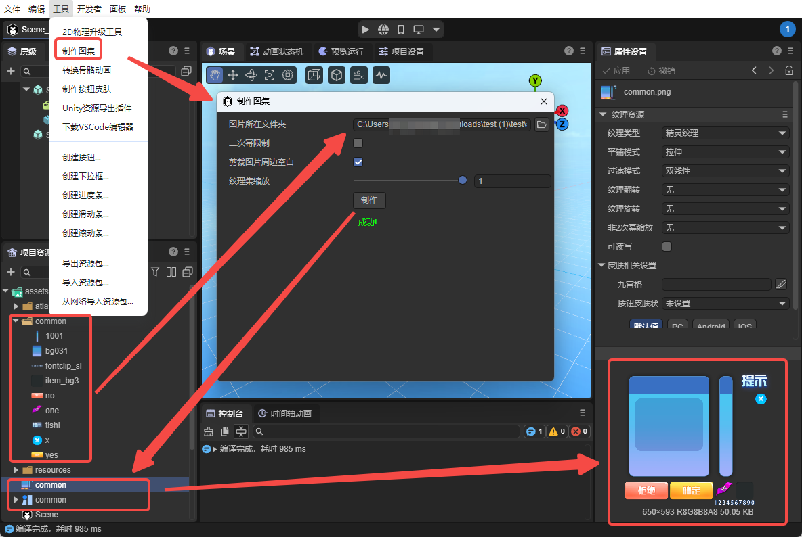
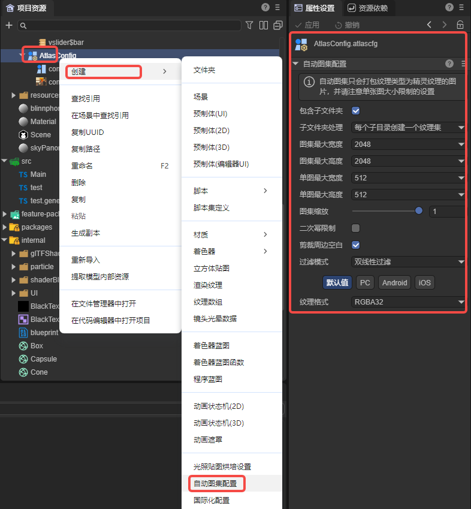
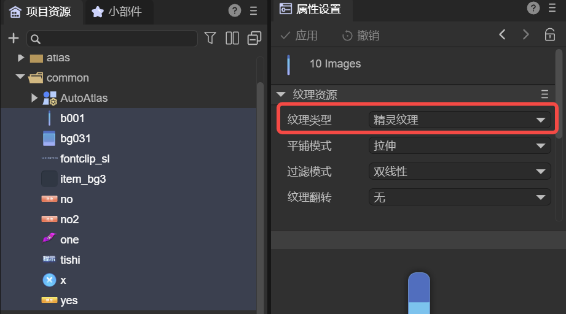
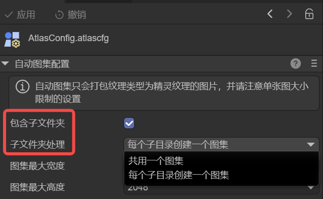
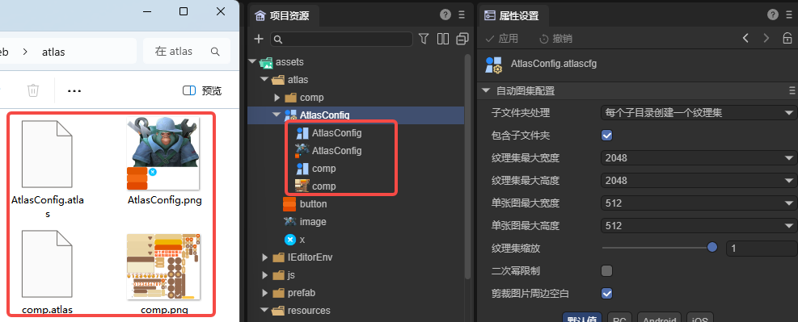

# Auto Atlas Configuration

> Author: Charley

## 1. Atlas Basics

### 1.1 What is an Atlas

In game development, the full name of **Texture Atlas** is a large image collection. It's a resource optimization technique that **integrates multiple small images into one large image**, with advantages such as reducing `DrawCall`, reducing texture switching times, and reducing `I/O` requests. It's one of the key means for `2D` product types to improve rendering performance and improve memory utilization.

### 1.2 How to Make an Atlas

In `LayaAir3-IDE`, there are two ways to generate atlases: manual atlas creation and automatic atlas creation.

#### 1.2.1 Manual Atlas Creation

The first method is through the menu bar: **Tools → Make Atlas**, which opens the atlas creation tool.

In this tool, drag or select the **folder where images are located**, and click the **Make** button to merge multiple small images into an atlas, as shown in Figure 1-1.



(Figure 1-1)

The generation result includes two parts:

- A large image resource file with `.png` suffix;
- An atlas configuration file with `.atlas` suffix, used to record the name, position, size, and other information of each small image.

#### 1.2.2 Automatic Atlas Creation

The second method is the automatic atlas creation highlighted in this document.

Automatic atlas is implemented through an **Auto Atlas Configuration File (`AutoAtlas.atlascfg`)**.

In daily development, developers don't need to manually operate or perceive the atlas generation process. They can simply use small image resources normally. The system will automatically generate and use corresponding atlas resources during **publishing/building or running/debugging**, thereby achieving **automation of performance optimization**.

To create an auto atlas configuration, simply select the target image directory in the resource panel, **right-click menu** → **Create → Auto Atlas Configuration**, and the `AutoAtlas.atlascfg` file will be generated, as shown in Figure 1-2.



(Figure 1-2)

> Detailed property descriptions of the auto atlas configuration file will be introduced in Section 2.

It should be noted that small image resources included in the auto atlas must be of **Sprite Texture (`spriteTexture`)** type, as shown in Figure 1-3. Only resources of this type will be correctly identified and merged into the atlas during packaging.



(Figure 1-3)

> Developers can select one or more images and uniformly set the texture type

## 2. Auto Atlas Configuration Description

### 2.1 **Folder and Subdirectory Settings**

The handling of folders includes two configuration items: **Include Subfolders** and **Subfolder Handling**. As shown in Figure 2-1,



(Figure 2-1)

- **Include Subfolders (includeSubFolders)**
  - **Unchecked**: Only pack images in the current folder (where the auto atlas configuration is located) into the atlas.
  - **Checked**: Recursively scan all subfolders and include their images in the packing scope.
- **Subfolder Handling (perFolder)**
  - **Share one atlas**: Pack images in the current directory and all subfolders into the same atlas.
  - **Create one atlas per subdirectory**: Generate independent atlases for each subfolder according to the directory structure.

### 2.2 Atlas Maximum Width / Height

Used to limit the maximum size a single atlas can reach. The default value is **2048 × 2048**.

When the content in an atlas exceeds this size limit, the IDE will automatically generate new atlas files (i.e., one directory may be split into multiple atlases).

### 2.3 Single Image Maximum Width / Height

Used to limit whether a single image is allowed to enter the atlas. The default value is **512 × 512**.

If the width or height of an image exceeds this value, it will not be packed into the atlas.

Generally, it's not recommended to put large images exceeding 512 × 512 into an atlas. Large images are more suitable as separate textures loaded in advance.

### 2.4 Atlas Scaling

Used to scale all images in the atlas proportionally. For example, if set to **0.5**, the `IDE` will scale the original image width and height by 0.5 respectively before putting them into the atlas. They will still be displayed at the original size during rendering.

Scaling can significantly reduce atlas volume and is a "lightweight compression" strategy, but it will affect display precision.

If you need to maintain the clarity at design time, it's recommended to keep the default value of 1.

### 2.5 Power of Two Limit

If checked, the generated atlas image width and height will be powers of two. For example, width 753 and height 500, after checking `Power of Two Limit`, the width and height will become 1024 and 512. Unless facing certain runtime environments thatrequire powers of two, there's usually no need to check this under normal circumstances.

### 2.6 Filter Mode

The scattered images in the atlas do not inherit their original texture's filter mode, so the filter mode needs to be set uniformly in the auto atlas configuration. It will be applied to the final generated atlas texture.

The filter mode affects the sampling method when textures are scaled, thereby affecting clarity and transition smoothness.

For more detailed texture filtering principles, you can refer to the document ["Texture Resources"](../texture/readme.md#23-过滤模式-filtermode).

### 2.7 Crop Surrounding Blanks

When enabled, the `IDE` will automatically crop the transparent blank areas around the original image to reduce atlas space occupation.

This option is enabled by default and usually doesn't need to be disabled.

### 2.8 Texture Format

Atlases support three types of texture formats:

- **RGBA32 (R8G8B8A8)**: Default format, 32 bits per pixel, including red, green, blue, and alpha channels.
- **RGB24 (R8G8B8)**: 24 bits per pixel, including only RGB three channels, without alpha channel.
- **Compressed Texture Format**: Uses GPU-specific compression algorithms (such as ETC, ASTC, etc.), which can significantly reduce memory usage and is suitable for projects that need to optimize performance.

For more detailed instructions, you can refer to the texture compression document ["Texture Compression"](../../uiEditor/textureCompress/readme.md).

## 3. How to Use an Atlas

### 3.1 Atlas Resource Introduction

After atlas packaging is completed, each atlas will generate two types of files: a `.atlas` data file and a `.png` texture file with the same name.

There are the following naming rules for scattered images and atlases:

- When **scattered images are located in the directory where the auto atlas configuration is located**, the atlas name is the same as the auto atlas configuration file name.
- When **scattered images are located in its subdirectory**, the atlas name is the same as that subdirectory name.

Regardless of which subdirectory the scattered images are in, the generated atlas files (`.png` and `.atlas`) will be uniformly output to the **directory where the auto atlas configuration is located**. As shown in Figure 3-1.



(Figure 3-1)

It can be seen that in the generated png format image, the textures of small images have been merged together. The `.atlas` is the data file of the atlas, used to store scattered image file names, positions, widths, heights, and other information.

### 3.2 How to Use Small Images from an Atlas

#### 3.2.1 Transparent Use of Auto Atlas

For developers, atlases generated through auto atlas configuration are "transparent."

Whether in the IDE or in code, developers can always access resources using the **small image's original relative path**. The construction, loading, and parsing of atlases are automatically completed by the IDE and engine.

When the engine uses any small image, it will automatically load the entire atlas where that small image is located. Therefore, the atlas is just a texture optimization means provided by the engine, and developers don't need to handle it additionally.

#### 3.2.2 Using Manually Made Atlases

In addition to auto atlases, you can also use manually made atlas files.

In LayaAir3 IDE, `.atlas` files support expanding to display the small images contained in the atlas.

In actual use, you can directly drag a small image from the resource panel to the texture property of a component. As shown in Figure 3-2.


(Figure 3-2)

#### 3.2.3 Preloading Atlases

Resource loading is asynchronous, so sometimes logic starts executing but resources haven't been loaded yet. Sometimes, for a better experience, some atlases need to be preloaded before use.

Especially for manually made atlases, when accessing through code, you must first load the `.atlas` file.

Example code is as follows:

```typescript
const { regClass, property } = Laya;

@regClass()
export class NewScript extends Laya.Script {
    declare owner: Laya.Image;

    //Executed after component is enabled, for example, after node is added to stage
    onEnable(): void {
        //Need to load the atlas before use. Note, the atlas should be placed in the resources directory or manually added as an always-included resource directory in the build & publish configuration
        Laya.loader.load("resources/aaa/test.atlas").then(() => {//For more resource loading methods, see the "Resource Loading" document
            this.owner.skin = "resources/aaa/image.png"; //Treat atlas path + name as the resource directory of the small image, the small image name is the original small image name in the atlas
        })
    }
}
```
