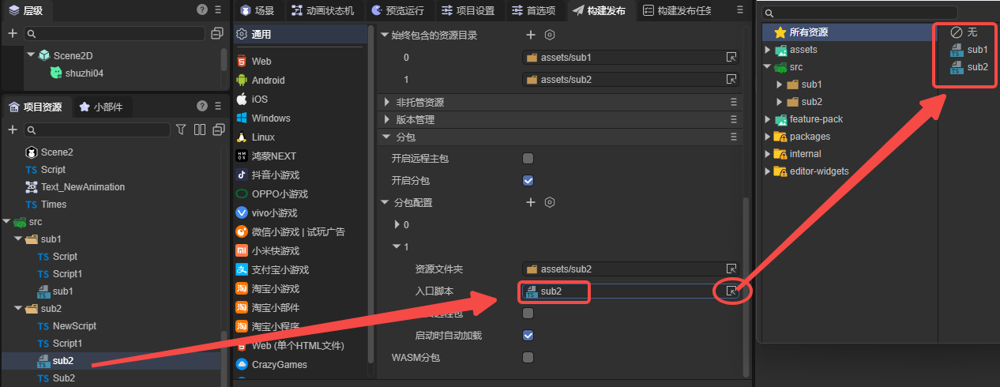

# Script Bundle Definition

> Author: Charley

## 1. Basic Usage Flow

### 1.1 What is Script Bundle Definition

Before understanding "Script Bundle Definition," let's first clarify what a "Script Bundle" is.

As the name suggests, a **Script Bundle** is a collection composed of a set of script files.

In the default build and publish process of `LayaAir3-IDE`, all `TypeScript` scripts in the project's `src` directory are uniformly compiled and packaged into a single script collection file named `bundle.js`. We call this the main script bundle.

And **Script Bundle Definition** is used to **customize and manage the build method of these script collections**, enabling projects to not be limited to the main script bundle but also create multiple independent script bundles based on requirements.

By creating and configuring `.bundledef` files, developers can specify which `TypeScript` files should be packaged into independent modular `.js` files, thereby achieving **modular script usage**.

### 1.2 Creating Script Bundle Definition

Script bundle definition files (`.bundledef`) are typically placed in an independent module directory, such as a subpackage directory.

In the project resource panel, generate a script bundle definition file through **right-click directory → Create → Script Bundle Definition**, as shown in Figure 1-1.

(Figure 1-1)

### 1.3 Using Script Bundle Definition

Script bundle definitions have two application scenarios: one is used in the main package, and the other is used in subpackages.

#### 1.3.1 Using Script Bundle Definition in Main Package

Select the script bundle definition file (`.bundledef`), complete relevant configuration in the property panel, then click "Apply" to save settings.

After build and publish completion, the system generates a **script bundle** file with the same name as the **script bundle definition** file in the main package directory (`js` folder), as shown in Figure 1-2.

(Figure 1-2)

> Specific script bundle definition file property descriptions will be introduced in Section 2

#### 1.3.2 Using in Subpackages

In build and publish settings, General → Subpackage → Subpackage Configuration allows specifying the script bundle definition file as the **entry script** for that subpackage, as shown in Figure 1-3.

(Figure 1-3)

When the **script bundle definition** file is set as the subpackage **entry script**, the **script bundle** file name generated by **build and publish** will no longer be consistent with the **script bundle definition** file name, but will be uniformly named `game.js` in the subpackage directory, as shown in Figure 1-4.

(Figure 1-4)

## 2. File Configuration Property Descriptions

> This section introduces the property configuration of script bundle definition files one by one

### 2.1 Enabled `enabled`

Checked by default. Only when checked will the script bundle definition configuration take effect.

### 2.2 Global Name `globalName`

Generally doesn't need to be set. Used for module naming. For example, if set to `module1`, other modules can access classes and functions exported by this module through "`module1.xxx`".

### 2.3 Allow Load in Editor `allowLoadInEditor`

Checked by default, controls whether the script bundle is loaded in the editor environment.

### 2.4 Allow Load in Runtime `allowLoadInRuntime`

Checked by default. During build and publish, only script bundles with this property checked will be included.

### 2.5 Auto Load `autoLoad`

Checked by default, determines whether to automatically load and execute the script at startup.

### 2.6 Entry Files `entries`

Entry files `entries` are used to control which `TypeScript` files need to be compiled and packaged into this script bundle (`js`).

During the build process, the system first specifies the `TypeScript` files that need to be included based on the `entries` array.

Then only the files referenced by these entry files `entries` and the files referenced by scene and prefab resources will be finally included in the output.

Note that external TS files not in the same directory as the current **script bundle definition** will be filtered out even if specified in the `entries` of this script bundle definition. This mechanism provides both precise file selection capability and ensures the encapsulation and modular isolation of script bundles.

The specific operation method in the `IDE` is:

Drag TS script files to the plus sign (+) on the right side of entry files. Or, click the plus sign (+) to select the TS script files to be compiled and add them to the entry file list, as shown in Figure 2-1:

(Figure 2-1)

### 2.7 Include All Files `includeAllFiles`

Unchecked by default.

When checked, the build and publish process will compile **all TS script files** in the directory where the **script bundle definition file** is located into the corresponding script bundle (`js`).

Only when unchecked will it process the TS script files specified in **entry files** `entries`.

### 2.8 References `references`

References `references` refer to the dependency relationship between script bundles, used to adjust the loading order between different script bundles, ensuring dependencies are always processed before dependents, thereby avoiding runtime errors caused by incorrect dependency order.

For example, when script bundle A references another script bundle B, A depends on content defined in B. Then A's script bundle definition needs to set the dependency to B's script bundle definition, and the system will ensure B is compiled and loaded before A.

Click the + button to add the script bundle definition file where the referenced functionality is located, as shown in Figure 2-2, to ensure correct loading order.

(Figure 2-2)

> Prohibit referencing yourself

### 2.9 Load Before Main Bundle `loadBeforeMain`

As introduced earlier, the main script bundle refers to `bundle.js`.

`loadBeforeMain` determines whether the module script bundle (`js`) compiled based on the current **script bundle definition** is loaded before or after the main script bundle (`bundle.js`).

If checked, it loads before `bundle.js`; if unchecked, it loads after `bundle.js`.

### 2.10 Bundle Externals `bundleExternals`

Bundle externals `bundleExternals` is used to control how references to files outside the script bundle are handled during packaging.

**When unchecked**, the build and publish system detects whether files referenced in the script bundle belong to other script bundles. If files from other script bundles are referenced, it won't compile and package external script file contents but creates a reference to that script bundle.

**The default is unchecked.** Maintains independence between script bundles and avoids code duplication.

**When checked**, no script bundle detection is performed. All referenced file contents will be directly packaged into the current script bundle. Even if the referenced script files belong to other script bundles, they will be included. The final generated content is the complete script file content, not a reference.

In some cases, you may need to directly package external dependencies to ensure code runs properly. When you need to aggregate related code into a single script bundle file (`js`), you can check this option.
