# Prefab Module

## 1. Overview

In project development, situations like this often occur:

(1) At the start of a project, artists define a series of standard font colors and font sizes, which are applied in various UIs. One day, the artist suddenly wants to change the default font color and font size. UI creators would need to modify all interfaces once, which would be very troublesome. **For this situation, using prefabs can easily handle it. Modifying one place can affect the entire project.**

(2) Different 2D interfaces have partially identical layouts, and you want to modify once so that multiple interfaces with identical layouts change together. **For this situation, using prefabs can easily handle it.**

(3) In 3D project development, repeatedly using a certain object in the same scene or different scenes, such as models, textures, animations, etc., that are already set up, you can directly create heroes, monsters, effects, etc. in the scene. We want to just load it with code when using it. **For this situation, only using prefabs can achieve it.**

For similar needs as above, LayaAirIDE provides UI prefabs, 2D prefabs, and 3D prefabs. Next, this article will introduce how to use these types of prefabs.

## 2. Creating in IDE

The process of creating prefabs can only be completed in the IDE. Usually, created prefabs are files with ".lh" suffix. This section introduces how to create prefabs (2D) and prefabs (3D) in the IDE.

### 2.1 Creating Prefab (2D)

Prefab (2D) and Prefab (UI) are prefabs used in the 2D interface development process, usually for 2D components and partial interfaces that will be used repeatedly.

As shown in Animated Figure 2-1, in the IDE under assets in project resources, developers can choose the directory where they want to store prefabs. In this directory, in the right-click menu, create prefab (2D/UI). Here we create a prefab (UI).

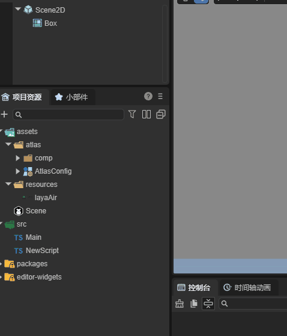

(Figure 2-1)

After creating a prefab, developers usually need to rename it so that the prefab's function can be identified by name. As shown in Animated Figure 2-2.


(Figure 2-2)

Click on the Title prefab, and you can see there's a root node "Box", as shown in Figure 2-3.

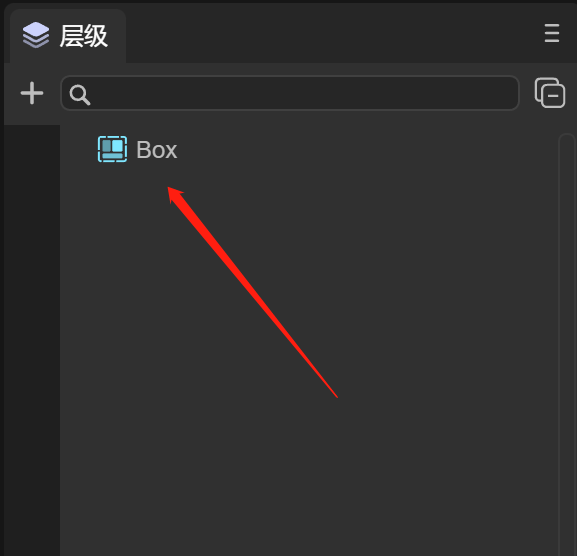

(Figure 2-3)

Developers can create 2D components under Box, or convert the Box node to other 2D components for use. We'll introduce this in detail later.

The root node of prefab (2D) is "Sprite". As shown in Figure 2-4.

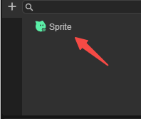

(Figure 2-4)

### 2.2 Creating Prefab (3D)

The process of creating prefab 3D is the same as prefab 2D, as shown in Animated Figure 2-5.

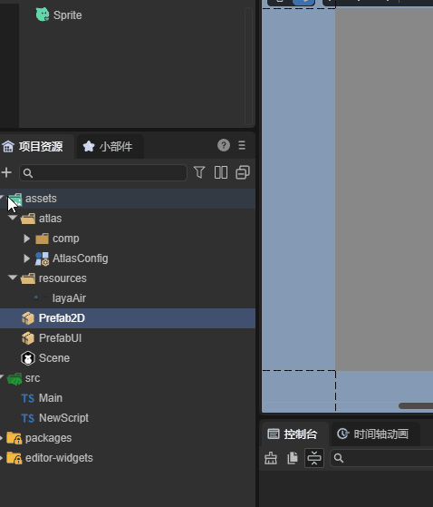

(Figure 2-5)

The difference is that double-clicking to open prefab 3D, the root node is "Sprite3D", which is the 3D sprite object we need to create. At the same time, the right side of Figure 2-6 is the default IDE scene, using the IDE's built-in skybox.

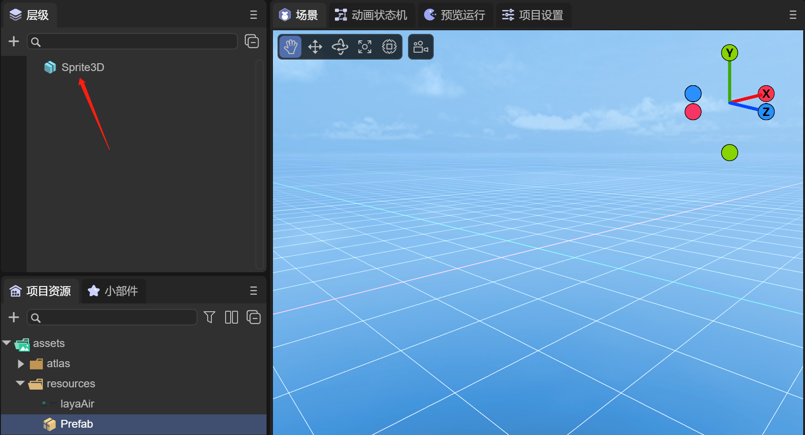

(Figure 2-6)

### 2.3 Modifying Prefab Editing Scene

Developers can change the 3D prefab's editing scene in the following way. As shown in Animated Figure 2-6.

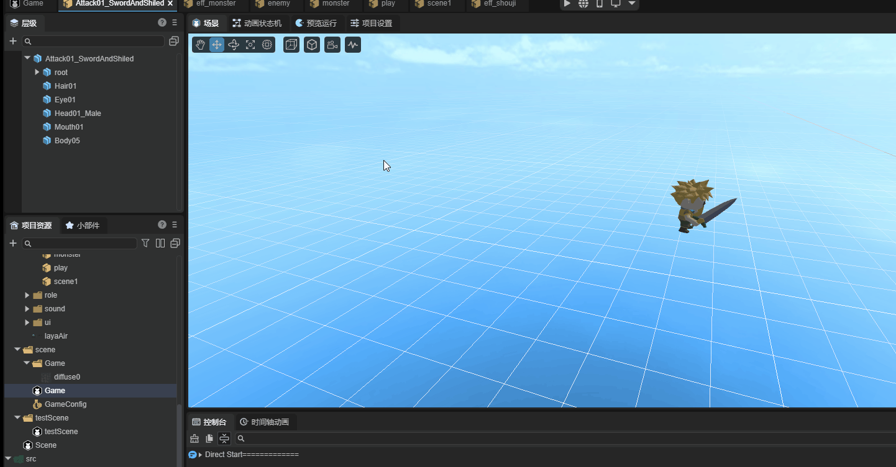

(Figure 2-6)

For example, if we have a 3D city scene, in the IDE's project settings, click the edit option, and in the prefab editing scene, drag in the 3D city scene file. At this time, when viewing the prefab's scene window again, you can see the scene has changed to the 3D city. In this case, it's more convenient for developers to flexibly create 3D prefabs in the scene.

## 3. Using Prefabs

### 3.1 UI/2D Prefabs

The first section mentioned that during development, many interfaces will use fonts similar to titles. It's best for developers to implement this through prefabs. When there's a need to change the font of all interface titles, you only need to modify the prefab once.

#### 3.1.1 Converting Node Type

Since the created prefab defaults to a Box root node, if creating a title under Box, this Box node is redundant. If creating a large number of titles in the interface, many Boxes will be created. From a performance perspective, this is strongly not recommended. Therefore, we want to use node conversion to change Box to a Label component. As shown in Animated Figure 3-1.


(Figure 3-1)

#### 3.1.2 Setting Font

Next, we won't introduce the title production process much. As shown in Figure 3-2, we temporarily create a yellow size 30 bold font as the title and rename it to Title.

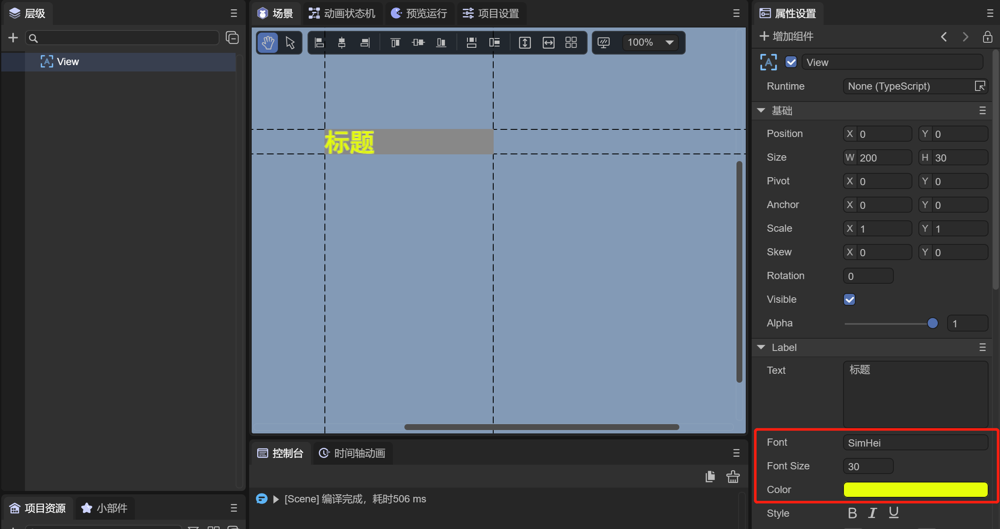

(Figure 3-2)

#### 3.1.3 Using Prefabs in IDE

After the prefab is made, it can be dragged into the interface where we want to use it in the IDE. As shown in Animated Figure 3-3.


(Figure 3-3)

There's a List in the scene. We want the item to have a title. We drag the Title prefab into the List's Box as the Label title of the List's item. You can see that in the node, the Label name color is green, representing that this node is a prefab node. Of course, all nodes under this node will also be green.

#### 3.1.4 Modifying Prefab Properties

When the requirement says to change all titles to red, that is, modify once and multiple interfaces change together. Then you only need to modify the text color in the Title prefab. As shown in Animated Figure 3-4.


(Figure 3-4)

After modifying the prefab, you can see the modification effect in scene interfaces using the prefab. Of course, you can also directly run to see the effect in the prefab interface. After developers complete editing, when closing the prefab interface, they need to remember to save the prefab file. Otherwise, the next time they open this prefab, previous changes will be lost.

New UI components can also be added to the prefab. Similarly, new UI components added in the scene are synchronized. We won't demonstrate this here. Developers can try it themselves.

> Note: Any scripts added to UI components can also be synchronized to the scene, but the runtime class under the prefab cannot be synchronized.

#### 3.1.5 Overriding Prefab Properties

If we operate on prefab nodes in the scene, such as adding new UI components, modifying UI component properties, or hanging scripts on UI components, as shown in Figure 3-3.


(Figure 3-3)

For example, there's an item node under the List in the scene that's a prefab. We made several changes under the List. In Figure 3-3, there will be indicators.

- Added LabelScript script to the Label component (with "+" indicator)

- Modified width property of the item node (property settings panel has yellow line prompt)

- Added Button component (with "+" indicator)

These modifications can also be overridden to the prefab. Let's see how to operate. As shown in Figure 3-4.


(Figure 3-4)

Click the item node, and in the property panel on the right, click the `Override Properties` button to open the `Override Properties to item` operation panel.

Since there were three operations before, when we click item, LabelScript, and Button, we can see as shown in Figure 3-8.

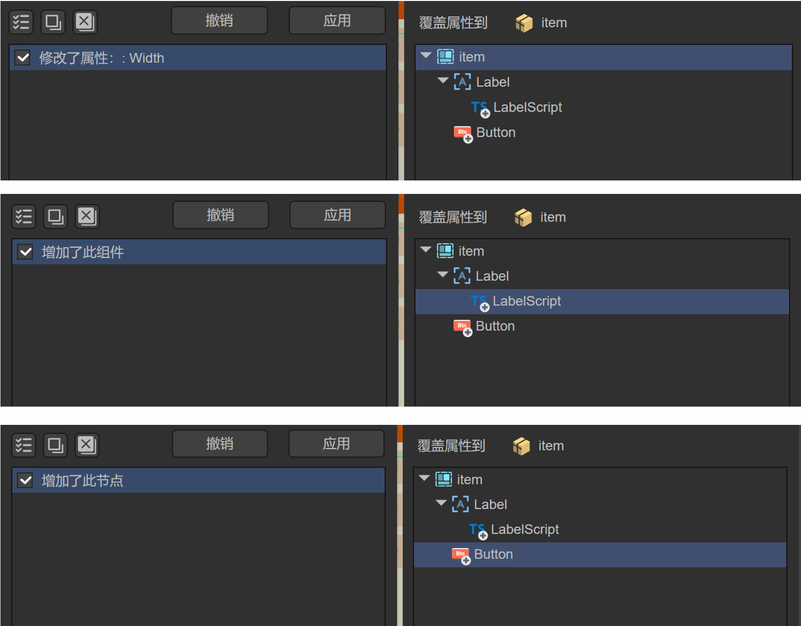

(Figure 3-8)

The IDE has recorded these three modification operations. We can separately `Undo` or `Apply` each item, or directly `Undo All` or `Apply All`.

When each operation clicks apply or uses apply all, after returning to the item prefab window, all three modifications will be updated and saved to the prefab. As shown in Figure 3-9.

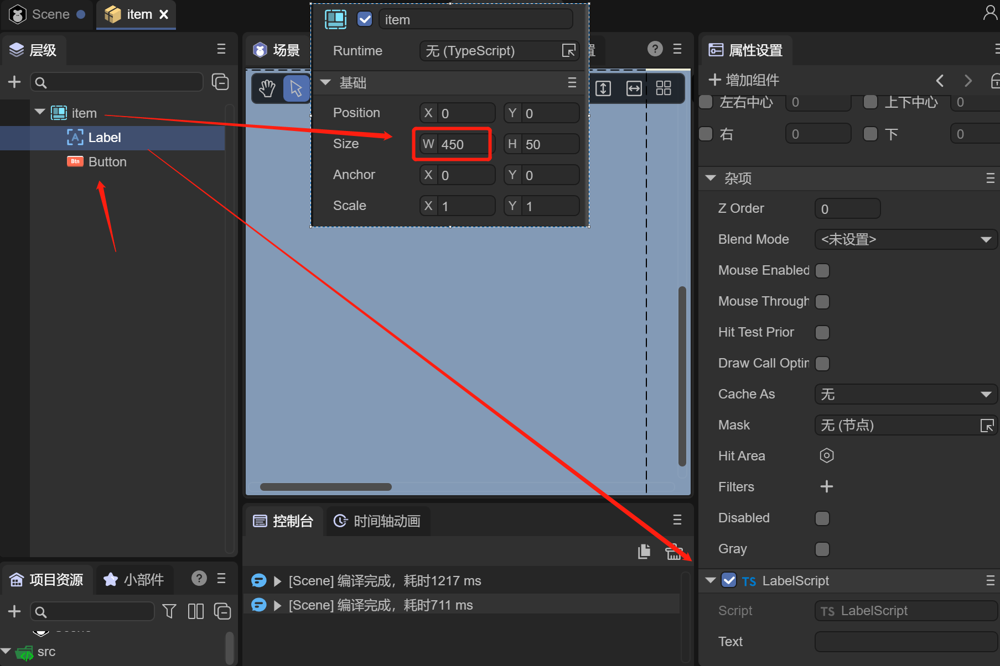

(Figure 3-9)

Through the above operations, using the method of overriding prefab properties can also achieve the effect of modifying the prefab.

> Note: If relative layout is set in the prefab, then when using this prefab object in the scene, the relative layout on the scene cannot be set to empty (IDE not checking or forcing code to set to null is not allowed and useless). It will be based on the relative layout within the prefab.
>
> However, if the relative layout value is modified in the scene, it will be based on the scene's settings. For example, if the prefab's top is set to 10, and when the scene uses this prefab, top is changed to 20, then during runtime, the scene will use 20 as the benchmark.

#### 3.1.6 Using Prefabs in Code

Adding prefabs through code is as simple as using a component. As shown in Figure 3-5, we want to put the Title prefab under Box.

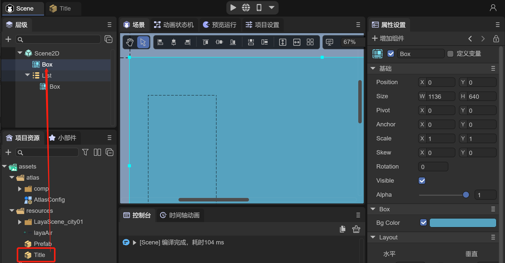

(Figure 3-5)

Example code is as follows:

```typescript
const { regClass, property } = Laya;

@regClass()
export class ScriptA extends Laya.Script {
    //declare owner : Laya.Sprite3D;

    @property( { type: Laya.Box } )
    private box: Laya.Box;

    constructor() {
        super();
    }

    onStart(): void {

        //Load prefab file
        Laya.loader.load("resources/Title.lh").then( (res)=>{
            //Create prefab
            let label: Laya.Label = res.create();
            //Add prefab Label font to box node
            this.box.addChild( label );
        } );
    }
}
```

The running effect is shown in Figure 3-6.

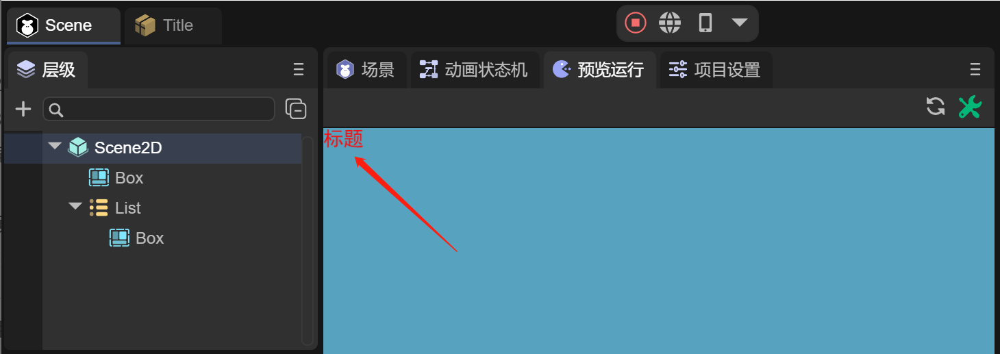

(Figure 3-6)

### 3.2 3D Prefabs

The use of 3D prefabs is the same as 2D prefabs. Here we won't introduce how to make prefabs. Let's see the use effect of 3D prefabs through the following example.

#### 3.2.1 Using in IDE

Assuming we've already created a 3D prefab and made LayaMonkey by adding models, materials, animation state machines, and other components. As shown in Figure 3-7.

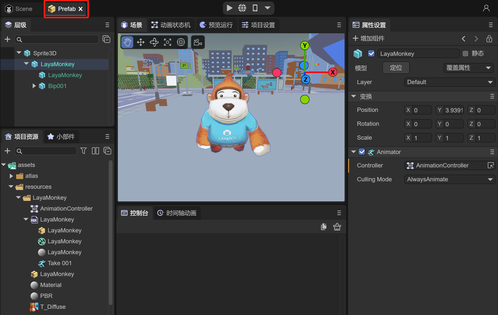

(Figure 3-7)

At this time, the made LayaMonkey can be dragged into any scene. As shown in Animated Figure 3-8.


(Figure 3-8)

#### 3.2.2 Using in Code

Using 3D prefabs through code is the most common method. Often in game battles, enemies are continuously created through code. Like the situation of dragging LayaMonkey into the IDE above, we implement it with code as follows:

```typescript
const { regClass, property } = Laya;

@regClass()
export class Main extends Laya.Script {

    @property( { type : Laya.Camera } )
    private camera: Laya.Camera;
    @property( { type : Laya.Scene3D } )
    private scene: Laya.Scene3D;

    onStart() {
        console.log("Game start");
        //Load prefab file
        Laya.loader.load("resources/Prefab.lh").then( (res)=>{
            //Create prefab
            let monkey: Laya.Sprite3D = res.create();
            //Add prefab to scene
            this.scene.addChild( monkey );
            monkey.transform.position = new Laya.Vector3(-28.9354,0.3,-63.20264);
        } );
    }
}

```

The running effect is shown in Animated Figure 3-9.

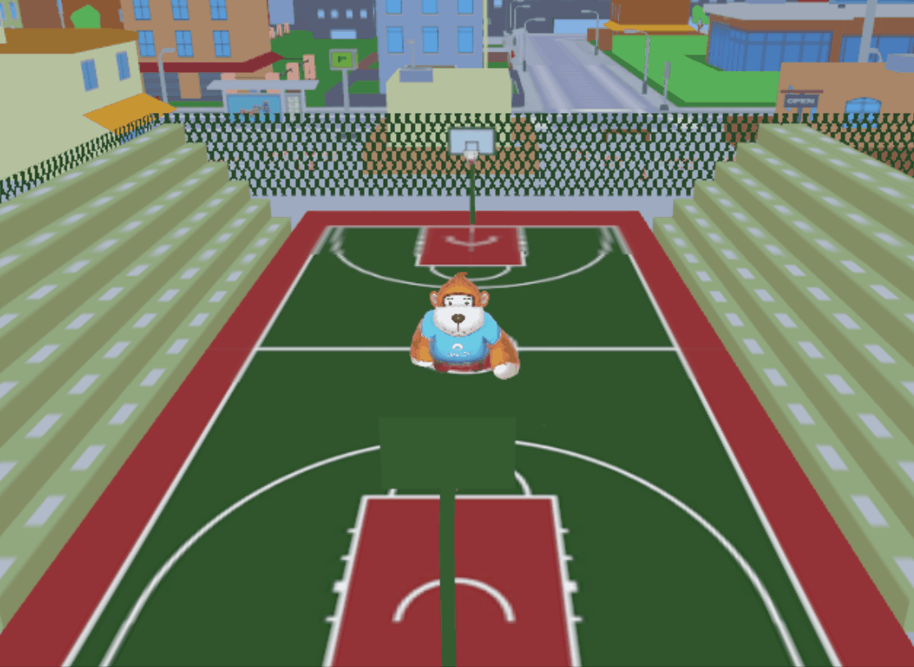

(Figure 3-9)

## 4. Preloading Prefabs

During development, we will achieve various functions by creating a large number of prefabs. Therefore, prefabs can also be understood as a collection of resources. When loading prefab files through code, associated resources can be loaded together. Therefore, during project startup loading, you can directly load all prefabs first, just like preloading scenes. The engine will load associated resources together.

In LayaAir's 2D introduction example code, you can see the implementation code for preloading a group of prefabs:

```typescript
import { LoadingRTBase } from "./LoadingRT.generated";

const { regClass, property } = Laya;
@regClass()
export default class LoadingRT extends LoadingRTBase {
    onAwake(): void {
        Laya.loader.load(
            //Load what this scene uses first
            ["resources/UI/image.png", "resources/UI/progress.png", "resources/UI/progress$bar.png"]
        ).then(() => {
            let resArr: Array<any> = [

                { url: "resources/prefab/uiDemo/useUI/ChangeTexture.lh", type: Laya.Loader.HIERARCHY },
                { url: "resources/prefab/uiDemo/useUI/MouseThrough.lh", type: Laya.Loader.HIERARCHY },
                { url: "resources/prefab/uiDemo/useUI/PhysicalCollision.lh", type: Laya.Loader.HIERARCHY },
                { url: "resources/prefab/uiDemo/useUI/Progress.lh", type: Laya.Loader.HIERARCHY },
                { url: "resources/prefab/uiDemo/useUI/TextShow.lh", type: Laya.Loader.HIERARCHY },
                { url: "resources/prefab/uiDemo/page/IframeElement.lh", type: Laya.Loader.HIERARCHY },
                { url: "resources/prefab/uiDemo/page/UsePanel.lh", type: Laya.Loader.HIERARCHY },
                { url: "resources/prefab/uiDemo/list/BagList.lh", type: Laya.Loader.HIERARCHY },
                { url: "resources/prefab/uiDemo/list/ComboBox.lh", type: Laya.Loader.HIERARCHY },
                { url: "resources/prefab/uiDemo/list/LoopList.lh", type: Laya.Loader.HIERARCHY },
                { url: "resources/prefab/uiDemo/list/MailList.lh", type: Laya.Loader.HIERARCHY },
                { url: "resources/prefab/uiDemo/list/Refresh.lh", type: Laya.Loader.HIERARCHY },
                { url: "resources/prefab/uiDemo/list/TreeBox.lh", type: Laya.Loader.HIERARCHY },
                { url: "resources/prefab/uiDemo/list/TreeList.lh", type: Laya.Loader.HIERARCHY },
                { url: "resources/prefab/uiDemo/animation/AtlasAni.lh", type: Laya.Loader.HIERARCHY },
                { url: "resources/prefab/uiDemo/animation/FrameAni.lh", type: Laya.Loader.HIERARCHY },
                { url: "resources/prefab/uiDemo/animation/SkeletonAni.lh", type: Laya.Loader.HIERARCHY },
                { url: "resources/prefab/uiDemo/animation/TimelineAni.lh", type: Laya.Loader.HIERARCHY },
                { url: "resources/prefab/uiDemo/animation/TweenAni.lh", type: Laya.Loader.HIERARCHY },
                { url: "resources/prefab/uiDemo/interactive/Astar.lh", type: Laya.Loader.HIERARCHY },
                { url: "resources/prefab/uiDemo/interactive/Joystick.lh", type: Laya.Loader.HIERARCHY },
                { url: "resources/prefab/uiDemo/interactive/ShapeDetection.lh", type: Laya.Loader.HIERARCHY },
                { url: "resources/prefab/uiDemo/interactive/tiledMap.lh", type: Laya.Loader.HIERARCHY },

                { url: "resources/prefab/Bullet.lh", type: Laya.Loader.HIERARCHY },
                { url: "resources/prefab/closeBtn.lh", type: Laya.Loader.HIERARCHY },
                { url: "resources/prefab/ComboList.lh", type: Laya.Loader.HIERARCHY },
                { url: "resources/prefab/defaultButton.lh", type: Laya.Loader.HIERARCHY },
                { url: "resources/prefab/defaultLabel.lh", type: Laya.Loader.HIERARCHY },
                { url: "resources/prefab/DropBox.lh", type: Laya.Loader.HIERARCHY },
                { url: "resources/prefab/LoopImg.lh", type: Laya.Loader.HIERARCHY },
                { url: "resources/prefab/role.lh", type: Laya.Loader.HIERARCHY },

                { url: "resources/prefab/ani/cd.lh", type: Laya.Loader.HIERARCHY },
                { url: "resources/prefab/ani/refresh.lh", type: Laya.Loader.HIERARCHY },

            ];


            //3.0's load can load 2D and 3D resources simultaneously
            Laya.loader.load(resArr, null, Laya.Handler.create(this, this.onLoading, null, false)).then(() => {
                // After loading is complete, handle logic
                this.progress.value = 0.98;
                console.log("Loading finished", this.progress.value);
                //Too few things preloaded, delay one second to see the effect locally, real projects don't need delay
                Laya.timer.once(1000, this, () => {
                    //Jump to entry scene
                    Laya.Scene.open("Scenes/Index.ls"); //Don't use Laya.Scene.open("./Scenes/Index.ls");
                });

            });

            // Listen for loading failure
            Laya.loader.on(Laya.Event.ERROR, this, this.onError);
        });
    }

    /**
   * Print error when error occurs
   * @param err Error message
   */
    onError(err: string): void {
        console.log("Loading failed: " + err);
    }

    /**
     * Listen during loading
     */
    onLoading(progress: number): void {
        //When nearing completion, make the displayed progress slower than actual progress, this reserves for automatic loading when opening scenes, especially when the scene to be opened has many resources and hasn't been fully put into preloading, and needs to automatically load some more.
        if (progress > 0.92) this.progress.value = 0.95;
        else this.progress.value = progress;
        console.log("Loading progress: " + progress, this.progress.value);
    }
}
```

Through the above code, you can see in the browser's debugging tool that the engine will load all prefab resources.
